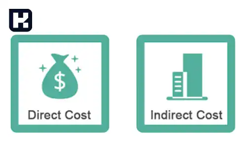

**راهنمای مطالب**
- [تعریف حسابداری صنعتی و اهمیت آن](#تعریف-حسابداری-صنعتی-و-اهمیت-آن)
- [نقش حسابداری صنعتی در مدیریت مالی و تصمیم‌گیری‌های استراتژیک](#نقش-حسابداری-صنعتی-در-مدیریت-مالی-و-تصمیم‌گیری‌های-استراتژیک)
- [اهداف حسابداری صنعتی](#اهداف-حسابداری-صنعتی)
- [طبقه بندی هزینه در حسابداری صنعتی](#طبقه-بندی-هزینه-در-حسابداری-صنعتی)
- [وظایف حسابداری](#وظایف-حسابداری)
- [وظایف حسابداری صنعتی](#وظایف-حسابداری-صنعتی)
- [بررسی روش‌های هزینه یابی در حسابداری صنعتی](#بررسی-روش‌های-هزینه-یابی-در-حسابداری-صنعتی)
- [تحلیل انواع هزینه‌ها در حسابداری صنعتی](#تحلیل-انواع-هزینه‌ها-در-حسابداری-صنعتی)
- [بررسی انواع گزارشات در حسابداری صنعتی](#بررسی-انواع-گزارشات-در-حسابداری-صنعتی)
- [حسابدار صنعتی کیست](#حسابدار-صنعتی-کیست)
- [تفاوت میان حسابداری صنعتی و حسابداری بهای تمام شده](#تفاوت-میان-حسابداری-صنعتی-و-حسابداری-بهای-تمام-شده)
- [تفاوت حسابداری صنعتی و حسابداری مالی](#تفاوت-حسابداری-صنعتی-و-حسابداری-مالی)
- [برای ورود به حسابداری صنعتی، موارد زیر را باید مد نظر داشت](#برای-ورود-به-حسابداری-صنعتی،-موارد-زیر-را-باید-مد-نظر-داشت)

## تعریف حسابداری صنعتی و اهمیت آن

حسابداری صنعتی یک شاخه از <a href="https://www.hooshkar.com/Wiki/Financial/WhatIsAccounting" target="_blank">حسابداری</a> محسوب می شود که به <a href="https://www.hooshkar.com/Software/Fennec/Module/Costing" target="_blank">محاسبه بهای تمام شده</a> محصولات و کنترل هزینه های تولید می‌پردازد. این حوزه از حسابداری به شرکت‌های تولیدی کمک می‌کند تا هزینه‌های خود را کاهش دهند، کیفیت و کارایی تولید را افزایش دهند و تصمیمات بهتری در زمینه قیمت‌گذاری و کنترل موجودی بگیرند.

یکی از وظایف حسابداری صنعتی، پیش‌بینی و برآورد هزینه‌های تولید است. با داشتن آمار دقیق در مورد هزینه‌های مواد اولیه و دیگر عوامل مرتبط با تولید، شرکت‌ها می‌توانند بهترین روش‌ها را برای کاهش هزینه‌ها و افزایش سودآوری انتخاب کنند.

علاوه بر این، حسابداری صنعتی در تعیین قیمت مناسب برای محصولات نیز نقش مهمی دارد. با ارزیابی بهای تمام شده مواد اولیه و هزینه‌های تولید، شرکت‌ها می‌توانند قیمت‌گذاری صحیح و عادلانه را انجام داده و در نتیجه رقابت‌پذیری خود را در بازار افزایش دهند.

به طور خلاصه، حسابداری صنعتی به شرکت‌های تولیدی کمک می‌کند تا با کنترل هزینه‌ها، بهبود کیفیت و کارایی تولید و تصمیم‌گیری دقیق‌تر در زمینه قیمت‌گذاری، به سودآوری بیشتری دست یابند.

<blockquote style="background-color:#f5f5f5; padding:0.5rem">
<a href="https://www.hooshkar.com/Software/Fennec/Module/Costing" target="_blank">مطلب پیشنهادی: بررسی قابلیت ها و قیمت نرم افزار بهای تمام شده سایان</a>
</blockquote>

## نقش حسابداری صنعتی در مدیریت مالی و تصمیم‌گیری‌های استراتژیک
حسابداری صنعتی یکی از دشوارترین و جذاب‌ترین حوزه‌های حسابداری است. این حوزه برای مدیران و صاحبان کسب و کار بسیار حائز اهمیت است زیرا درک دقیق و جامع از هزینه‌های تولید و عوامل مؤثر بر سودآوری، به آنها کمک می‌کند تا تصمیمات موثرتری در مورد مدیریت و بهبود عملکرد سازمان بگیرند.

حسابداری صنعتی با تنظیم بودجه و تعیین هزینه‌ های استاندارد، هزینه‌ های واقعی عملیات، هزینه مراحل تولید، تجزیه ضایعات، تعیین سودآوری و... مرتبط است. این حوزه با تجزیه و تحلیل حساب‌ها و ثبت هزینه‌ها، ارتباط بین هزینه‌ها و مراحل تولید و توزیع کالاها و خدمات را مشخص می‌کند.

حسابداری صنعتی به دلیل ارتباط مستقیم با صنعت و مؤسسات تولیدی، برای مدیران و صاحبان کسب و کار بسیار مهم است. این حوزه به آنها امکان می‌دهد تا هزینه‌های تولید را کنترل کرده، عملکرد سازمان را بهبود بخشند و تصمیمات موثرتری در مورد استراتژی‌ها و قیمت‌گذاری بگیرند.

به طور خلاصه، حسابداری صنعتی برای مدیران و صاحبان کسب و کار ابزارها و آمارهای لازم را فراهم می‌کند تا هزینه‌ها را کنترل کنند، به بهره‌وری و سودآوری بیشتر دست یابند و تصمیمات موثرتری را در مورد مدیریت سازمان بگیرند.

## اهداف حسابداری صنعتی

**1. حساب سود و زیان و ترازنامه:**
حسابدار صنعتی با اندازه‌گیری درآمد و ارزیابی موجودی‌ها، بهای تمام شده را محاسبه می‌کند. این اطلاعات در حساب سود و زیان و ترازنامه ثبت می‌شوند. این هدف به مدیران کمک می‌کند تا به طور دقیق و جامع وضعیت مالی شرکت را درک کنند.

**2. گزارش‌های کنترل:**
گزارش‌ها شامل اطلاعاتی مثل هزینه‌ها، درآمدها، سود و زیان و عملکرد مالی شرکت در یک دوره زمانی مشخص است. این اهداف به مدیران کمک می‌کنند تا عملکرد شرکت را بررسی کرده و تصمیمات مناسب را بگیرند.

**3. تجزیه و تحلیل‌ها و مطالعات مخصوص:**
این اطلاعات شامل تجزیه و تحلیل‌های مالی، پیش‌بینی‌ها، مطالعات مخصوص و تحلیل رقابتی است. مسئولان مربوطه می‌توانند از این اطلاعات برای برنامه ریزی بهتر و اتخاذ تصمیمات استراتژیک استفاده کنند.

با به دست آوردن و ارائه این اطلاعات به صورت دقیق و به موقع، حسابدار صنعتی در بهبود فرآیندهای مالی و عملکرد شرکت نقش مهمی را ایفا می‌کند.

## طبقه بندی هزینه در حسابداری صنعتی

**1. طبقه‌بندی طبیعی هزینه‌ها:**
هزینه‌های مواد اولیه، هزینه‌های نیروی کار، هزینه‌های ماشین آلات و تجهیزات و غیره. 

**2. طبقه‌بندی بر اساس ارتباط با تولید:**
هزینه‌ها بر اساس ارتباطشان با فرآیند تولید یا عملیات شرکت طبقه‌بندی می‌شوند که به دو دسته هزینه‌های مستقیم و غیرمستقیم. هزینه‌های مستقیم به صورت مستقیم به تولید مرتبط هستند، مانند هزینه‌های مواد اولیه و دستمزد مستقیم نیروی کار. هزینه‌های غیرمستقیم، هزینه‌هایی هستند که برای تولید نیاز است اما به طور مستقیم با محصول مرتبط نیستند، مانند هزینه‌های عمومی و مدیریتی.

**3. طبقه‌بندی هزینه‌های مستقیم:**
هزینه‌های مستقیم عبارتند از هزینه‌های مواد اولیه و دستمزد نیروی کار که مستقیماً به تولید محصول اختصاص دارند.

**4. طبقه‌بندی هزینه‌های غیرمستقیم:**
هزینه‌هایی که به صورت غیرمستقیم تولید را تأمین می‌کنند. به عنوان مثال، هزینه‌های مرتبط با نگهداری و تعمیرات تجهیزات، هزینه‌های اجاره و بیمه و غیره.

**5. طبقه‌بندی هزینه بر اساس حجم تولید:**
هزینه‌ها بر اساس حجم تولید یا مقدار تولید طبقه‌بندی می‌شوند. در این طبقه‌بندی، هزینه‌های ثابت و هزینه‌های متغیر جداگانه مورد بررسی قرار می‌گیرند. هزینه‌های ثابت، هزینه‌هایی هستند که در حجم تولید تغییر نمی‌کنند و هزینه‌های متغیر، هزینه‌هایی هستند که با تغییر در حجم تولید نیز تغییر می‌کنند.

این طبقه‌بندی هزینه‌ها به حسابداران و مدیران کمک می‌کند تا هزینه‌های مختلف را به صورت دقیق تشخیص داده و برای برنامه ریزی مالی و تصمیم‌گیری‌های استراتژیک مورد استفاده قرار دهند. همچنین، این طبقه‌بندی به تجزیه و تحلیل هزینه‌ها، کاهش هزینه‌ها و بهبود کارایی در فرآیندهای تولید کمک می‌کند.

<blockquote style="background-color:#f5f5f5; padding:0.5rem">
<a href="https://www.hooshkar.com/Wiki/Financial/TheBestCostAccountingSoftware" target="_blank">مطلب پیشنهادی: بهترین نرم افزار حسابداری بهای تمام شده چه ویژگی هایی دارد؟</a>
</blockquote>

## وظایف حسابداری
1. برنامه ریزی و اجرای بودجه
2. جمع‌آوری و گزارش‌دهی اطلاعات
3. کنترل هزینه‌ها و بهبود عملکرد
4. هزینه یابی و تعیین قیمت
5. تحلیل و ارزیابی سودآوری

## وظایف حسابداری صنعتی

**1. برآورد دقیق هزینه‌های مستقیم تولید:** این هزینه‌ها شامل حقوق و دستمزد کارکنان، مواد اولیه و سایر هزینه‌های مستقیم می‌شوند.

**2. برآورد دقیق هزینه‌های غیرمستقیم تولید:** هزینه‌ها شامل هزینه‌های نگهداری دارایی‌های، هزینه‌های مزایا، بازاریابی، تبلیغات و غیره.

**3. تجزیه و تحلیل مراکز هزینه:** بخشی از دستگاه‌ها یا ماشین‌آلات تولیدی که در چرخه تولید محصول نقش دارند، مرکز هزینه محسوب می‌شوند.

همچنین، حسابداران صنعتی مسئول تهیه و ارائه گزارش‌های مالی هستند. گزارشات مالی در دو صورت برون سازمانی و درون سازمانی تهیه می‌شوند. گزارشات درون سازمانی به منظور افزایش آگاهی مدیران از مصرف مواد اولیه، هزینه تمام شده محصول و سایر جزئیات مربوط به فعالیت‌های داخلی شرکت تهیه می‌شوند. گزارشات برون سازمانی هم به سازمان‌های دولتی ارائه می‌شوند تا اطلاعاتی درباره سود و زیان شرکت و قیمت تمام شده محصول را دریافت کنند.

<blockquote style="background-color:#f5f5f5; padding:0.5rem">
<a href="https://www.hooshkar.com/Wiki/Financial/CostCenters" target="_blank">مطلب پیشنهادی: مراکز هزینه در شرکت‌های تولیدی</a>
</blockquote>

## بررسی روش‌های هزینه یابی در حسابداری صنعتی

**1. هزینه یابی مستقیم:** در این روش، هزینه‌های مرتبط با تولید محصول، به صورت مستقیم به محصول مرتبط تخصیص داده می‌شود. شامل هزینه‌های مواد اولیه، دستمزد مستقیم کارگران و سایر هزینه‌های مستقیم است.

**2. هزینه یابی جذبی:** در این روش، تمامی هزینه‌های مرتبط با خط تولید محصول مورد بررسی قرار می‌گیرند. شامل هزینه‌های دستمزد، مواد مستقیم، سربار و سایر هزینه‌های مرتبط است.

**3. هزینه یابی سفارش کار:** این روش برای شرکت‌هایی که محصولات سفارشی تولید می‌کنند، استفاده می‌شود. هزینه‌ها بر اساس هر سفارش جداگانه محاسبه و ثبت می‌شوند.

**4. هزینه یابی تخمینی:** در این روش، هزینه‌های احتمالی بر اساس پیش‌بینی و تخمین انجام می‌شود. این می‌تواند شامل هزینه‌های قرارداد با شرکت‌های خارجی، پیمانکاران و سایر شرکت‌ها باشد.

**5. هزینه یابی استاندارد:** در این روش، پس از پیش‌بینی هزینه‌ها، هزینه‌های واقعی بررسی و با پیش‌بینی‌ها مقایسه می‌شوند. این روش به منظور بررسی اختلاف بین هزینه‌های واقعی و پیش‌بینی شده استفاده می شود.

**6. هزینه یابی مرحله‌ای:** این روش در شرکت‌هایی که فرآیند تولید آن‌ها شامل چندین مرحله استفاده می‌شود. هزینه‌ها در هر مرحله از تولید، به صورت جداگانه محاسبه و ثبت می‌شوند.

**7. هزینه یابی فعالیت:** در این نوع هزینه‌یابی، هزینه‌ها بر اساس فعالیت‌هایی که بر روی محصول انجام می‌شوند، تخصیص داده می‌شوند. این روش امکان بررسی دقیق هزینه‌های مرتبط با هر فعالیت را فراهم می‌کند.

هر یک از این روش‌های هزینه‌یابی دارای ویژگی‌ها و مزایا و معایب خود هستند. انتخاب روش مناسب برای هر شرکت بستگی به نوع فعالیت، نیازها و شرایط خاص آن دارد. با استفاده از روش‌های مناسب هزینه‌یابی، شرکت‌ها می‌توانند بهبود کارایی و کنترل هزینه‌ها را داشته باشند و به طور کلی به بهبود سودآوری و عملکرد مالی شرکت کمک کنند.

## تحلیل انواع هزینه‌ها در حسابداری صنعتی

با درک اهمیت بررسی هزینه‌ها در شرکت‌های تولیدی، حالا بهتر است که اطلاعاتی جامع در مورد انواع هزینه‌ها را در اختیار داشته باشیم. همانطور که می‌دانید، هر محصول تولیدی، هزینه‌های خاص خود را به همراه دارد. در ادامه، به بررسی انواع این هزینه‌ها می‌پردازیم.

**1. هزینه مستقیم:**
این نوع هزینه‌ها مستقیماً در فرآیند تولید محصول تأثیر گذار هستند. به طور کلی، این هزینه‌ها شامل دستمزد مستقیم کارکنان و هزینه مواد اولیه می‌شود.

**2. هزینه غیرمستقیم:**
این نوع هزینه‌ها بطور مستقیم بر روی تولید محصول تأثیر نمی‌گذارند، اما به طور کلی بر روی فعالیت‌های کسب و کار تأثیر دارند. این هزینه‌ها شامل هزینه‌هایی مانند برق، آب، استهلاک ماشین‌آلات و غیره است.

**3. هزینه ثابت:**
این نوع هزینه‌ها هیچ ارتباطی با حجم و نوع تولید در کارخانه ندارند. به عبارت دیگر، تغییرات در میزان تولید تأثیری بر روی این هزینه‌ها ندارد. هزینه‌هایی مانند استهلاک ساختمان، اجاره، بیمه و غیره به عنوان هزینه‌های ثابت محسوب می‌شوند.

**4. هزینه متغیر:**
این نوع هزینه‌ها به طور مستقیم با میزان و حجم تولید رابطه دارند. به عبارت دیگر، هرچه میزان تولید افزایش یابد، این هزینه‌ها نیز افزایش خواهند یافت. به عنوان مثال، هزینه برق و استهلاک ماشین‌آلات نمونه‌هایی از هزینه‌های متغیر هستند که با تغییرات حجم تولید افزایش یا کاهش می‌یابند.

با دانستن انواع مختلف هزینه‌ها، شرکت‌های تولیدی می‌توانند بهبودهای لازم در مدیریت هزینه‌ها را اعمال کنند، به سودآوری بیشتر دست یابند و فرآیندهای خود را بهینه‌سازی کنند.

## بررسی انواع گزارشات در حسابداری صنعتی

**1. گزارش خرید و مصرف مواد اولیه:**
در شرکت‌های صنعتی و تولیدی، قیمت مواد اولیه تأثیر زیادی در قیمت نهایی محصول دارد. بنابراین، حسابداران باید گزارشی درباره خرید و مصرف مواد اولیه به مدیران ارائه دهند.

**2. گزارش موجودی مواد اولیه:**
مواد اولیه ای که شرکت خریداری می‌کند، در انبار ذخیره می‌شوند. گزارش موجودی این مواد در انبار باید توسط حسابدار صنعتی به مدیریت ارسال شود تا در تصمیم‌گیری‌های آتی مربوط به سفارش‌ها استفاده شود.

**3. گزارش سربار تولید:**
این گزارش به هزینه‌های غیرمستقیم و دستمزد مرتبط با فرآیند تولید اشاره دارد. ارسال این گزارش به مدیریت می‌تواند در تصمیم‌گیری‌های بهینه‌سازی به کار گرفته شود.

**4. گزارش هزینه دستمزد:**
کارکنانی که در فرآیند تولید به صورت مستقیم نقش دارند، دستمزدی را دریافت می‌کنند.
این هزینه باید توسط حسابدار در گزارشی به مدیریت ارسال شود. این گزارش شامل جزئیات دستمزد مستقیم کارکنان، مانند میزان واحدی که به آنها پرداخت می‌شود و تعداد کارکنان مشغول به کار است.

<blockquote style="background-color:#f5f5f5; padding:0.5rem">
<a href="https://www.hooshkar.com/Wiki/Payroll/PayrollFormula" target="_blank">مطلب پیشنهادی: فرمول محاسبه حقوق و دستمزد</a>
</blockquote>

**5. گزارش قیمت تمام شده محصول:**
این گزارش به عنوان یکی از وظایف اصلی حسابداری صنعتی محسوب می‌شود. این گزارش میزان سود شرکت را نشان می‌دهد. همچنین، این گزارش به مدیریت کسب و کار در اتخاذ تصمیمات مربوط به کاهش هزینه‌ها و افزایش سودآوری کمک می‌کند.

**6. گزارش ضایعات تولید:**
در فرآیند تولید هر محصول، ممکن است ضایعاتی به وجود آید. دلایل ایجاد این ضایعات ممکن است متنوع باشد و باید توسط حسابدار در گزارش مشخص شوند. از این گزارش می‌توان برای کاهش هزینه‌ها و بهبود نیروی انسانی استفاده کرد.

همچنین، در این گزارشات می‌توان به اطلاعات دیگری مانند نرخ تغییر هزینه‌ها، تحلیل‌های مالی و عملکرد مالی شرکت اشاره کرد. هدف ارائه این گزارشات، ارائه اطلاعات دقیق و جامع به مدیران است تا بتوانند تصمیمات بهتری در مورد مدیریت مالی و عملکرد کسب و کار بگیرند.

## حسابدار صنعتی کیست

حسابدار صنعتی نقشی بسیار مهم در شرکت‌ها و سازمان‌ها دارد. وظیفه اصلی او جمع آوری اطلاعات مالی و صنعتی است. این اطلاعات به وی کمک می‌کنند تا وضعیت اقتصادی و صنعتی شرکت را بهبود بخشد.

حسابدار صنعتی گزارشاتی را جمع آوری، بررسی و ثبت می‌کند که به او در بررسی دوره‌ای سلامت مالی شرکت کمک می‌کنند. این گزارشات به شکل منظم بررسی می‌شوند و اطلاعات و راهنمایی‌های لازم را به مدیران مربوطه ارائه می‌دهد. به این ترتیب، مدیران می‌توانند تصمیمات مناسبی را براساس این اطلاعات بگیرند.

با استفاده از زبان ساده و قابل فهم، حسابدار صنعتی توانایی انتقال اطلاعات حسابداری را به مدیران می‌کند، به طوری که آن‌ها بتوانند بهترین تصمیمات ممکن را برای بهبود و مدیریت مناسب شرکت بگیرند.

## تفاوت میان حسابداری صنعتی و حسابداری بهای تمام شده

تفاوت <a href="https://www.hooshkar.com/Software/Fennec/Module/Costing" target="_blank">حسابداری بهای تمام شده</a> و حسابداری صنعتی در این است که حسابداری صنعتی به بررسی، مدیریت هزینه‌ها و موارد مالی مرتبط با تولید کالاها و خدمات می‌پردازد؛ در حالی که حسابداری بهای تمام شده به بررسی مواردی می‌پردازد که با بهای تمام شده محصولات و خدمات سازگار هستند و برای ارزیابی و کنترل هزینه‌ها، مدیریت موجودی و اتخاذ تصمیمات آینده مورد استفاده قرار می‌گیرند.

حسابداری صنعتی از دیدگاه تولید و فرآیندهای تولیدی به بهای تمام شده محصولات توجه می‌کند و هدف آن بهینه‌سازی هزینه‌ها و کنترل موثر آن‌ها است. این حوزه از حسابداری به مدیران کمک می‌کند تا روش‌های بهتری برای کاهش هزینه‌ها و بهبود کارایی در فرآیندهای تولید ایجاد کنند.

از طرفی، حسابداری بهای تمام شده به تحلیل بهای کلی تمام شده محصولات می‌پردازد که شامل هزینه‌های مستقیم و غیرمستقیم تولید، هزینه‌های تعمیرات و نگهداری، هزینه‌های مدیریت و سایر هزینه‌های مرتبط با تولید محصولات است. این حسابداری به مدیران کمک می‌کند تا با توجه به بهای تمام شده محصولات، تصمیمات بهتری در مورد قیمت‌گذاری، تولید و مدیریت موجودی اتخاذ کنند.

## تفاوت حسابداری صنعتی و حسابداری مالی

حسابداری صنعتی به جمع‌آوری اطلاعات مربوط به هزینه‌ها، بهای تمام شده، گزارشات و خدمات مرتبط با یک سازمان یا شرکت می‌پردازد. هدف اصلی حسابداری صنعتی ارائه روش‌های مناسب برای کاهش هزینه‌ها و افزایش سود است. این حسابداری با بررسی و تحلیل روش‌های تولید و عملیات سازمان، اطلاعات مورد نیاز را به دست می‌آورد و راهکارهایی را برای بهبود عملکرد مالی و افزایش سود ارائه می‌دهد.

در مقابل، <a href="https://www.hooshkar.com/Software/Sayan" target="_blank">حسابداری مالی</a> به فرآیند خلاصه‌سازی تمامی گزارشات معاملات انجام شده در یک کسب و کار یا سازمان می‌پردازد. این حسابداری اطلاعات مالی را جمع‌آوری و خلاصه می‌کند و آن‌ها را در گزارشات مالی ثبت می‌کند. هدف حسابداری مالی نمایش دقیق و تصویری از وضعیت مالی و عملکرد کسب و کار یا سازمان است.

علاوه بر این، حسابداری مالی تمرکز خود را بر ارائه مشاوره مالی و تخصصی به مشتریان قرار می‌دهد. حسابداران مالی توانایی تجزیه و تحلیل اطلاعات مالی را دارند و مشتریان را در تصمیم‌گیری‌های مالی و استراتژیک یاری می‌کنند.

## برای ورود به حسابداری صنعتی، موارد زیر را باید مد نظر داشت

**1. تجربه و دانش مرتبط:** برخورداری از تجربه قبلی در زمینه حسابداری صنعتی و دانش لازم برای این حوزه از جمله پیش نیازهای اصلی است. شناخت فرآیندها، اصول و قوانین مرتبط با حسابداری صنعتی ضروری است.

**2. مهارت کار با کامپیوتر:** آشنایی و حداقل توانایی در کار با رایانه و نرم افزارهای مرتبط با حسابداری صنعتی از جمله نیازمندی‌های اساسی است. اطلاعات مالی و محاسبات مربوط به حسابداری صنعتی معمولاً با استفاده از نرم افزارهای مختلفی مانند Excel انجام می‌شود.

**3. تسلط بر قوانین مالیاتی:** شناخت و تسلط بر قوانین و مقررات مالیاتی مهم است. حسابداران صنعتی باید قادر باشند درستی و صحت اطلاعات مالی را بر اساس قوانین مالیاتی ارزیابی کنند و گزارش‌های مالی مطابق با آنها تهیه کنند.

**4. تسلط بر قوانین بیمه تأمین اجتماعی و قوانین کار:** آشنایی کامل با قوانین و مقررات مرتبط با بیمه تأمین اجتماعی و قوانین کار ضروری است. حسابداران صنعتی باید قادر باشند در مورد حقوق و مزایا، بیمه ها و مقررات کارگری مطلع باشند و آنها را به درستی اعمال کنند.

**5. رزومه کاری مناسب:** نوشتن یک رزومه حسابداری صنعتی حرفه‌ای و جذاب می‌تواند به شما کمک کند تا در انتخاب شغل موفق باشید. رزومه شما باید شامل سوابق تحصیلی، تجربیات حسابداری قبلی، مهارت‌ها، دوره‌های آموزشی و همچنین مهارت‌های کامپیوتری و نرم افزاری را به طور جامع و واضح نشان دهد. همچنین، ذکر افتخارات و موفقیت‌های قبلی در حسابداری صنعتی نیز می‌تواند مزیتی برای شما در جذب کارفرمایان باشد.

**6. مهارت کار با <a href="https://www.hooshkar.com/Software/Fennec/Module/Costing" target="_blank">نرم افزارهای مالی (بهای تمام شده)</a> و اداری (اکسل):** حسابداری صنعتی نیازمند استفاده ماهرانه از نرم افزارهای مالی و اداری است. تسلط کامل بر این نرم افزارها و قابلیت استفاده بهینه از ابزارهای آن مهارتی ضروری برای ورود به حسابداری صنعتی است.

با توجه به موارد فوق، ورود به حسابداری صنعتی نیازمند ترکیبی از تجربه، دانش و مهارت‌های متنوع است. به علاوه، مهارت‌های ارتباطی، توانایی حل مسئله و دقت در کار نیز از اهمیت بالایی برخوردارند. پیشرفت و موفقیت در این حوزه نیازمند یادگیری و به‌روزرسانی مداوم نیز می‌باشد.

[تعریف حسابداری صنعتی]: #تعریف-حسابداری-صنعتی
[اهداف حسابداری صنعتی]: #اهداف-حسابداری-صنعتی
[طبقه بندی هزینه در حسابداری صنعتی]: #طبقه-بندی-هزینه-در-حسابداری-صنعتی
[وظایف حسابداری]: #وظایف-حسابداری
[وظایف حسابداری صنعتی]: #وظایف-حسابداری-صنعتی
[بررسی روش‌های هزینه یابی در حسابداری صنعتی]: #بررسی-روش‌های-هزینه-یابی-در-حسابداری-صنعتی
[تحلیل انواع هزینه‌ها در حسابداری صنعتی]: #تحلیل-انواع-هزینه‌ها-در-حسابداری-صنعتی
[بررسی انواع گزارشات در حسابداری صنعتی]: #بررسی-انواع-گزارشات-در-حسابداری-صنعتی
[حسابدار صنعتی کیست]: #حسابدار-صنعتی-کیست
[تفاوت میان حسابداری صنعتی و حسابداری بهای تمام شده]: #تفاوت-میان-حسابداری-صنعتی-و-حسابداری-بهای-تمام-شده
[تفاوت حسابداری صنعتی و حسابداری مالی]: #تفاوت-حسابداری-صنعتی-و-حسابداری-مالی
[برای ورود به حسابداری صنعتی، موارد زیر را باید مد نظر داشت]: #برای-ورود-به-حسابداری-صنعتی،-موارد-زیر-را-باید-مد-نظر-داشت