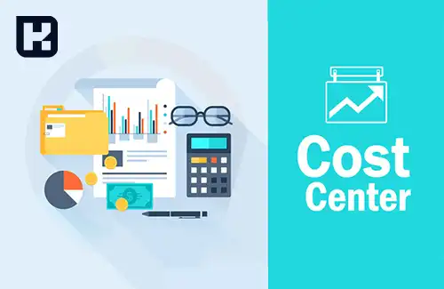

<blockquote style="background-color:#eeeefc; padding:0.5rem">

  
آنچه در این مطلب خواهید خواند:

  <ul>
    <li>تعریف مرکز هزینه</li>
    <li>مزایای استفاده از مراکز هزینه در شرکت ها</li>
    <li>نمونه مراکز هزینه در شرکت های تولیدی</li>
    <li>نتیجه گیری</li>
  </ul>

</blockquote>

## تعریف مرکز هزینه

هر بخش یا عملکرد خاصی از یک سازمان که مستقیماً در ایجاد هزینه دخیل است، می‌تواند به‌عنوان یک **مرکز هزینه** تلقی شود. در صنایع تولیدی، خطوط مختلف تولید و مراحل پروسه تولید معمولاً به‌عنوان مرکز هزینه شناخته می‌شوند. 

همچنین در کسب‌وکارهای خدماتی مانند رستوران‌ها و فروشگاه‌ها نیز بخش‌های مختلف به‌عنوان مراکز هزینه‌ای جداگانه تعریف می‌شوند. ثبت دقیق و جداگانه هزینه‌های هر مرکز به مدیران کمک می‌کند تا بهای تمام‌شده محصولات و خدمات را به‌درستی محاسبه کرده و تصمیم‌گیری‌های بهینه‌ای در زمینه قیمت‌گذاری و کنترل هزینه‌ها انجام دهند.

هدف از ایجاد مراکز هزینه در شرکت‌ها، تعیین و محاسبه هزینه‌های مربوط به هر بخش و فعالیت مختلف است. 
با تقسیم هزینه‌ها بر اساس مراکز هزینه، می‌توان مشخص کرد کدام بخش بیشترین هزینه را دارد و در نتیجه، عملکرد مراکز را مدیریت کرد.

<blockquote style="background-color:#f5f5f5; padding:0.5rem">

<strong>آشنایی با <a href="https://www.hooshkar.com/Software/Sayan/Package/Industrial" target="_blank">نرم افزار حسابداری تولیدی</a> سایان</strong>
</blockquote>

### **چگونه ERP به بهینه‌سازی مراکز هزینه کمک می‌کند؟**  

سیستم‌های ERP با یکپارچه‌سازی اطلاعات مالی، ثبت دقیق هزینه‌ها و ارائه گزارش‌های تحلیلی، امکان مدیریت بهتر مراکز هزینه را فراهم می‌کنند. این نرم‌افزارها با شناسایی هزینه‌های غیرضروری، بهینه‌سازی تخصیص منابع و کنترل دقیق بودجه، به کاهش هزینه‌ها و افزایش بهره‌وری سازمان کمک می‌کنند. همچنین، با خودکارسازی فرآیندهای مالی و مدیریتی، دقت و سرعت تصمیم‌گیری را بهبود می‌بخشند.

### مزایای استفاده از مراکز هزینه در شرکت ها

**1. کاهش هزینه‌های اضافی:** با مشخص شدن هزینه‌های مربوط به هر بخش، می‌توان در هر مرحله از فرآیند تولید، بهترین تصمیمات را اتخاذ کرد تا هزینه‌های اضافی کاهش یابد.

**2. بهبود عملکرد مدیریتی:** با تعیین مراکز هزینه و مشخص کردن هزینه‌های مربوط به هر مرکز، می‌توان بهبود عملکرد مدیریتی را داشت و در نتیجه بهبود کارایی و بازدهی شرکت را تجربه کرد.

**3.تعیین هزینه‌های واقعی:** با تقسیم هزینه‌ها بر اساس مراکز هزینه، می‌توان هزینه‌های واقعی مربوط به هر بخش را تعیین کرد و در نتیجه تصمیمات بهتری گرفت.

**4. تخصیص منابع بهینه:** با تعیین مراکز هزینه و مشخص کردن هزینه‌های مربوط به هر مرکز، می‌توان منابع را بهینه تر تخصیص داد.

**5. سنجش عملکرد:** با تعیین مراکز هزینه و محاسبه هزینه‌های مربوط به هر مرکز، می‌توان عملکرد هر مرکز را با سایر مراکز مقایسه کرد و از این طریق به بهبود عملکرد و بالا بردن کیفیت کار شرکت دست یافت.

### نمونه مراکز هزینه در شرکت های تولیدی

در شرکت‌های تولیدی، مراکز هزینه به صورت معمول بر اساس فرآیند تولید تقسیم می‌شود. 

برای مثال، در شرکت‌های تولید خودرو، مراکز هزینه ممکن است شامل خط تولید، پخش، تحقیق و توسعه، بازاریابی و مدیریت باشند. 

در هر مرکز هزینه، هزینه‌های مربوط به آن مرکز از جمله هزینه‌های مستقیم و غیر مستقیم شامل حقوق و دستمزد کارکنان، هزینه‌های اجاره و تأمین مواد اولیه محاسبه می‌شود.

در نهایت، استفاده از مراکز هزینه در شرکت‌های تولیدی برای بهبود عملکرد و کاهش هزینه‌های اضافی بسیار مفید است. با تعیین و محاسبه هزینه‌های مربوط به هر مرکز هزینه، می‌توان تصمیمات بهتری در فرآیند تولید گرفت و باعث بهبود کارایی و بازدهی شرکت شد.

علاوه بر این، با استفاده از مراکز هزینه، می‌توان در فرآیند بودجه‌بندی شرکت به بهبود رسید. با تعیین هزینه‌های مربوط به هر مرکز هزینه، می‌توان بهترین توزیع بودجه را بین مراکز هزینه مختلف تعیین کرد و در نتیجه باعث کاهش هزینه‌ها و افزایش سود شرکت شد.

در اینجا نکته مهمی باید ذکر شود که تعیین مراکز هزینه به تنهایی کافی نیست و باید در کنار آن، یک سیستم پایش و کنترل نیز برای آن تعیین شود. برای مثال، می‌توان از سیستم‌های مدیریت برنامه‌های کاری و پیشرفت پروژه‌های مربوطه استفاده کرد تا به مراتب بهبود یابد.

### تفاوت مراکز هزینه در شرکت‌های تولیدی، خدماتی و بازرگانی

در حالی که مراکز هزینه در شرکت‌های تولیدی معمولاً بر اساس فرآیندهای تولیدی و خدماتی تقسیم می‌شود، در شرکت‌های خدماتی و بازرگانی توزیع مراکز هزینه ممکن است تفاوت‌های اساسی داشته باشد.

در شرکت‌های خدماتی، مراکز هزینه بیشتر حول فرآیندهای غیر تولیدی مانند نیروی انسانی، خدمات ارائه‌شده و تحقیق و توسعه می‌چرخد. برای مثال، در یک شرکت مشاوره‌ای، هزینه‌های مربوط به مشاوره، تحقیق و توسعه و پشتیبانی مشتریان می‌تواند به عنوان مراکز هزینه در نظر گرفته شود.

در شرکت‌های بازرگانی، مراکز هزینه معمولاً به پخش و توزیع کالاهای خریداری شده، عملیات انبارداری و فروش اختصاص دارد. این شرکت‌ها به جای تمرکز بر تولید، بیشتر بر هزینه‌های مرتبط با خرید، نگهداری موجودی و حمل‌ونقل کالا تمرکز دارند.

---

#### نتیجه گیری
در کل، استفاده از مراکز هزینه در شرکت‌های تولیدی برای بهبود عملکرد و کاهش هزینه‌های اضافی، بهبود بودجه‌بندی و افزایش سود شرکت بسیار مهم است. 

با تعیین و محاسبه هزینه‌های مربوط به هر مرکز هزینه، می‌توان تصمیمات بهتری در فرآیند تولید گرفت و باعث بهبود کارایی و بازدهی شرکت شد.