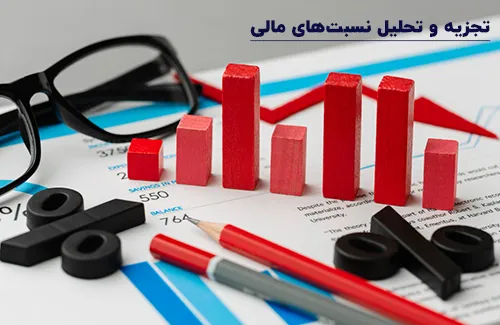

**راهنمای مطالب**

- [تجزیه و تحلیل صورتهای مالی](#تجزیه-و-تحلیل-صورتهای-مالی)
- [اجزای صورت های مالی](#اجزای-صورت-های-مالی)
- [تجزیه و تحلیل ترازنامه](#تجزیه-و-تحلیل-ترازنامه)
- [تجزیه و تحلیل صورت سود و زیان](#تجزیه-و-تحلیل-صورت-سود-و-زیان)
- [تجزیه و تحلیل جریان وجه نقد](#تجزیه-و-تحلیل-جریان-وجه-نقد)
- [تجزیه و تحلیل نسبت های مالی](#تجزیه-و-تحلیل-نسبت-های-مالی)
- [نتیجه گیری](#نتیجه-گیری)

## تجزیه و تحلیل صورتهای مالی
صورت های مالی ابزاری مهم برای ارزیابی عملکرد مالی یک شرکت هستند. تجزیه و تحلیل صورت‌های مالی برای تصمیم گیری درباره سرمایه گذاری در یک شرکت یا ارزیابی عملکرد مالی شرکت بسیار مهم است. 

در این مقاله، به بررسی اجزای صورت‌های مالی و نحوه تجزیه و تحلیل آن‌ها می پردازیم.

<blockquote style="background-color:#f5f5f5; padding:0.5rem">
مطلب پیشنهادی: <a href="https://www.hooshkar.com/Wiki/Financial/FinancialRatios" target="_blank">آشنایی با انواع نسبت های مالی</a></blockquote>

## اجزای صورت های مالی
صورت‌های مالی شامل 3 بخش اصلی هستند: ترازنامه، صورت سود و زیان و گزارش جریان وجوه نقد. 

1. ترازنامه نشان دهنده دارایی‌های شرکت، بدهی‌ها و حقوق صاحبان سهام است. 
2. صورت سود و زیان نشان دهنده درآمد، هزینه‌ها، سود و زیان شرکت در یک دوره مشخص است. 
3. گزارش جریان وجوه نقد نشان دهنده جریان وجوه نقد در شرکت در یک دوره مشخص است.

<blockquote style="background-color:#f5f5f5; padding:0.5rem">
مطلب پیشنهادی: <a href="https://www.hooshkar.com/Wiki/Financial/TaxPayersSystemUpdate" target="_blank">تمدید مهلت ارسال صورت حساب الکترونیکی 1402

</a></blockquote>
## تجزیه و تحلیل ترازنامه

**ترازنامه** نشان دهنده دارایی‌های شرکت، بدهی‌ها و حقوق صاحبان سهام است. 

ترازنامه به دو بخش اصلی تقسیم می‌شود: دارایی‌ و بدهی

**دارایی‌** به دو دسته تقسیم می‌شود: دارایی‌های جاری و دارایی‌های ثابت. 

دارایی‌های جاری نشان دهنده دارایی‌هایی هستند که در طول یک دوره کوتاه می‌توانند به وجود آیند. مانند: پول نقد، حساب‌های دریافتنی، موجودی و... . 

دارایی‌های ثابت نشان دهنده دارایی‌هایی هستند که در طول یک دوره طولانی خریداری شده‌اند و در طول زمان از ارزش آنها کاسته می شود مانند: ماشین آلات، ساختمان، اثاثیه و... .

<blockquote style="background-color:#f5f5f5; padding:0.5rem">
مطلب پیشنهادی: <a href="https://www.hooshkar.com/Wiki/Financial/DetailedAccountingCoding" target="_blank">کدینگ تفصیلی حسابداری چیست؟</a></blockquote>

**بدهی** نیز به دو دسته تقسیم می‌شود: بدهی‌ها و حقوق صاحبان سهام.

بدهی‌ها نشان دهنده میزان پولی هستند که شرکت به سایر افراد و سازمان‌ها بدهکار است. مانند: وام‌ها، نسخه‌های پرداختنی، و... .

**حقوق صاحبان سهام** نیز نشان دهنده میزان پولی است که سهامداران در شرکت سرمایه گذاری کرده‌اند.

برای تجزیه و تحلیل ترازنامه، ابتدا باید روی هر یک از دسته‌ها تمرکز کرد و بررسی کرد که آیا افزایش یا کاهشی در مقدار آن‌ها رخ داده است. سپس باید مقدار هر یک از دارایی‌ها و منابع مالی را با یکدیگر مقایسه کرد تا ببینید که آیا شرکت بدهکار است یا سرمایه گذاران به طور کلی در شرکت دارای سود هستند. در نهایت، باید نسبت‌های مختلفی را محاسبه کنید تا بتوانید اطلاعات دقیق تری درباره عملکرد مالی شرکت بدست آورید. 

## تجزیه و تحلیل صورت سود و زیان

**صورت سود و زیان** نشان دهنده درآمد، هزینه‌ها، سود و زیان شرکت در یک دوره مشخص است. صورت سود و زیان به دو بخش اصلی تقسیم می شود: درآمد عملیاتی و هزینه عملیاتی. 

**درآمد عملیاتی** نشان دهنده درآمدی است که شرکت از فعالیت‌های خود کسب می‌کند. مانند: فروش محصولات، خدمات و... . 

**هزینه عملیاتی** نیز نشان دهنده هزینه‌هایی است که شرکت برای انجام فعالیت‌های خود می‌پردازد. مانند: هزینه‌های مواد اولیه، هزینه‌های نیروی کار، هزینه‌های حمل و نقل و... .

<blockquote style="background-color:#f5f5f5; padding:0.5rem">
مطلب پیشنهادی: مقایسه و بررسی<a href="https://www.hooshkar.com/Wiki/Financial/ComparisonFinancialSoftware" target="_blank"> بهترین نرم افزارهای حسابداری</a></blockquote>

## تجزیه و تحلیل جریان وجه نقد

**جریان وجه نقد** نشان دهنده مقدار پولی است که شرکت دریافت یا پرداخت می‌کند. تجزیه و تحلیل جریان وجه نقد شامل بررسی سه جریان وجه نقد اصلی است: جریان وجه نقد عملیاتی، جریان وجه نقد سرمایه گذاری و جریان وجه نقد تامین مالی. 

**جریان وجه نقد عملیاتی** نشان دهنده میزان پولی است که شرکت از فعالیت‌های خود بدست آورده است.

**جریان وجه نقد سرمایه گذاری** نیز نشان دهنده میزان پولی است که شرکت ار سرمایه گذاری در دارایی‌های جدید، مانند خرید ماشین آلات جدید، ساختمان‌ها و... بدست آورده است. 

**جریان وجه نقد تامین مالی** نیز نشان دهنده میزان پولی است که شرکت برای تأمین نیازهای مالی خود، مانند صدور سهام جدید، وام گرفتن و پرداخت سود به سهامداران و بدهی‌های دیگر، دریافت یا پرداخت کرده است.

برای تجزیه و تحلیل جریان وجه نقد، ابتدا باید جریان وجه نقد عملیاتی را بررسی کنید و ببینید که شرکت چقدر وجه نقد از فعالیت‌های خود بدست آورده است. 

<blockquote style="background-color:#f5f5f5; padding:0.5rem">
مطلب پیشنهادی: <a href="https://www.hooshkar.com/Wiki/Financial/BasicsOfFinancialAccounting" target="_blank">مبانی حسابداری مالی</a></blockquote>

## تجزیه و تحلیل نسبت های مالی

نسبت‌های مالی نشان دهنده ارتباط بین اجزای مختلف دوره مالی هستند. با تحلیل نسبت‌های مالی، شما می‌توانید میزان عملکرد شرکت در دوره مالی مورد نظر را با دوره‌های قبلی یا شرکت‌های دیگر مقایسه کنید. 

**برخی از نسبت‌های مالی مهم عبارتند از:**

**1.	نسبت سود به فروش:** این نسبت نشان می‌دهد که شرکت چقدر با فروش خود سودآوری داشته است.

**2.	نسبت دارایی‌ها به بدهی‌ها:** نشان دهنده میزان بدهی شرکت نسبت به دارایی‌های آن است. این نسبت نشان می‌دهد که شرکت چه میزان از دارایی‌های خود را با وام گرفتن به دست آورده است و با چه میزان بدهی قرار است با توجه به نسبتی که بین دارایی‌ها و بدهی‌های شرکت وجود دارد، بتواند بدهی‌های خود را پرداخت کند.

**3.	نسبت سود ناخالص به فروش:** نشان دهنده درصد سودی است که شرکت قبل از کسر هزینه‌های دیگر، به دست آورده است.

**4.	نسبت دوره پرداخت به بدهی‌ها:** نشان دهنده میزان زمانی است که شرکت برای پرداخت بدهی‌های خود به طور متوسط نیاز دارد. این نسبت نشان می‌دهد که شرکت چه میزان زمان برای پرداخت بدهی‌های خود در اختیار دارد.

**5.	نسبت تورم:** نشان دهنده تغییرات در سطح قیمت‌ها در دوره مالی مورد نظر است. این نسبت می‌تواند به عنوان یک اندازه گیری برای تعیین تأثیر تورم بر عملکرد شرکت استفاده شود.

### نتیجه گیری
تجزیه و تحلیل صورتهای مالی یک شرکت، ابزاری بسیار مهم در تصمیم گیری برای سرمایه گذاران و مدیران است. 

این تجزیه و تحلیل، شما را قادر می‌سازد تا به طور دقیق تری عملکرد شرکت را درک کنید و درک بهتری از وضعیت مالی و آینده شرکت داشته باشید. 

با استفاده از نسبت‌های مالی می‌توانید اطلاعات بیشتری در مورد میزان سودآوری، بدهی‌ها و رشد شرکت بدست آورید. برای مثال، اگر نسبت دوره سرمایه گذاری شرکت به درآمد بیشتر از دوره قبلی بوده باشد، این نشان می‌دهد که شرکت برای بهبود فرایندهای تولیدی و جذب مشتریان، سرمایه گذاری بیشتری انجام داده است. 

همچنین، اگر نسبت بدهی به حقوق صاحبان سهام بیشتر از دوره قبلی باشد، این نشان می‌دهد که شرکت برای تأمین سرمایه برای پروژه‌های جدید بیشتر به بدهی نیاز داشته است.

همچنین، تجزیه و تحلیل صورتهای مالی می‌تواند به شما کمک کند تا بهترین تصمیمات را برای سرمایه گذاری در شرکت بگیرید. به عنوان مثال، اگر سودآوری شرکت در دوره مالی جاری کمتر از دوره قبلی بوده باشد، می‌توانید بررسی کنید که چه مشکلاتی باعث این کاهش شده‌اند و تلاش کنید برای بهبود آنها. همچنین، اگر شرکت در حال رشد است، می‌توانید سرمایه گذاری بیشتری در آن انجام دهید تا سود بیشتری کسب کنید.

در نهایت، برای تجزیه و تحلیل صورتهای مالی یک شرکت، لازم است تا از تخصص و دانش کافی در این حوزه برخوردار باشید. 

همچنین، باید اطلاعات مالی شرکت را به صورت کامل و دقیق بدست آورید تا بتوانید تحلیلی صحیح از وضعیت مالی شرکت ارائه دهید. 

با توجه به اهمیت تجزیه و تحلیل صورتهای مالی، بسیاری از شرکت‌ها و موسسات به متخصصین مالی نیاز دارند. برخی از شرکت‌ها ممکن است نیاز داشته باشند تا گزارشات مالی خود را به صورت دوره‌ای به دفتر حسابداری خود ارائه دهند تا بتوانند با توجه به اطلاعات به دست آمده، تصمیمات بهتری برای آینده شرکت بگیرند.

به طور خلاصه، تجزیه و تحلیل صورتهای مالی می‌تواند به شما کمک کند تا بهترین تصمیمات سرمایه گذاری در شرکت خود را بگیرید. 

[مقدمه]: #مقدمه
[اجزای صورت های مالی]: #اجزای-صورت-های-مالی
[تجزیه و تحلیل ترازنامه]: #تجزیه-و-تحلیل-ترازنامه
[تجزیه و تحلیل صورت سود و زیان]: #تجزیه-و-تحلیل-صورت-سود-و-زیان
[تجزیه و تحلیل جریان وجه نقد]: #تجزیه-و-تحلیل-جریان-وجه-نقد
[تجزیه و تحلیل نسبت های مالی]: #تجزیه-و-تحلیل-نسبت-های-مالی
[نتیجه گیری]: #نتیجه-گیری