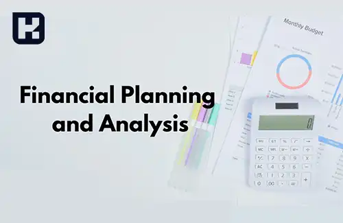

<blockquote style="padding:0.5rem; margin-top:0.5rem;">

  
آنچه در این مطلب خواهید خواند:

  <ul>
    <li>تحلیل و برنامه‌ریزی مالی</li>
    <ul>
     <li>تعیین بودجه</li>
     <li>صرفه‌جویی در هزینه‌ها</li>
     <li>پس‌انداز</li>
     <li>سرمایه‌گذاری</li>
     <li>استفاده از ابزارهای مدیریت مالی</li>
     <li>پرداخت بدهی‌ها در موعد مقرر</li>
     <li>دریافت کمک از مشاوران مالی</li>
     <li>ایجاد برنامه مالی بلندمدت</li>
     <li>استفاده از خدمات بانکی آنلاین</li>
    </ul>
    <li>نتیجه‌گیری</li>
  </ul>

</blockquote>

 مدیریت مالی نه‌تنها برای کسب‌وکارها بلکه برای هر فردی یک نیاز اساسی است. برنامه‌ریزی مالی صحیح می‌تواند مسیر موفقیت مالی را هموار کند و از مشکلاتی مانند بدهی‌های سنگین، هزینه‌های غیرضروری و عدم توانایی در پس‌انداز جلوگیری نماید. با وجود پیچیدگی‌های اقتصادی و تغییرات بازار، اتخاذ تصمیمات هوشمندانه در زمینه مدیریت هزینه‌ها، سرمایه‌گذاری و برنامه‌ریزی مالی بیش از هر زمان دیگری اهمیت دارد.  

در این مقاله، راهکارهای عملی و مؤثری برای بهینه‌سازی مدیریت مالی ارائه می‌شود. از تعیین بودجه و صرفه‌جویی در هزینه‌ها گرفته تا سرمایه‌گذاری و استفاده از ابزارهای مالی نوین، نکاتی را بررسی می‌کنیم که می‌توانند به بهبود وضعیت مالی و افزایش ثبات اقتصادی شما کمک کنند.

## تحلیل و برنامه ریزی مالی

مدیریت مالی برای هر فردی امری حیاتی است که باید به آن توجه ویژه‌ای داشته باشد. در حالی که برخی افراد می‌توانند به راحتی با مسائل مالی خود کنار بیایند، برخی دیگر احساس مشکل و دشواری می‌کنند. 

در اینجا، راهکاری را برای مدیریت مالی موثرتر معرفی می‌کنیم که به شما کمک می‌کند در زمینه‌های مختلفی مانند تعیین بودجه، صرفه جویی در هزینه‌ها و سرمایه گذاری، بهترین تصمیمات را بگیرید.

<blockquote style="background-color:#f5f5f5; padding:0.5rem">

<strong>آشنایی با <a href="https://www.hooshkar.com/Software/Sayan" target="_blank">نرم افزار مالی</a> سایان</strong>
</blockquote>

### 1. تعیین بودجه
یکی از مهمترین راهکارهایی که می‌تواند در مدیریت مالی معجزه کند، تعیین بودجه است. این کار به شما کمک می‌کند تا بتوانید مصرف‌های خود را در چارچوب معقولی نگه دارید. 

تعیین یک بودجه سالانه، ماهانه و هفتگی، بسته به نیازهای شما، می‌تواند به شما کمک کند تا مبالغی را که در هر دوره برای هزینه‌های مختلف خود می‌خواهید صرف کنید، مشخص کنید. 

با داشتن بودجه، می‌توانید بهترین تصمیم‌های ممکن در خصوص صرف هزینه‌های خود بگیرید و هزینه‌های غیرضروری خود را کاهش دهید. از طرفی، با پیگیری این بودجه‌ها، می‌توانید به آسانی مطمئن شوید که آیا می‌توانید هزینه‌های خود را پوشش دهید یا خیر.

### 2. صرفه جویی در هزینه ها
صرفه جویی در هزینه‌ها یکی دیگر از راهکارهای مهم در مدیریت مالی است. این کار به شما کمک می‌کند تا هزینه‌های خود را کاهش دهید و سرمایه گذاری‌های بیشتری را برای خود داشته باشید. 

در این راستا، شما می‌توانید از روش‌های مختلفی مانند کاهش مصرف انرژی در خانه، جایگزینی متریال‌های گران قیمت با محصولات بسیار ارزانتر، استفاده از پیشنهادات و تخفیف‌های فصلی در فروشگاه‌ها، یا خرید کالاهای دست دوم استفاده کنید. 

همچنین، در نظر داشته باشید که انجام کارهای خود به صورت خودمانی، مانند تعمیرات خانگی یا پاک کردن ماشین خود، به شما کمک می‌کند تا بتوانید هزینه‌های خود را کاهش دهید.

### 3. پس انداز
پس انداز، یکی دیگر از راهکارهای مهم در مدیریت مالی است. این کار به شما کمک می‌کند تا برای مواقع بحرانی یا ناگهانی، پولی در اختیار داشته باشید و از دسترسی به سرمایه‌های خود در زمان‌های دشوار جلوگیری کنید.

در نظر داشته باشید که این پس انداز باید به صورت منظم و با توجه به درآمد شماو در زمان رکود انجام شود.

### 4. سرمایه گذاری

سرمایه گذاری یکی دیگر از راهکارهای موثر در مدیریت مالی است. با سرمایه گذاری در بورس، سپرده‌های بانکی، خرید املاک و مستغلات و یا سرمایه گذاری در کسب و کارهای کوچک، می‌توانید در زمان های سقوط بازار سرمایه خود را افزایش دهید و به سود بیشتری دست پیدا کنید. 

در نظر داشته باشید که سرمایه گذاری در هر یک از این رشته‌ها، خطرات خاص خود را دارد و بهتر است قبل از شروع سرمایه گذاری، مطالعه و تحقیق کافی درباره آنها انجام دهید.

### 5. استفاده از ابزارهای مدیریت مالی
استفاده از ابزارهای مدیریت مالی مانند نرم افزارهای بودجه ریزی و محاسبه هزینه‌ها، یکی دیگر از راهکارهای مفید در مدیریت مالی است. 

با استفاده از این ابزارها، می‌توانید درآمد و هزینه‌های خود را بررسی کنید و برنامه ریزی‌های لازم را برای بهبود مالی خود انجام دهید. همچنین، این ابزارها به شما کمک می‌کنند تا هزینه‌های مختلف خود را ردیابی کنید و بهترین راهکارهای ممکن را برای صرفه جویی در هزینه‌های خود پیدا کنید.

### 6. پرداخت بدهی ها در موعد مقرر

پرداخت بدهی‌ها در موعد مقرر، یکی دیگر از مهمترین راهکارهای مدیریت مالی است. با پرداخت بدهی‌های خود در موعد مقرر، جریمه‌ها و هزینه‌های اضافی را جلوگیری می‌کنید و از افزایش بدهی‌های خود جلوگیری می‌کنید. 

در نظر داشته باشید که تأخیر در پرداخت بدهی‌ها می‌تواند باعث لطمه به اعتبار و کاهش اعتماد به شما از نظر مردم و سازمان‌ها شود.

### 7. دریافت کمک از مشاوران مالی
دریافت کمک از مشاوران مالی، یکی دیگر از راهکارهای مهم در مدیریت مالی است. با مشاوره گرفتن از افراد متخصص، می‌توانید برای مسائل مالی خود بهترین راهکارها را پیدا کنید و بهترین تصمیم‌ها را در خصوص مدیریت مالی خود بگیرید. 

همچنین، مشاوران مالی می‌توانند به شما در تحلیل و بررسی وضعیت مالی خود کمک کنند تا بهترین راه حل‌های ممکن را برای بهبود مالی خود پیدا کنید.

### 8. ایجاد برنامه مالی بلند مدت
ایجاد برنامه مالی بلند مدت، یکی دیگر از راهکارهای مفید در مدیریت مالی است که برای بهبود مالی خود باید پیگیری کنید. با ایجاد برنامه مالی بلند مدت، می‌توانید هدف‌های مالی خود را مشخص کرده و برنامه ریزی‌های لازم را برای رسیدن به این هدف‌ها انجام دهید. 

این برنامه ممکن است شامل مواردی مانند کاهش هزینه‌ها، افزایش درآمد، سرمایه گذاری در پروژه‌های مطمئن و غیره باشد. با پیگیری برنامه مالی بلند مدت، شما می‌توانید اوضاع مالی خود را بهبود ببخشید و به هدف‌های مالی خود نزدیک‌تر شوید.

### 9. استفاده از خدمات بانکی آنلاین

استفاده از خدمات بانکی آنلاین، یکی دیگر از راهکارهای مهم در مدیریت مالی است. با استفاده از خدمات بانکی آنلاین، می‌توانید به آسانی حساب‌های خود را مدیریت کنید، تراکنش‌های خود را مشاهده کنید و اطلاعاتی درباره موجودی و معاملات خود بدست آورید. 

همچنین، با استفاده از خدمات بانکی آنلاین، می‌توانید پرداخت‌های خود را به سرعت و با دقت انجام دهید و زمان خود را صرف مدیریت حساب‌های خود نکنید.

#### نتیجه گیری
در نهایت، باید یادآور شویم که مدیریت مالی یک فرایند پویا است و باید به روز رسانی شود. شما می‌توانید با پیگیری برنامه مالی و ایجاد روش‌های موثر در مدیریت مالی، کنترل بهتری بر موقعیت مالی خود داشته باشید.