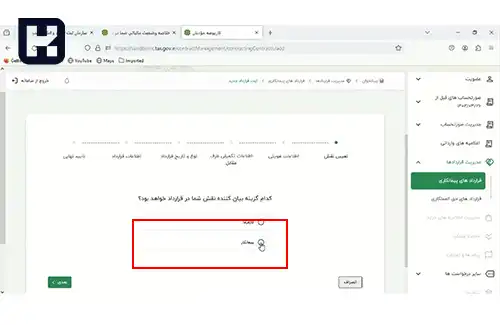
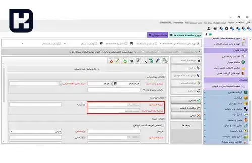

<blockquote style="padding:0.5rem; margin-top:0.5rem;">

  
آنچه در این مطلب خواهید خواند:

  <ul>
   <li>راهنمای گام‌ به‌ گام ثبت قرارداد در سامانه مودیان</li>
   <li>ارسال صورتحساب پیمانکاری به سامانه مودیان</li>
   <li>سوالات متداول</li>
  </ul>

</blockquote> 

با گسترش استفاده از فناوری اطلاعات و خدمات الکترونیک، فرآیندهای سنتی و کاغذبازی مربوط به انعقاد قراردادها و ارسال صورتحساب‌ها نیز با تغییراتی روبرو شده است. سازمان امور مالیاتی نیز در راستای تسهیل و شفاف‌سازی این فرآیندها، سامانه‌ای را برای ثبت و پیگیری قراردادهای پیمانکاری و همچنین ارسال صورتحساب‌های الکترونیکی تحت عنوان "سامانه مودیان" راه‌اندازی کرده است.

در این راهنما، گام‌به‌گام نحوه ثبت قرارداد و ارسال صورتحساب پیمانکاری در این سامانه توضیح داده خواهد شد.

## راهنمای گام‌ به‌ گام ثبت قرارداد در سامانه مودیان

1. در ابتدا، به کارپوشه مربوطه وارد شوید، مطابق آنچه در تصویر نمایش داده شده، گزینه "قراردادهای پیمانکاری" را انتخاب و بعد بر روی "ثبت قرارداد جدید" کلیک نمایید.

2. در این مرحله، نقش شرکت خود را مشخص کنید.

3. سپس، شماره اقتصادی طرف قرارداد را وارد نمایید.

4. با استفاده از شماره اقتصادی که وارد کرده‌اید، سامانه نام طرف قرارداد را نمایش می‌دهد و در صورت تایید، فرآیند ادامه می‌یابد.

5. در مرحله بعدی، نوع قرارداد و تاریخ را مشخص کنید.

6. بعد از وارد کردن تاریخ قرارداد، برای جلوگیری از ثبت قراردادهای تکراری، می‌توانید قراردادهای موجود در تاریخ مورد نظر را نیز مشاهده کنید.

7. در مرحله بعد، اطلاعات تکمیلی قرارداد و جزئیات پیش‌پرداخت یا مبالغ علی‌الحساب نیز وارد می‌شود.

8. در این مرحله، اطلاعات وارد شده در سامانه به صورت یکجا به مودی جهت تایید نهایی نمایش داده می‌شود.

 

9. اگر تایید نهایی صورت گیرد، یک شماره ۱۲ رقمی که به عنوان **شناسه یکتای حافظه مالیاتی قرارداد** شناخته می‌شود، به کاربر اختصاص داده خواهد شد.

---

### ارسال صورتحساب پیمانکاری به سامانه مودیان

برای ارسال صورتحساب‌های الکترونیکی به صورت پیمانکاری، ابتدا وارد  **<a href="https://www.hooshkar.com/Software/Sayan/Module/TpTaxGov" target="_blank">نرم‌افزار واسط سامانه مودیان سایان</a>**  شوید و در قسمت **گزارشات قانونی → سامانه مودیان**، ابتدا نوع صورتحساب را انتخاب کنید، سپس قرارداد پیمانکاری را تعیین کرده و یک فاکتور جدید ثبت نمایید.

---

### سوالات متداول

<blockquote style="padding:0.5rem; margin-top:0.5rem;">

  
شناسه ۱۲ رقمی قرارداد چیست و چه کاربردی دارد؟

  این شناسه به عنوان «شناسه یکتای حافظه مالیاتی قرارداد» شناخته می‌شود و برای هر قرارداد پیمانکاری در سامانه مودیان صادر می‌شود. این شناسه باید در زمان ارسال صورتحساب‌های پیمانکاری درج شود.

</blockquote>

<blockquote style="padding:0.5rem; margin-top:0.5rem;">

  
آیا می‌توان برای یک قرارداد چند صورتحساب پیمانکاری ارسال کرد؟

  بله. تا زمانی که شناسه قرارداد معتبر است، می‌توان چند صورتحساب جزئی مربوط به همان قرارداد را به سامانه مودیان ارسال کرد.

</blockquote>

<blockquote style="padding:0.5rem; margin-top:0.5rem;">

  
در صورت وارد کردن اشتباه اطلاعات قرارداد چه باید کرد؟

  در صورت بروز خطا در اطلاعات قرارداد، باید ابتدا قرارداد اشتباه را لغو کرده و مجدداً با اطلاعات صحیح ثبت کنید. سامانه مودیان امکان ویرایش مستقیم قرارداد تأییدشده را ندارد.

</blockquote>

<blockquote style="padding:0.5rem; margin-top:0.5rem;">

  
آیا برای هر قرارداد جدید باید شناسه جدید دریافت شود؟

  بله، هر قرارداد پیمانکاری دارای شناسه یکتای مجزاست که پس از ثبت نهایی در سامانه به مودی اختصاص می‌یابد.

</blockquote>

---

### جمع‌بندی

ثبت قرارداد پیمانکاری در سامانه مودیان یکی از الزامات قانونی برای ارسال صورتحساب‌های الکترونیکی است. با طی مراحل بالا، مودیان می‌توانند شناسه یکتای قرارداد خود را دریافت کرده و تمامی فاکتورهای مرتبط را به صورت دقیق و قانونی ثبت کنند.  

برای مشاهده ویدئوی آموزشی مرتبط، می‌توانید از لینک زیر استفاده کنید:  
<a href="https://www.aparat.com/v/N8zq4?refererRef=channel_page" target="_blank">آموزش تنظیمات نرم‌افزار سایان در سامانه مودیان</a>