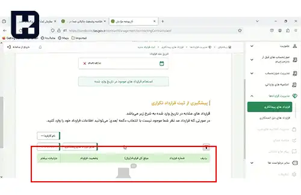

<blockquote style="background-color:#eeeefc; padding:0.5rem">

  
آنچه در این مطلب خواهید خواند:

  <ul>
   <li>راهنمای گام‌ به‌ گام ثبت قرارداد در سامانه مودیان</li>
   <li>ارسال صورتحساب پیمانکاری به سامانه مودیان</li>
  </ul>

</blockquote>

 با گسترش استفاده از فناوری اطلاعات و خدمات الکترونیک، فرآیندهای سنتی و کاغذبازی مربوط به انعقاد قراردادها و ارسال صورتحساب‌ها نیز با تغییراتی روبرو شده است. سازمان امور مالیاتی نیز در راستای تسهیل و شفاف‌سازی این فرآیندها، سامانه‌ای را برای ثبت و پیگیری قراردادهای پیمانکاری و همچنین ارسال صورتحساب‌های الکترونیکی تحت عنوان "سامانه مودیان" راه‌اندازی کرده است.

در این راهنما، گام‌به‌گام نحوه ثبت قرارداد و ارسال صورتحساب پیمانکاری در این سامانه توضیح داده خواهد شد.

## راهنمای گام‌ به‌ گام ثبت قرارداد در سامانه مودیان

1. در ابتدا، به کارپوشه مربوطه وارد شوید، مطابق آنچه در تصویر نمایش داده شده، گزینه "قراردادهای پیمانکاری" را انتخاب و بعد بر روی "ثبت قرارداد جدید" کلیک نمایید.

2. در این مرحله، نقش شرکت خود را مشخص کنید.

3. سپس، شماره اقتصادی طرف قرارداد را وارد نمایید.

4. با استفاده از شماره اقتصادی که وارد کرده‌اید سامانه، نام طرف قرارداد را نمایش می‌دهد و در صورت تایید، فرآیند ادامه می‌یابد.

5. در مرحله بعدی، نوع قرارداد و تاریخ را مشخص کنید.

6. بعد از وارد کردن تاریخ قرارداد، برای جلوگیری از ثبت قراردادهای تکراری، می‌توانید قراردادهای موجود در تاریخ مورد نظر را نیز مشاهده کنید.

7. در مرحله بعد، اطلاعات تکمیلی قرارداد و جزئیات پیش‌پرداخت یا مبالغ علی‌الحساب نیز وارد می‌شود.

8. در این مرحله، اطلاعات وارد شده در سامانه به صورت یکجا به مودی جهت تایید نهایی نمایش داده می‌شود.

 

9. اگر تایید نهایی صورت گیرد، یک شماره ۱۲ رقمی که به عنوان شناسه یکتای حافظه مالیاتی قرارداد شناخته می‌شود، به کاربر اختصاص داده خواهد شد.

## ارسال صورتحساب پیمانکاری به سامانه مودیان

برای ارسال صورتحساب‌های الکترونیکی به صورت پیمانکاری، ابتدا وارد **<a href="https://www.hooshkar.com/Software/Sayan/Module/TpTaxGov" target="_blank">نرم افزار واسط سامانه مودیان سایان
</a>** شوید و در قسمت گزارشات قانونی و سپس در فیلد سامانه مودیان، ابتدا نوع صورتحساب اول را انتخاب کنید، سپس قرارداد پیمانکاری را انتخاب و یک فاکتور جدید را ثبت نمایید.

