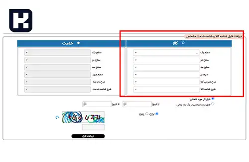

<blockquote class="faq-block">

  
آنچه در این مطلب خواهید خواند:

  <ul>
    <li>مقدمه: اهمیت شناسه کالا در سامانه مودیان</li>
    <li>نحوه دریافت و استعلام شناسه کالا</li>
    <li>جستجوی شناسه بر اساس مشخصات کالا</li>
    <li>مدیریت شناسه کالا در نرم‌افزار سایان</li>
    <li>سوالات متداول</li>
    <li>جمع‌بندی</li>
  </ul>

</blockquote> 

برای ارسال صورتحساب‌های الکترونیکی در **سامانه مودیان**، دریافت شناسه کالا یکی از مراحل ضروری است.  
شناسه کالا، یک کد یکتا است که هر کالا در کشور با آن شناسایی می‌شود و در فرآیند صدور فاکتور الکترونیکی، نقش کلیدی در **دسته‌بندی، ردیابی و شفافیت اطلاعات مالیاتی** دارد.  

این شناسه به مودیان کمک می‌کند تا اطلاعات کالاهای خود را به‌صورت دقیق و مطابق با قوانین مالیاتی ثبت کنند.  
در این آموزش، مراحل **دریافت، جستجو و استفاده از شناسه کالا** را در سامانه مودیان و نرم‌افزار **سایان** به‌طور کامل بررسی می‌کنیم.  

## نحوه دریافت و استعلام شناسه کالا

سازمان امور مالیاتی برای تسهیل ارسال صورتحساب‌های الکترونیکی، این امکان را فراهم کرده است که مودیانی که هنوز شناسه اختصاصی کالا دریافت نکرده‌اند، بتوانند از **لیست شناسه‌های عمومی** تهیه‌شده توسط سازمان استفاده کنند.  

این لیست در بخش **ارسال فایل و شناسه کالا** از طریق وب‌سایت زیر در دسترس است:

**<a href="https://stuffid.tax.gov.ir/" target="_blank">stuffid.tax.gov.ir</a>**

مودیان می‌توانند شناسه مرتبط با کالا یا خدمت خود را از این لیست انتخاب کنند.  

1. در این بخش می‌توانید تمام شناسه‌های کالا را دریافت کرده و برای سهولت، فرمت فایل را به‌صورت **CSV** انتخاب کنید تا اطلاعات در قالب فایل اکسل در اختیار شما قرار گیرد.  

2. در مرحله بعد، می‌توانید با استفاده از **مشخصات کلی کالای خود (مانند نام، برند یا گروه کالا)**، در میان تمامی شناسه‌ها جستجو کنید.  

3. پس از دریافت شناسه کالای موردنظر، می‌توانید از طریق **نرم‌افزار سایان**، نوع کالا و شناسه مربوطه را مدیریت و استفاده کنید.  

---

### جستجوی شناسه بر اساس مشخصات کالا

در صورتی که کالای شما شناسه اختصاصی ندارد، کافی است وارد بخش «جستجو در فهرست عمومی شناسه‌ها» شوید.  
در این قسمت می‌توانید بر اساس فیلدهایی مانند **نام کالا، برند، مدل یا گروه کالا**، شناسه مناسب را پیدا کنید.  

پس از انتخاب شناسه، آن را در فاکتور الکترونیکی خود ثبت کنید.  
چنانچه کالای شما در فهرست وجود نداشته باشد، باید از طریق سامانه جامع تجارت، برای **دریافت شناسه اختصاصی کالا** اقدام نمایید.

---

## مدیریت شناسه کالا در نرم‌افزار سایان

نرم‌افزار **سایان** به‌عنوان یکی از ابزارهای مورد تأیید سازمان امور مالیاتی، این امکان را می‌دهد تا:
- شناسه‌های عمومی یا اختصاصی کالا را ثبت و ذخیره کنید؛  
- هنگام صدور صورتحساب الکترونیکی، شناسه را به‌صورت خودکار در هر ردیف فاکتور درج نمایید؛  
- و در صورت تغییر قوانین یا به‌روزرسانی فهرست کالاها، داده‌ها را همگام‌سازی کنید.  

برای راهنمایی بیشتر می‌توانید آموزش 
<a href="https://www.aparat.com/v/N8zq4?refererRef=channel_page" target="_blank">تنظیمات نرم‌افزار سایان در سامانه مودیان</a> 
را ببینید.

---

### سوالات متداول

<blockquote class="faq-block">

  
آیا دریافت شناسه کالا برای همه مودیان الزامی است؟

  بله، تمام مودیانی که صورتحساب الکترونیکی صادر می‌کنند باید برای هر کالا یا خدمت، شناسه مرتبط را درج نمایند. در غیر این صورت، فاکتور آنها در سامانه مودیان پذیرفته نخواهد شد.

</blockquote>

<blockquote class="faq-block">

  
اگر کالای من در فهرست عمومی وجود نداشت چه کنم؟

  در این حالت باید از طریق <strong>سامانه جامع تجارت</strong> برای دریافت شناسه اختصاصی اقدام کنید و پس از تأیید، آن را در سامانه مودیان ثبت نمایید.

</blockquote>

<blockquote class="faq-block">

  
آیا شناسه عمومی با شناسه اختصاصی تفاوت دارد؟

  بله. شناسه عمومی برای کالاهای پرمصرف و مشترک میان مودیان است، اما شناسه اختصاصی به‌صورت ویژه برای کالاهای خاص یک مودی یا تولیدکننده صادر می‌شود.

</blockquote>

<blockquote class="faq-block">

  
آیا نرم‌افزار سایان به‌صورت خودکار شناسه کالا را فراخوانی می‌کند؟

  در نسخه‌های جدید، نرم‌افزار سایان قابلیت اتصال مستقیم به فهرست عمومی شناسه‌ها را دارد و می‌تواند بر اساس کلیدواژه، شناسه مرتبط را پیشنهاد دهد.

</blockquote>

<blockquote class="faq-block">

  
آیا ثبت اشتباه شناسه کالا باعث رد فاکتور می‌شود؟

  بله. در صورتی که شناسه درج‌شده با نوع کالا مطابقت نداشته باشد، فاکتور توسط سامانه مودیان برگشت داده می‌شود و لازم است اصلاح صورت گیرد.

</blockquote>

---

### جمع‌بندی

شناسه کالا یکی از مهم‌ترین عناصر در فرآیند ارسال صورتحساب‌های الکترونیکی است و استفاده از آن برای **شفافیت اطلاعات، جلوگیری از خطا و اعتبار مالیاتی شرکت‌ها** الزامی است.  
مودیان باید اطمینان حاصل کنند که برای هر کالا، شناسه صحیح را از **لیست رسمی stuffid.tax.gov.ir** انتخاب کرده و در نرم‌افزار خود درج کنند.  

رعایت این نکات موجب تسهیل در فرآیند حسابرسی و جلوگیری از مشکلات احتمالی در ارسال فاکتورها خواهد شد.