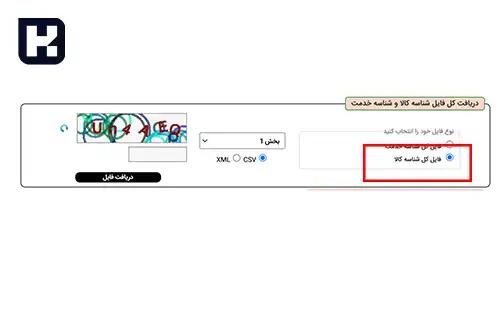
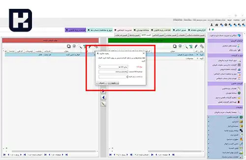

برای ارسال صورتحساب‌های الکترونیکی در سامانه مودیان، دریافت شناسه کالا یکی از مراحل ضروری است. این فرایند به مودیان کمک می‌کند تا اطلاعات کالاهای خود را به‌صورت دقیق و مطابق با قوانین مالیاتی ثبت کنند. در این آموزش، نحوه دریافت و استفاده از شناسه کالا در سامانه مودیان را به‌طور کامل توضیح خواهیم داد.

## نحوه دریافت و استعلام دریافت شناسه کالا

سازمان امور مالیاتی برای تسهیل ارسال صورتحساب‌های الکترونیکی، این امکان را فراهم کرده است که مودیانی که هنوز شناسه اختصاصی کالا دریافت نکرده‌اند، بتوانند از لیست شناسه‌های عمومی تهیه‌شده توسط سازمان استفاده کنند. 

این لیست در بخش ارسال فایل و شناسه کالا، از طریق وب‌سایت **<a href="https://stuffid.tax.gov.ir/" target="_blank">stuffid.tax.gov
</a>** در دسترس است و مودیان می‌توانند شناسه مرتبط با فعالیت خود را از آن انتخاب کنند.

 

1.	در این بخش می‌توانید تمام شناسه‌های کالا را دریافت کرده و برای سهولت، فرمت فایل را به صورت CSV انتخاب کنید تا اطلاعات به‌صورت فایل اکسل در اختیار شما قرار گیرد. 

2.	در مرحله بعد، می‌توانید با استفاده از مشخصات کلی کالای خود، در میان تمامی شناسه‌ها جستجو کنید.
 

3.	پس از دریافت شناسه کالای موردنظر، می‌توانید از طریق نرم‌افزار سایان، نوع کالا و شناسه مربوطه را مدیریت و استفاده کنید.
 

