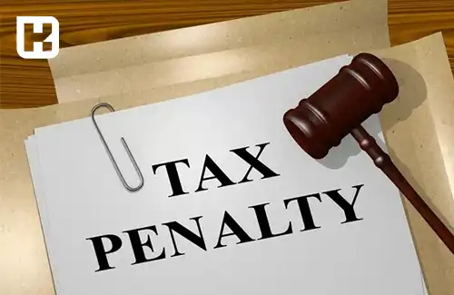

<blockquote class="faq-block">

  
آنچه در این مطلب خواهید خواند:

  <ul>
    <li>شرکت‌های غیرفعال به چه شرکت‌هایی اطلاق می‌شود؟</li>
    <li>چگونگی اعلام عدم فعالیت شرکت</li>
    <li>آیا شرکت‌های غیر فعال مشمول مالیات می‌شوند؟</li>
    <li>چگونگی محاسبه مالیات برای شرکت‌های غیرفعال</li>
    <li>وظایف مالیاتی مدیران شرکت‌های غیر فعال</li>
    <li>پیامدهای عدم اعلام وضعیت غیرفعالی شرکت‌ها</li>
    <li>چگونه شرکت غیر فعال را منحل کنیم؟</li>
    <li>سوالات متداول</li>
    <li>جمع‌بندی</li>
  </ul>

</blockquote> 

شرکت‌های غیرفعال، شرکت‌هایی هستند که ثبت قانونی دارند اما در طول سال هیچ فعالیت اقتصادی و تجاری انجام نمی‌دهند. این شرکت‌ها، که گردش مالی آن‌ها صفر است، ممکن است برای بهره‌مندی از معافیت‌های مالیاتی، وضعیت عدم فعالیت خود را به اداره مالیات اعلام کنند. در این مقاله، به بررسی کامل شرکت‌های غیرفعال، نحوه اعلام عدم فعالیت، وظایف مالیاتی مدیران، محاسبه مالیات و مراحل انحلال این شرکت‌ها می‌پردازیم.

برای مدیریت آسان مالیات شرکت‌های غیرفعال، می‌توانید از <a href="https://www.hooshkar.com/Software/Sayan/Module/TpTaxGov" target="_blank">نرم افزار واسط سامانه مودیان سایان</a> استفاده کنید.

## شرکت‌های غیرفعال به چه شرکت‌هایی اطلاق می‌شود؟

شرکت غیر فعال به شرکتی گفته می‌شود که ثبت قانونی شده است اما هیچ گونه فعالیت اقتصادی و تجاری ندارد. گردش مالی چنین شرکتی صفر است و از نظر قانونی، شرکتی غیر فعال است که در طول سال هیچ تبادل مالی انجام نمی‌دهد.

---

### چگونگی اعلام عدم فعالیت شرکت

برای بهره‌مندی از معافیت مالیاتی، شرکت باید وضعیت عدم فعالیت خود را به‌طور رسمی به اداره مالیات اعلام کند. مدارک مورد نیاز عبارتند از:

- عدم وجود فاکتورها یا صورت‌حساب‌های صادرشده از سوی شرکت  
- صفر بودن گردش حساب بانکی و مالی در دوره مورد نظر  
- ثبت نکردن مبالغ مربوط به حقوق، خرید، فروش و اجاره در دفاتر حسابداری  
- عدم وجود کد بیمه و پرداخت‌های بیمه‌ای  
- عدم ارائه اسناد استخدامی یا پرداخت حقوق و دستمزد  
- عدم سرمایه‌گذاری شرکت در پروژه‌ها  
- نبود تسهیلات بانکی یا وام  
- عدم انعقاد قراردادهای مشارکت با سایر شرکت‌ها  

برای مدیریت بهتر این روند، می‌توانید از <a href="https://www.hooshkar.com/Software/Sayan/Module/TpTaxGov" target="_blank">نرم افزار سامانه مودیان سایان</a> استفاده کنید.

---

### آیا شرکت‌های غیر فعال مشمول مالیات می‌شوند؟

شرکت‌های غیرفعال در صورتی که قوانین مربوطه را رعایت کنند، از پرداخت مالیات معاف خواهند بود. اما لازم است که این عدم فعالیت به اداره مالیات اثبات شود.

---

### چگونگی محاسبه مالیات برای شرکت‌های غیرفعال

هر شرکتی که با هدف فعالیت اقتصادی تأسیس شده و کد اقتصادی دریافت کرده است، موظف به پرداخت مالیات است. عدم تشکیل پرونده مالیاتی به معنای معافیت نیست و شرکت‌ها تا دو ماه پس از تأسیس فرصت دارند پرونده مالیاتی خود را تشکیل دهند.  

عدم اعلام عدم فعالیت به اداره مالیات می‌تواند منجر به جریمه مالیاتی شود. برای اطلاعات بیشتر درباره مدیریت هزینه‌ها و مالیات شرکت‌ها، مطلب <a href="https://www.hooshkar.com/Wiki/Financial/CostCenters" target="_blank">مراکز هزینه در شرکت‌های تولیدی</a> را ببینید.

---

### وظایف مالیاتی مدیران شرکت‌های غیر فعال

- ارسال اعلام کتبی عدم فعالیت به اداره مالیات و دریافت تأییدیه  
- پلمپ دفاتر قانونی  
- ارائه اظهارنامه مالیاتی  
- ثبت تغییرات وضعیت شرکت طبق تبصره ۴ ماده ۱۸۶ قانون مالیات‌های مستقیم  
- اعلام شروع مجدد فعالیت شرکت در صورت بازگشایی  

---

### پیامدهای عدم اعلام وضعیت غیرفعالی شرکت‌ها

عدم اعلام عدم فعالیت، منجر به جریمه مالیات علی‌الراس خواهد شد. حتی اگر فعالیت اقتصادی صورت نگرفته باشد، ارائه اظهارنامه و دفاتر قانونی در موعد مقرر ضروری است.

---

### چگونه شرکت غیر فعال را منحل کنیم؟

برای انحلال شرکت غیر فعال:

- فهرست دارایی‌ها و بدهی‌ها تهیه شود  
- دیون پرداخت گردد  
- اموال بین سهام‌داران تقسیم شود  
- اظهارنامه انحلال ارائه شود  

در غیر این صورت، ۱ تا ۲ درصد از سرمایه پرداختی به عنوان جریمه مالیاتی در نظر گرفته خواهد شد.

---

### سوالات متداول

<blockquote class="faq-block">

  
آیا شرکت بدون فعالیت مالیات می‌پردازد؟

  اگر عدم فعالیت به اداره مالیات اثبات شود، شرکت مشمول مالیات نخواهد بود.

</blockquote>

<blockquote class="faq-block">

  
چه مدارکی برای اعلام عدم فعالیت نیاز است؟

  مدارکی شامل گردش حساب بانکی صفر، عدم فاکتورها و صورت‌حساب‌ها، پلمپ دفاتر و عدم پرداخت حقوق است.

</blockquote>

<blockquote class="faq-block">

  
آیا شروع مجدد فعالیت شرکت نیاز به اعلام دارد؟

  بله، مدیران موظف به اعلام کتبی به اداره مالیات هستند.

</blockquote>

<blockquote class="faq-block">

  
آیا انحلال شرکت مالیات معاف دارد؟

  بله، در صورت ارائه اظهارنامه انحلال و تسویه بدهی‌ها، شرکت از پرداخت مالیات معاف می‌شود.

</blockquote>

---

### جمع‌بندی

شرکت‌های غیرفعال باید وضعیت عدم فعالیت خود را به اداره مالیات اعلام کنند تا از پرداخت مالیات معاف شوند. رعایت قوانین، ارائه مدارک کامل و استفاده از نرم افزارهای مدیریتی مانند **سامانه مودیان سایان** می‌تواند از جریمه‌های مالیاتی جلوگیری کرده و مدیریت شرکت را ساده‌تر کند.