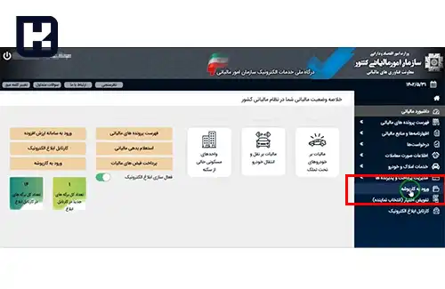
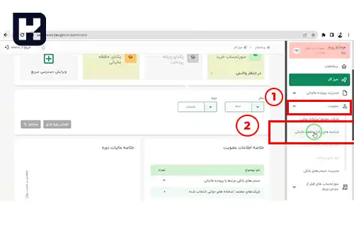
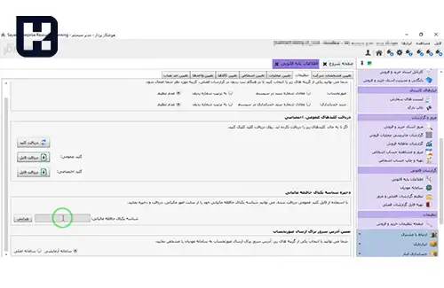

<blockquote class="faq-block">

  
فهرست مطالب

  <ul>
    <li>نحوه دریافت شناسه یکتا از سامانه مودیان</li>
    <li>مراحل ورود و دریافت رمز</li>
    <li>ویرایش و ثبت شناسه در نرم‌افزار سایان</li>
    <li>سوالات متداول</li>
    <li>جمع‌بندی</li>
  </ul>

</blockquote> 

شناسه یکتای حافظه مالیاتی یکی از مهم‌ترین ابزارها در سیستم مالیاتی کشور است که برای تمامی مودیان ضروری به شمار می‌آید. این شناسه به سازمان امور مالیاتی کمک می‌کند تا فرآیندهای مالی را با دقت و شفافیت بیشتری مدیریت کند و امکان پیگیری فعالیت‌های مالیاتی را فراهم نماید.  

در این آموزش، گام‌به‌گام فرآیند دریافت و ذخیره شناسه یکتای حافظه مالیاتی از طریق سامانه مودیان ارائه شده است تا کاربران بتوانند مراحل را به راحتی و بدون ابهام طی کنند.

## نحوه دریافت شناسه یکتای حافظه مالیاتی

برای دریافت شناسه یکتای حافظه مالیاتی، ابتدا به سایت سامانه مودیان به نشانی <a href="https://tax.gov.ir/Pages/HomePage" target="_blank">tax.gov.ir</a> مراجعه کنید.

1. در صفحه اصلی، تب "خدمات اصلی مالیاتی" و سپس آیتم "درگاه ملی خدمات الکترونیکی" را انتخاب کنید.  

2. گزینه "ورود به درگاه ملی" را انتخاب نمایید. در این مرحله، رمز ورود از طریق پیامک برای شما ارسال می‌شود.  

3. پس از ورود، گزینه "ورود به کارپوشه" را انتخاب کنید. در این صفحه می‌توانید وارد سامانه واقعی یا آزمایشی شوید.  

4. سپس "ورود به پرونده" را انتخاب کنید.  

5. آیتم "عضویت" و سپس "شناسه یکتای حافظه مالیاتی" را کلیک کنید.  

6. در پنجره باز شده، گزینه "دریافت شناسه یکتا" را انتخاب نمایید.  

7. مشخص کنید که ارسال توسط چه کسی انجام شود و گزینه "توسط مودی" را انتخاب کنید.  

8. فایل کلید عمومی استخراج شده از نرم‌افزار سایان را الحاق کنید.  

9. کد پستی و آدرس را تایید و سایر مراحل را تکمیل کنید، سپس "اتمام" را کلیک کنید.  

10. شناسه یکتا نمایش داده می‌شود. آن را کپی کنید.  

11. در نرم‌افزار سایان، گزینه "ویرایش" را انتخاب کنید و شناسه یکتای حافظه مالیاتی را ثبت نمایید.  

---

### سوالات متداول

<blockquote class="faq-block">

  
آیا هر مودی باید شناسه یکتا داشته باشد؟

  بله، تمامی مودیان موظف به دریافت و ثبت شناسه یکتای حافظه مالیاتی هستند.

</blockquote>

<blockquote class="faq-block">

  
آیا برای هر نرم‌افزار مالیاتی شناسه جداگانه نیاز است؟

  خیر، شناسه یکتا برای هر مودی منحصر به فرد است و می‌توان آن را در نرم‌افزارهای مختلف ثبت کرد.

</blockquote>

<blockquote class="faq-block">

  
اگر شناسه یکتا را اشتباه وارد کنم چه باید کرد؟

  می‌توانید از طریق گزینه "ویرایش" در نرم‌افزار سایان، شناسه صحیح را جایگذاری و ثبت نمایید.

</blockquote>

<blockquote class="faq-block">

  
آیا دریافت شناسه یکتا نیاز به مراجعه حضوری دارد؟

  خیر، تمام مراحل به صورت آنلاین و از طریق سامانه مودیان انجام می‌شود.

</blockquote>

---

### جمع‌بندی

شناسه یکتای حافظه مالیاتی ابزار کلیدی برای شناسایی و پیگیری فعالیت‌های مالیاتی است. دریافت و ثبت صحیح آن از طریق سامانه مودیان و نرم‌افزار سایان، از بروز خطاهای احتمالی و مشکلات مالیاتی جلوگیری می‌کند. با دنبال کردن مراحل گام‌به‌گام این آموزش، می‌توانید شناسه یکتای خود را به راحتی دریافت و در نرم‌افزار ثبت کنید و از مزایای آن بهره‌مند شوید.