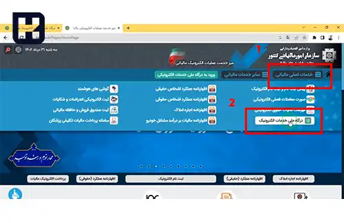
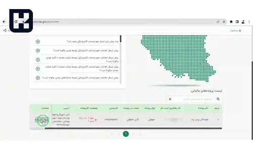

شناسه یکتای حافظه مالیاتی یکی از موارد کلیدی در سیستم مالیاتی کشور است که برای تمامی مودیان ضروری به شمار می‌آید. این شناسه به عنوان یک ابزار مهم جهت شناسایی و پیگیری فعالیت‌های مالیاتی به کار می‌رود و به سازمان امور مالیاتی کمک می‌کند تا فرآیندهای مالی را با دقت و شفافیت بیشتری مدیریت کند.

 در این آموزش، گام‌به‌گام فرآیند دریافت و ذخیره این شناسه از طریق سامانه مودیان تشریح شده است تا کاربران بتوانند به راحتی و بدون ابهام، مراحل لازم را طی کنند.

## نحوه ذخیره شناسه یکتا حافظه مالیاتی 

برای دریافت شناسه یکتای حافظه مالیاتی، ابتدا به سایت سامانه مودیان به نشانی **<a href="https://tax.gov.ir/Pages/HomePage" target="_blank">tax.gov.ir
</a>** مراجعه کنید.

 1. ابتدا تب "خدمات اصلی مالیاتی" سپس، آیتم درگاه ملی خدمات الکترونیکی را انتخاب نمایید. 

2. پس از ورود به محیط جدید، گزینه "ورود به درگاه ملی" را انتخاب کنید. در این مرحله، رمزی از طریق پیامک به شما ارسال خواهد شد. 

3. پس از ورود، گزینه "ورود به کارپوشه" را انتخاب کنید. صفحه جدیدی باز خواهد شد که در آن می‌توانید وارد سامانه واقعی یا سامانه آزمایشی شوید.

4.  سپس، گزینه "ورود به پرونده" را انتخاب کنید 

5. آیتم "عضویت" را برگزینید و در ادامه، بر روی "شناسه یکتای حافظه مالیاتی" کلیک نمایید.  

6. در پنجره بازشده، روی گزینه دریافت شناسه یکتا کلیک کنید. 

7. صفحه جدیدی باز می‌شود که در آن نحوه ارسال توسط چه کسی انجام شود را باید مشخص کنید و گزینه "توسط مودی" را انتخاب نمایید. 

8. در این قسمت، فایلی که قبلاً به عنوان کلید عمومی از نرم افزار سایان استخراج کرده‌اید را می‌توانید الحاق کنید. 

9. سپس،  کد پستی و  آدرس را تایید کنید و بقیه مراحل را پیش ببرید و دکمه "اتمام" را کلیک کنید

10.  در این مرحله، شناسه یکتا به شما نمایش داده خواهد شد. شناسه یکتا را کپی کنید 

11. در  نرم‌افزار سایان، گزینه "ویرایش" را انتخاب کنید و شناسه یکتای حافظه مالیاتی را جایگذاری و ثبت نمایید.

