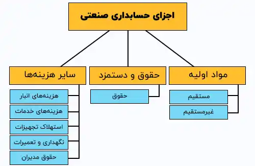

<blockquote style="background-color:#eeeefc; padding:0.5rem">

  
آنچه در این مطلب خواهید خواند:

  <ul>
    <li>تعریف ثبت های حسابداری صنعتی</li>
    <li>اجزای حسابداری صنعتی</li>
    <ul>
     <li>مواد اولیه</li>
     <li>حقوق و دستمزد</li>
     <li>سایر هزینه‌ها (هزینه‌های سربار ساخت)</li>
     <li>مواد اولیه</li>
    </ul>
    <li>انواع ثبت ها در حسابداری صنعتی</li>
    <ul>
     <li>ثبت تراکنش های مالی</li>
     <li>ثبت هزینه‌ها و درآمدها</li>
     <li>ثبت موجودی و ارزش افزوده</li>
     <li>گزارش گیری</li>
     <li>کنترل و بازرسی</li>
    </ul>
    <li>در ثبت های حسابداری صنعتی به چه مواردی باید توجه کرد؟</li>
    <li>برخی از نکات مهم در ثبت های حسابداری صنعتی</li>
  </ul>

</blockquote>

<a href="https://www.hooshkar.com/Wiki/Financial/CostAccounting" target="_blank">حسابداری صنعتی</a> به عنوان یکی از ستون‌های اساسی مدیریت مالی شرکت‌ها به ما اجازه می‌دهد تا با دقت و صحت به پردازش اطلاعات مالی بپردازیم. 

ثبت های حسابداری صنعتی، علاوه بر ارائه تصاویر دقیق از تراکنش‌های مالی، نقش بسیار حیاتی در <a href="https://www.hooshkar.com/Wiki/Financial/FinancialManagementSolution" target="_blank">برنامه‌ریزی مالی</a> و اتخاذ تصمیمات استراتژیک دارد.

این مقاله به بررسی اهمیت و انواع ثبتهای حسابداری صنعتی به‌عنوان یک فرآیند بلندمدت و چگونگی انجام دقیق و موثر آن می‌پردازد.

## تعریف ثبت های حسابداری صنعتی

ثبت های حسابداری صنعتی به عنوان یکی از <a href="https://www.hooshkar.com/Wiki/Financial/AccountingPrinciples" target="_blank">اصول حسابداری</a>، در پردازش اطلاعات مالی شرکت‌ها بسیار مهم می‌باشد.

ثبت های حسابداری شامل ثبت تراکنش‌های مالی شرکت، دریافت و پرداخت وجه، خرید و فروش کالاها، پرداخت حقوق کارکنان و همچنین ارائه گزارشات مالی به مدیران و سایر صاحبان سهام می‌باشد.

با توجه به اهمیت ثبت های حسابداری صنعتی، این ثبتها باید با دقت کامل انجام شوند. برای این منظور، معمولاً شرکت‌ها از <a href="https://www.hooshkar.com/Wiki/Financial/ComparisonFinancialSoftware" target="_blank">نرم افزارهای حسابداری</a> استفاده می‌کنند که تمامی تراکنش‌های مالی را در یک پایگاه داده مشترک ثبت می‌کنند و به تولید گزارشات مالی کمک می‌کنند.

## اجزای حسابداری صنعتی

### 1. مواد اولیه

#### الف- مواد مستقیم
این گروه شامل هزینه‌های تمامی مواد خام و دیگر موجودی‌هایی است که به صورت مستقیم در تولید محصول نهایی مورد استفاده قرار می‌گیرند. به عنوان مثال، پارچه برای تولید پوشاک یا آلومینیوم و لاستیک برای ساخت دوچرخه.

#### ب- مواد غیرمستقیم
این بخش شامل مصرفی‌هایی می‌شود که برای تکمیل محصول لازم و مصرف آن به میزان کمی انجام می‌شود. به عنوان نمونه، روغن، پیچ و...

### 2. حقوق و دستمزد

#### الف- حقوق
این مورد به پرداخت به افرادی اشاره دارد که به صورت مستقیم در فرآیند تولید یا ارائه خدمات نقش دارند و شامل افرادی که وظایف اداری یا فروش را انجام می‌دهند نمی‌شود.

<blockquote style="background-color:#f5f5f5; padding:0.5rem">

<strong>آشنایی با <a href="https://www.hooshkar.com/Software/Sayan/Module/Payroll" target="_blank">نرم افزار حقوق و دستمزد</a> سایان</strong>
</blockquote>

### 3. سایر هزینه‌ها (هزینه‌های سربار ساخت)

#### الف- هزینه‌های انبار
این شامل اجاره انبار و هزینه‌های مرتبط با نگهداری مواد موجود در انبار می‌شود.

#### ب- هزینه‌های خدمات
این گروه شامل خدمات آب و برق و هزینه‌های مشابه می‌باشد.

#### ج- استهلاک تجهیزات
این مورد هزینه مرتبط با استهلاک تجهیزات و دستگاه‌های تولیدی را شامل می شود.

#### د- نگهداری و تعمیرات
این بخش شامل هزینه‌های مرتبط با نگهداری و تعمیرات ماشین‌آلات و تجهیزات است.

#### ه- حقوق مدیران
این مورد حاوی حقوق مربوط به کارکنان مدیریتی یا افراد مشغول به تعمیر و نگه‌داری می‌باشد.

## انواع ثبت ها در حسابداری صنعتی

حوزه حسابداری صنعتی شامل عملیات متنوع حسابداری است که برای نظارت و ثبت همه تراکنش‌های مالی یک سازمان صنعتی ضروری است. در زیر به برخی از اصطلاحات و ثبت‌های کلیدی در حسابداری صنعتی اشاره می‌شود:

### 1. ثبت تراکنش های مالی
**- فاکتورها و رسیدهای خرید و فروش:** ثبت تمامی فاکتورها و رسیدهای خرید و فروش جهت نظارت بر تراکنش‌های مرتبط با مواد، کالاها و خدمات.

**- رسیدهای نقدی و چک‌ها:** ثبت دریافت نقدی یا چک از فروش محصولات یا خدمات.

**- ثبت سفارشات خرید و فروش:** ثبت درخواست‌ها و دستورات مرتبط با خرید و فروش به منظور پیگیری دقیق تراکنش‌ها و نظارت بر موجودی‌ها.

<blockquote style="background-color:#f5f5f5; padding:0.5rem">

<strong>آشنایی با <a href="https://www.hooshkar.com/Software/Sayan/Module/CustomerOrders" target="_blank">برنامه ثبت سفارش مشتری</a> سایان
</strong></blockquote>

### 2. ثبت هزینه‌ها و درآمدها

**- ثبت هزینه‌های مواد:** ثبت هزینه‌های مرتبط با مواد مستقیم و غیرمستقیم استفاده شده در فرآیند تولید.

**- حقوق و دستمزد:** ثبت هزینه حقوق و دستمزد کارکنان مستقیم و غیرمستقیم.

**- ثبت درآمد:** ثبت درآمد ناشی از عملیات فروش محصولات یا ارائه خدمات. 

**- هزینه‌های اداری و عمومی:** ثبت هزینه‌های متعلق به عملیات اداری و عمومی سازمان.

### 3. ثبت موجودی و ارزش افزوده

**- موجودی ابتدایی و انتقالات موجودی:** ثبت موجودی آغازین و تغییرات موجودی در طول دوره مالی.

**- محاسبه و ثبت ارزش افزوده (VAT):** ثبت ارزش افزوده معاملات.

### 4. گزارش‌گیری
**- تهیه گزارش مالی:** تولید گزارشات مالی روزانه، ماهیانه و سالیانه.

**- گزارش هزینه‌های تولید:** تهیه گزارش‌های جزئی از هزینه‌های مستقیم و غیرمستقیم تولید.

**- گزارش سود و زیان:** تهیه گزارش سود و زیان بر اساس فعالیت‌ها و دوره‌های زمانی مختلف.

### 5. کنترل و بازرسی

**- کنترل داخلی:** بررسی و تصدیق اطلاعات به منظور جلوگیری از خطاها و تقلب‌ها.

**- آزمایشات حسابداری:** اجرای آزمایشات بررسی دقت و صحت سوابق حسابداری.

**- پیش‌بینی و برنامه‌ریزی:** ثبت و پیش‌بینی هزینه‌ها و درآمدها به منظور ایجاد برنامه‌های بهینه.

## در ثبت های حسابداری صنعتی به چه مواردی باید توجه کرد؟

**1. صحت دقیق تراکنش های مالی:** تمامی تراکنش‌های مالی باید به دقت و با جزییات کاملی ثبت شوند تا گزارش‌های مالی به صورت صحیح تهیه شوند.

**2. رعایت مسائل مالیاتی:** باید به دقت مسائل مالیاتی را مد نظر داشت. این شامل ثبت مالیات‌ها، <a href="https://www.hooshkar.com/Wiki/Financial/VatDeadline" target="_blank">مالیات بر ارزش افزوده</a>، مالیات بر درآمد و سایر موارد مالیاتی می‌باشد.

**3. پایبندی به استانداردهای حسابداری:** باید به دقت به استانداردهای حسابداری مربوطه پایبند بود تا گزارش‌های مالی به شکل صحیح تهیه شوند.

در کل، ثبتهای حسابداری صنعتی یک فرآیند بلند مدت می‌باشد و باید به صورت مداوم انجام شود. این فرآیند شامل ثبت تراکنش‌های روزانه، تعیین موجودی کالاها، <a href="https://www.hooshkar.com/Wiki/Financial/TypesOfAudits" target="_blank">حسابرسی</a> و تهیه گزارشات مالی است.

## برخی از نکات مهم در ثبتهای حسابداری صنعتی

**1-	تعیین سیستم حسابداری مناسب:**

برای انجام ثبتهای حسابداری صنعتی، باید یک <a href="https://www.hooshkar.com/Software/Sayan" target="_blank">سیستم حسابداری</a> مناسب انتخاب شود. این سیستم باید به دقت و با جزییات کاملی قابلیت ثبت تراکنش ها و تولید گزارشات مالی را نیز داشته باشد.

**2-	مراقبت از اطلاعات مالی:**

اطلاعات مالی شرکت ها باید محفوظ باشند تا از سوء استفاده و دسترسی غیرمجاز جلوگیری شود. باید از ابزارهای امنیتی مانند پسورد و سیستم های محافظت از اطلاعات استفاده کرد.

**3-	انجام حسابرسی:**

برای تضمین دقت و صحت ثبتهای حسابداری، باید به صورت دوره ای حسابرسی انجام شود. در این روش، یک حسابرس مستقل با بررسی ثبتهای حسابداری و گزارشات مالی شرکت، صحت و دقت آنها را تایید می کند.

<blockquote style="background-color:#f5f5f5; padding:0.5rem">

<strong>موسسه چابک حساب: <a href="https://www.hooshkar.com/Software/Sayan/Module/Accounting" target="_blank">حسابرسی در قزوین</a>
</strong></blockquote>

**4-	تهیه گزارشات مالی:**

بعد از انجام ثبت های حسابداری، باید گزارشات مالی شرکت تهیه شود. این گزارشات شامل صورت سود و زیان، ترازنامه و جریان وجوه نقد می باشند. این گزارشات مالی به مدیران و سهامداران شرکت اطلاعات لازم را درباره عملکرد مالی شرکت ارائه می دهند.

**5-	رعایت قوانین و مقررات:**

در ثبتهای حسابداری صنعتی باید قوانین و مقررات مالی را رعایت کرد. برای مثال، باید از روش های مالی قانونی استفاده شود و تراکنش های مشکوک و غیرقانونی را از طریق ثبتهای حسابداری متوقف کرد.

**6-	مدیریت مالی:**

ثبتهای حسابداری صنعتی باید به عنوان یک ابزار برای مدیریت مالی در شرکت استفاده شوند. با بررسی دقیق ثبتهای حسابداری، می توان به راحتی نقاط ضعف و قوت مالی شرکت را شناسایی کرد و بهترین تصمیمات مدیریتی را اتخاذ کرد.

**7-	آموزش کارکنان:**

کارکنانی که مسئول ثبتهای حسابداری صنعتی هستند، باید آموزش های لازم را دیده باشند تا بتوانند به صورت صحیح تراکنش های مالی را ثبت کرده و گزارش های مالی را تهیه کنند.