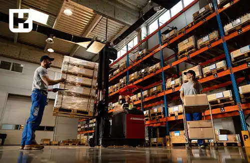

<blockquote style="background-color:#eeeefc; padding:0.5rem">

  
آنچه در این مطلب خواهید خواند:

  <ul>
    <li>انبارداری چیست</li>
    <li>انواع سیستم انبارداری</li>
    <ul>
      <li>سیستم FiFo</li>
      <li>سیستم LiFo</li>
      <li>سیستم انبارداری HiFo</li>
      <li>سیستم JIT</li>
    </ul>
    <li>مراحل انبارداری</li>
    <ul>
      <li>مرحله‌ ورود کالا</li>
      <li>مرحله‌ انبار کردن</li>
      <li>مرحله‌ خروج کالا</li>
    </ul>
    <li>رسید انبار چیست</li>
    <li>آشنایی با حواله انبار و انواع آن</li>
    <ul>
      <li>حواله انبار چیست</li>
      <li>انواع حواله انبار</li>
    </ul>
    <li>بهترین روش انبارداری</li>
    <li>انبارگردانی یکی از پر اهمیت ترین بخش ها</li>
    <li>نرم افزارهای انبارداری</li>
  </ul>

</blockquote>

امروزه کلمه‌ی انبارداری به بخش جدانشدنی از هر مجموعه، تبدیل شده است؛ چرا که سرمایه‌ی مالی هر سازمان، در انبار آن نهفته است. پس جهت جلوگیری از هرگونه خطا و حفظ سرمایه‌، استفاده از سیستم انبارداری الزامیست. 

ما در این مقاله قصد داریم صفر تا صد نکات انبارداری را بررسی کنیم. اگر شما هم علاقه‌مند به مسائل حسابداری و انبارداری هستید، در ادامه مطلب با ما همراه باشید.

<blockquote style="background-color:#f5f5f5; padding:0.5rem">

<strong>آشنایی با <a href="https://www.hooshkar.com/Software/Sayan/Module/InventoryAccounting" target="_blank">نرم افزار انبارداری</a> سایان</strong>
</blockquote>

## انبارداری چیست؟
انبارداری یعنی نگهداری ایمن از اقلامی که در انبار سازمان‌ها وجود دارند. به گونه‌ای که از مفقود شدن و هرگونه آسیب به کالا جلوگیری گردد. 

البته ورود و خروج کالا از انبار، در کم‌ترین زمان ممکن هم یکی از نکات حائز اهمیت است که انباردار باید به آن عمل کند.

امروزه نرم افزارهای حسابداری به کمک ما آمده‌اند تا بهترین تجربه‌ی انبار داری را برای ما رقم بزنند و تا جای ممکن، از بروز خطا جلوگیری کنند.

<blockquote style="background-color:#f5f5f5; padding:0.5rem">

<strong>بیشتر بخوانید: <a href="https://aparat.com/v/DuQVe" target="_blank">آموزش انبارداری با نرم افزار سایان</a></strong>
</blockquote>

## انواع سیستم انبارداری

شناخت انواع سیستم های انبار داری برای تمامی کسب و کارها بسیار مهم است. چرا که مشاغل گوناگون باید با توجه به حوزه کاری خود، بهترین انتخاب را داشته باشند. 

سیستم های متعددی برای انبار داری وجود دارند که ما در این قسمت به چهار مورد از پرکاربردترین آن‌ها، اشاره می‌کنیم.

### سیستم FiFo

فایفو (FiFo)، یکی از معروف‌ترین سیستم‌ها است که تقریبا همه‌ی ما با آن آشنایی داریم. 

وقتی می‌خواهید از فروشگاه‌ها خرید کنید، به نحوه‌ی چیدمان محصولاتشان توجه کرده‌اید؟ معمولا محصولات قدیمی‌تر را جلوی قفسه می‌گذارند. محصولات جدید را هم عقب قرار می‌دهند تا از دسترس مشتری‌ها به دور باشند.

این سیستم برای محصولاتی مناسب است که دارای تاریخ انقضای مشخصی هستند و باید نسبت به اقلام جدید، زودتر از انبار خارج شوند.

### سیستم LiFo
لایفو (LiFo)، کاملا برعکس سیستم فایفو است. در این سیستم، کالای جدیدتر بر کالای قدیمی اولویت دارد و زودتر خارج می‌شود. سیستم لایفو بیشتر برای محصولات الکترونیکی کاربرد دارد تا کالاهایی با تکنولوژی جدیدتر، جایگزین کالاهای قدیمی شوند.

### سیستم HiFo

کلمه‌ی هایفو، مخفف عبارت Highest In First Out است که به معنای "اول خروج گران‌ترین‌ها" می‌شود. در این روش، اقلامی که بیشترین هزینه‌ی خرید را داشته‌اند، اول از همه از انبار خارج می‌شوند. علت خروج آن‌ها، این است که شرکت با کمبود بودجه مواجه نشود.

### سیستم JIT
این سیستم، با هدف کاهش هزینه‌های نگهداری، ساخته شده است. 
یعنی دقیقا در زمانی که سازمان نیاز به اقلام و مواد اولیه دارد، آن‌ها را تهیه می‌‌کند. بدون اینکه موجودی اضافه‌تری از آن‌ها را خریداری کند.

<blockquote style="background-color:#f5f5f5; padding:0.5rem">

<strong>بیشتر بخوانید: <a href="https://www.hooshkar.com/Wiki/Production/JustInTime" target="_blank">سیستم تولید به هنگام (Just in time)</a> چیست؟
</strong></blockquote>

## مراحل انبارداری
به صورت کلی مراحل انبارداری به سه بخش تقسیم می‌شود:

1. مرحله‌ی ورود کالا
2. مرحله‌ی انبار کردن
3. مرحله‌ی خروج کالا

در ادامه به توضیح مختصری درمورد هر مرحله خواهیم پرداخت.

### مرحله‌ ورود کالا
در این مرحله از انبار داری، ورود کالا توسط نگهبان کنترل می‌شود و سپس محصول وارد بخش پذیرش می‌شود. 

مسئولین انبار، کالاهای وارد شده را از نظر تعداد و ظاهر بررسی می‌کنند. در صورت عدم مغایرت، اقلام به انبار ارسال شده و به صورت اصولی دسته‌بندی می‌شوند.

### مرحله‌ انبار کردن
پس از ورود کالا به انبار، هر کدام در محل از قبل تعیین شده قرار می‌گیرند. سپس در اسناد و سامانه‌ی مدیریت انبار، ثبت می‌شوند.

### مرحله‌ خروج کالا
در این مرحله، برای خروج کالا لازم است تا مجوز خروج از انبار صادر شود. اگر صاحب کالا درخواست بسته‌بندی محصول را کرده باشد، باید قبل از بارگیری، عملیات بسته‌بندی انجام شود. سپس کالا آماده‌ی ارسال است.

## رسید انبار چیست؟

زمانی که کالایی وارد انبار می‌شود، نیاز است فرمی تکمیل گردد تا ثابت کند که انبار، مالک کالا است. 
این فرم پراهمیت، شامل اطلاعاتی اعم از نام فروشنده، نام کالا، مقدار کالا و... است که به آن رسید انبار می‌گوییم. 

برای اینکه رسید انبار اعتبار داشته باشد، نیاز است که به آن، فاکتور خرید پیوست شود.

## آشنایی با حواله انبار و انواع آن

### حواله انبار چیست؟
همه‌ی انبارداران موظف هستند زمانی که کالایی خارج می‌شود، سندی صادر کنند. در انبارداری به این سند، حواله گفته می‌شود که شامل اطلاعاتی چون کالاهای خارج شده و تاریخ خروج است. 

### انواع حواله انبار

با توجه به حوزه‌های مختلفی که هر سازمان در آن کار می‌کند، به حواله‌های متفاوتی نیاز است. 

**دسته‌بندی حواله‌ها براساس کاربرد، به موارد زیر تقسیم می‌شود:**

1. حواله بابت کالایی که در خود سازمان به مصرف رسیده باشد

2.	حواله بابت کالایی که در یکی از پروژه‌های مربوط به سازمان استفاده شده باشد

3.	حواله برای اعمال آزمایش روی کالا

4.	حواله برای اقلامی که در اثر تائید نشدن کیفیت، مرجوع می‌شوند

5.	فرم حواله برای کالایی که به صورت امانت به سازمان دیگری سپرده می‌شود

6.	فرم حواله بابت فروش کالا که اصلی‌ترین حواله‌ی هر مجموعه است

## انواع روش انبارداری

**انبار داری، به دو شیوه‌ی دستی و نرم افزاری انجام می‌گردد.**

**روش دستی و سنتی:**

در شیوه‌ی دستی، احتمال بروز خطا توسط انسان بسیار زیاد است. مواردی چون خستگی روحی و جسمی، سروصدا، چندکاری و... به صورت مستقیم روی عملکرد انسان تاثیرگذار هستند. در نتیجه در روش انبار داری دستی علاوه بر بروز خطا، احتمال عملکرد ضعیف و بازدهی پایین در انجام کارها نیز وجود دارد.

**روش نرم افزاری**

با طراحی و ساخت نرم افزارها، انقلاب بزرگی در صنایع و مشاغل مختلف رخ داده است. نرم افزارهای انبارداری، به کمک ما آمده‌اند که تا حد ممکن از بروز اشتباهات انسانی جلوگیری کنند و انجام تمامی کارها را تسریع ببخشند.

امروزه نرم افزارهای متعددی برای انبارداری وجود دارند که می‌توانید با تحقیق و بررسی، بهترین انتخاب را برای سازمانتان داشته باشید. 

**چند مورد از مزایای مهم این نرم افزارها:**

1-	حذف هزینه‌های اضافی مانند چاپ دسته رسید و...

2-	سرعت بسیار بالا در پیدا کردن اطلاعات کالا و صاحبین آن‌ها

3-	نگهداری و بازیابی اطلاعات در کسری از ثانیه

4-	سرعت بالا در سرویس‌دهی

<blockquote style="background-color:#f5f5f5; padding:0.5rem">

<strong>بیشتر بخوانید: <a href="https://www.hooshkar.com/Wiki/Financial/ComparisonFinancialSoftware" target="_blank"> بهترین نرم افزار انبارداری</a> چه ویژگی هایی دارد؟
</strong></blockquote>

## انبارگردانی یکی از پر اهمیت ترین بخش ها

آمارگیری از موجودی کالاها و تطبیق آن‌ها با تعداد کالاهایی که در سیستم انبار ثبت شده، انبارگردانی نام دارد.

این مورد، بخشی بسیار مهم و حیاتی برای هر سازمانی است که حداقل سالی یک‌بار انجام می‌گردد. مجموعه‌های مختلف این کار را انجام می‌دهند تا موجودی انبارشان را اصلاح و بروزرسانی کنند. 

با انبارگردانی، کالاهای تاریخ گذشته یا ضایعاتی حذف می‌شوند، کالاهای مورد نیاز انبار تهیه شده و در نهایت سرمایه‌ی دقیق انبار محاسبه خواهد شد.

فرآیند انبارگردانی، به این صورت است که انبار پلمپ شده و از ورود خروج پرسنل جلوگیری می‌شود. سپس با حضور انباردار و حسابرس شروع می‌شود. در نهایت پس از شمارش تعداد و ثبت گزارش، آن را به مدیریت تحویل می‌دهند تا برای اضافات و کسری‌های انبار تصمیمات لازم اتخاد گردد.

## نرم افزارهای انبارداری
اهمیت استفاده از نرم افزارهای انبارداری را به هیچ وجه نباید دست کم گرفت. 

امروزه نرم افزارهایی وجود دارند که حتی برای افرادی که دانشی از انبار داری ندارند، مناسب هستند و کمک شایانی به تسریع کارها می‌کنند. 

**3 مورد از مهم‌ترین مزایای این نرم‌افزارها:**

1.	فروش و سرویس‌دهی حداکثری

2.	جلوگیری از هدر رفت کالاها

3.	صرفه‌جویی در هزینه‌های سازمان

در این مقاله سعی کردیم تمام موارد با عنوان انبارداری را تحت پوشش قرار دهیم. امیدواریم که این مطلب برای شما هم مفید بوده باشد. 

نظرات خود را در مورد استفاده از نرم افزارهای انبارداری با ما به اشتراک بگذارید. 
در حال حاضر از چه نرم افزاری استفاده می‌کنید و علت این انتخاب شما چیست؟

اگر شما هم علاقه‌مند به استفاده از نرم افزارهایی با رابط کاربری آسان و در عین حال کاربردی هستید، به شما پیشنهاد می‌کنیم با تیم <a href="https://www.hooshkar.com" target="_blank">هوشکار</a> در ارتباط باشید. 