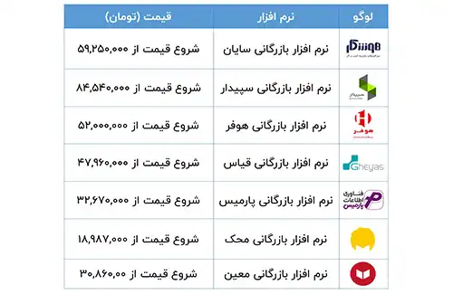

<blockquote style="padding:0.5rem; margin-top:0.5rem; color:#002145;">

  
آنچه در این مطلب خواهید خواند:

    <li>نرم افزار بازرگانی سایان</li>
    <li>نرم افزار بازرگانی سپیدار</li>
    <li>نرم افزار بازرگانی هوفر</li>
    <li>نرم افزار بازرگانی قیاس</li>
    <li>نرم افزار بازرگانی پارمیس</li>
    <li>نرم افزار بازرگانی پیوست</li>
    <li>نرم افزار بازرگانی معین</li>

</blockquote>

با توجه به پیچیدگی‌های مالی و حسابداری شرکت‌های بازرگانی، انتخاب نرم‌افزاری که بتواند نیازهای خاص این شرکت‌ها را برآورده کند، اهمیت بسیاری دارد. این مقاله به معرفی و بررسی چندین نرم‌افزار بازرگانی مطرح می‌پردازد که هرکدام با ویژگی‌ها و امکانات منحصر به فرد خود، راهکاری مناسب برای مدیریت مالی و عملیاتی شرکت‌های بازرگانی ارائه می‌دهند.

 از مدیریت انبار و ثبت سفارش تا محاسبه پورسانت و مدیریت حقوق و دستمزد، این نرم‌افزارها به گونه‌ای طراحی شده‌اند که تمامی نیازهای یک واحد بازرگانی را پوشش دهند و به بهبود فرآیندهای داخلی سازمان کمک کنند.

## 1. نرم افزار بازرگانی سایان

<a href="https://www.hooshkar.com/Software/Sayan/Package/Commerce" target="_blank">نرم افزار حسابداری بازرگانی</a> کمک می‌کند تا در فرآیندهای حساس مانند <a href="https://www.hooshkar.com/Software/Sayan/Module/CustomerOrders" target="_blank">سفارش</a>، <a href="https://www.hooshkar.com/Software/Sayan/Module/Inventory" target="_blank">انبار</a>، <a href="https://www.hooshkar.com/Software/Sayan/Module/PurchaseAndSale" target="_blank">خرید و فروش</a>، اطلاعات مدیریت و گزارش‌های دقیق و به موقع تهیه شود، تا در تصمیم‌گیری‌ها و سیاست‌گذاری‌های آتی سازمان موثر واقع گردد. 

بسته بازرگانی سایان، به شرکت‌هایی با گردش مالی‌ متفاوت و نیازمند به کنترل لیست قیمت و حسابداری ارزی، کمک می‌کند تا ارز تعریف شده را به مقدار نامحدود تعریف نمایند، عملیات چک‌های دریافتی و پرداختی را ثبت کنند، صورت‌حسابها را لحظه‌ای تهیه کنند، اطلاعات کالاها را ثبت کنند، موجودی انبار را مدیریت کنند و با استفاده از یک <a href="https://www.hooshkar.com/Software/Sayan/Module/Application" target="_blank">اپلیکیشن</a>، انبارگردانی را به سادگی انجام دهند.

**چرا باید از نرم افزار بازرگانی سایان استفاده کنیم؟**

-	تعیین نقطه سفارش 
-	مرور گردش و کاردکس کالا 
-	تهیه گزارش تفکیکی سود و زیان
-	شناسایی کالاهای کم سود و پر سود 
-	تعریف و تفکیک نامحدود انبارها
-	ثبت ورود و خروج کالا و... 

## 2.	نرم افزار بازرگانی سپیدار

بسته بازرگانی سپیدار، با 5 ماژول شامل حسابداری، مشتریان و فروش، تامین کنندگان و انبار و دارایی‌ثابت، دریافت و پرداخت، به شرکت‌های بازرگانی ارائه می‌شود. این بسته مناسب شرکت‌هایی است که فعالیت‌های بازرگانی، خرید و فروش را دارند و همچنین در زمینه صادرات و واردات اقدام می‌نمایند.

**برخی از امکانات این نرم افزار:**

-	ثبت سفارش و حداکثر موجودی کالاها
-	تهیه آنی صورتحساب مشتریان
-	مدیریت دریافت و پرداخت
-	تعریف مدل‌های مختلف پورسانت
-	تعریف و محاسبه خودکار پورسانت براساس تسویه یا عدم تسویه فاکتور

## 3.	نرم افزار بازرگانی هوفر

نرم‌افزار بازرگانی هوفر تمام فرآیند فروش و مالی را شامل می‌شود. از ثبت نام مشتریان در فروشگاه آنلاین تا مدیریت ارتباط با مشتریان در نرم‌افزار CRM و اتصال آن به حسابداری، همه جزئیات در نظر گرفته شده است. این نرم‌افزار در سه نسخه‌ی آنلاین، دائمی و دائمی تحت وب عرضه می‌شود.

**برخی از امکانات این نرم افزار:**

-	امکان استفاده همزمان در چندین فروشگاه یا دفتر کاری مختلف
-	پیش فاکتور آنلاین
-	یکپارچه‌سازی کامل با نرم‌افزار CRM و فروشگاه آنلاین
-	استفاده از اپلیکیشن موبایل برای بازاریابان و تنظیم کنندگان
-	گزارش‌دهی پیوسته از سال‌های مالی مختلف

## 4. نرم افزار بازرگانی قیاس 
یکی دیگر از پلتفرم‌های نرم‌افزار بازرگانی قیاس پلاس، نسخه تحت ویندوز آن است. این نرم‌افزار از طریق یک فایل نصبی قابل نصب بر روی سیستم عامل ویندوز بوده و با استفاده از فایل اجرایی (exe) قابل اجرا می‌باشد. علاوه بر این، نرم‌افزار قیاس پلاس قابلیت استفاده در بستر شبکه و حتی اینترنت را دارد و به صورت کلاینت-سرور عمل می‌کند.

-	فرآیندهای دریافت و پرداخت
-	مدیریت خزانه‌داری
-	سیستم انبارداری
-	حسابداری چهارسطحی

## 5. نرم افزار بازرگانی پارمیس 
شرکت‌ها در حوزه تجارت و خدمات، طیف گسترده‌ای از کسب‌وکارها را پوشش می‌دهند. بنابراین، با وجود نیازهای مشترک، ویژگی‌های منحصر به فردی دارند که موجب ایجاد نیازمندی‌های خاص در نرم‌افزار حسابداری بازرگانی و شرکتی می‌شود. 

از جمله این نیازها می‌توان به صدور فاکتور با قیمت‌های مختلف برای شرکت‌های خدماتی و بازرگانی، تعریف پورسانت و مدیریت اشخاص، مدیریت چک و وجوه نقد برای حسابداران و امکان مرور و تجمیع ردیف‌های اسناد اشاره کرد. همچنین چاپ دفاتر و تهیه گزارش‌های رسمی از دیگر ویژگی‌هایی است که شرکت‌ها در نرم‌افزار حسابداری به دنبال آن هستند.

-	ایجاد و صدور انواع فاکتورها
-	ورود و مدیریت هزینه‌های حمل‌ونقل
-	پیگیری و نظارت بر چک‌ها
-	تنظیم تخفیفات و محاسبه پورسانت
-	ثبت و مدیریت اسناد رویدادها

## 6. نرم افزار بازرگانی محک

نرم‌افزار حسابداری محک در سه نسخه مختلف ارائه می‌شود: نسخه فروشگاهی، تولیدی و شرکتی. هر یک از این نسخه‌ها با توجه به نیاز کاربران طراحی شده‌اند و دارای زیرسیستم‌هایی مانند انبارداری، تولید، حقوق و دستمزد و دیگر امکانات مرتبط هستند.

 سیستم حسابداری فروشگاهی محک به دو سری تجاری و عمومی تقسیم می‌شود؛ سری تجاری برای فروشگاه‌های متوسط و بزرگ مناسب است، در حالی که سری عمومی به فروشگاه‌های کوچک‌تر که نیاز به فرآیندهای حسابداری پیچیده ندارند، اختصاص دارد.

## 7.	نرم افزار بازرگانی معین
نرم‌افزار بازرگانی معین، علاوه بر قابلیت‌های عمومی مالی و حسابداری، دارای افزونه‌ها و ماژول‌های بسیار کارآمد است. این برنامه امکاناتی از جمله صدور فیش حقوقی و مدیریت حقوق و دستمزد کارمندان، مدیریت اموال و دارایی‌های ثابت، مدیریت سهامداران و شرکا و صدها قابلیت دیگر را فراهم می‌کند.

-	امکان نظارت و سازماندهی سهامداران و شرکا
-	مدیریت جامع اموال و دارایی‌های ثابت
-	قابلیت چندشرکته و مدیریت نامحدود شرکت‌ها و فروشگاه‌ها
-	مدیریت کارآمد اشانتیون‌ها و هدایای تبلیغاتی
-	تنظیم و کنترل تخفیفات دوره‌ای و گروهی محصولات

آینده کسب و کار شما در گرو تصمیمات هوشمندانه امروز است. همین حالا با انتخاب نرم‌افزار بازرگانی مناسب، گام بلندی به سوی موفقیت بردارید. مشاوره رایگان ما را از دست ندهید - همین امروز با <a href="https://www.hooshkar.com" target="_blank">هوشکار پرداز</a> تماس بگیرید!