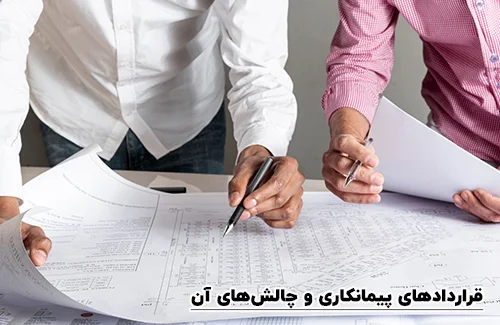

<blockquote style="background-color:#eeeefc; padding:0.5rem">

  
آنچه در این مطلب خواهید خواند:

  <ul>
    <li>سامانه مودیان شرکتهای پیمانکاری</li>
    <li>سامانه مودیان پیمانکاری برای قراردادهای پیمانکاری</li>
    <li>چه نوعی از صورتحساب‌ الکترونیکی را شرکت های پیمانکاری باید صادر کنند</li>
    <li>الگوهای صورتحساب الکترونیکی برای قراردادهای پیمانکاری</li>
    <li>قراردادهای پیمانکاری</li>
    <li>مدیریت شناسه خدمات</li>
    <li>انواع الگوهای صورتحساب الکترونیکی</li>
    <ul>
      <li>الگوهای صورتحساب الکترونیکی نوع اول</li>
      <li>الگوهای صورتحساب الکترونیکی نوع دوم</li>
      <li>الگوهای صورتحساب الکترونیکی نوع سوم</li>
    </ul>
    <li>نکات مهم در الگوهای صورتحساب الکترونیکی</li>
    <ul>
      <li>نکته اول: الگوی بلیط هواپیما</li>
      <li>نکته دوم: الگوی قرارداد پیمانکاری</li>
      <li>نکته سوم: الگوی صادرات</li>
      <li>نکته چهارم: الگوی طلا، جواهر و پلاتین</li>
    </ul>
    <li>ثبت گزارش وضعیت پیمانکاری در سامانه مودیان</li>
    <li>فهرست شناسه های کالا و خدمات برای شرکت های پیمانکاری</li>
    <li>ارسال آسان فاکتور الکترونیکی به سامانه مودیان با نرم‌افزار حسابداری سایان</li>
    <li>سوالات متداول</li>
    <ul>
      <li>ارسال صورتحساب الکترونیکی چه زمانی است</li>
      <li>آیا مغازه داران نیز ملزم به صدور صورتحساب الکترونیکی هستند</li>
      <li>مهلت ارسال صورتحساب الکترونیکی تا چه زمانیست</li>
      <li>آیا کارفرما نیز باید صورتحساب را تایید کند</li>
    </ul>
  </ul>

</blockquote>

## سامانه مودیان شرکتهای پیمانکاری

فعالیت‌های خاص شرکتهای پیمانکاری باعث ایجاد یک راهکار ویژه در <a href="https://my.tax.gov.ir/?url_back=https://tp.tax.gov.ir" target="_blank">سامانه مودیان مالیاتی</a> برای ثبت قراردادهای پیمانکاری شده است. اما چقدر با این سازوکارها آشنایی دارید؟

در این مقاله، نکات کلیدی در خصوص نحوه ثبت قراردادهای پیمانکاری در سامانه مودیان مورد بررسی قرار گرفته است.

آشنایی با این نکات اساسی به پیمانکاران این امکان را می‌دهد تا به دقت و با پایبندی به قوانین مالیاتی، اطلاعات مالی مرتبط با قراردادهای پیمانکاری خود را در سامانه مودیان ثبت نمایند.

<blockquote style="background-color:#f5f5f5; padding:0.5rem">

<strong>آشنایی با <a href="https://www.hooshkar.com/Software/Sayan/Module/TpTaxGov" target="_blank">نرم افزار واسط سامانه مودیان
</a> سایان</strong>
</blockquote>

### سامانه مودیان پیمانکاری برای قراردادهای پیمانکاری

قوانین مالیات مرتبط با قراردادهای پیمانکاری برای شرکتهای پیمانکاری یک ابزار حیاتی جهت اداره مالی و حسابداری را فراهم می‌سازد. 

با انتشار نسخه جدید سامانه مودیان، این امکان به پیمانکاران ارائه شده است که بتوانند به سادگی قراردادهای پیمانکاری خود را در این سامانه ثبت کرده و شناسه یکتای قرارداد مالیاتی را دریافت نمایند. 

این فرآیند به پیمانکاران این امکان را می‌دهد تا با دریافت شناسه یکتای قرارداد، به راحتی صورتحساب های الکترونیکی با الگوهای پیمانکاری خود را به سامانه مودیان ارسال نمایند.

<blockquote style="background-color:#f5f5f5; padding:0.5rem">

<strong>بیشتر بخوانید: <a href="https://www.hooshkar.com/Wiki/Financial/TaxPayersSystemUpdate" target="_blank">مهلت ارسال صورتحساب در سامانه مودیان
</a>
</strong></blockquote>

### چه نوعی از صورتحساب‌ الکترونیکی را شرکت های پیمانکاری باید صادر کنند؟

انواع صورتحساب های الکترونیکی که سازمان امور مالیاتی معرفی کرده، به سه دسته تقسیم می‌شوند:

**1. صورتحساب الکترونیکی نوع اول:** این صورتحساب ها مخصوص کسب و کارهایی است که به صورت عمده فروشی فعالیت می‌کنند. به طور کلی، قراردادهایی که الزاماً نیاز به ذکر نام خریدار دارند، مشمول صورتحساب های الکترونیکی نوع اول خواهند شد.

**2. صورتحساب الکترونیکی نوع دوم:** این نوع صورتحساب الکترونیکی برای کسب و کارهایی است که به صورت خرده فروشی فعالیت می‌کنند و با مصرف‌کنندگان نهایی سر و کار دارند. اگر نیازی به ذکر نام و مشخصات خریدار نباشد، باید صورتحساب های الکترونیکی نوع دوم ارسال شود.

**3. صورتحساب الکترونیکی نوع سوم:** این صورتحساب ها در واقع رسید دستگاه های کارتخوان و درگاه های پرداخت هستند که به صورت اتوماتیک توسط دستگاه یا درگاه به سیستم سازمان امور مالیاتی ارسال می‌شوند و نیازی به ارسال دستی آنها نیست.

سازوکار سامانه مودیان برای قراردادهای پیمانکاری به گونه‌ای است که شرکتهای پیمانکاری باید صورتحساب الکترونیکی نوع اول را صادر و ارسال کنند. 

این موضوع به دلیل این است که در قراردادهای پیمانکاری، مشخصات کامل خریدار (کارفرما) لازم به ذکر است و او نیز باید بابت این قرارداد 
مالیات داده یا (بسته به نوع قرارداد) اعتبار مالیاتی دریافت کند.

بنابراین، در صورتی که یک شرکت پیمانکاری در هر زمینه‌ای فعالیت داشته باشد (از عملیات عمرانی و ساختمانی گرفته تا خدمات نرم‌افزاری)، حتماً باید صورتحساب الکترونیکی نوع اول را صادر و از طریق کارپوشه سامانه مودیان به سازمان امور مالیاتی ارسال نماید.

### الگوهای صورتحساب الکترونیکی برای قراردادهای پیمانکاری

سیستم مودیان، با ارائه صورتحساب الکترونیکی، به شرکت های پیمانکاری امکان پیگیری دقیق و مؤثر قراردادهای خدماتی را فراهم می‌سازد. 

در اینجا، نحوه استفاده از الگوهای صورتحساب الکترونیکی برای قراردادهای پیمانکاری مورد بررسی قرار گرفته است.

صورتحساب های الکترونیکی نوع اول، با داشتن 7 الگوی متفاوت، شامل الگوهای خاصی برای شرکت‌های پیمانکاری می‌شوند. 

علاوه بر الگوی عمومی فروش که برای بسیاری از کسب و کارهای B2B مناسب است، برخی از شرکت‌ها نیازمند الگوهای ویژه‌تری هستند تا بهترین استفاده را از این سامانه کسب نمایند.

یکی از الگوهای مهم صورتحساب الکترونیکی نوع اول به قراردادهای پیمانکاری اختصاص دارد. با این حال، جالب است که این الگو هیچ تفاوتی با الگوی عمومی فروش ندارد.

یکی از چالش‌های اصلی این سامانه برای شرکتهای پیمانکاری، این است که این شرکت‌ها عمدتاً خدمات ارائه می‌دهند و از این رو نمی‌دانند چطور در بخش شناسه کالا عمل کنند.

<blockquote style="background-color:#f5f5f5; padding:0.5rem">

<strong>بیشتر بخوانید: <a href="https://www.hooshkar.com/Wiki/Financial/TaxpayerSystemDeadline" target="_blank">مهلت ارسال صورتحساب در سامانه مودیان برای اشخاص حقیقی و باقیمانده</a>
</strong></blockquote>

## مدیریت شناسه خدمات

برای حل این چالش، شرکت‌های ارائه‌دهنده خدمات باید به جای شناسه کالا، "**شناسه خدمات"** خود را در صورتحساب الکترونیکی درج کنند. 

این اقدام به شرکت‌ها کمک می‌کند تا با دقت و به‌صورت دقیق‌تر اطلاعات مربوط به خدمات ارائه شده خود را ثبت و در پروسه مالی بهبود ایجاد نمایند.

## انواع الگوهای صورتحساب الکترونیکی
برای اطمینان از رفع اشکالات مرتبط با مواد قانونی، مودیان نیازمند استفاده از الگوهای صورتحساب الکترونیکی با توجه به نوع کسب و کار خود می‌باشند.

در اینجا به معرفی انواع الگوهای صورتحساب الکترونیکی و اهمیت تطابق با نوع کسب و کار می‌پردازیم.

### الگوهای صورتحساب الکترونیکی نوع اول

1. الگوی فروش کالا و خدمات
2. الگوی فروش ارزی (مختص صرافی‌ها)
3. الگوی صورتحساب طلا، جواهر و پلاتین (به کارگیری تنها توسط فروشندگان طلا و جواهرات)
4. الگوی قراردادهای پیمانکاری
5. الگوی قبوض خدماتی
6. الگوی بلیط هواپیما
7. الگوی صادرات

این الگوها به عنوان قالب‌های استاندارد مورد استفاده قرار می‌گیرند و تمامی صورتحساب‌های نوع ۱ تحت این الگوها تعریف و صادر می‌شوند. 

هر یک از این الگوها شامل اقلام اختصاصی و مشترک با دیگر الگوهای صورتحساب الکترونیکی هستند. این اطلاعات برای تایید خریدار و اطلاعات مالی مرتبط با معاملات حیاتی است.

<blockquote style="background-color:#f5f5f5; padding:0.5rem">

<strong>بیشتر بخوانید: <a href="https://www.hooshkar.com/Wiki/Financial/TaxGov" target="_blank">سامانه مودیان در شهرداری ها</a>
</strong></blockquote>

### الگوهای صورتحساب الکترونیکی نوع دوم

1. الگوی فروش کالا و خدمات
2. الگوی صورتحساب طلا، جواهر و پلاتین (مختص فروشندگان طلا و جواهرات)

### الگوهای صورتحساب الکترونیکی نوع سوم

برای رسید یا گزارش دستگاه‌های کارتخوان یا درگاه‌های پرداخت الکترونیکی و آنلاین، الگوی خاصی تعریف نشده است؛ زیرا هر یک از این دستگاه‌ها خود دارای یک شماره منحصر به فرد مالیاتی می‌باشند.

استفاده از الگوهای صورتحساب الکترونیکی مناسب با نوع کسب و کار، مودیان را قادر می‌سازد تا با دقت و مطابق با ضوابط مالیاتی مواد قانونی را اجرا کرده و فعالیت‌های تجاری خود را بهبود بخشند.

این تنوع در الگوها اهمیت بسزایی دارد و اطمینان از استفاده صحیح از صورتحساب های الکترونیکی را تضمین می‌کند.

<blockquote style="background-color:#f5f5f5; padding:0.5rem">

<strong>آشنایی با <a href="https://www.hooshkar.com/Software/Sayan/Package/Contracting" target="_blank">نرم افزار حسابداری پیمانکاری</a> سایان
</strong></blockquote>

## نکات مهم در الگوهای صورتحساب الکترونیکی

در چارچوب دستورالعمل های موضوع پایانه های فروشگاهی و سامانه مودیان، سازمان امور مالیاتی به نکات مهمی در مورد الگوهای صورتحساب الکترونیکی اشاره کرده است.

در اینجا، به بررسی این نکات اجرایی و اهمیت هر کدام از آنها پرداخته می‌شود:

### نکته اول: الگوی بلیط هواپیما

در صورتحساب های الکترونیکی با الگوی "بلیط هواپیما"، حتما باید فیلد نوع پرواز ثبت گردد. این اقدام ضمانت می‌کند که اطلاعات مرتبط با نوع پرواز در صورتحساب به دقت ثبت شده و از صحت مالیاتی آن اطمینان حاصل شود.

### نکته دوم: الگوی قرارداد پیمانکاری

در صورتحساب های الکترونیکی با الگوی "قرارداد پیمانکاری"، حتما باید فیلد "شناسه یکتای ثبت قرارداد فروشنده" را ثبت نمایید. این اطلاعات از اهمیت ویژه‌ای برخوردارند و به مودیان این امکان را می‌دهند تا به دقت مبالغ مالیاتی مرتبط با قراردادهای پیمانکاری را محاسبه نمایند.

### نکته سوم: الگوی صادرات

•	در صورتحساب های الکترونیکی با الگوی "صادرات"، نیازی به ثبت اطلاعات خریدار وجود ندارد. همچنین، به منظور بهره‌مندی از معافیت نرخ صفر و مشوق‌های مالیاتی، تناظرهای یک به یک باید رعایت شود و صورتحساب‌ها در سامانه مودیان ثبت گردند.

•	در صورتحساب‌های الکترونیکی با الگوی "صادرات"، در صورت عدم مطابقت صورتحساب با اطلاعات اظهارنامه گمرکی یا مودی کم اظهاری، صورتحساب به عنوان صورتحساب نوع دوم با الگوی فروش در نظر گرفته خواهد شد و مودی ممکن است جرائم ماده ۹ قانون پایانه های فروشگاهی را تجربه نماید.

•	در صورتحساب‌های الکترونیکی با الگوی "صادرات"، در صورت عدم مطابقت با اطلاعات اظهارنامه گمرکی، صورتحساب نوع دوم با الگوی فروش در نظر گرفته می‌شود و مودی ممکن است تحت جرائم ماده ۹ قانون پایانه های فروشگاهی قرار گیرد.

### نکته چهارم: الگوی طلا، جواهر و پلاتین

در صورتحساب‌های الکترونیکی با الگوی "طلا، جواهر و پلاتین"، فیلدهای "اجرت ساخت"، "سود فروشنده"، "حق‌العمل و جمع کل اجرت"، "حق‌العمل و سود" حتما باید ثبت گردند. این اطلاعات به مودیان امکان محاسبه دقیق‌تر و مالیاتی صحیح‌تر ارائه می‌دهند.

رعایت نکات مهم مطرح شده در مورد الگوهای صورتحساب الکترونیکی، اهمیت زیادی در اجرای مالیاتی صحیح دارد. با رعایت این نکات، مودیان می‌توانند مطمئن شوند که اطلاعات ثبت شده در صورتحساب‌ها با مقررات مالیاتی مطابقت دارند و مشکلات مرتبط با اجرای قوانین را به حداقل ممکن برسانند.

## ثبت گزارش وضعیت پیمانکاری در سامانه مودیان

پس از اعلام اداره مالیات و تصمیم به الزامی کردن ارسال فاکتورهای الکترونیکی به سامانه مودیان برای بسیاری از پیمانکاران که درآمدهای آن‌ها بر اساس گزارش‌های وضعیت خود بود، سوالاتی پیرامون نحوه وارد کردن این گزارش‌ها به سامانه مودیان به وجود آمد.

چگونگی ثبت گزارش‌های وضعیت در سامانه مودیان نیازمند صدور یک فاکتور فروش برای هر گزارش وضعیت تأیید شده است.

## فهرست شناسه های کالا و خدمات برای شرکت های پیمانکاری

شرکت‌های موظف به ارسال فاکتورهای الکترونیکی به سامانه مودیان برای امور مالی، نیازمند است که شناسه کالا و خدمات را به دقت وارد کنند.

در ادامه، یک فهرست از شناسه‌های پرکاربرد کالا و خدمات برای شما فراهم آمده است:

نام کالا (خدمات) | شناسه کالا (خدمات)
------------ | -------------
2330001003372 | خدمات تامین نیروی انسانی
2330001009466 | خدمات پشتیبانی نرم افزار
2330001031030 | خدمات تعمیر و نگهداری
2330001031054 | خدمات تمیز کردن
2330001031092 | خدمت های مبتنی بر مهندسی و تحقیق و فناوری
2330001031207 | پیمانکاری خدمات شهری- راه و ساختمان
2720000193486 | مهره قطعات اتصالات عمومی
K7310146 | مشاوره - طراحی شبکه آب، رودخانه و دفع آب سطحی

## ارسال آسان صورتحساب الکترونیکی به سامانه مودیان با نرم افزار سایان

نرم افزار سامانه مودیان سایان برای همه کاربران این امکان را فراهم کرده است که بدون هزینه‌ و ماژول های اضافی و یا نیاز به شرکت‌های معتمد، بتوانند به سادگی صورتحساب الکترونیکی خود را به سامانه مودیان ارسال نمایند.

## سوالات متداول

### ارسال صورتحساب الکترونیکی چه زمانی است
با توجه به قانون، از ابتدای فروردین ماه سال ۱۴۰۲ تقریباً تمام گروه‌های مشاغل، از ج
مله افراد حقیقی و حقوقی، ملزم به رعایت این قانون هستند و باید پس از ثبت نام در سامانه مودیان، فرآیند ارسال صورتحساب الکترونیکی را آغاز نمایند. هر تأخیر یا عدم ارسال در موعد مقرر این صورتحساب‌ها، با خود جریمه‌ای همراه خواهد داشت.

### آیا مغازه داران نیز ملزم به صدور صورتحساب الکترونیکی هستند
بله، بر اساس قانون، همه فروشگاه‌های خرده‌فروشی موظفند اقدام به تعویض دستگاه‌های کارتخوان خود و اتصال درگاه‌های پرداخت آنلاین خود به سیستم سازمان امور مالیاتی کنند. با انجام این اقدام، نیاز به ارسال دستی صورتحساب الکترونیکی از طریق سامانه حذف می‌شود، زیرا رسیدهای مرتبط با این دستگاه‌های مجاز به عنوان صورتحساب الکترونیکی در نظر گرفته می‌شوند.

### مهلت ارسال صورتحساب الکترونیکی تا چه زمانیست
بر اساس قوانین سامانه مودیان، برای قراردادهای پیمانکاری شما مهلت یک هفته پس از انعقاد رسمی قرارداد را دارید تا صورتحساب الکترونیکی مربوط به آن را ارسال نمایید.

### آیا کارفرما نیز باید صورتحساب را تایید کند
بله، کارفرما به عنوان خریدار در نوع ۱ صورتحساب تعریف شده و باید به طریق سامانه مودیان، صورتحسابی که شما ارسال کرده‌اید را تصویب نماید. در غیر اینصورت، بعد از گذشت یک ماه، صورتحساب به صورت پیش‌فرض تایید شده محسوب خواهد شد.

---
آیا آماده‌اید تجربه ای ساده و کارآمد در ثبت قراردادهای پیمانکاری با نرم افزار واسط مودیان سایان داشته باشید؟

با قابلیت های جامع <a href="https://www.hooshkar.com/Software/Sayan/Module/TpTaxGov" target="_blank">نرم افزار مودیان مالیاتی سایان</a>، به شما این امکان داده شده است که به سرعت و به صورت دقیق قراردادهای پیمانکاری خود را ثبت کنید و از شناسه یکتای قرارداد مالیاتی بهره‌مند شوید.

برای کسب اطلاعات بیشتر می توانید با کارشناسان <a href="https://www.hooshkar.com" target="_blank">هوشکار</a> در ارتباط باشید.