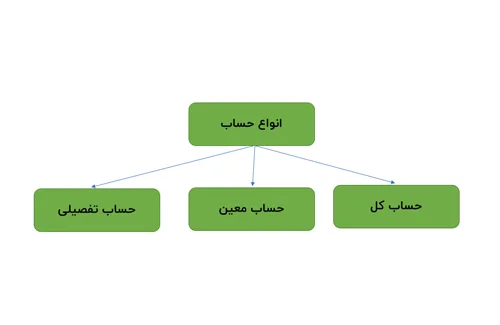

<blockquote style="background-color:#eeeefc; padding:0.5rem">

  
آنچه در این مطلب خواهید خواند:

  <ul>
    <li>تعریف حساب تفصیلی</li>
    <li>کاربرد حساب تفصیلی</li>
    <li>ماهیت حساب تفصیلی</li>
    <li>تفاوت حساب تفصیلی و معین و کل</li>
    <li>انواع حساب تفصیلی
    <ul>
     <li>حساب تفصیلی شناور</li>
     <li>حساب تفصیلی واحد</li>
    </ul>
    </li>
    <li>گزارش تفصیلی چیست؟</li>
    <li>تعریف حساب تفصیلی در نرم افزار حسابداری سایان</li>
  </ul>

</blockquote>

## تعریف حساب تفصیلی
حساب تفصیلی در توصیف حساب های کل و معین تعریف می شود. معنای لغوی تفصیل یعنی شرح دادن؛ 

بنابراین حساب های تفصیلی، جزئی ترین حساب های یک سازمان یا شرکت هستند.

به طور مثال:
* گروه (داراییهای جاری)
    * حساب کل  (موجودی نقد و بانک)
        * حساب معین (موجودی نزد بانک)
            * حساب تفصیل (بانک ملی)

بنابراین حسابداران برای تکمیل و دقیق بودن اطلاعات و ثبت هایشان از حساب های تفصیلی کمک می گیرند.

<blockquote style="background-color:#f5f5f5; padding:0.5rem">

<strong>آشنایی با <a href="https://www.hooshkar.com/Software/Sayan/Module/Accounting" target="_blank">نرم افزار حسابداری</a> سایان</strong>
</blockquote>

## کاربرد حساب تفصیلی
حساب های تفصیلی در تکمیل اطلاعات حساب های معین کاربرد دارند یا به تعریف دیگر مهمترین کاربرد حساب تفصیلی، پاسخگویی مناسب به گزارش گیری حسابداری و مالیست که بدون استفاده از حساب تفصیلی، امکان پاسخگویی به نیازهای گزارش گیری مدیران درون سازمانی و ذینفعان برون سازمانی وجود نخواهد داشت.

بعنوان مثال نیاز داریم گردش و مانده حسابهای اشخاص حقیقی یا حقوقی خود را به تفکیک در سیستم حسابداری داشته باشیم که بدون بکارگیری حساب تفصیل، این امکان وجود نخواهد داشت.

## ماهیت حساب تفصیلی
حساب های تفصیلی ماهیت جزئی دارند. جزئیات اگرچه بسیار مهم هستند اما به تنهایی بی معنا می شوند. حساب های تفصیلی به نوعی ماهیت خود را از حساب معین خود دریافت می کنند.

<blockquote style="background-color:#f5f5f5; padding:0.5rem">

<strong>بیشتر بخوانید: <a href="https://www.hooshkar.com/Wiki/Financial/DetailedAccountingCoding" target="_blank">کدینگ تفصیلی حسابداری چیست؟
</a>
</strong></blockquote>

## تفاوت حساب تفصیلی و معین و کل

قبل از بررسی این موضوع باید تعریف حساب کل و معین را بهتر درک نماییم تا بتوانیم به تفاوت آنها با حساب تفصیلی بپردازیم.

**حساب های کل (دائمی) شامل:** {دارایی ها، بدهی ها، حقوق صاحبان سهام، سرمایه، حسابهای انتظامی} 

**حساب های کل (موقت) شامل:** {درآمد و هزینه} می باشند.

بنابراین حساب کل، کلیت رویدادهای مالی یک شرکت را بیان می کند.

برای دسترسی به جزییات بیشتر از حساب های کل باید حساب معین را برای هر کدام از آنها تعریف کنیم.

از حساب تفصیلی زمانی که رویدادهای مالی جزئیات بالایی دارند و حساب معین، پاسخگوی تمام اطلاعات نیست استفاده می شود.

<blockquote style="background-color:#f5f5f5; padding:0.5rem">

<strong>بیشتر بخوانید: <a href="https://www.hooshkar.com/Wiki/Financial/CostAccounting" target="_blank">حسابداری صنعتی چیست؟
</a>
</strong></blockquote>

## انواع حساب تفصیلی

### 1. حساب تفصیلی شناور

این نوع حساب ها به صورت شناور با حساب های معین در ارتباط هستند، یعنی امکان ارتباط بین یک حساب تفصیلی شناور با چند حساب معین وجود دارد.

یک شخص حقوقی همزمان می تواند تامین کننده و یا مشتری باشد. 

زمانیکه تامین کننده باشد در حساب بستانکاران تجاری قرار می گیرد {بدهی جاری(کل)/ حسابهای پرداختنی (معین)/ آقای احمدی (تفصیلی)}

زمانیکه مشتری باشد در حساب بدهکاران تجاری قرار می گیرد {دارایی جاری (کل)، حسابهای دریافتنی (معین)، آقای احمدی (تفصیلی)}

### 2. حساب تفصیلی واحد

حساب تفصیلی واحد نام دیگر تفصیلی شناور محسوب می شود از این رو چون یک حساب تفصیلی واحد با چندین حساب معین، در ارتباط است نام واحد به آن اطلاق می گردد. بنابراین شناور و واحد با یکدیگر تفاوتی ندارند.

## گزارش تفصیلی چیست
گردش حسابهای مربوط به یک شخص حقیقی یا حقوقی که نشان دهنده عملکرد مالی آن شخص می باشد.

## تعریف حساب تفصیلی در نرم افزار حسابداری سایان
<a href="https://www.hooshkar.com/Software/Sayan" target="_blank">سایان
</a> یکی از بهترین نرم افزار های مطرح در عرصه نرم افزارهای مالی و حسابداری است.

در حسابداری سایان جهت ایجاد حساب تفصیلی ابتدا باید ویژگی تفصیل پذیر بودن به حساب معین تخصیص داده شود.

امکان تعریف انواع مختلفی از حسابهای تفصیلی نظیر: حسابهای جاری، مراکز هزینه ها، اشخاص حقیقی و حقوقی و... وجود دارد که با انتخاب هر یک از اینها بعنوان یک حساب تفصیلی می توانیم جزییات دلخواه را وارد نماییم.