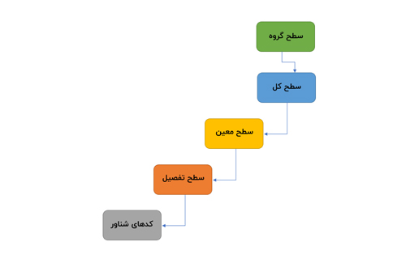

**راهنمای مطالب**
- [کدینگ حسابداری چیست](#کدینگ-حسابداری-چیست)
- [اهداف کدینگ در حسابداری](#اهداف-کدینگ-در-حسابداری)
- [انواع کدینگ حسابداری](#انواع-کدینگ-حسابداری)
    - [1. کدینگ سلسه مراتبی](#1-کدینگ-سلسه-مراتبی)
    - [2. کدینگ متوالی (سریالی)](#2-کدینگ-متوالی-سریالی)
    - [3. کدینگ حفظی (حروف اختصاری)](#3-کدینگ-حفظی-حروف-اختصاری)
    - [4. کدینگ توده ای](#4-کدینگ-توده-ای)
- [سطوح کدینگ حسابداری](#سطوح-کدینگ-حسابداری)
- [کاربرد سیستم کدینگ در حسابداری](#کاربرد-سیستم-کدینگ-در-حسابداری)
- [استاندارد سازی کدینگ حسابداری](#استاندارد-سازی-کدینگ-حسابداری)

## کدینگ حسابداری چیست
کدینگ در معنای لغوی یعنی شماره گذاری که ترکیب آن با حسابداری یعنی حساب ها در حسابداری را کدگذاری نماییم.
در یک تعریف ساده، یک نوع از دسته بندی حساب ها در حسابداری به شمار می رود.

کدینگ حسابداری اصولا به شکل درختی است. در آن دسته بندی هایی برای حساب ها 
مشخص می شود که دارای سطوح مختلف و کدهای متنوعی هستند، به این نوع شاخه بندی کردن و کدگذاری حساب ها کدینگ حسابداری گفته می شود.

<blockquote style="background-color:#f5f5f5; padding:0.5rem">
مطلب پیشنهادی: <a href="https://www.hooshkar.com/Wiki/Accounting/DetailedAccount" target="_blank">حساب تفصیلی چیست؟
</a></blockquote>

### اهداف کدینگ در حسابداری
1. کدینگ حسابداری موجب استاندارد سازی عملیات های مالی و یکپارچه نمودن آنها براساس یک فرمت خاص می گردد.

2. سرعت و دقت در ثبت و پردازش رویدادهای مالی را افزایش داده و موجب پایین آمدن خطای انسانی در تیم های حسابداری می شود.

3. موجب افزایش سرعت و دقت در تهیه گزارشات مالی (مانند صورت معاملات فصلی) می گردد.

4. فرایند کدینگ، تحلیل و بررسی های مالی جهت سرمایه گذاری یا محاسبه میزان دارایی ها را تسهیل می بخشد که موجب بهبود قدرت در تصمیم گیری برای تصمیم گیرندگان درون سازمانی و برون سازمانی می گردد.

<blockquote style="background-color:#f5f5f5; padding:0.5rem">
مطلب پیشنهادی: <a href="https://www.hooshkar.com/Wiki/Financial/TaxPayersSystemUpdate" target="_blank">تمدید مهلت ارسال صورت حساب الکترونیکی 1402
</a></blockquote>

## انواع کدینگ حسابداری
کدینگ حسابداری امری تخصصی به شمار می آید که باید توسط حسابداران متخصص و مدیران مالی با تجربه انجام شود تا بتواند از بروز مشکلات مالی و حسابداری واحدهای اقتصادی جلوگیری نماید.

<blockquote style="background-color:#f5f5f5; padding:0.5rem">
مطلب پیشنهادی: آشنایی با امکانات<a href="https://www.hooshkar.com/Software/Sayan/Module/Accounting" target="_blank"> نرم افزار حسابداری سایان
</a></blockquote>

### 1. کدینگ سلسه مراتبی

به دلیل نظم و دقت بالا و عدم محدودیت در تعداد حساب ها، کالاها و داده یکی از پرکاربردترین روش های کدینگ می باشد.

بعنوان مثال: در یک شرکت برای حساب دارایی ها کد 302 در نظر گرفته می شود.
اگر حسابدار قصد اضافه نمودن  زیر گروهی به این حساب داشته باشد می تواند با اضافه کردن یک عدد صحیح به آن، زیر گروه مورد نظر خود را ایجاد نماید.

* 300
* 301
* 302
    * 3021
    * 3022
    * 3023
        * 30231
        * 30231

### 2. کدینگ متوالی (سریالی)

در این روش اعداد به صورت پشت سر هم به حساب ها و دیتا تخصیص داده می شود.

### 3. کدینگ حفظی (حروف اختصاری)

در این روش کد گذاری حرف اول کلمات را برای بازه کوچکی از کلمات به کار می برند. 

بعنوان مثال: حساب های دریافتنی با کد «ح-د» شناخته می شود.
این نوع کدینگ بیشتر در میان دانش آموزان و دانشجویان رشته حسابداری و مالی کاربرد دارد. 

### 4. کدینگ توده ای

از این روش زمانی استفاده می شود که می خواهیم در یک دوره مالی یک کد را به یک حساب اختصاص دهیم.

<blockquote style="background-color:#f5f5f5; padding:0.5rem">
مطلب پیشنهادی: <a href="https://www.hooshkar.com/Wiki/Financial/AccountingPrinciples" target="_blank">تعریف اصول حسابداری و انواع آن
</a></blockquote>

## سطوح کدینگ حسابداری

* گروه حساب
* سطح کل
* سطح معین
* سطح تفصیلی
* کدهای شناور

### کاربرد سیستم کدینگ در حسابداری

* به منظور شناسایی بهتر و ساده تر حساب های شرکت و صورت های مالی
* سرعت بخشیدن به امور حسابرسی شرکت
* دسته بندی، مرتب‌سازی موضوعات و عنوان‌های مربوط به فعالیت‌های حسابداری یک شرکت یا سازمان
* امکان دسته بندی و مرتب سازی عملیات مالی طبق موارد مختلف مانند نوع و سطح فعالیت سازمان
* پس از مشخص شدن سرفصل های حساب کل و معین، قادریم ارتباط بین آن ها را به دست آورده و سپس برای استفاده کنندگان درون سازمانی و برون سازمانی ارائه دهیم.
* از دیگر کاربردهای مهم کدینگ حسابداری، تفکیک حساب‌ و طبقه بندی حساب های شرکت های تولیدی است.
* این امکان را فراهم می آورد تا حساب شرکت های تولیدی و بازرگانی به طور موثر و براساس با نیازهای تجاری سازماندهی گردد.

<blockquote style="background-color:#f5f5f5; padding:0.5rem">
مطلب پیشنهادی: <a href="https://www.hooshkar.com/Wiki/Financial/ComparisonFinancialSoftware" target="_blank">مقایسه نرم افزار های حسابداری
</a></blockquote>

برای انجام این کار در ابتدا گروه حسابها (حساب های اصلی) تعیین می گردد که براساس آن شکل کلی حساب ها نشان داده می شوند.

در مرحله دوم حساب کل تعریف می شود که جز اصول اولیه آن شرکت جهت ثبت دفاتر قانونی (دفتر کل) است و برای اداره دارایی و سازمان امور مالیاتی اهمیت زیادی دارد 

مرحله سوم حساب های معین که به منظور گزارش دادن و تصمیم گیری مفید هستند. 

مرحله چهارم نیز مربوط به حساب های تفصیلی است که برای هر سازمان به طور اختصاصی تعریف می شوند.

زمانیکه حساب تفصیلی به حساب معین متصل باشد، به آن حساب استاندارد و در غیر این صورت به آن حساب شناور می گویند.

<blockquote style="background-color:#f5f5f5; padding:0.5rem">
مطلب پیشنهادی: <a href="https://www.hooshkar.com/Wiki/Accounting/MultiLayeredAccounting" target="_blank">حسابداری چند لایه چیست؟
</a></blockquote>

### استاندارد سازی کدینگ حسابداری

استاندارد سازی کدینگ در برگیرنده اصول و قواعدی است که از آن، جهت نظم دهی حسابهای مالی یک سازمان استفاده می شود.

کدینگ حسابداری، سیستمی است که در آن اطلاعات مالی به وسیله نرم افزارهای حسابداری پردازش و گزارش های مالی مورد نظر فراهم می شود.

لذا ضرورت دارد طراحی و تدوین کدینگ حسابداری را بر اساس معادله حسابداری، استانداردهای سازمان حسابداری و حسابرسی اجرا نماییم.

[کدینگ حسابداری چیست]: #کدینگ-حسابداری-چیست
[اهداف کدینگ در حسابداری]: #اهداف-کدینگ-در-حسابداری
[انواع کدینگ حسابداری]: #انواع-کدینگ-حسابداری
[1. کدینگ سلسه مراتبی]: #1-کدینگ-سلسه-مراتبی
[2. کدینگ متوالی (سریالی)]: #2-کدینگ-متوالی-سریالی
[3. کدینگ حفظی (حروف اختصاری)]: #3-کدینگ-حفظی-حروف-اختصاری
[4. کدینگ توده ای]: #4-کدینگ-توده-ای
[سطوح کدینگ حسابداری]: #سطوح-کدینگ-حسابداری
[کاربرد سیستم کدینگ در حسابداری]: #کاربرد-سیستم-کدینگ-در-حسابداری
[استاندارد سازی کدینگ حسابداری]: #استاندارد-سازی-کدینگ-حسابداری