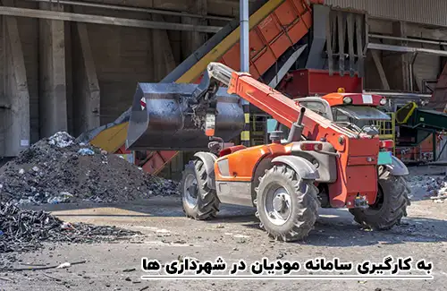
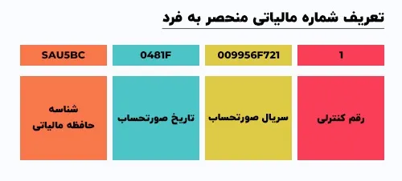
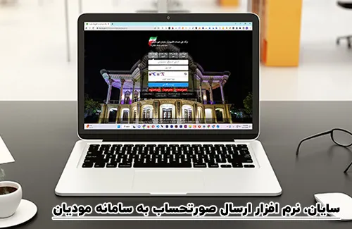

<blockquote style="background-color:#eeeefc; padding:0.5rem">

  
آنچه در این مطلب خواهید خواند:

  <ul>
    <li>سامانه مودیان شهرداری ها</li>
    <li>سامانه مودیان</li>
    <li>حافظه مالیاتی چیست؟</li>
    <li>تعریف شماره منحصر به فرد مالیاتی</li>
    <li>شرکت معتمد در سامانه مؤدیان</li>
    <li>تاریخ اجرایی شدن قانون سامانه مؤدیان</li>
    <li>جرائم ناشی از عدم اجرای قانون سامانه مودیان</li>
    <li>باید و نبایدها در نرم افزارهای ارسال صورتحساب به سامانه مودیان مالیاتی</li>
  </ul>

</blockquote>

## سامانه مودیان شهرداری ها

سامانه مودیان مالیاتی، یا به‌طور مختصر سامانه مودیان، یک پلتفرم یکپارچه است که توسط <a href="https://my.tax.gov.ir" target="_blank">سازمان امور مالیاتی</a> کشور به منظور تسهیل فعالیت مودیان مالیاتی و تبادل مستندات مورد نیاز بین آن‌ها و سازمان ایجاد شده است.

شهرداری ها به عنوان یکی از سازمان‌های بزرگ، با گردش مالی فراوان، موظف به پیوستن به این سامانه هستند.

شرکت <a href="https://www.hooshkar.com" target="_blank">هوشکار پرداز</a> با هدف افزایش آگاهی از الزامات، قوانین و مقررات مربوطه و ایجاد شفافیت بیشتر جهت بهبود عملکرد و استفاده بهینه از سامانه مؤدیان، مقاله‌ای تخصصی در این زمینه تدوین کرده است.

<blockquote style="background-color:#f5f5f5; padding:0.5rem">

<strong>آشنایی با <a href="https://www.hooshkar.com/Software/Sayan/Module/TpTaxGov" target="_blank">نرم افزار واسط سامانه مودیان</a> سایان</strong>
</blockquote>

## سامانه مودیان

اصطلاح اصلی در این مقاله، سامانه مودیان است. سامانه مودیان شامل چهار ویژگی اصلی است:

1. تحت مدیریت سازمان مالیاتی قرار دارد.
2. برای هر مؤدی، یک کارپوشه مخصوص تعریف می‌شود.
3. اتصال سامانه با استفاده از حافظه مالیاتی.
4. به عنوان مرجع ثبت، صدور و استعلام صورتحساب عمل می‌کند.

## حافظه مالیاتی چیست؟

حافظه مالیاتی به هر نرم افزار یا سخت‌ فزاری اشاره دارد که شامل پنج ویژگی زیر می‌شود:

1. نوعی از حافظه الکترونیکی است.
2. ثبت و نگهداری اطلاعات صورتحساب را انجام می‌دهد.
3. انتقال اطلاعات به سامانه مؤدیان را امکان‌پذیر می‌کند.
4. تحت نظارت سازمان امور مالیاتی قرار دارد.
5. دارای شماره شناسه یکتا اختصاصی است.

با کمک این مقاله آموزشی، کارشناسان شهرداری ها و دهیاری ها قادرند مطابق با قوانین مالیاتی عمل کنند.

<blockquote style="background-color:#f5f5f5; padding:0.5rem">

<strong>بیشتر بخوانید: <a href="https://www.hooshkar.com/Wiki/Financial/TaxPayersSystemUpdate" target="_blank">مهلت ارسال صورتحساب در سامانه مودیان
</a>
</strong></blockquote>

## تعریف شماره منحصر به فرد مالیاتی

شماره مالیاتی منحصر به فرد، یک کد بیست و دو کاراکتری است که برای هر صورتحساب الکترونیکی صادر می‌شود. این شماره برای زمانی که نیاز به اصلاح یا ابطال یک صورتحساب دارید ضروری است. شماره مالیاتی از چپ به راست به چهار بخش تقسیم می‌شود:

1. **شش کاراکتر اول:** شناسه حافظه مالیاتی.
2. **پنج کاراکتر بعدی:** تاریخ صورتحساب.
3. **ده کاراکتر بعدی:** سریال صورتحساب.
4. **کاراکتر آخر:** رقم کنترلی.

## شرکت معتمد در سامانه مودیان

این شرکت‌ها، به عنوان اشخاص حقوقی مورد تایید سازمان امور مالیاتی، مسئول فراهم کردن آموزش‌ها و تجهیزات مورد نیاز برای مودیان جهت ارسال صورتحساب الکترونیکی به سامانه مالیاتی هستند. خدمات اصلی ارائه شده توسط شرکت های معتمد به مؤدیان مالیاتی شامل موارد زیر می‌شود:

- صدور صورتحساب الکترونیکی
- ثبت معاملات در سامانه مودیان
- ارائه مشاوره های فنی
- دریافت استعلام از سامانه مودیان

شرکت‌های معتمد به سه نوع تقسیم می‌شوند و هر یک از آنها مسئولیت‌های خاصی را بر عهده دارند. در زیر انواع شرکت‌های معتمد در سامانه مؤدیان را معرفی می‌کنیم:

1. **شرکت های معتمد نوع اول:** این شرکت‌ها مسئولیت آموزش و راه اندازی پایانه های فروشگاهی و حافظه مالیاتی را بر عهده دارند.

2. **شرکت های معتمد نوع دوم:** مسئولیت‌های اصلی این شرکت‌ها شامل آموزش حقوق و تکالیف قانونی مؤدیان، آموزش مقررات صدور صورتحساب الکترونیکی، احراز تسلط مؤدیان در مورد حقوق و تکالیف قانونی آنها و احراز تسلط مودیان در مورد مقررات صدور صورتحساب الکترونیکی می‌باشد.

3. **شرکت های معتمد نوع سوم:** این شرکت‌ها وظایف محدودتری در زمینه قوانین پایانه‌های فروشگاهی و سامانه مؤدیان دارند، که شامل تهیه صورت های مالی، حسابرسی مالی، مشاوره فنی و غیر عملیاتی و مشاوره مالیاتی می‌شود.

<blockquote style="background-color:#f5f5f5; padding:0.5rem">

<strong>بیشتر بخوانید: راهنمایی کامل در مورد <a href="https://www.hooshkar.com/Wiki/Financial/TrustedCompaniesTaxServices" target="_blank">شرکت های معتمد مالیاتی</a>
</strong></blockquote>

## تاریخ اجرایی شدن قانون سامانه مؤدیان

تاریخ اجرای قانون سامانه مؤدیان برای گروه‌های مختلف متفاوت است و بستگی به نوع شرکت دارد. طبق قانونی که در مجلس شورای اسلامی تصویب شده، قانون سامانه مؤدیان همزمان برای همه شرکت‌ها اجرا نمی‌شود. 

شرکت‌ها بر اساس نوع خود در چند دسته تقسیم شده‌اند و هر یک از این دسته‌ها باید در تاریخ مشخصی ثبت‌نام کرده و صورتحساب الکترونیکی صادر کنند. پس زمان ثبت‌نام در سامانه مؤدیان بستگی به نوع شرکت شما دارد. 

در جدول زیر تاریخ اجرای قانون سامانه مؤدیان برای انواع شرکت‌ها را می‌توانید مشاهده کنید.

- تاریخ اجرای قانون سامانه مؤدیان برای شرکتهای عضو بورس و فرابورس از تاریخ: 1402/07/01

- تاریخ اجرای قانون سامانه مؤدیان برای شرکتهای دولتی و سایر دستگاه های اجرای ماده 5 قانون مدیریت خدمات کشوری از تاریخ: 1402/07/01

- تاریخ اجرای قانون سامانه مؤدیان برای اشخاص حقوقی از تاریخ: 1402/07/01

- تاریخ اجرای قانون سامانه مؤدیان برای صاحبان مشاغل مشمول مالیات بر ارزش افزوده از تاریخ: 1402/10/01

- تاریخ اجرای قانون سامانه مؤدیان برای صاحبان مشاغل گروه های اول و دوم از تاریخ: 1402/10/01

- تاریخ اجرای قانون سامانه مؤدیان برای کلیه اشخاص مشمول باقیمانده از تاریخ: 1402/10/01

<blockquote style="background-color:#f5f5f5; padding:0.5rem">

<strong>بیشتر بخوانید: <a href="https://www.hooshkar.com/Wiki/Financial/ModianContractorSystem" target="_blank">سامانه مودیان شرکتهای پیمانکاری</a>
</strong></blockquote>

## جرائم ناشی از عدم اجرای قانون سامانه مودیان

تدابیر قانونی و تخلفات جدی توسط قانون‌گذار برای اطمینان از اجرای صحیح قانون سامانه مودیان در نظر گرفته شده است. مؤدیانی که این قانون را رعایت نمی‌کنند، با جرائم سنگینی مواجه می‌شوند. در صورتی که مؤدی در یکی از تخلفات زیر متهم شود، مجبور خواهد بود جریمه‌ای به مبلغ 10٪ از مجموع مبلغ فروش انجام شده یا حداقل بیست میلیون ریال (هرکدام که بیشتر باشد) پرداخت کند:

1. عدم عضویت در سامانه مودیان.
2. عدم استفاده از پایانه فروشگاهی.
3. عدم استفاده از حافظه مالیاتی.
4. بکارگیری از حافظه مالیاتی دیگران به نفع خود.
5. بکارگیری از حافظه مالیاتی خود به نفع دیگران.
6. عدم اعلام شماره حساب های بانکی واحدهای اقتصادی که با آن‌ها گردش مالی انجام می‌دهند.

باید توجه داشت که علاوه بر جریمه مالی، تخلفات مرتبط با این قانون می‌توانند منجر به از دست دادن مزایای مالیاتی مانند معافیت‌ها و نرخ مالیاتی صفر شوند. این خسارات می‌توانند برای مؤدیان مالیاتی جبران‌ناپذیر باشند.

همچنین، برخی اقدامات دیگر نیز می‌توانند جرائم مالیاتی به همراه داشته باشند. به عنوان مثال، عدم تحویل صورتحساب چاپی به خریدار یا تغییر غیرمجاز آن، می‌تواند منجر به جریمه به مبلغ دو درصد از مبلغ فروش انجام شده از آن طریق یا حداقل بیست میلیون ریال (هرکدام که بیشتر باشد) به صاحب سازمان امور مالیاتی شود.

توجه کنید که ارقام مالیاتی مشخص شده در این قوانین با توجه به نرخ تورم سالانه توسط سازمان امور مالیاتی سالانه به‌روزرسانی می‌شوند. این نکته نشان‌دهنده جدیت در اجرای این تخلفات و جریمه‌ها است. 

همچنین، بر اساس تصویب قانون تسهیل تکالیف مودیان، سازمان امور مالیاتی مجاز است که 100٪ جرائم ماده 22 قانون پایانه‌های فروشگاهی و سامانه مودیان طبق ماده 191 قانون مالیات ها، مورد بخشش قرار دهد.

پیش از شروع ثبت‌نام، توصیه می‌شود که قوانین مربوط به سامانه مودیان مالیاتی را به دقت مطالعه نمایید. می‌توانید با کلیک بر روی دکمه زیر، قوانین سامانه مودیان را از سایت سازمان امور مالیاتی مطالعه کنید.

<blockquote style="padding:0.5rem justify-content: center">
<strong>
راهنما: <a href="https://inta.tax.gov.ir/Pages/Action/LawsIndex/8/1" target="_blank">قوانین سامانه مودیان</a>
</strong></blockquote>

### باید و نبایدها در نرم افزارهای ارسال صورتحساب به سامانه مودیان مالیاتی

از تاریخ 1402/01/01، اشخاص حقوقی به جز اشخاص حقوقیِ مشمول ماده ۱۶ قانون مالیات بر ارزش افزوده، مکلف به رعایت قانون <a href="https://www.intamedia.ir/Law-of-store-terminals-and-taxpayer-system" target="_blank">پایانه های فروشگاهی</a> شده‌اند و صورتحساب ‌هایی که به‌صورت الکترونیکی به سامانه مودیان ارسال می‌شوند، تنها با تأیید سازمان اعتبار خواهند داشت.

مؤدیان نباید صورتحساب ها را به‌صورت غیر الکترونیکی یا به‌صورت کم اظهاری یا بیش اظهاری ارسال کنند. همچنین، کتمان اطلاعات در اظهار صورتحساب‌ها نیز جزو جرائم مالیاتی محسوب می‌شود و می‌تواند باعث از دست رفتن اعتبار مالیاتی مودی گردد، که سپس پرونده مورد نظر باید جهت تشخیص و احیای اعتبار مالیاتی مورد رسیدگی قرار گیرد. بنابراین، مؤدیان مالیاتی باید صورتحساب ها را به‌صورت الکترونیکی ارسال کنند و برای این منظور، می‌توانند از پایانه های فروشگاهی یا نرم افزار مناسب استفاده کنند، که ارسال مستقیم توسط مؤدی به سامانه مودیان بهترین روش ممکن است.

روش ارسال مستقیم صورتحساب ها به سامانه مودیان به این صورت است که مودیان مالیاتی از طریق نرم افزار مخصوص خود، صورتحساب ها را به سامانه مودیان ارسال نمایند. در این راستا شرکت نرم افزاری **هوشکار پرداز** برای مشتریان خود **نرم افزار سامانه مودیان** را ارائه داده است. 

**امیدواریم محتوای ارائه شده برای شما مفید و عملی بوده باشد. دیدگاه‌ها و انتقادات سازنده شما، چراغ راه <a href="https://www.hooshkar.com" target="_blank">هوشکار پرداز</a> در ارتقای کیفیت مطالب آینده خواهد بود. قدردان زمان ارزشمندی هستیم که برای مطالعه این مقاله اختصاص دادید و مشتاقانه منتظر بازخورد شما هستیم.**