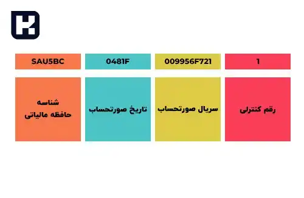

<blockquote class="faq-block">

  
آنچه در این مطلب خواهید خواند:

  <ul>
    <li>سامانه مودیان شهرداری ها</li>
    <li>سامانه مودیان و حافظه مالیاتی</li>
    <li>تعریف شماره منحصر به فرد مالیاتی</li>
    <li>شرکت معتمد در سامانه مودیان</li>
    <li>تاریخ اجرایی شدن قانون سامانه مؤدیان</li>
    <li>جرائم ناشی از عدم اجرای قانون سامانه مودیان</li>
    <li>باید و نبایدها در نرم افزارهای ارسال صورتحساب</li>
    <li>سوالات متداول</li>
    <li>جمع‌بندی</li>
  </ul>

</blockquote> 

با توجه به گردش مالی گسترده شهرداری‌ها و نقش کلیدی آنها در اقتصاد کشور، استفاده از سامانه مودیان برای ثبت و مدیریت صورتحساب‌های الکترونیکی ضروری است. این سامانه با هدف شفافیت مالی، کاهش فساد، و بهبود عملکرد مالی سازمان‌ها طراحی شده و امکان مدیریت یکپارچه تراکنش‌ها را فراهم می‌کند. در این مقاله، نحوه اجرای سامانه مودیان در شهرداری‌ها، الزامات قانونی، و روش‌های عملیاتی استفاده از نرم افزارهای مرتبط بررسی می‌شود.

## سامانه مودیان شهرداری ها

سامانه مودیان مالیاتی (<a href="https://my.tax.gov.ir" target="_blank">my.tax.gov.ir</a>) یک پلتفرم یکپارچه است که توسط سازمان امور مالیاتی کشور ایجاد شده و شهرداری‌ها موظف به استفاده از آن هستند. هدف این سامانه، تسهیل تبادل مستندات و افزایش شفافیت مالیاتی می‌باشد.

برای تسهیل ارسال صورتحساب‌های الکترونیکی به سامانه مودیان، می‌توانید از [نرم افزار واسط سامانه مودیان سایان](https://www.hooshkar.com/Software/Sayan/Module/TpTaxGov) استفاده کنید.

---

### سامانه مودیان

ویژگی‌های اصلی سامانه مودیان شامل موارد زیر است:

1. تحت مدیریت سازمان مالیاتی قرار دارد.
2. برای هر مؤدی، کارپوشه مخصوص تعریف می‌شود.
3. اتصال سامانه با استفاده از حافظه مالیاتی.
4. مرجع ثبت، صدور و استعلام صورتحساب‌ها است.

---

### حافظه مالیاتی چیست؟

حافظه مالیاتی نوعی حافظه الکترونیکی است که امکان ثبت، نگهداری و انتقال اطلاعات صورتحساب به سامانه مودیان را فراهم می‌کند. ویژگی‌ها:

1. حافظه الکترونیکی و امن
2. ثبت و نگهداری اطلاعات صورتحساب
3. انتقال اطلاعات به سامانه مودیان
4. تحت نظارت سازمان امور مالیاتی
5. دارای شماره شناسه یکتا

برای کسب اطلاعات دقیق درباره زمان‌بندی و <a href="https://www.hooshkar.com/Wiki/Financial/TaxPayersSystemUpdate" target="_blank">مهلت ارسال صورتحساب در سامانه مودیان</a> می‌توانید به این مطلب مراجعه کنید.

---

### تعریف شماره منحصر به فرد مالیاتی

شماره مالیاتی منحصر به فرد، کدی 22 رقمی است که برای هر صورتحساب صادر می‌شود و شامل:

1. شش کاراکتر اول: شناسه حافظه مالیاتی
2. پنج کاراکتر بعدی: تاریخ صورتحساب
3. ده کاراکتر بعدی: سریال صورتحساب
4. کاراکتر آخر: رقم کنترلی

---

### شرکت معتمد در سامانه مودیان

شرکت‌های معتمد، اشخاص حقوقی مورد تایید سازمان امور مالیاتی هستند که آموزش و تجهیزات لازم را فراهم می‌کنند. انواع شرکت‌ها:

1. **نوع اول:** آموزش و راه‌اندازی پایانه‌های فروشگاهی و حافظه مالیاتی
2. **نوع دوم:** آموزش حقوق و تکالیف قانونی مؤدیان و صدور صورتحساب
3. **نوع سوم:** ارائه مشاوره فنی، حسابرسی مالی و مشاوره مالیاتی

برای آشنایی بیشتر با <a href="https://www.hooshkar.com/Wiki/Financial/TrustedCompaniesTaxServices" target="_blank">شرکت های معتمد مالیاتی</a> و خدمات آن‌ها، این مطلب را مطالعه کنید.

---

### تاریخ اجرایی شدن قانون سامانه مؤدیان

تاریخ اجرا بسته به نوع شرکت متفاوت است. نمونه تاریخ‌ها:

- شرکت‌های عضو بورس و فرابورس: 1402/07/01
- شرکت‌های دولتی: 1402/07/01
- اشخاص حقوقی: 1402/07/01
- صاحبان مشاغل مشمول مالیات بر ارزش افزوده: 1402/10/01

برای کسب اطلاعات بیشتر درباره <a href="https://www.hooshkar.com/Wiki/Financial/ModianContractorSystem" target="_blank">سامانه مودیان شرکتهای پیمانکاری</a>، این مطلب را مطالعه کنید.

---

### جرائم ناشی از عدم اجرای قانون سامانه مودیان

جرائم شامل:

1. عدم عضویت در سامانه مودیان
2. استفاده نکردن از پایانه فروشگاهی یا حافظه مالیاتی
3. استفاده غیرمجاز از حافظه مالیاتی دیگران
4. عدم اعلام شماره حساب‌های بانکی

میزان جریمه: 10٪ مجموع فروش یا حداقل 20 میلیون ریال.  

برای دسترسی به راهنمای کامل <a href="https://inta.tax.gov.ir/Pages/Action/LawsIndex/8/1" target="_blank">قوانین سامانه مودیان</a> می‌توانید این لینک را دنبال کنید.

---

### باید و نبایدها در نرم افزارهای ارسال صورتحساب به سامانه مودیان

- ارسال صورتحساب‌ها غیر الکترونیکی مجاز نیست.
- کم‌اظهاری یا بیش‌اظهاری تخلف است.
- استفاده از نرم‌افزار معتبر بهترین روش ارسال مستقیم است.
- نرم افزار سامانه مودیان هوشکار پرداز، ارسال سریع و مطمئن صورتحساب‌ها را تضمین می‌کند.

برای ارسال سریع و بدون خطا صورتحساب‌های الکترونیکی می‌توانید از <a href="https://www.hooshkar.com/Software/Sayan/Module/TpTaxGov" target="_blank">نرم افزار واسط سامانه مودیان سایان</a> استفاده کنید.

---

### سوالات متداول

<blockquote class="faq-block">
  

    
شهرداری‌ها چرا موظف به پیوستن به سامانه مودیان هستند؟

    شهرداری‌ها به دلیل گردش مالی بالا و لزوم شفافیت مالی، موظف به ثبت و مدیریت صورتحساب‌های خود در سامانه مودیان هستند.
  

</blockquote>

<blockquote class="faq-block">
  

    
حافظه مالیاتی چیست؟

    حافظه مالیاتی سخت‌افزار یا نرم‌افزاری است که اطلاعات صورتحساب را ثبت، نگهداری و به سامانه مودیان ارسال می‌کند.
  

</blockquote>

<blockquote class="faq-block">
  

    
شماره منحصر به فرد مالیاتی چه کاربردی دارد؟

    این شماره برای اصلاح، ابطال و استعلام صورتحساب‌ها ضروری است و هر صورتحساب یک شماره یکتا دارد.
  

</blockquote>

<blockquote class="faq-block">
  

    
شرکت معتمد چیست و چه خدماتی ارائه می‌دهد؟

    شرکت معتمد، شخص حقوقی مورد تایید سازمان مالیاتی است که آموزش، صدور صورتحساب و پشتیبانی فنی ارائه می‌دهد.
  

</blockquote>

<blockquote class="faq-block">
  

    
جرائم ناشی از عدم اجرای قانون سامانه مودیان چیست؟

    شامل عدم عضویت، عدم استفاده از پایانه فروشگاهی، استفاده غیرمجاز از حافظه مالیاتی و جریمه نقدی حداقل 20 میلیون ریال یا 10٪ مجموع فروش می‌باشد.
  

</blockquote>

---

### جمع‌بندی

اجرای سامانه مودیان در شهرداری‌ها یک ضرورت قانونی و عملی است که موجب شفافیت مالی، کاهش فساد، و تسهیل نظارت بر تراکنش‌ها می‌شود. استفاده از نرم افزارهای معتبر، ثبت دقیق اطلاعات و پایبندی به الزامات قانونی، کلید موفقیت در بهره‌برداری بهینه از این سامانه است. پیروی از دستورالعمل‌ها و استفاده از شرکت‌های معتمد، ریسک جرائم مالیاتی را کاهش داده و عملکرد شهرداری‌ها را بهبود می‌بخشد.