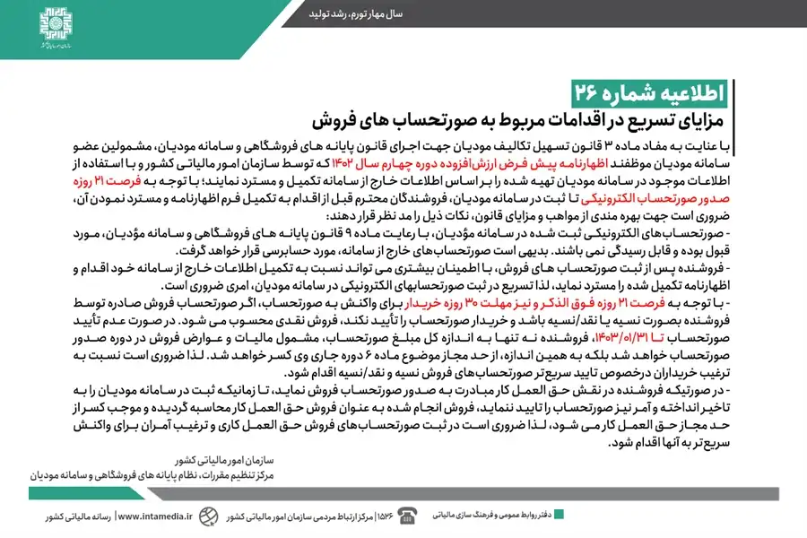

## اقدامات مربوط به صورتحساب های فروش

بر اساس ماده 3 قانون تسهیل تکالیف مودیان، مشمولین سامانه مودیان باید اظهارنامه پیش‌فرض ارزش افزوده دوره چهارم 1402 که توسط سازمان امور مالیاتی تهیه شده را بر مبنای اطلاعات خارج از سامانه، تکمیل و مسترد نمایند. در این راستا نکاتی وجود دارد که در متن اطلاعیه کامل شرح داده شده است.

برای بهره‌مندی از امکانات پیشرفته و تسریع در ارسال و مدیریت صورتحساب‌ها، می‌توانید از <a href="https://www.hooshkar.com/Software/Sayan/Module/TpTaxGov" target="_blank">نرم افزار واسط سامانه مودیان سایان</a> استفاده کنید.

منبع: <a href="https://www.intamedia.ir/news/%D8%A7%D8%B7%D9%84%D8%A7%D8%B9%DB%8C%D9%87-%D8%B4%D9%85%D8%A7%D8%B1%D9%87-26-%D8%A7%D8%B7%D9%84%D8%A7%D8%B9-%D8%B1%D8%B3%D8%A7%D9%86%DB%8C-%D8%AF%D8%B1%D8%AE%D8%B5%D9%88%D8%B5-%D9%85%D8%B2%D8%A7%DB%8C%D8%A7%DB%8C-%D8%AA%D8%B3%D8%B1%DB%8C%D8%B9-%D8%AF%D8%B1-%D8%A7%D9%82%D8%AF%D8%A7%D9%85%D8%A7%D8%AA-%D9%85%D8%B1%D8%A8%D9%88%D8%B7-%D8%A8%D9%87-%D8%B5%D9%88%D8%B1%D8%AA%D8%AD%D8%B3%D8%A7%D8%A8-%D9%87%D8%A7%DB%8C-%D9%81%D8%B1%D9%88%D8%B4" target="_blank">اقدامات مربوط به صورتحساب های فروش</a>

منبع <a href="https://www.intamedia.ir/news/%D8%A7%D8%B7%D9%84%D8%A7%D8%B9%DB%8C%D9%87-%D8%B4%D9%85%D8%A7%D8%B1%D9%87-25-%D8%A7%D8%B7%D9%84%D8%A7%D8%B9-%D8%B1%D8%B3%D8%A7%D9%86%DB%8C-%D8%AF%D8%B1%D8%AE%D8%B5%D9%88%D8%B5-%D9%85%D8%B2%D8%A7%DB%8C%D8%A7%DB%8C-%D8%AA%D8%B3%D8%B1%DB%8C%D8%B9-%D8%AF%D8%B1-%D8%A7%D9%82%D8%AF%D8%A7%D9%85%D8%A7%D8%AA-%D9%85%D8%B1%D8%A8%D9%88%D8%B7-%D8%A8%D9%87-%D8%B5%D9%88%D8%B1%D8%AA%D8%AD%D8%B3%D8%A7%D8%A8-%D9%87%D8%A7%DB%8C-%D8%AE%D8%B1%DB%8C%D8%AF" target="_blank">اقدامات مربوط به صورتحساب های خرید</a>