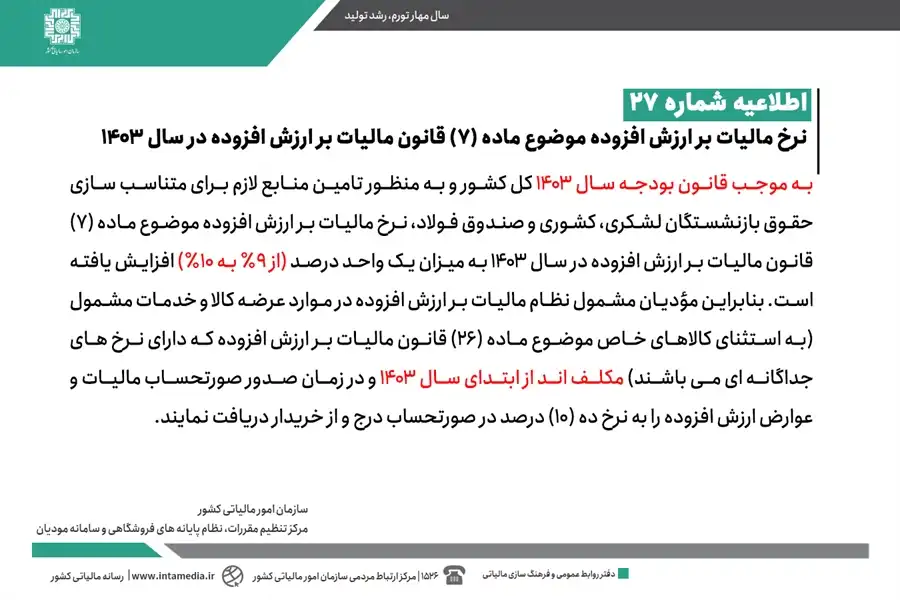

## بخشنامه افزایش مالیات بر ارزش افزوده در سال 1403

براساس قانون بودجه سال 1403 و به منظور تامین منابع لازم برای متناسب سازی حقوق بازنشستگان (لشکری، کشوری و صندوق فولاد)، **نرخ مالیات بر ارزش افزوده در سال 1403 از 9% به 10% افزایش یافته است.**

بنابراین مودیان مشمول این نظام مالیاتی، موظفند از ابتدای سال 1403، در زمان صدور صورتحساب برای عرضه کالا و خدمات مشمول (به استثنای کالاهای خاص با نرخ جداگانه)، مالیات و عوارض ارزش افزوده را به نرخ 10 درصد در صورتحساب درج و از خریدار دریافت نمایند.

<blockquote style="background-color:#f5f5f5; padding:0.5rem">

<strong>آشنایی با <a href="https://www.hooshkar.com/Software/Sayan/Module/TpTaxGov" target="_blank">نرم افزار واسط سامانه مودیان
</a> سایان</strong>
</blockquote>

### بخشنامه ارزش افزوده سال 1403

> به ‌موجب قانون بودجه سال 1403 کل کشور و به منظور تامین منابع لازم برای متناسب سازی حقوق بازنشستگان لشکری، کشوری و صندوق فولاد، نرخ مالیات بر ارزش افزوده موضوع ماده (7) قانون مالیات بر ارزش افزوده در سال 1403 به میزان یک واحد درصد **(از 9% به 10%)** افزایش یافته است. بنابراین مؤدیان مشمول نظام مالیات بر ارزش افزوده در موارد عرضه کالا و خدمات مشمول (به استثنای کالاهای خاص موضوع ماده (26) قانون مالیات بر ارزش افزوده که دارای نرخ های جداگانه ای می باشند) مکلف اند از ابتدای سال 1403 و در زمان صدور صورتحساب مالیات و عوارض ارزش افزوده را به نرخ ده (10) درصد در صورتحساب درج و از خریدار دریافت نمایند.

منبع: <a href="https://www.intamedia.ir/news/%D8%A7%D8%B7%D9%84%D8%A7%D8%B9%DB%8C%D9%87_%D8%B4%D9%85%D8%A7%D8%B1%D9%87_27_%D9%82%D8%A7%D8%A8%D9%84_%D8%AA%D9%88%D8%AC%D9%87_%D9%81%D8%B9%D8%A7%D9%84%D8%A7%D9%86_%D9%85%D8%AD%D8%AA%D8%B1%D9%85_%D8%A7%D9%82%D8%AA%D8%B5%D8%A7%D8%AF%DB%8C_%D9%85%D8%B4%D9%85%D9%88%D9%84_%D9%86%D8%B8%D8%A7%D9%85_%D9%85%D8%A7%D9%84%DB%8C%D8%A7%D8%AA_%D8%A8%D8%B1_%D8%A7%D8%B1%D8%B2%D8%B4_%D8%A7%D9%81%D8%B2%D9%88%D8%AF%D9%87" target="_blank">اطلاعیه شماره 27</a>