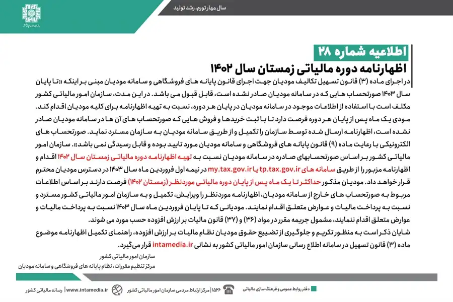

## اطلاعیه شماره 28

بر اساس ماده 3 قانون تسهیل تکالیف مودیان، تا پایان سال 1403 صورتحساب‌هایی که در سامانه مودیان صادر نشده است، قابل قبول خواهد بود.
سازمان امور مالیاتی موظف است در پایان هر دوره، اظهارنامه‌ای را برای مودیان تهیه کند.

مودیان یک ماه فرصت دارند اظهارنامه ارسالی را با ثبت خریدها و فروش‌های خارج از سامانه، تکمیل و به سازمان مسترد نمایند. 

برای دوره مالیاتی زمستان 1402، سازمان، اظهارنامه‌ای تهیه و در نیمه اول فروردین 1403 در اختیار مودیان قرار می‌دهد. مودیان تا پایان فروردین 1403 فرصت دارند اظهارنامه را ویرایش، تکمیل و مالیات را پرداخت کنند، در غیر این صورت مشمول جریمه می‌شوند.

<blockquote style="background-color:#f5f5f5; padding:0.5rem">

<strong>آشنایی با <a href="https://www.hooshkar.com/Software/Sayan/Module/TpTaxGov" target="_blank">نرم افزار واسط سامانه مودیان
</a> سایان</strong>
</blockquote>

**راهنمای تکمیل اظهارنامه:** <a href="https://www.intamedia.ir" target="_blank">intamedia.ir</a>

منبع: <a href="https://www.intamedia.ir/news/%D8%A7%D8%B7%D9%84%D8%A7%D8%B9%DB%8C%D9%87_%D8%B4%D9%85%D8%A7%D8%B1%D9%87_28_%D9%82%D8%A7%D8%A8%D9%84-%D8%AA%D9%88%D8%AC%D9%87-%D9%85%D9%88%D8%AF%DB%8C%D8%A7%D9%86-%D9%86%D8%B8%D8%A7%D9%85-%D9%85%D8%A7%D9%84%DB%8C%D8%A7%D8%AA-%D8%A8%D8%B1-%D8%A7%D8%B1%D8%B2%D8%B4-%D8%A7%D9%81%D8%B2%D9%88%D8%AF%D9%87" target="_blank">اظهارنامه دوره مالیاتی زمستان سال 1402</a>