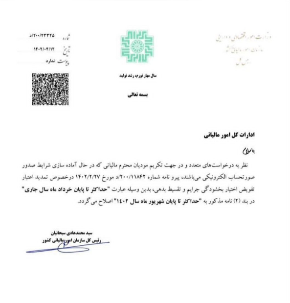

## تمدید مهلت سامانه مودیان

> نظر به درخواست‌های متعدد و در جهت تکریم مودیان محترم مالیاتی که در حال آماده سازی شرایط صدور صورتحساب الکترونیکی می‌باشند، پیرو نامه شماره 200/11842/د مورخ 1402/2/27 در خصوص تمدید اعتبار تفویض اختیار بخشودگی جرایم و تقسیط بدهی، بدین وسیله عبارت **"حداکثر تا پایان خرداد ماه سال جاری"** در بند (2) نامه مذکور به **"حداکثر تا پایان شهریور ماه سال 1402"** اصلاح می گردد.

<blockquote style="background-color:#f5f5f5; padding:0.5rem">
<a href="https://www.hooshkar.com/Software/Sayan/Module/TpTaxGov" target="_blank">نرم افزار ارسال صورتحساب به سامانه مودیان سایان</a>: 
نرم افزار واسط مودیان سایان، انتخابی عالی برای کسب و کارهایی که می‌خواهند فرآیند صدور و ارسال صورتحساب الکترونیکی را به صورت خودکار انجام دهند.

این نرم‌افزار با قابلیت‌هایی مانند ارسال نامحدود و آنلاین و سریع صورت‌حساب، امکان مشاهده و اصلاح صورت‌حساب های دارای خطا و موارد بسیار دیگر، تمامی نیازهای یک شرکت برای ارسال الکترونیکی صورت‌حساب را برآورده می‌کند.

با به‌کارگیری این نرم‌افزار کارآمد، دیگر نگرانی‌های مربوط به فرایند دستی صدور صورت‌حساب برطرف شده و شرکت‌ها می‌توانند با آسودگی خاطر، صورت‌حساب‌های خود را مدیریت کنند.

<a href="https://www.aparat.com/v/N8zq4" target="_blank">آموزش تنظیمات سامانه مودیان</a>

<a href="https://aparat.com/v/IMFPL" target="_blank">آموزش نحوه ارسال صورتحساب به سامانه مودیان با سایان
</a>
</blockquote>

