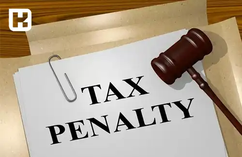

## بخشودگی جرایم قابل بخشش مالیاتی طبق مقررات ماده 191

سازمان امور مالیاتی کشور در راستای تکریم و ترغیب مؤدیان به انجام تکالیف قانونی، به مناسبت دهه فجر اقدام به بخشودگی جرایم قابل بخشش مالیاتی و عوارض طبق مقررات ماده 191 قانون مالیات‌های مستقیم نمود. این اقدام ضمن تقدیر از مودیان شریف، موجب تشویق آنان در پرداخت به موقع بدهی‌ها و کاهش بار مالی آنان می‌شود.

طبق این مصوبه، مودیانی که تا پایان بهمن ماه سال جاری نسبت به پرداخت بدهی اقدام کنند، از بخشودگی جرایم طبق دستورالعمل پیوشت شده برخوردار می گردند.

<blockquote style="background-color:#f5f5f5; padding:0.5rem">

<strong>آشنایی با <a href="https://www.hooshkar.com/Software/Sayan/Module/TpTaxGov" target="_blank">نرم افزار واسط سامانه مودیان
</a> سایان</strong>
</blockquote>

