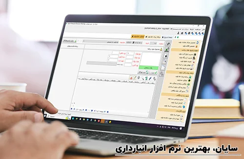

<blockquote style="background-color:#eeeefc; padding:0.5rem">

  
آنچه در این مطلب خواهید خواند:

  <ul>
    <li>نرم افزار مدیریت انبار چیست؟</li>
    <li>اهمیت نرم‌افزارهای انبارداری در مدیریت زنجیره تأمین</li>
    <li>معرفی بهترین نرم‌افزارهای انبارداری خارجی</li>
    <ul>
      <li>NetSuite WMS</li>
      <li>Fishbowl Inventory</li>
      <li>Zoho Inventory</li>
      <li>SAP Extended Warehouse Management (EWM)</li>
      <li>Odoo Inventory</li>
    </ul>
    <li>جایگزین نرم‌افزارهای خارجی؛ معرفی کامل نرم‌افزار انبارداری سایان</li>
  </ul>

</blockquote>

در این مقاله قصد داریم تا با معرفی لیستی از بهترین نرم‌افزارهای انبارداری خارجی، نگاهی اجمالی به کاربردها و قابلیت‌های آن‌ها داشته باشیم تا بتوانیم گزینه مناسبی را برای نیازهای سازمان خود انتخاب کنیم. در پایان نیز، یک نرم‌افزار ایرانی قابل رقابت با نمونه‌های بین‌المللی معرفی می‌شود.

## نرم افزار مدیریت انبار چیست؟

نرم‌افزار انبارداری به عنوان یک پلتفرم یا سیستم مدیریت انبار در زمینه لجستیک تلقی می‌شود که برای مشاهده، ردیابی و مدیریت کل موجودی یک کسب‌وکار از لحظه ورود مواد به انبار تا تحویل محصولات به مشتریان در فروشگاه‌ها به کار می‌رود. این ابزارها نقش حیاتی در کاهش خطای انسانی، افزایش سرعت پردازش سفارش‌ها و مدیریت هزینه‌ها ایفا می‌کنند.

## اهمیت نرم‌افزارهای انبارداری در مدیریت زنجیره تأمین

انبارها به عنوان بخشی اساسی از زنجیره تأمین، وظیفه نگهداری و مدیریت کالاها از مرحله تأمین تا توزیع را بر عهده دارند. مدیریت ضعیف انبار می‌تواند منجر به موجودی‌های مازاد، کمبود ناگهانی کالا، تأخیر در ارسال سفارش‌ها و در نهایت از دست رفتن مشتریان شود.
استفاده از نرم‌افزار انبارداری باعث می‌شود:

- ردیابی کالاها به صورت لحظه‌ای انجام شود
- مدیریت چند انباره ساده شود
- از اشتباهات دستی جلوگیری شود
- ارتباط با سایر ماژول‌های ERP یا مالی برقرار باشد

<blockquote style="background-color:#f5f5f5; padding:0.5rem">
  
<strong>برای آشنایی بیشتر با نرم‌افزارهای مالی و انتخاب بهترین گزینه، مطالعه مقاله جامع 
    <a href="https://www.hooshkar.com/Wiki/Financial/ComparisonFinancialSoftware" target="_blank">
      مقایسه نرم افزارهای حسابداری
    </a> 
    را به شما پیشنهاد می‌کنیم.
  </strong>

</blockquote>

## معرفی بهترین نرم‌افزارهای انبارداری خارجی

در ادامه، با ۵ نرم‌افزار برتر انبارداری جهانی آشنا می‌شوید که بسیاری از کسب‌وکارهای بین‌المللی از آن‌ها بهره می‌برند:

### ۱. NetSuite WMS
یکی از جامع‌ترین سیستم‌های مدیریت انبار ابری (Cloud-based) است که توسط شرکت Oracle ارائه شده. این نرم‌افزار مناسب کسب‌وکارهایی است که فرآیندهای پیچیده دارند.
ویژگی‌ها:

- مدیریت خودکار ورود/خروج کالا
- برنامه‌ریزی دقیق برای انبارگردانی
- هماهنگی کامل با سایر ماژول‌های NetSuite ERP
- رابط کاربری حرفه‌ای و گزارش‌گیری پیشرفته

### ۲. Fishbowl Inventory
نرم‌افزاری بسیار محبوب در بین شرکت‌های کوچک و متوسط که به دنبال یکپارچه‌سازی انبار با حسابداری هستند.
ویژگی‌ها:

- ادغام کامل با QuickBooks
- پشتیبانی از بارکد، مدیریت چند انباره
- مناسب برای تولیدکنندگان، توزیع‌کنندگان و خرده‌فروشی‌ها
- داشبورد ساده و آموزشی برای کاربران تازه‌کار

### ۳. Zoho Inventory
بخشی از خانواده Zoho، برای مدیریت سفارش‌ها، خرید، فروش و انبار، به‌ویژه مناسب کسب‌وکارهای آنلاین.
ویژگی‌ها:

- اتصال به فروشگاه‌های Shopify و Amazon
- سیستم هشدار سطح موجودی
- ردیابی بسته‌ها و سفارش‌ها در زمان واقعی
- قیمت‌گذاری مقرون‌به‌صرفه برای استارتاپ‌ها

### ۴. SAP Extended Warehouse Management (EWM)
ابزار فوق‌پیشرفته برای شرکت‌های بزرگ، که در دل سیستم SAP ERP قرار گرفته و مناسب برای انبارهای بسیار بزرگ و زنجیره تأمین بین‌المللی است.
ویژگی‌ها:

- مدیریت کاملاً خودکار و هوشمند موجودی
- پشتیبانی از عملیات انبار پیشرفته (Cross-Docking، Wave Picking و...)
- قابلیت اتصال به دستگاه‌های ردیابی RFID
- مقیاس‌پذیری بسیار بالا

### ۵. Odoo Inventory
بخشی از پلتفرم متن‌باز Odoo ERP، بسیار مناسب برای کسب‌وکارهایی که نیاز به سفارشی‌سازی بالا دارند.
ویژگی‌ها:

- پشتیبانی از چند انبار، چند واحد، و چند مکان
- اتصال کامل با حسابداری، فروش و خرید
- طراحی ساده و قابل توسعه برای کسب‌وکارهای محلی
- قابل نصب بر روی سرور اختصاصی یا ابری

## جایگزین نرم‌افزارهای خارجی؛ معرفی کامل نرم‌افزار انبارداری سایان

در کنار تمام راهکارهای خارجی، اگر به دنبال یک نرم‌افزار بومی، اقتصادی و کاملاً یکپارچه با نیازهای کسب‌وکار ایرانی هستید، <a href="https://www.hooshkar.com/Software/Sayan/Module/Inventory" target="_blank">نرم افزار انبارداری سایان</a> یکی از بهترین گزینه‌هاست.

شما می توانید موارد مطرح در انبارداری مانند انواع عملیات انبار،
دسترسی ها، مرور گردش کالا به تفکیک گروه بندی های انجام شده، انبارگردانی و... را در این نرم افزار به شکلی
شخصی سازی کنید که با نیازهای کسب و کار خود بیشترین تطابق را داشته باشد.

- شخصی سازی نرم افزار متناسب با نوع کسب و کار شما
- ساماندهی دقیق از ورود و خروج کالاها
- اطلاعات جامع از موجودی
- محاسبه و ثبت سند حسابداری
- ردیابی دقیق سفارشات و تحویلات
- بارکدهای پارامتریک و چند واحدی
- کنترل هزینه های نگهداری
- مرور بهای کالاها
- گزارش گیری سریع
- ارتباط سهولت‌بخش با سایر سیستم‌ها
- کاربری ساده و پشتیبانی فنی قوی
- و...

**قیمت پایه از 16.500.000 تومان و با توجه به امکانات جانبی این قیمت افزایش پیدا می کند**

### جمع‌بندی

نرم‌افزارهای انبارداری جهانی مانند NetSuite، Fishbowl، Zoho، SAP و Odoo امکانات پیشرفته‌ای برای سازمان‌های بزرگ و بین‌المللی فراهم می‌کنند. اما برای کسب‌وکارهای داخلی که به دنبال پشتیبانی بومی، هزینه کمتر و تطبیق با فرآیندهای خاص بازار ایران هستند، نرم‌افزاری مانند سایان یک انتخاب هوشمندانه، امن و حرفه‌ای خواهد بود.

در خاتمه، از شما که تا پایان این مقاله <a href="https://www.hooshkar.com" target="_blank">هوشکار پرداز</a> را همراهی کردید، قدردانی می‌کنیم. امیدواریم محتوای ارائه شده برایتان سودمند بوده و از آن بهره برده باشید. دریافت نظرات و پیشنهادات شما مایه خرسندی ماست.