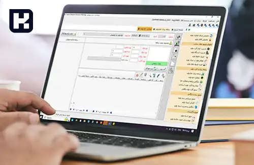

**راهنمای مطالب**
- [ویژگی های نرم افزار انبارداری](#ویژگی-های-نرم-افزار-انبارداری)
- [چرا سایان جزء بهترین نرم افزار های انبارداری است؟](#چرا-سایان-جزء-بهترین-نرم-افزار-های-انبارداری-است؟)

##  ویژگی های نرم افزار مدیریت انبار

**1. سهولت استفاده:** واسط کاربری ساده و کاربرپسند می‌تواند به کاربران کمک کند تا به سرعت با نرم افزار آشنا شوند و بدون نیاز به آموزش‌های طولانی و پیچیده، بتوانند از تمامی ویژگی‌های نرم افزار بهره‌برداری کنند.

**2. ارتباط با سیستم‌های دیگر:**  یک نرم افزار انبارداری و مدیریت انبار خوب، باید قابلیت ارتباط با سیستم‌های دیگر مانند سیستم های حسابداری، فروش و مدیریت مشتری را داشته باشد تا بتواند به یکپارچگی و هماهنگی بهتری بین بخش‌های مختلف یک سازمان دست یابد.

**3. سفارشی سازی:** برنامه انبارداری باید دارای قابلیت سفارشی سازی براساس نیازهای سازمان باشد تا کاربران بتوانند به سرعت و به صورت مشخص بر روی عملکرد انبار خود نظارت داشته باشند. 

<blockquote style="background-color:#f5f5f5; padding:0.5rem">
مطلب پیشنهادی: بررسی <a href="https://www.hooshkar.com/Wiki/Financial/ComparisonFinancialSoftware" target="_blank"> بهترین نرم افزار های حسابداری</a></blockquote>

**4. گزارش‌دهی و آنالیز:** سیستم انبارداری باید قابلیت تولید گزارش‌ها و آنالیزهای جامع درباره موجودی‌ها، سفارشات، ورودی و خروجی کالاها، عملکرد انبار و دیگر اطلاعات مرتبط را داشته باشد. این قابلیت می‌تواند به مدیران و کاربران نرم افزار کمک کند تا تصمیمات بهتری بر اساس آمار و اطلاعات قابل استناد بگیرند.

**5. مدیریت موجودی:** یک نرم افزار انبارداری حرفه ای باید بتواند موجودی کالاها و محصولات را به صورت دقیق و جامع مدیریت کند، از جمله دریافت و فروش کالاها، انتقال موجودی بین انبارها، ثبت و جستجوی اطلاعات مربوط به موجودی و انجام عملیات‌های مربوط به موجودی نظیر بازگشت کالا و ضایعات.

**6. پیگیری سفارشات:** این ویژگی به نرم افزار امکان می‌دهد تا سفارشات مشتریان را پیگیری و مدیریت کند، از جمله ثبت سفارشات جدید، بررسی و تایید سفارشات، تنظیم تاریخ تحویل سفارشات و پیگیری وضعیت سفارشات تا تحویل به مشتری.

**7. پشتیبانی از بارکد:** قابلیت خواندن و مدیریت بارکدها به کمک دستگاه‌های بارکد خوان، می‌تواند فرایندهای انبارگردانی را تسهیل کند و دقت و سرعت در انجام عملیات‌ها را افزایش دهد، از جمله دریافت و تحویل کالاها، بررسی موجودی و ثبت عملیات‌های مختلف.

**8. قابلیت انطباق و توسعه‌پذیری:** نرم افزار انبارداری باید قابلیت انطباق و توسعه‌پذیری با نیازها و تغییر‌های سازمانی و تجاری مختلف را داشته باشد تا با تغییرات آینده، به راحتی قابل ارتقاء و اصلاح باشد.

**9. پشتیبانی فنی و به‌روزرسانی:** نرم افزار انبارداری باید از پشتیبانی فنی مناسب برخوردار بوده و به‌روزرسانی‌های مداوم و به موقع را ارائه دهد تا از نقصان امنیتی و عملکردی جلوگیری شود.

<blockquote style="background-color:#f5f5f5; padding:0.5rem">
مطلب پیشنهادی: ویژگی های <a href="https://www.hooshkar.com/Wiki/Financial/TheBestCostAccountingSoftware" target="_blank">بهترین نرم افزار قیمت تمام شده</a></blockquote>

به طور کلی، بهترین نرم افزار انبارداری باید دارای ویژگی‌هایی باشد که به بهبود کارایی، دقت، سرعت و امنیت در مدیریت انبار و موجودی‌ها کمک کند و با نیازها و الزامات سازمان‌ها و تجارب تجاری مختلف سازگار باشد.

## چرا سایان جزء بهترین نرم افزار های انبارداری است؟

سایان، <a href="https://www.hooshkar.com/Software/Sayan/Module/Inventory" target="_blank">بهترین نرم افزار انبارداری</a> است که با ویژگی‌های برتر و عملکرد بی‌نظیر خود، به سازمان‌ها کمک می‌کند تا عملیات مدیریت انبار و موجودی را بهبود بخشند.

این نرم افزار با استفاده از روش‌های پیشرفته، قابلیت‌های بیشماری را در اختیار کاربران خود قرار می‌دهد. ساماندهی دقیقی از ورود و خروج کالاها، اطلاعات جامعی در مورد موجودی، ردیابی دقیق سفارشات و تحویلات، گزارشگیری سریع و ارتباط سهولت‌بخش با سایر سیستم‌ها از جمله ویژگی‌های برجسته سایان می‌باشند.

با استفاده از انبارداری سایان، سازمان‌ها قادر خواهند بود عملکرد خود را بهبود داده، هزینه‌ها را کاهش دهند و به صورت بهینه موجودی‌ها را مدیریت کنند. 

این نرم افزار با کاربری ساده و پشتیبانی فنی قوی، به عنوان انتخابی برتر برای سازمان‌هایی که به دنبال نرم افزار انبارداری قدرتمند و کارآمد هستند، مطرح می‌باشد.

[ویژگی های نرم افزار انبارداری]: #ویژگی-های-نرم-افزار-انبارداری
[سایان بهترین نرم افزار انبارداری]: #سایان-بهترین-نرم-افزار-انبارداری

