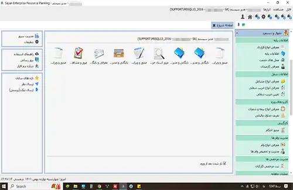
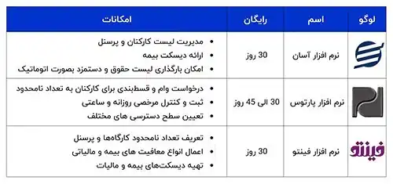

<blockquote style="padding:0.5rem; margin-top:0.5rem;">
  

    
آنچه در این مطلب خواهید خواند:

    <ul>
      <li>انواع نرم‌افزارهای محاسبه حقوق و دستمزد
        <ul>
          <li>نرم‌افزارهای پیش‌ساخته</li>
          <li>نرم‌افزارهای سفارشی‌سازی‌شده</li>
        </ul>
      </li>
      <li>معرفی بهترین نرم‌افزار حقوق و دستمزد ایرانی</li>
      <li>معرفی بهترین نرم‌افزارهای حقوق و دستمزد خارجی
        <ul>
          <li>نرم‌افزار ADP</li>
          <li>نرم‌افزار Gusto</li>
          <li>نرم‌افزار Paychex</li>
          <li>نرم‌افزار Zenefits</li>
          <li>نرم‌افزار Deel</li>
        </ul>
      </li>
      <li>مقایسه نرم‌افزارهای ایرانی و خارجی</li>
      <li>نرم‌افزارهای رایگان حقوق و دستمزد</li>
      <li>نکات کلیدی در انتخاب نرم‌افزار حقوق و دستمزد</li>
      <li>سوالات متداول</li>
      <li>جمع‌بندی</li>
    </ul>
  

</blockquote>

مدیریت دقیق حقوق و دستمزد، یکی از ستون‌های اصلی موفقیت منابع انسانی در هر سازمان است. انتخاب نرم‌افزار مناسب برای این کار، نه‌تنها باعث صرفه‌جویی در زمان و کاهش خطاهای انسانی می‌شود، بلکه به شفافیت مالی و رضایت کارکنان نیز کمک می‌کند. اما با توجه به تنوع گزینه‌ها، از نرم‌افزارهای رایگان گرفته تا سامانه‌های تجاری و اختصاصی، سازمان‌ها باید بر اساس نیازها، منابع و ساختار خود، بهترین انتخاب را داشته باشند. در ادامه، انواع نرم‌افزارهای حقوق و دستمزد و نکات کلیدی برای انتخاب صحیح آن‌ها بررسی می‌شود.

## انواع نرم افزارهای محاسبه حقوق و دستمزد

نیازها و منابع سازمان‌ها تعیین می‌کنند که آنها باید به سراغ نرم‌افزارهای رایگان بروند یا برای تهیه نرم‌افزارهای تجاری و حرفه‌ای، بودجه‌ای را اختصاص دهند.

نرم افزارهای حرفه ای و تخصصی، به دو صورت در بازار موجود هستند:

**نوع اول،** نرم افزاری است که با پیش‌فرض‌های خاص، برای مشاغل مختلف طراحی و ساخته شده‌است. شما می‌توانید به راحتی نرم افزار را خریداری کنید و از کلیه‌ی امکانات آن استفاده نمایید.

**نوع دوم،** نرم افزارهایی هستند که به صورت اختصاصی برای شرکت شما و با توجه به نیازهای شما شخصی سازی می‌شوند. در هر زمان هم که نیاز داشته باشید، برنامه‌نویسان آماده‌ی توسعه‌ی نرم‌ افزار شما هستند.

## معرفی <a href="https://www.hooshkar.com/Software/Sayan/Module/Payroll" target="_blank">بهترین نرم افزار حقوق و دستمزد ایرانی</a>

حقوق و دستمزد سایان، یکی از نرم افزارهای کاربردی شرکت هوشکار
 در حوزه منابع انسانی است که به منظور ساده‌سازی محاسبات پیچیده حقوق و دستمزد طراحی و تولید شده است.

**ویژگی‌ها و قابلیت‌های این نرم افزار:**

- محاسبه دقیق و سریع انواع حقوق، کسورات و مالیات‌ها
- امکان محاسبه عیدی، پاداش، حق مرخصی و سایر مزایا
- صدور خودکار فیش حقوقی و سایر گزارشات مورد نیاز
- تهیه لیست بیمه و مالیات
- یکپارچگی با نرم افزار حضور و غیاب جهت کاهش حجم کاری
- انعطاف‌پذیری بالا در تعریف انواع فرمول‌های محاسباتی
- گزارش‌گیری آسان و قدرتمند جهت تحلیل آماری
- رابط کاربری ساده و دوستانه
- و بسیاری قابلیت های دیگر

**قیمت پایه از 25.500.000 تومان شروع می شود و با توجه به امکانات جانبی امکان افزایش قیمت وجود دارد.**

<blockquote style="padding:1rem; border-right:4px solid #ff9900; margin-top:1rem;">
  
<strong>نکته طلایی:</strong> اگر سازمان شما چند شعبه دارد، نرم‌افزار سایان امکان تجمیع اطلاعات پرسنل در تمام شعب را فراهم می‌کند و گزارش‌های یکپارچه مدیریتی ارائه می‌دهد — بدون نیاز به وارد کردن مجدد اطلاعات.

</blockquote>

## معرفی بهترین نرم‌افزارهای حقوق و دستمزد خارجی

### ۱. ADP
یکی از شناخته‌شده‌ترین نرم‌افزارهای حقوق و دستمزد در سطح جهان است که برای شرکت‌های بزرگ، چندملیتی و با ساختار پیچیده مناسب است.

ویژگی‌ها:

- پردازش حقوق در چند کشور و ارز مختلف
- ابزارهای پیشرفته تحلیل منابع انسانی
- امنیت بالا و انطباق با قوانین مالیاتی جهانی
- مناسب برای: سازمان‌های بزرگ با شعب بین‌المللی

### ۲. Gusto
یک گزینه کاربرپسند برای استارتاپ‌ها و شرکت‌های کوچک تا متوسط در آمریکاست.

ویژگی‌ها:

- محاسبه حقوق، مالیات، بیمه و مزایا
- یکپارچه با نرم‌افزارهای حسابداری مانند QuickBooks
- رابط کاربری ساده و جذاب
- مناسب برای: شرکت‌های کوچک و متوسط

### ۳. Paychex
راهکاری جامع برای حقوق، منابع انسانی و بیمه.

ویژگی‌ها:

- اتوماسیون کامل حقوق و مالیات
- داشبورد مدیریتی و گزارش‌گیری دقیق
- خدمات مشاوره HR
- مناسب برای: کسب‌وکارهای متوسط تا بزرگ

### ۴. Zenefits
تمرکز بر منابع انسانی و خدمات حقوقی، مناسب برای تیم‌های HR حرفه‌ای.

ویژگی‌ها:

- مدیریت مزایا و عملکرد کارکنان
- همگام با قوانین جدید ایالتی/فدرال آمریکا
- ابزارهای آنالیز حقوق و مزایا
- مناسب برای: تیم‌های HR و شرکت‌های مدرن

### ۵. Deel
طراحی‌شده برای پرداخت حقوق به کارکنان دورکار و فریلنسرها در سراسر جهان.

ویژگی‌ها:

- پرداخت بین‌المللی با رعایت قوانین هر کشور
- قراردادهای استاندارد جهانی
- پشتیبانی از چند زبان و ارز
- مناسب برای: استارتاپ‌های بین‌المللی و ریموت بیس

<blockquote style="background-color:#f9f9ff; padding:1rem; border-right:4px solid #7066f1; margin-top:1rem;">
  
<strong>مقایسه سریع نرم‌افزارهای حقوق و دستمزد ایرانی و خارجی</strong>

  <table style="width:100%; border-collapse:collapse; font-size:0.85rem; min-width:900px;">
    <thead>
      <tr>
        <th style="padding:0.6rem; text-align:right;">ویژگی‌ها</th>
        <th style="padding:0.6rem; text-align:right;">سایان</th>
        <th style="padding:0.6rem; text-align:right;">سپیدار</th>
        <th style="padding:0.6rem; text-align:right;">آرین‌سیستم</th>
        <th style="padding:0.6rem; text-align:right;">ADP</th>
        <th style="padding:0.6rem; text-align:right;">Gusto</th>
        <th style="padding:0.6rem; text-align:right;">Deel</th>
      </tr>
    </thead>
    <tbody>
      <tr>
        <td style="padding:0.5rem;">پشتیبانی فارسی</td>
        <td>✅</td>
        <td>✅</td>
        <td>✅</td>
        <td>❌</td>
        <td>❌</td>
        <td>❌</td>
      </tr>
      <tr>
        <td style="padding:0.5rem;">قیمت و هزینه پیاده‌سازی</td>
        <td>متوسط</td>
        <td>متوسط</td>
        <td>متوسط</td>
        <td>خیلی بالا</td>
        <td>بالا</td>
        <td>متوسط</td>
      </tr>
      <tr>
        <td style="padding:0.5rem;">سازگاری با قوانین بیمه و مالیات ایران</td>
        <td>کامل</td>
        <td>کامل</td>
        <td>کامل</td>
        <td>❌</td>
        <td>❌</td>
        <td>❌</td>
      </tr>
      <tr>
        <td style="padding:0.5rem;">مناسب برای کسب‌وکارهای</td>
        <td>متوسط تا بزرگ</td>
        <td>کوچک</td>
        <td>متوسط تا بزرگ</td>
        <td>بزرگ</td>
        <td>کوچک تا متوسط</td>
        <td>استارتاپ‌های بین‌المللی</td>
      </tr>
    </tbody>
  </table>
  

    🔹 همان‌طور که مشاهده می‌شود،
    <a href="https://www.hooshkar.com/Software/Sayan/Module/Payroll" target="_blank">نرم‌افزار حقوق و دستمزد سایان</a>
    با پوشش کامل قوانین بیمه و مالیات ایران و هزینه پایین‌تر نسبت به نمونه‌های خارجی، گزینه‌ای بهینه برای شرکت‌های ایرانی محسوب می‌شود.
  

</blockquote>

## لیست برخی از نرم افزارهای رایگان حقوق دستمزد

مهم نیست ابعاد کسب و کار شما کوچک است یا بزرگ، در نهایت، با محاسبه حقوق و مزایای پرسنل سر و کار خواهید داشت. در این راستا نرم افزارهای مختلفی بصورت رایگان و پولی وجود دارند. در ادامه به بررسی آنها می‌پردازیم.

- چطور می توانیم به نرم افزارهای رایگان دسترسی داشته باشیم؟
شما به راحتی می‌توانید این نرم افزارهای رایگان را که توسط مجموعه‌های مختلف طراحی شده اند، از سایت‌های معتبر دانلود کنید.
اگر قصد دارید روی گوشی همراهتان این اپ کاربردی را داشته باشید، می‌توانید به برنامه بازار یا سیب سری بزنید.

- آیا نرم افزاری که کاملا رایگان باشد، وجود دارد؟ خیر

- آیا دسترسی به امکانات نرم افزارهای رایگان نامحدود است؟ خیر، هیچ نرم افزار رایگانی، به شما دسترسی و امکانات کامل و گسترده را نخواهد داد.

**نام برخی از نرم افزارهای رایگان + برخی از امکانات آنها:**

<blockquote style="padding:1rem; border-right:4px solid #4285f4;">
  
<strong>در انتخاب تردید دارید؟</strong>

  
اگر بین چند نرم‌افزار مردد هستید، کافی است با کارشناسان ما تماس بگیرید تا 
  براساس نوع کسب‌وکارتان، مناسب‌ترین گزینه را معرفی کنند.

  
<a href="https://wa.me/989120259585" target="_blank" style="color:#4285f4;">درخواست مشاوره رایگان</a>

</blockquote>

### نکات کلیدی در انتخاب نرم‌افزار حقوق و دستمزد

انتخاب نرم‌افزار مناسب برای مدیریت حقوق و دستمزد یکی از تصمیمات حیاتی برای هر سازمان است. در این بخش، مهم‌ترین معیارهایی که باید هنگام انتخاب در نظر گرفته شوند، بررسی شده‌اند:

#### ۱. قابلیت تعریف پارامترهای متنوع برای کارکنان
نرم‌افزار باید امکان تعریف انواع وضعیت‌های استخدامی، بیمه‌ها، معافیت‌ها، مزایا، و آیتم‌های متغیر را داشته باشد تا بتواند محاسبات دقیق و متناسب با ساختار سازمان ارائه دهد.

#### ۲. انعطاف‌پذیری در طراحی فرمول‌های محاسباتی
یک نرم‌افزار قدرتمند باید توانایی تعریف فرمول‌های سفارشی برای انواع پرداخت‌ها، کسورات، معوقات و مالیات‌ها را داشته باشد. این ویژگی در مواجهه با تغییرات قوانین مالیاتی و استخدامی بسیار کاربردی است.

#### ۳. قابلیت یکپارچه‌سازی با سیستم‌های دیگر
یکپارچگی با ماژول‌هایی مانند حضور و غیاب، <a href="https://www.hooshkar.com/Software/Sayan/Module/Accounting" target="_blank">حسابداری</a>، منابع انسانی و مالیات از ضروریات نرم‌افزار حقوق و دستمزد است. این ویژگی باعث کاهش خطا و صرفه‌جویی در زمان می‌شود.

#### ۴. امکانات کنترلی و امنیتی
وجود قابلیت‌هایی مانند سطوح دسترسی، ثبت گزارش تغییرات و قفل‌گذاری دوره‌های مالی کمک می‌کند تا اطلاعات حساس کارکنان از دسترسی غیرمجاز محافظت شوند.

#### ۵. مدیریت معوقات و محاسبات دوره‌های گذشته
امکان محاسبه خودکار معوقات حقوقی به‌دلیل اصلاح احکام یا تأخیر در ثبت عملکرد ماه‌های قبل، یکی از ویژگی‌های مهم برای جلوگیری از خطاهای مالی است.

#### ۶. پشتیبانی از قوانین بیمه و مالیات ایران
نرم‌افزار باید با آخرین تغییرات مقررات بیمه و مالیات ایران هماهنگ باشد و بتواند خروجی‌های لازم برای اداره کار، سازمان تأمین اجتماعی و دارایی را به‌درستی ارائه دهد.

#### ۷. تولید فیش حقوقی و گزارش‌های متنوع
تولید خودکار فیش‌های حقوقی، لیست‌های بیمه، فایل‌های پرداخت بانکی و گزارش‌های مدیریتی قابل تحلیل باید به سادگی در نرم‌افزار در دسترس باشد.

#### ۸. تجربه کاربری آسان
رابط کاربری باید ساده، قابل فهم و بدون نیاز به آموزش پیچیده باشد تا تیم منابع انسانی بتواند با حداقل خطا و بیشترین سرعت عملیات را انجام دهد.

#### ۹. قابلیت پشتیبانی و توسعه نرم‌افزار
مهم است که ارائه‌دهنده نرم‌افزار بتواند در کوتاه‌ترین زمان ممکن پشتیبانی مؤثر و به‌روزرسانی‌های لازم را ارائه دهد و امکان توسعه بر اساس نیازهای سازمان را فراهم کند.

<blockquote style="padding:1rem; border-right:4px solid #f4b400; margin-top:1rem;">
  
<strong>راهنمای سریع انتخاب نرم‌افزار حقوق و دستمزد مناسب</strong>

  <ul style="line-height:1.8;">
    <li>✅ اندازه شرکت خود را مشخص کنید (کوچک / متوسط / بزرگ)</li>
    <li>✅ بررسی کنید آیا نرم‌افزار با قوانین بیمه و مالیات ایران سازگار است</li>
    <li>✅ مطمئن شوید امکان تعریف فرمول‌ها و مزایای سفارشی وجود دارد</li>
    <li>✅ هزینه پشتیبانی و به‌روزرسانی را مقایسه کنید</li>
    <li>✅ در صورت نیاز به یکپارچگی با سیستم حسابداری یا حضور و غیاب، گزینه‌های سازگار را انتخاب کنید</li>
  </ul>
</blockquote>

---

### سوالات متداول

<blockquote style="padding:0.5rem">
  

    
نرم‌افزار حقوق و دستمزد چیست و چرا استفاده از آن اهمیت دارد؟
 
    این نرم‌افزارها برای محاسبه دقیق حقوق، مزایا، کسورات، مالیات و بیمه طراحی شده‌اند و با کاهش خطاهای انسانی، سرعت و دقت فرآیندهای مالی را افزایش می‌دهند.
  

</blockquote>

<blockquote style="padding:0.5rem; margin-top:0.5rem;">
  

    
نرم‌افزار حقوق و دستمزد سایان برای چه سازمان‌هایی مناسب است؟
 
    این نرم‌افزار برای انواع شرکت‌ها از جمله سازمان‌های تولیدی، خدماتی، پیمانکاری و آموزشی با تعداد پرسنل مختلف مناسب است و قابلیت انعطاف بالایی دارد.
  

</blockquote>

<blockquote style="padding:0.5rem; margin-top:0.5rem;">
  

    
آیا نرم‌افزارهای خارجی حقوق و دستمزد در ایران قابل استفاده هستند؟
 
    بله، اما معمولاً به دلیل قیمت بالا، عدم پشتیبانی فارسی، پیچیدگی پیاده‌سازی و ناسازگاری با قوانین بیمه و مالیات ایران، استفاده از آن‌ها در ایران چالش‌برانگیز است. نرم‌افزارهای ایرانی مانند سایان این مشکلات را برطرف کرده‌اند.
  

</blockquote>

<blockquote style="padding:0.5rem; margin-top:0.5rem;">
  

    
چه تفاوتی بین نرم‌افزار حقوق و دستمزد و نرم‌افزار منابع انسانی وجود دارد؟
 
    نرم‌افزار حقوق و دستمزد بر محاسبه حقوق، مزایا، بیمه و مالیات تمرکز دارد، در حالی که نرم‌افزار منابع انسانی مجموعه‌ای گسترده‌تر شامل جذب، ارزیابی، آموزش و مدیریت عملکرد کارکنان را پوشش می‌دهد.
  

</blockquote>

<blockquote style="padding:0.5rem; margin-top:0.5rem;">
  

    
آیا نرم‌افزار سایان قابلیت سفارشی‌سازی دارد؟
 
    بله، این نرم‌افزار با ساختار ماژولار و انعطاف‌پذیر خود، امکان تعریف فرمول‌های خاص، ساخت گزارش‌های سفارشی و تطبیق با ساختار سازمانی را به مدیران می‌دهد.
  

</blockquote>

<blockquote style="padding:0.5rem; margin-top:0.5rem;">
  

    
پشتیبانی و آموزش نرم‌افزار سایان چگونه ارائه می‌شود؟
 
    تیم پشتیبانی سایان خدمات کامل شامل نصب، آموزش، پاسخ‌گویی تلفنی و تیکتینگ و همچنین توسعه نرم‌افزار بر اساس نیاز مشتری را ارائه می‌دهد.
  

</blockquote>

<blockquote style="padding:0.5rem; margin-top:0.5rem;">
  

    
چطور می‌توانیم به نرم افزارهای رایگان دسترسی داشته باشیم؟
 
    شما می‌توانید نرم‌افزارهای رایگان ارائه‌شده توسط مجموعه‌های مختلف را از وب‌سایت‌های معتبر دانلود کنید. همچنین برخی نسخه‌ها از طریق اپلیکیشن‌های بازار و سیب برای گوشی‌های همراه در دسترس هستند.
  

</blockquote>

<blockquote style="padding:0.5rem; margin-top:0.5rem;">
  

    
آیا نرم‌افزاری که کاملا رایگان باشد، وجود دارد؟
 
    خیر؛ هیچ نرم‌افزاری که کاملاً رایگان و بدون محدودیت باشد در بازار وجود ندارد.
  

</blockquote>

<blockquote style="padding:0.5rem; margin-top:0.5rem;">
  

    
آیا دسترسی به امکانات نرم افزارهای رایگان نامحدود است؟
 
    خیر؛ نرم‌افزارهای رایگان معمولاً دارای محدودیت‌هایی در امکانات و دسترسی هستند.
  

</blockquote>

---

### جمع بندی

هر سازمانی بسته به فعالیت‌ها، ساختار و فرایندهای داخلی خود، نیازمندی‌ها و خواسته‌های متفاوتی دارد. بنابراین انتخاب نهایی نرم‌افزار باید بر اساس بررسی دقیق نیازها و اولویت‌بندی آن‌ها در هر سازمان صورت پذیرد تا بتواند به بهترین شکل نیازها را پوشش دهد.

برای ساده‌سازی فرآیند حقوق و دستمزد و حذف خطاهای دستی، همین حالا با کارشناسان <a href="https://www.hooshkar.com" target="_blank">هوشکار پرداز</a> تماس بگیرید و از مشاوره رایگان استفاده کنید تا راهکار مناسب کسب‌وکار خود را انتخاب کنید.