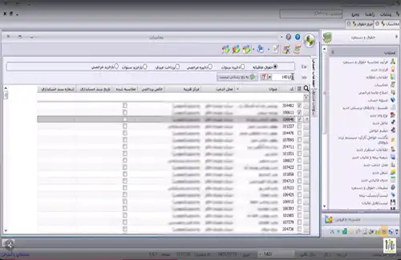

<blockquote style="background-color:#eeeefc; padding:0.5rem">
آنچه در این مطلب خواهید خواند:

- [نرم افزار حقوق و دستمزد سایان](#نرم-افزار-حقوق-و-دستمزد-سایان)
- [نرم افزار حقوق دستمزد سپیدار](#نرم-افزار-حقوق-دستمزد-سپیدار)
- [نرم افزار حقوق دستمزد فرداد](#نرم-افزار-حقوق-دستمزد-فرداد)
- [نرم افزار حقوق دستمزد هلو](#نرم-افزار-حقوق-دستمزد-هلو)
- [نرم افزار حقوق دستمزد پارمیس](#نرم-افزار-حقوق-دستمزد-پارمیس)
- [نرم افزار حقوق دستمزد شایگان](#نرم-افزار-حقوق-دستمزد-شایگان)
- [نرم افزار حقوق دستمزد میزان](#نرم-افزار-حقوق-دستمزد-میزان)
- [نرم افزار حقوق دستمزد منطق](#نرم-افزار-حقوق-دستمزد-منطق)
- [نتیجه گیری](#نتیجه-گیری)
</blockquote>

**مقدمه**

امروزه مدیریت حقوق و دستمزد کارکنان به یک چالش بزرگ برای سازمان‌ها تبدیل شده است. نه تنها مدیران منابع انسانی باید با قوانین و مقررات پیچیده حقوق و دستمزد آشنا باشند، بلکه باید از نرم‌افزار‌های پیشرفته و کارآمد در این زمینه استفاده کنند تا بتوانند فرآیند محاسبه و پرداخت حقوق و مزایای کارکنان را به روشی دقیق، سریع و کارآمد انجام دهند.

در این مقاله، به معرفی چند مورد از بهترین نرم افزارها در زمینه محاسبه حقوق و دستمزد می پردازیم.

## نرم افزار حقوق و دستمزد سایان

این نرم افزار، یکی از محصولات کاربردی شرکت نرم‌افزاری <a href="https://www.hooshkar.com" target="_blank">هوشکار</a> در حوزه منابع انسانی است که به منظور ساده‌سازی محاسبات پیچیده حقوق و دستمزد طراحی و تولید شده است.

**ویژگی‌ها و قابلیت‌های این نرم افزار:**

- محاسبه دقیق و سریع انواع حقوق، کسورات و مالیات‌ها
- امکان محاسبه عیدی، پاداش، حق مرخصی و سایر مزایا
- صدور خودکار فیش حقوقی و سایر گزارشات مورد نیاز
- تهیه لیست بیمه و مالیات
- یکپارچگی با نرم‌افزار حضور و غیاب جهت کاهش حجم کاری
- انعطاف‌پذیری بالا در تعریف انواع فرمول‌های محاسباتی
- گزارش‌گیری آسان و قدرتمند جهت تحلیل آماری
- رابط کاربری ساده و دوستانه
- و بسیاری قابلیت های دیگر

<blockquote style="background-color:#f5f5f5; padding:0.5rem">

<strong>آشنایی با <a href="https://www.hooshkar.com/Software/Sayan/Module/Payroll" target="_blank">نرم افزار حقوق و دستمزد</a> سایان</strong>
</blockquote>

## نرم افزار حقوق دستمزد سپیدار
حقوق و دستمزد سپیدار یکی از نرم افزار‌های حسابداری است که به شما امکان محاسبه و پرداخت حقوق و مزایای کارکنان را فراهم می‌کند.

**بعضی از ویژگی‌ها و امکانات این نرم‌افزار:**

- ثبت جزئیات و اطلاعات کامل کارکنان
- محاسبه مالیات بر حقوق به چهار روش مختلف
- تهیه دیسکت پرداخت حقوق برای تمامی بانک‌ها
- یکپارچه‌سازی سیستم حقوق و دستمزد سپیدار با سیستم ورود و خروج کارکنان

## نرم افزار حقوق دستمزد فرداد

نرم‌افزار حقوق و دستمزد فرداد عملیاتی چون ثبت اطلاعات پرسنلی، ورود اطلاعات ماهیانه، تعیین فرمول‌های حقوق، اختصاص وام و پس‌انداز، محاسبه حقوق و تهیه گزارشات فیش حقوق را برای شما انجام می‌دهد.

**برخی از ویژگی‌های این نرم‌افزار:**

- محاسبات حقوق، عیدی، سنوات و...
- تعریف مختلف انواع وام و پس‌انداز برای پرسنل
- تعریف متنوع عوامل حقوق و کارکردی و تعیین فرمول برای آن‌ها
- تعیین جدول مالیاتی و سقف عوامل بیمه و عیدی
- ارائه خروجی اکسل از اکثر فرم‌های نرم‌افزار
- امکان وارد کردن اطلاعات از فایل اکسل به بیشتر فرم‌های نرم‌افزار 
- و...

## نرم افزار حقوق دستمزد هلو

نرم‌افزار حقوق و دستمزد هلو کار پرداخت حقوق و مزایای کارکنان شرکت را ساده‌تر می‌کند و امکان گزارشگیری را به راحتی فراهم می‌آورد. این نرم‌افزار نیز به مانند دیگر نرم افزارها قابلیت تهیه فایل‌های بیمه و مالیات حقوق را بر اساس آخرین تغییرات فراهم می‌کند.

**برخی از امکانات این نرم‌افزار:**

- تعریف پرسنل و جزئیات آنها
- ثبت کارکرد کارمندان
- امکان تنظیم مالیات سالیانه
- ثبت و مدیریت مزایا مانند عیدی
- ثبت مرخصی و غیبت پرسنل
- طراحی گزارشات و...

## نرم افزار حقوق دستمزد پارمیس

حقوق و دستمزد پارمیس، توسط شرکت فناوری اطلاعات پارمیس توسعه یافته است. این نرم‌افزار با هدف بهبود دقت و سرعت در محاسبه حقوق و دستمزد پرسنل و تهیه گزارشات قانونی طراحی شده است. در این سیستم، اطلاعات مربوط به پرسنل شامل جزئیات کارکردی و حقوقی به طور جامع مدیریت می‌شود و همچنین قابلیت فرمول‌نویسی در فیش‌های حقوقی نیز فراهم می‌باشد.

**بعضی از امکانات این نرم‌افزار:**

- تعریف نامحدود کارفرما و کارگاه
- امکان تعریف انواع مأموریت
- ورود اطلاعات کارکردی از فایل‌های اکسل
- تعریف و مدیریت دوره‌های کاری و مرخصی‌ها
- تعریف انواع استخدام و صدور فیش حقوقی مبتنی بر آنها
- تعریف وام‌ها، تقسیط و نمایش آنها در فیش حقوقی
- تنظیم اقلام فیش‌ها و فرمول‌نویسی

## نرم افزار حقوق دستمزد شایگان

استفاده از نرم‌افزار حقوق و دستمزد شایگان، توانایی تعریف و تغییر ضرایب حقوق و دستمزد و پارامترهای سازمانی را مانند محل کار، مرکز هزینه، حق اولاد، مسکن و خواروبار، بیمه، جدول مالیاتی، عیدی و... را به‌صورت آسان و سریع فراهم می‌کند.

**چند مورد از ویژگی‌ها و امکانات این نرم‌افزار:**

- نگهداری اطلاعات جامع پرسنلی و شغلی همراه با طراحی فرم‌های کارگزینی و اداری؛ از جمله فیش حقوقی
- محاسبه کامل حقوق و دستمزد ماهانه پرسنل بر اساس جدول مالیاتی سال، همراه با محاسبات دقیق مزایا، اضافات و کسورات و ...
- ساخت لیست بیمه، مالیات و حقوق پرسنل براساس آخرین استانداردها
- تهیه فایل ماهانه لیست حقوق به‌منظور تحویل به سازمان تامین اجتماعی
- ایجاد امکان فراهم‌کردن فایل پرداخت حقوق ماهانه کارکنان از طریق بانک‌ها
- ذخیره سنوات خدمت پرسنل و امکان محاسبه عیدی و پیش‌پرداخت آن
- و...

## نرم افزار حقوق دستمزد میزان

حقوق و دستمزد میزان، اطلاعات مالی مرتبط با بیمه، مالیات و دیسکت تمامی بانک‌ها را در اختیار شما قرار می‌دهد. این نرم‌افزار به شما امکان می‌دهد تا آیتم‌های مختلف فیش حقوقی را به دلخواه خود انتخاب کنید و حتی با استفاده از سرتیتر و فرمول‌های مخصوص، آیتم‌های جدید را به فیش حقوقی کارکنان اضافه کنید. 
محاسبه عیدی و سنوات پرسنل در پایان سال و همچنین محاسبه مطالبات کارکنان در زمان تسویه حساب نیز با یک کلیک ساده در این نرم‌افزار قابل انجام است.

**بعضی از امکانات این نرم‌افزار:**

- خروجی دیسکت بانک‌ها با امکان انتخاب پرسنل
- تقسیم‌بندی کارکنان بر اساس محل کار و واحدهای خدمت
- امکان جمع‌آوری کارکرد پرسنل از دستگاه‌های حضور و غیاب
- انواع استخدام (ساعتی، دائمی، بیمه شده، قراردادی شغل دوم و مشاوره‌ای)
- و...

## نرم افزار حقوق دستمزد منطق

با کمک این نرم‌افزار، کاربر به‌راحتی می‌تواند سیستم پرداختی حقوق خود را بر اساس نیازها و روش محاسبه حقوق خود تنظیم کند. در این نرم‌افزار، تنظیمات مربوط به حقوق، بیمه و مالیات قابلیت شخصی‌سازی دارند.

**برخی از قابلیت های این نرم‌افزار:**

- تعیین مالیات بر اساس جداول حقوقی تعیین‌شده توسط اداره مالیات
- تهیه فایل بیمه و دارایی برای سازمان‌های مربوط با استفاده از استانداردهای مشخص
- پرداخت وام به پرسنل و پرداخت اقساط از حقوق یا به صورت مجزا
- مشاهده ریزحساب و سوابق پرسنل
- دریافت گزارش از دریافتی‌های پرسنل و...

### نتیجه گیری

هر سازمانی بسته به فعالیت‌ها، ساختار و فرایندهای داخلی خود، نیازمندی‌ها و خواسته‌های متفاوتی دارد. بنابراین انتخاب نهایی نرم‌افزار باید بر اساس بررسی دقیق نیازها و اولویت‌بندی آن‌ها در هر سازمان صورت پذیرد تا بتواند به بهترین شکل نیازها را پوشش دهد.

---
امیدواریم این مطلب برای شما مفید واقع شده باشد. 

اگر تا به حال تجربه‌ی استفاده از نرم افزارهای حقوق و دستمزد را نداشته‌اید؟

**با نرم افزار مدیریت حقوق و دستمزد سایان، محاسبه حقوق کارکنان به سادگی چند کلیک خواهد بود. بدون خطا، دقیق و سریع!**

هم اکنون درخواست <a href="https://www.hooshkar.com" target="_blank">دموی رایگان</a> را بفرستید و تجربه ای آسان را بدست آورید.