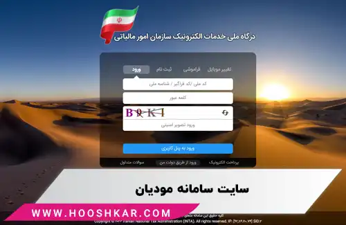
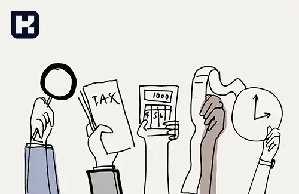

<blockquote style="background-color:#eeeefc; padding:0.5rem">

  
آنچه در این مطلب خواهید خواند:

  <ul>
    <li>سامانه مودیان چیست</li>
    <li>قانون سامانه مودیان مکمل قوانین مالیاتی کشور</li>
    <li>چه کسانی باید در سامانه مودیان مالیاتی ثبت نام کنند</li>
    <li>اهداف اجرای قانون سامانه مودیان مالیاتی چیست</li>
    <li>مزایای سامانه مودیان مالیاتی چیست</li>
    <li>معایب سامانه مودیان مالیاتی چیست</li>
  </ul>

</blockquote>

## سامانه مودیان چیست

**سامانه مودیان مالیاتی** یک سامانه آنلاین است که توسط سازمان مالیاتی کشور برای ارتباط و ارسال اطلاعات بین مالکین و عرضه‌کنندگان خدمات و کالاها (مودیان) با اداره کنندگان مالیات تعبیه شده است. 

این سامانه به طور کلی برای ثبت و پیگیری اطلاعات مالیاتی، اتصال پایانه‌های فروشگاهی و ارسال اظهارنامه مالیاتی توسط مودیان مورد استفاده قرار می‌گیرد.

با استفاده از <a href="https://my.tax.gov.ir/?url_back=https://tp.tax.gov.ir" target="_blank">سامانه مودیان مالیاتی</a>، مودیان می‌توانند اطلاعات مربوط به درآمدها، هزینه‌ها و سایر اطلاعات مربوط به تعهدات مالیاتی خود را به صورت آنلاین و در قالب اظهارنامه مالیاتی وارد کنند و آن را به سازمان مالیاتی ارسال کنند. این سامانه همچنین امکاناتی مانند پرداخت آنلاین مالیات، مشاهده وضعیت مالیاتی و پیگیری وضعیت اظهارنامه مالیاتی را نیز فراهم می‌کند.

<blockquote style="background-color:#f5f5f5; padding:0.5rem">

<strong>آشنایی با <a href="https://www.hooshkar.com/Software/Sayan/Module/TpTaxGov" target="_blank">نرم افزار سامانه مودیان</a> سایان</strong>
</blockquote>

استفاده از سامانه مودیان مالیاتی برای ارسال اظهارنامه مالیاتی و پرداخت آنلاین مالیات به مودیان کمک می‌کند تا به طریقی سریعتر، مطمئن‌تر و امن‌تر اقدامات مالیاتی خود را انجام دهند و تعاملات مالیاتی خود را با سازمان مالیاتی سریع‌تر و موثرتر انجام دهند.

 >  **بند پ ماده 1 قانون پایانه های فروشگاهی و سامانه مودیان، در تعریف سامانه مودیان مالیاتی مقرر داشته:** "سامانه‌ای است، تحت مدیریت سازمان که در آن، به هر مودی، کارپوشه ویژه‌ای اختصاص یافته و تبادل اطلاعات میان مودیان و سازمان، منحصرا از طریق آن کارپوشه انجام می‌شود. مودیان می‌توانند با استفاده از هرگونه سخت افزار یا نرم افزار، اعم از رایانه شخصی، پایانه فروشگاهی، سامانه‌های ابری یا هر وسیله دیگری که حافظه مالیاتی به آن متصل شده باشد، به سامانه مودیان متصل شوند. مرجع نهائی ثبت، صدور و استعلام صورتحساب الکترونیکی، سامانه مودیان می‌باشد."

<blockquote style="background-color:#f5f5f5; padding:0.5rem">

<strong>بیشتر بخوانید: <a href="https://www.hooshkar.com/Wiki/Financial/TrustedCompaniesTaxServices" target="_blank">لیست شرکتهای معتمد مالیاتی</a>
</strong></blockquote>

## قانون سامانه مودیان مکمل قوانین مالیاتی کشور

قانون سامانه مودیان مالیاتی مکملی از قوانین مالیاتی کشور محسوب می‌شود. این قانون به منظور بهبود فرایندهای مالیاتی، کاهش تخلفات مالیاتی و ارتقای نظام مالیاتی کشور، اجرا می‌شود. 

سامانه مودیان مالیاتی، تکمیلی از سایر قوانین و مقررات مالیاتی کشور است و از طریق آن مودیان مالیاتی از تسهیلات، معافیت‌ها، تخفیف‌ها و سایر امتیازات مالیاتی مربوطه بهره‌برداری می‌کنند.

قانون سامانه مودیان مالیاتی به صورت هماهنگ و توافقی با سایر قوانین و مقررات مالیاتی کشور اجرا می‌شود و مودیان مالیاتی باید همچنان از رعایت قوانین و مقررات مالیاتی کلی کشور پیروی کنند. 

سامانه مودیان مالیاتی تنها به منظور سهولت و تسهیل در ارتباط بین سازمان‌های مالیاتی و مودیان مالیاتی و همچنین ارائه خدمات آنلاین به افراد و شرکت‌ها استفاده می‌شود و قوانین و مقررات مالیاتی کشور همچنان اعتبار خود را حفظ می‌کنند و مودیان مالیاتی باید در چارچوب این قوانین و مقررات عمل کنند.

<blockquote style="background-color:#f5f5f5; padding:0.5rem">

<strong>بیشتر بخوانید: <a href="https://www.hooshkar.com/Wiki/Financial/ntsw" target="_blank">سامانه جامع تجارت</a>
</strong></blockquote>

## چه کسانی باید در سامانه مودیان مالیاتی ثبت نام کنند

به طور کلی، افراد و شرکت‌هایی که به عنوان عرضه‌کنندگان خدمات و کالاها در زمینه‌های مختلف فعالیت می‌کنند، می‌بایست در سامانه مودیان مالیاتی ثبت نام کنند. برخی از نمونه‌های افراد و شرکت‌هایی که باید در <a href="https://tp.tax.gov.ir" target="_blank">سامانه مودیان مالیاتی</a> ثبت نام کنند، شامل موارد زیر می‌باشند:

**1.	شرکت‌ها و سازمان‌ها:** شرکت‌ها (سهامی عام، خاص، مسئولیت محدود) و سازمان‌های حقوقی که در زمینه‌های مختلف فعالیت می‌کنند، مانند شرکت‌های تجاری، صنعتی، خدماتی و...

**2.	کسب‌ و کارهای کوچک و متوسط (SMEs):** افراد و شرکت‌های کوچک و متوسط که در زمینه‌های مختلف مانند فروشندگان، تولیدکنندگان، خدمات‌دهندگان و ... فعالیت می‌کنند.

**3.	مشاغل آزاد:** افرادی که در حرفه‌های مختلف مانند پزشکی، وکالت، حسابداری، مشاوره، آرایشگری و... فعالیت می‌کنند، باید در سامانه مودیان مالیاتی ثبت نام کنند.

**4.	واردکنندگان و صادرکنندگان:** افراد و شرکت‌هایی که کالاها و خدمات را وارد یا صادر می‌کنند، باید در سامانه مودیان مالیاتی ثبت نام کنند.

**5.	اشخاص حقوقی و غیرحقوقی:** افراد و شرکت‌هایی که به عنوان اشخاص حقوقی و غیرحقوقی در زمینه‌های مختلف فعالیت می‌کنند. این شامل مؤسسات، بنگاه‌های اقتصادی، انجمن‌ها، بنیادها و... می‌شود.

**6.	اشخاص حقوقی و غیرحقوقی خارجی:** : اشخاص حقوقی و غیرحقوقی از کشورهای دیگر که در ایران فعالیت‌های مالیاتی دارند.

لازم به ذکر است موارد مطرح شده در فهرست فوق، بصورت کلی بیان شده است و ممکن است در مواردی خاص آیتمی به لیست اضافه شود.

<blockquote style="background-color:#f5f5f5; padding:0.5rem">

<strong>بیشتر بخوانید: <a href="https://www.hooshkar.com/Wiki/Financial/TaxPayersSystemUpdate" target="_blank">مهلت ارسال صورتحساب در سامانه مودیان
</a>
</strong></blockquote>

## اهداف اجرای قانون سامانه مودیان مالیاتی چیست

برای بهبود سیستم مالیاتی، می‌توان به راهکارهایی مانند افزایش درآمدهای مالیاتی از طریق جلوگیری از فرار مالیاتی، کاهش هزینه‌های وصول مالیات از طریق بهینه‌سازی فرایندها، افزایش رضایت صاحبان منافع، ارتقای سطح اشراف اطلاعاتی سیستم مالیاتی، تبادل اطلاعات به‌صورت کارآمد و مدیریت امن اطلاعات و افزایش سطح تمکین مالیاتی از طریق بهبود روش‌های تشخیص اشاره کرد.

این اهداف همه به منظور بهبود فرایندهای مالیاتی، کاهش تخلفات مالیاتی و ارتقای نظام مالیاتی کشور است.

## مزایای سامانه مودیان مالیاتی چیست

**1.	سهولت در ارتباط با سازمان‌های مالیاتی:** سامانه مودیان مالیاتی امکان ارسال اظهارنامه مالیاتی، پرداخت مالیات، درخواست تخفیف و سایر امور مالیاتی را به صورت آنلاین و از طریق یک پلتفرم مرکزی فراهم می‌کند، که این امر می‌تواند برای مودیان مالیاتی بهبود قابل توجهی در سرعت و سهولت انجام امور مالیاتی ایجاد کند.

**2.	دسترسی آسان به اطلاعات مالیاتی:** با استفاده از سامانه مودیان مالیاتی، مودیان مالیاتی به صورت آنلاین به اطلاعات مالیاتی خود و پرداخت‌های مالیاتی قبلی خود دسترسی دارند و می‌توانند وضعیت مالیاتی خود را به راحتی بررسی کنند.

<blockquote style="background-color:#f5f5f5; padding:0.5rem">

<strong>بیشتر بخوانید: <a href="https://www.hooshkar.com/Wiki/Financial/ModianContractorSystem" target="_blank">سامانه مودیان شرکتهای پیمانکاری</a>
</strong></blockquote>

**3.	کاهش تخلفات مالیاتی:** با استفاده از سامانه مودیان مالیاتی، ارسال اظهارنامه مالیاتی و پرداخت مالیات به صورت آنلاین و تماماً الکترونیکی انجام می‌شود که می‌تواند کاهش تخلفات مالیاتی و افزایش صحت و دقت اظهارنامه‌ها را به دنبال داشته باشد.

**4.	افزایش شفافیت:** سامانه مودیان مالیاتی بهبود شفافیت در ارتباطات مالیاتی و تبادل اطلاعات بین مودیان مالیاتی و سازمان‌های مالیاتی را افزایش می‌دهد و می‌تواند برای افزایش اعتماد عمومی به فرآیندهای مالیاتی کشور مؤثر باشد.

**5.	کاهش هزینه‌ها:** استفاده از سامانه مودیان مالیاتی می‌تواند هزینه‌های اجرایی و اداری مرتبط با امور مالیاتی را کاهش دهد. امکاناتی مانند ارسال آنلاین اظهارنامه مالیاتی، پرداخت آنلاین مالیات و امکانات ارتباطی آنلاین با سازمان‌های مالیاتی، می‌توانند زمان و هزینه‌های مرتبط با مراجعه حضوری به دفاتر مالیاتی و پرداخت حضوری مالیات را کاهش دهند.

## معایب سامانه مودیان مالیاتی چیست

مانند هر سیستم و فناوری دیگری، سامانه مودیان مالیاتی نیز ممکن است برخی از معایب و چالش‌ها را داشته باشد. 

برخی از معایب احتمالی سامانه مودیان مالیاتی عبارتند از:

**1.	امنیت و حریم خصوصی:** سامانه مودیان مالیاتی به حجم زیادی از اطلاعات مالیاتی افراد و شرکت‌ها دسترسی دارد و باید از امنیت مناسبی برخوردار باشد تا از هرگونه نفوذ و دسترسی غیرمجاز جلوگیری کند. همچنین، حفظ حریم خصوصی اطلاعات مالی و شخصی افراد و شرکت‌ها نیز اهمیت دارد.

**2.	امکانات فنی:** برای استفاده از سامانه مودیان مالیاتی، نیاز به امکانات فنی مانند اینترنت پایدار، می باشد. در برخی مناطق، امکانات فنی ممکن است بهره‌برداری از سامانه را محدود کند.

<blockquote style="background-color:#f5f5f5; padding:0.5rem">

<strong>لینک: <a href="https://my.tax.gov.ir/?url_back=https://tp.tax.gov.ir" target="_blank">ثبت نام سامانه مودیان مالیاتی</a>
</strong></blockquote>

---
آیا شما از سامانه مودیان مالیاتی استفاده کرده‌اید؟

اگر هنوز نرم افزار مناسبی جهت ارسال صورتحساب ها انتخاب نکرده اید به شما نرم افزار سامانه مودیان سایان با رابط کاربری آسان و بدون وابستگی با ارسال نامحدود فاکتور از شرکت  <a href="https://www.hooshkar.com" target="_blank"> هوشکار پرداز</a> را پیشنهاد می‌کنیم.