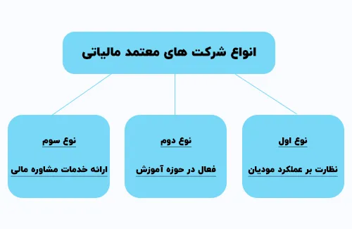

**راهنمای مطالب**
- [شرکت های معتمد ارائه دهنده خدمات مالیاتی](#شرکت-های-معتمد-ارائه-دهنده-خدمات-مالیاتی)
- [تعریف شرکت معتمد مالیاتی](#تعریف-شرکت-معتمد-مالیاتی)
- [وظایف شرکت های معتمد مالیاتی](#وظایف-شرکت-های-معتمد-مالیاتی)
- [انواع شرکت های معتمد مالیاتی](#انواع-شرکت-های-معتمد-مالیاتی)
- [لیست شرکت های معتمد سامانه مودیان](#لیست-شرکت-های-معتمد-سامانه-مودیان)
    - [شرکت های معتمد نوع اول](#شرکت-های-معتمد-نوع-اول)
    - [شرکت های معتمد نوع دوم و سوم](#شرکت-های-معتمد-نوع-دوم-و-سوم)
- [تعرفه شرکت های معتمد مالیاتی](#تعرفه-شرکت-های-معتمد-مالیاتی)

## شرکت های معتمد ارائه دهنده خدمات مالیاتی

در این مقاله ما قصد داریم ابتدا به بررسی وظایف شرکت های معتمد بپردازیم و سپس انواع آن‌ها را معرفی نماییم. در پایان، لیست شرکت‌های معتمد سامانه مودیان نیز مورد بررسی قرار خواهد گرفت. اگر از کسانی هستید که در ارتباط با سامانه مودیان سوال دارید، توصیه می‌شود که این مقاله را به‌هیچ‌وجه از دست ندهید.

شرکت‌های معتمد مالیاتی به عنوان واسطه ای بین مودیان و سازمان امور مالیاتی عمل می‌کنند. این شرکت‌ها پیش از شروع امور مالیاتی، موظف به دریافت مجوزهای لازم از سازمان امور مالیاتی هستند. کارمندان این شرکت‌ها باید زیر نظر سازمان امور مالیاتی آموزش‌های لازم را به دست آورده و پس از گذراندن دوره‌های مربوطه، مجوز مورد نیاز برای انجام امور مالیاتی برای آن‌ها صادر گردد. به همین دلیل، تعداد این شرکت‌ها به دلیل استانداردهای بالای آموزشی و مجوزدهی محدود می‌باشد.

<blockquote style="background-color:#f5f5f5; padding:0.5rem">
مطلب پیشنهادی: <a href="https://www.hooshkar.com/Software/Sayan/Module/TpTaxGov" target="_blank">آشنایی با امکانات نرم افزار واسط سامانه مودیان سایان</a></blockquote>

## تعریف شرکت معتمد مالیاتی

با توجه به اجرای الکترونیکی شدن ارسال صورتحساب ها به سامانه مودیان، افراد مشمول این قانون موظف به ارسال الکترونیکی فاکتورهای خود به سامانه مودیان می‌باشند. این ارسال می‌تواند به صورت مستقیم توسط مودی یا به صورت غیرمستقیم توسط شرکت‌های معتمد مالیاتی صورت گیرد. در غیر این صورت، افراد مشمول جریمه مالیاتی می‌شوند.

در روش مستقیم، مودیان از طریق خرید نرم افزار سامانه مودیان، فاکتورهای الکترونیکی خود را به سامانه ارسال می‌نمایند. در حالی که در روش غیرمستقیم، این فرآیند توسط شرکت های معتمد مالیاتی انجام می‌پذیرد.

در نتیجه، شرکت‌های معتمد مالیاتی که توسط افراد با آموزش‌های مختص سازمان مالیات تشکیل شده‌اند، وظیفه ثبت، انتقال و صدور صورتحساب های الکترونیکی را در سامانه مودیان به عهده دارند. البته، ارائه این خدمات همراه با هزینه‌هایی می‌باشد.

<blockquote style="background-color:#f5f5f5; padding:0.5rem">
مطلب پیشنهادی: <a href="https://www.hooshkar.com/Wiki/Financial/TaxPayersSystemUpdate" target="_blank">مهلت ارسال صورت حساب الکترونیکی در سال 1402
</a></blockquote>

## وظایف شرکت های معتمد مالیاتی

شرکت‌های معتمد مالیاتی نقش حیاتی در ارتباط مودیان با <a href="https://my.tax.gov.ir/?url_back=https://tp.tax.gov.ir" target="_blank">سامانه مودیان</a> دارند و وظایف متنوعی را انجام می‌دهند. در این راستا، به موارد زیر اشاره می‌شود:

**1. مشاوره و رفع مشکلات مودی:**

   شرکت های معتمد مالیاتی وظیفه دارند تا به مودیان مشاوره دهند و در رفع هر گونه مشکل یا سوال مالیاتی که ممکن است پیش آید، به آن‌ها کمک نمایند.

**2. آموزش قوانین مالیاتی:**

   ارائه آموزش‌های لازم در زمینه قوانین مالیاتی به مودیان از دیگر وظایف این شرکت‌ها می‌باشد. این آموزش‌ها به منظور افزایش آگاهی مودیان از تعهدات و الزامات مالیاتی ارائه می‌شود.

**3. ثبت نام در سامانه مودیان:**

   شرکت های معتمد مالیاتی مسئولیت ثبت نام مودیان در سامانه مودیان را بر عهده دارند و فرآیند ثبت نام را به صورت دقیق و موثر انجام می‌دهند.

<blockquote style="background-color:#f5f5f5; padding:0.5rem">
لینک: <a href="https://my.tax.gov.ir/?url_back=https://tp.tax.gov.ir" target="_blank">ثبت نام سامانه مودیان مالیاتی</a></blockquote>

**4. تکمیل کارپوشه در سایت مودیان:**

   این شرکت‌ها به عنوان واسطه فعال در تکمیل کارپوشه‌های مودیان در سایت مودیان مشغول به کار هستند، تا اطلاعات مهم و لازم برای پرداخت مالیات را به دقت و به‌صورت کامل وارد سامانه نمایند.

**5. صدور و ارسال اطلاعات صورتحساب الکترونیکی در سامانه مودیان:**

   شرکت های معتمد مالیاتی مسئولیت صدور و ارسال اطلاعات مربوط به صورتحساب های الکترونیکی مودیان را به سامانه مودیان بر عهده دارند، تا این اطلاعات به صورت سریع و کارآمد به سازمان امور مالیاتی ارائه گردد.

به این ترتیب، شرکت های معتمد مالیاتی با انجام این وظایف به بهبود فرآیند مالیاتی و ارائه خدمات بهتر به مودیان کمک می‌نمایند.

<blockquote style="background-color:#f5f5f5; padding:0.5rem">
مطلب پیشنهادی: <a href="https://www.hooshkar.com/Wiki/Financial/ntsw" target="_blank">سامانه جامع تجارت (ntsw) چیست؟
</a></blockquote>

## انواع شرکت های معتمد مالیاتی

شرکت های معتمد مالیاتی هر یک با وظایف و فعالیت‌های خاص خود به سه دسته اصلی تقسیم می‌شوند. این دسته‌بندی شامل نوع اول که به نظارت بر عملکرد مودیان می‌پردازد، نوع دوم که در حوزه آموزش مشغول به فعالیت است و نوع سوم که خدمات مشاوره مالی ارائه می‌دهد.

**نوع اول؛ نظارت بر عملکرد مودیان:**

شرکت های معتمد مالیاتی نوع اول، مجوزهای لازم برای صدور، جمع‌آوری، نگهداری فاکتورها، ارسال صورتحساب فروش و ارائه خدمات به سازمان امور مالیاتی را دریافت کرده‌اند. 
علاوه‌ بر این، این شرکت‌ها قادر به نظارت بر عملکرد مودیان و بررسی صحت اطلاعات مالیاتی آن‌ها است. به عنوان مثال، نظارت بر تهیه صورت‌های مالی اساسی مانند ترازنامه نیز در سطح وظایف آن‌ها جای دارد.

**نوع دوم؛ فعال در حوزه آموزش:**

شرکت های معتمد مالیاتی نوع دوم، مجوز فعالیت در حوزه آموزش را حاصل کرده و اقدام به ارائه آموزش‌های مرتبط با تکالیف مالیاتی و قوانین پایانه‌های فروشگاهی و سامانه مودیان می‌نمایند. این شرکت‌ها تنها در زمینه آموزشی فعالیت دارند و نقشی در نظارت عملی بر مودیان ندارند.

**نوع سوم؛ ارائه خدمات مشاوره مالی:**
گروه سوم از شرکت های معتمد مالیاتی، بیشتر به عنوان مشاور فعالیت می‌کنند. این گروه از شرکت‌ها می‌توانند به مودیان مالیاتی در زمینه ارسال اظهارنامه مالیاتی، تکمیل اطلاعات در اظهارنامه‌ها و سایر مسائل مرتبط با امور مالیاتی کمک کنند. همچنین، ممکن است این شرکت‌ها برای ارائه مشاوره حسابداری و مالی در امور مختلف نظیر محاسبه حقوق و دستمزد به مودیان مالیاتی فعالیت نمایند.

یک نکته مهم که باید به آن توجه کرد، این است که با <a href="https://www.hooshkar.com/Software/Sayan/Module/TpTaxGov" target="_blank">اتصال نرم افزار حسابداری سایان به سامانه مودیان</a>، مودیان می‌توانند به راحتی صورت حساب الکترونیکی خود را به شرکت معتمد یا سامانه مودیان ارسال کنند، که این اتصال به بهبود و سهولت در فرآیند ارسال اطلاعات منجر می گردد.

## لیست شرکت های معتمد سامانه مودیان

بسیاری از مودیان به دنبال اطلاعات مربوط به شرکت‌های معتمد سامانه می‌باشند. این لیست شرکت‌ها طبق اطلاعیه منتشره از سوی سازمان امور مالیاتی کشور، در راستای اجرای قانون پایانه‌های فروشگاهی و سامانه مودیان و طبق آیین‌نامه اجرایی ماده ۲۶ قانون پایانه‌های فروشگاهی و سامانه مودیان، در سامانه مودیان قابل بررسی می‌باشد.

برای دسترسی به لیست کامل شرکت‌های معتمد سامانه مودیان، می‌توانید به سایت اینترنتی سامانه مودیان به نشانی tp.tax.gov.ir مراجعه نموده و در بخش "پایانه‌های فروشگاهی و سامانه مودیان" به جستجوی لیست شرکت‌های معتمد بپردازید.

### شرکت های معتمد نوع اول

1. داده کاوی اول سام
2. داده‌پردازی کیسان
3. داده‌پردازی تیس
4. هوشمند راهبر
5. همراه فن آوا

### شرکت های معتمد نوع دوم و سوم
1. شرکت دیان همراه فردا

این لیست طبق آخرین اطلاعیه سازمان امور مالیاتی کشور به‌روز می‌باشد و مودیان می‌توانند با مراجعه به سامانه مودیان، جزئیات بیشتر درباره هر شرکت معتمد را بررسی نمایند.

## تعرفه شرکت های معتمد مالیاتی
تعرفه شرکت های معتمد مالیاتی به گونه‌ای است که از سوی دولت تصویب شده و با توجه به نیازها و حجم کاری هر شرکت، متغیر بوده و به مودیان امکان انتخاب روش مناسب با توجه به موقعیت خود را فراهم می‌سازد. این تعرفه‌ها طبق مصوبه‌ای که توسط دولت به تصویب رسیده است، بر اساس یک هزارم مالیات بر ارزش افزوده تعیین می‌شود.

در مواردی که شرکت موظف به صدور فاکتورهای فروشگاهی به سامانه مودیان می‌باشد، می‌تواند از روش غیرمستقیم یا از طریق شرکت‌های معتمد استفاده نماید. در این روش، شرکت معتمد هزینه‌های مربوط به این فرآیند را بر عهده می‌گیرد. به عبارت دیگر، شرکت فاکتور را به سامانه مودیان ارسال کرده و هزینه مربوط به این عملیات را پرداخت نموده و در نتیجه مودیان از این خدمات با هزینه مشخصی بهره‌مند می‌شوند.

از نظر بهره‌وری و کارایی، اتصال مستقیم به سامانه مودیان و ارسال فاکتورهای فروش از طریق نرم افزار مخصوص سامانه به عنوان بهترین روش مطرح می‌شود. 

برای خرید نرم‌افزار واسط سامانه مودیان، می‌توانید با کارشناسان فروش تیم <a href="https://www.hooshkar.com" target="_blank">هوشکار پرداز</a> تماس بگیرید. این روش امکان ارسال صورتحساب الکترونیکی مالیاتی را به سادگی و با چند کلیک فراهم می‌کند.

---

اگر هنوز نرم افزار مناسبی جهت ارسال صورتحساب ها انتخاب نکرده اید به شما نرم افزار سامانه مودیان سایان با رابط کاربری آسان و در عین حال کاربردی <a href="https://www.hooshkar.com" target="_blank">هوشکار</a> را پیشنهاد می‌کنیم.

در این مقاله اشاره کردیم که نرم افزار واسط سامانه مودیان و شرکتهای معتمد ابزارهای بسیار حیاتی برای تسهیل روند مالیاتی شما هستند. در بخش نظرات می توانید چالش‌ها و راه حل هایی که با این سامانه داشته‌اید را با دیگران به اشتراک بگذارید تا به بهبود فرآیند مالیاتی کمک کنید.
