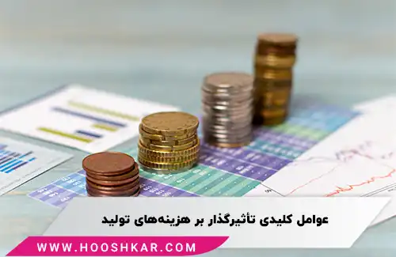

<blockquote style="background-color:#eeeefc; padding:0.5rem">

  
آنچه در این مطلب خواهید خواند:

  <ul>
    <li>انواع هزینه های مرتبط با تولید</li>
    <ul>
     <li>هزینه‌های ثابت</li>
     <li>هزینه های متغیر</li>
     <li>هزینه کل</li>
     <li>هزینه‌ی متوسط</li>
     <li>هزینه‌ی نهایی</li>
    </ul>
    <li>عوامل مؤثر بر هزینه‌های تولید</li>
  </ul>

</blockquote>

هر کسب‌وکاری که به تولید محصول مشغول است، با هزینه‌های مختلفی سر و کار دارد که مدیریت آن‌ها نقش مهمی در سودآوری دارد. اما آیا می‌دانید هزینه‌های تولید دقیقاً شامل چه مواردی می‌شوند و چگونه می‌توان آن‌ها را کنترل کرد؟

 در این مقاله، انواع هزینه‌های ثابت و متغیر را بررسی می‌کنیم و به شما نشان می‌دهیم که چگونه با مدیریت بهتر این هزینه‌ها، می‌توانید بهره‌وری و سود شرکت خود را افزایش دهید.

## انواع هزینه های مرتبط با تولید

-	هزینه‌های ثابت
-	هزینه‌های متغیر
-	هزینه‌ی کل
-	هزینه‌ی متوسط
-	هزینه‌ی نهایی

### هزینه‌های ثابت

هزینه‌هایی که با تغییر حجم تولید، تغییر نمی‌کند. بدین معنا که سازمان باید این هزینه‌ها را بپردازد، چه سطح تولید افزایش یابد و چه کاهش پیدا کند. به عبارت دیگر، هزینه‌های ثابت شامل هزینه‌هایی است که یک شرکت، حتی در صورتی که تولیداتش صفر باشد، باز هم متحمل آنها می‌شود.

 ارتباط مستقیمی بین میزان هزینه‌های ثابت و حجم تولید وجود ندارد؛ بنابراین هرچقدر هزینه‌های ثابت یک شرکت بیشتر باشد، نیاز به حجم تولید بیشتری برای بهبود راندمان و تعادل مالی شرکت وجود دارد.
 
  به عنوان مثال، سرمایه، یکی از هزینه‌های ثابت در فرآیند تولید است که شرکت در کوتاه‌مدت متحمل آن می‌شود.

در این راستا به برخی دیگر از هزینه‌های ثابت اشاره خواهیم کرد:

-	هزینه‌های نگهداری و تعمیرات ساختمان اداری یا کارخانه
-	هزینه اجاره
-	پرداخت بهره وام
-	هزینه‌های تبلیغات
-	نرخ‌های تجاری

### هزینه های متغیر 

هزینه‌های متغیر به هزینه‌هایی اشاره دارند که با تغییر حجم تولید نیز تغییر می‌کنند.
این هزینه‌ها به‌طور مستقیم با تولید یا فروش یک محصول مرتبط هستند. به عنوان مثال، اگر یک سازمان تولید محصولات خود را گسترش دهد، هزینه‌های مرتبط با تولید محصولات (مانند بسته‌بندی) نیز افزایش خواهد یافت.

از دیگر هزینه‌های متغیر می‌توان موارد زیر را نام برد:

-	حقوق و دستمزد کارگران
-	مواد اولیه (از جمله چوب، فلز و آهن)
-	هزینه‌های انرژی
-	هزینه‌های سوخت
-	هزینه‌های بسته‌بندی

### هزینه کل

هزینه کل = هزینه متغیر + هزینه ثابت

### هزینه‌ی متوسط

متوسط هزینه به ازای هر واحد، بر اساس جمع کل هزینه‌های مربوط به اقلام موجودی تقسیم بر تعداد کل واحدهای خریداری شده یا تولید شده محاسبه می‌شود. این روش معمولاً به عنوان روش میانگین وزنی نیز شناخته می‌شود. معمولاً از روش هزینه میانگین برای ارزیابی موجودی استفاده می‌شود، که از میان دو روش LIFO و FIFO رایج‌تر است.

**مزایای استفاده از روش هزینه متوسط**

استفاده از روش هزینه متوسط به منظور اشباع نیازهای سازمان، نیازمند به حداقل نیروی کار است و به همین دلیل از جمله روش‌های کم‌هزینه است. در شرکت‌هایی که با چالش مواجه هستند تا هزینه‌های مربوط به واحدهای مختلف را مشخص کنند، استفاده از روش هزینه متوسط ترجیح داده می‌شود. از جمله مزایای دیگر این روش، آسانی در ردیابی کالاهای مشابه در موجودی شرکت است.

### هزینه‌ی نهایی

هزینه نهایی به تغییر در کل هزینه تولید اشاره دارد که ناشی از ساخت یا تولید یک واحد اضافی است. برای محاسبه هزینه نهایی، تغییر در هزینه تولید را بر تغییر در مقدار تقسیم می‌کنیم. هدف از تجزیه و تحلیل هزینه نهایی، تعیین نقطه‌ای است که سازمان می‌تواند با بهینه‌سازی تولید و عملیات کلی به صرفه جویی در مقیاس برسد. اگر هزینه نهایی تولید یک واحد اضافی کمتر از قیمت هر واحد باشد، تولیدکننده می‌تواند سود کسب کند.

**مزایای استفاده از روش هزینه نهایی**

وقتی شرکت می‌تواند هزینه‌ها و درآمدهای نهایی خود را برای خطوط تولید مختلف مشخص کند، می‌تواند به مواردی که تفاوت آن‌ها بیشترین است، تمرکز کند. هزینه نهایی نیز می‌تواند برای تشخیص زمانی که تولید کالاهای اضافی سودآور نیست و کمک به شرکت در گرفتن سفارشات اضافی یا سفارشی مفید باشد.

برای مثال، اگر شرکت دارای ظرفیت اضافی برای تولید کالاهای بیشتر باشد، با دریافت پیشنهاد خرید ۱۰۰۰ واحد با قیمت کمتر، می‌تواند تصمیم بگیرد که آیا سفارش را با قیمت ویژه بپذیرد یا خیر.

#### عوامل مؤثر بر هزینه‌های تولید

**-	تقاضا**

هنگامی که یک شرکت به موفقیت می‌رسد، ممکن است تقاضا برای برخی محصولات افزایش یابد. در چنین شرایطی، برای تولید بیشتر، شرکت به خرید بیشتر مواد اولیه، استخدام کارگران جدید، گسترش امکانات تولیدی و سایر اقدامات مشابه می‌پردازد. در بهترین حالت، با استفاده از سود حاصل از فروش محصولات پرطرفدار، شرکت قادر خواهد بود هزینه‌های جدید را جبران نماید.

**-	تکنولوژی**

پیشرفت تکنولوژی باعث ظهور دستگاه‌ها و تجهیزاتی شده‌است که قابلیت جایگزینی با نیروی کار انسانی در کارخانه‌ها را دارند. شرکت‌ها به دلیل کاهش هزینه‌های نیروی انسانی، اکثراً تمایل دارند از دستگاه‌ها و ربات‌های پیشرفته‌تر در فرآیند تولید استفاده کنند.

**-	نرخ ارز**

وقتی یک شرکت مواد اولیه‌ی خود را از خارج از کشور وارد می‌کند، نرخ ارز در زمان خرید مواد می‌تواند به طور قابل توجهی بر هزینه تولید تأثیر بگذارد. در صورتی که نرخ ارز افزایش یابد، هزینه‌ی مواد موردنیاز برای تولید محصولات شرکت افزایش می‌یابد؛ بنابراین نرخ بالای ارز ممکن است رقابت میان شرکت‌های صادرکننده را افزایش دهد؛ از این رو، هزینه‌ها ممکن است ثابت بمانند یا حتی افزایش یابند.

**-	هزینه مواد**

هزینه‌ی مواد اولیه موردنیاز برای تولید، وابسته به سال تولید، شرایط اقتصادی و محدودیت‌های موجود، ممکن است متغیر باشد؛ برای مثال، قیمت فولاد می‌تواند تحت تأثیر توان مالی کارخانه تولیدکننده یا هزینه‌های حمل‌ونقل بین‌المللی، دچار نوسان شود.
از طرف دیگر، قیمت نفت و بنزین به دلیل ارتباط آن‌ها با حمل‌ونقل و تحویل محصول، تقریبا در هر صنعتی بسیار تأثیرگذار است.

**-	نرخ مالیات**

مالیات یکی از هزینه‌های غیرمستقیم شرکت‌های تولیدی است که بر اساس قوانین دولتی، ممکن است در طول سال تغییرات افزایشی یا کاهشی داشته باشد. عواملی همچون استخدام نیروی کار جدید، افزایش حق‌بیمه کارمندان و مالیات کارگران می‌توانند بر هزینه‌های تولید تأثیرگذار باشند.
