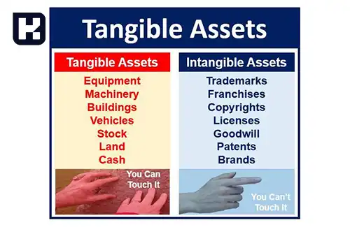
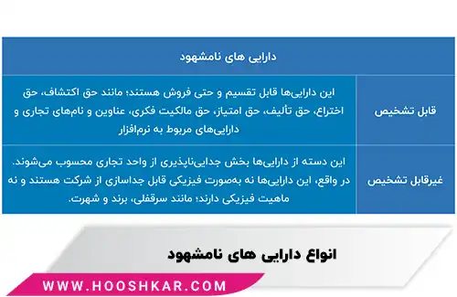

---

title: دارایی مشهود و نامشهود چیست؟ و تفاوت‌ بین آن‌ها
author: تیم تحریریه هوشکار
description: تفاوت دارایی‌های مشهود و نامشهود در ماهیت فیزیکی آنهاست؛ دارایی‌های مشهود مانند زمین و ماشین‌آلات فیزیکی و قابل لمس هستند، در حالی که دارایی‌های نامشهود شامل علامت تجاری و حق امتیاز، غیرقابل لمس و ارزشمندند. این مقاله به بررسی کامل این دو دسته دارایی، انواع آن‌ها و نحوه ثبت آن‌ها در ترازنامه می‌پردازد.
dateModified: 2025/11/16
datePublished: 2024/08/01
uid: Financial/WhatAreTangibleAndIntangibleAssets
---

<blockquote style="padding:0.5rem; margin-top:0.5rem;">

  
آنچه در این مطلب خواهید خواند:

  <ul>
    <li>مقدمه و اهمیت شناخت دارایی‌ها</li>
    <li>دارایی مشهود (Tangible Asset) و انواع آن</li>
    <li>دارایی نامشهود (Intangible Asset) و انواع آن</li>
    <li>تفاوت بین دارایی‌های مشهود و نامشهود</li>
    <li>دارایی‌های ثابت و مشهود در ترازنامه</li>
    <li>ثبت اسناد حسابداری برای دارایی‌های ثابت مشهود</li>
    <li>جدول مقایسه و نمودار تصویری</li>
    <li>سوالات متداول</li>
    <li>جمع‌بندی</li>
  </ul>

</blockquote> 

تصور کنید شرکت شما در حال خرید یک کارخانه جدید یا ثبت برند جدید است. تصمیم‌گیری مالی درست نیازمند شناخت دقیق دارایی‌هاست.  
دارایی‌ها، چه مشهود و چه نامشهود، پایه تحلیل مالی و مدیریت مؤثر منابع شرکت هستند. شناخت دقیق آن‌ها، مدیران را قادر می‌سازد تا:

- ارزش واقعی دارایی‌ها را درک کنند  
- تصمیمات سرمایه‌گذاری هوشمندانه بگیرند  
- دارایی‌ها را به‌درستی در ترازنامه ثبت کنند  
- مالیات و گزارش‌های قانونی را به‌درستی محاسبه کنند  

استفاده از <a href="https://www.hooshkar.com/Software/Sayan/Module/Assets" target="_blank">نرم‌افزار اموال و دارایی ثابت سایان</a> نیز فرآیند مدیریت دارایی‌ها را ساده‌تر و دقیق‌تر می‌کند.

## دارایی مشهود (Tangible Asset) چیست؟

دارایی‌های مشهود دارای ارزش پولی و ماهیت فیزیکی هستند و در عملیات شرکت استفاده می‌شوند. این دارایی‌ها معمولاً قابل معامله بوده و ارزش آنها ممکن است با گذشت زمان کاهش یا افزایش یابد.  

**نمونه‌های دارایی مشهود:** زمین، ساختمان، ماشین‌آلات، موجودی کالا و تجهیزات اداری.

### انواع دارایی‌های مشهود

- **دارایی‌های مشهود استهلاک‌پذیر:** ماشین‌آلات، تجهیزات  
- **دارایی‌های مشهود استهلاک‌ناپذیر:** زمین، ساختمان  
- **دارایی‌های مشهود با طول عمر کوتاه:** موجودی کالا، مواد اولیه  
- **دارایی‌های مشهود با طول عمر طولانی:** کارخانه، تجهیزات صنعتی سنگین  

> نکته: دارایی‌های استهلاک‌پذیر هر ساله بخشی از ارزش خود را از دست می‌دهند و باید در صورت‌های مالی مستهلک شوند.

---

### دارایی نامشهود چیست؟ (Intangible Asset)

دارایی‌های نامشهود، قابل دیدن و لمس کردن نیستند اما ارزش زیادی برای شرکت دارند.  
این دارایی‌ها ممکن است شامل حقوق قانونی، مالکیت معنوی یا ارزش برند باشند.

**نمونه‌های دارایی نامشهود:** علامت تجاری، ارزش برند، حق امتیاز، پروانه ثبت، جواز کسب، حق تألیف، سرقفلی، ارزهای دیجیتال در کسب‌وکارهای مدرن.

### انواع دارایی‌های نامشهود

- دارایی‌های نامشهود قابل شناسایی: علامت تجاری، حق امتیاز  
- دارایی‌های نامشهود غیرقابل شناسایی: ارزش برند، سرمایه انسانی  
- دارایی‌های دیجیتال: ارزهای دیجیتال، نرم‌افزارهای اختصاصی  

> نکته: دارایی‌های نامشهود هرچند غیرقابل لمس هستند، اما می‌توانند سهم عمده‌ای از ارزش کل شرکت را تشکیل دهند.

---

### تفاوت بین دارایی‌های مشهود و نامشهود

| ویژگی | دارایی مشهود | دارایی نامشهود |
|--------|---------------|----------------|
| ماهیت | فیزیکی، قابل لمس | غیرقابل لمس، معنوی |
| قابلیت استهلاک | دارد (برخی) | معمولاً ندارد یا محدود |
| نمونه | زمین، ماشین‌آلات، موجودی کالا | علامت تجاری، حق امتیاز، سرقفلی |
| ارزش‌گذاری | بر اساس هزینه خرید و استهلاک | بر اساس قرارداد، بازار یا ارزش برند |
| نقدشوندگی | نسبتاً آسان | دشوار و وابسته به توافق طرفین |

---

### دارایی‌های ثابت و مشهود در ترازنامه

ترازنامه، وضعیت مالی شرکت را نشان می‌دهد. دارایی‌ها به دو دسته اصلی تقسیم می‌شوند:  

**الف) دارایی جاری:** موجودی نقد، سرمایه‌گذاری کوتاه‌مدت، حساب‌ها و اسناد دریافتی، پیش‌پرداخت‌ها.  
**ب) دارایی غیرجاری:** دارایی‌های ثابت مشهود، دارایی‌های نامشهود، سرمایه‌گذاری بلندمدت، پیش‌پرداخت‌ها و سایر دارایی‌ها.  

> نکته: شناسایی صحیح دارایی‌ها در ترازنامه باعث شفافیت گزارش‌های مالی و تصمیم‌گیری بهتر مدیران می‌شود.

---

### ثبت اسناد حسابداری برای دارایی‌های ثابت مشهود

**خرید نقدی دارایی ثابت**  
- زمین بدهکار  
- موجودی نقد/بانک بستانکار  

**خرید دارایی ثابت با ارزش‌افزوده**  
- اثاثیه بدهکار  
- سایر حساب‌های دریافتنی بدهکار  
- سایر حساب‌های پرداختنی بستانکار  

**خرید نسیه دارایی ثابت**  
- ساختمان بدهکار  
- سایر حساب‌های پرداختنی بستانکار  

> نکته: ثبت دقیق و به‌موقع این معاملات به جلوگیری از خطاهای مالی و افزایش دقت صورت‌های مالی کمک می‌کند.

---

### جدول مقایسه و نمودار تصویری

| نوع دارایی | ماهیت | مثال | استهلاک |
|------------|-------|------|----------|
| مشهود استهلاک‌پذیر | فیزیکی | ماشین‌آلات | دارد |
| مشهود استهلاک‌ناپذیر | فیزیکی | زمین | ندارد |
| نامشهود قابل شناسایی | غیرقابل لمس | علامت تجاری | معمولاً ندارد |
| نامشهود غیرقابل شناسایی | غیرقابل لمس | ارزش برند | محدود |

---

### سوالات متداول

<blockquote style="padding:0.5rem; margin-top:0.5rem;">

دارایی‌های مشهود را چگونه ارزش‌گذاری کنیم؟

ارزش دارایی‌های مشهود معمولاً بر اساس هزینه خرید یا ارزش بازار تعیین می‌شود و استهلاک برای دارایی‌های استهلاک‌پذیر لحاظ می‌شود.

</blockquote>

<blockquote style="padding:0.5rem; margin-top:0.5rem;">

دارایی‌های نامشهود چه تأثیری در ارزش شرکت دارند؟

دارایی‌های نامشهود می‌توانند بخش بزرگی از ارزش شرکت را تشکیل دهند، مانند برند معتبر یا حق اختراع، و نقش مهمی در جذب سرمایه‌گذار دارند.

</blockquote>

<blockquote style="padding:0.5rem; margin-top:0.5rem;">

استهلاک دارایی‌های مشهود چگونه ثبت می‌شود؟

استهلاک دارایی‌های مشهود به‌صورت دوره‌ای ثبت می‌شود تا ارزش دارایی‌ها در ترازنامه به‌روز باقی بماند و هزینه استفاده از دارایی در صورت سود و زیان لحاظ شود.

</blockquote>

<blockquote style="padding:0.5rem; margin-top:0.5rem;">

چرا دارایی‌های نامشهود مهم هستند؟

اگرچه غیرقابل لمس هستند، دارایی‌های نامشهود مانند برند، حق امتیاز و نرم‌افزار اختصاصی ارزش اقتصادی بالایی دارند و به رشد بلندمدت شرکت کمک می‌کنند.

</blockquote>

---

### جمع‌بندی

- دارایی‌ها به دو دسته مشهود و نامشهود تقسیم می‌شوند که هر کدام نقش متفاوتی در عملیات و ارزش شرکت دارند.  
- دارایی‌های مشهود فیزیکی و قابل لمس هستند و ممکن است مستهلک شوند، در حالی که دارایی‌های نامشهود غیرقابل لمس ولی ارزشمندند.  
- ثبت صحیح دارایی‌ها در ترازنامه و استفاده از نرم‌افزارهای حسابداری مانند <a href="https://www.hooshkar.com/Software/Sayan" target="_blank">سایان از هوشکار</a> به مدیریت دقیق و تصمیم‌گیری هوشمندانه کمک می‌کند.  
- تحلیل و طبقه‌بندی درست دارایی‌ها پایه گزارش‌های مالی، برنامه‌ریزی سرمایه و تصمیمات استراتژیک شرکت است.