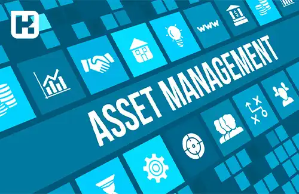

<blockquote class="faq-block">

  
آنچه در این مطلب خواهید خواند:

  <ul>
    <li>دارایی ثابت یا اموال گردانی چیست؟</li>
    <li>اموال چیست؟</li>
    <li>مزایای اموال گردانی</li>
    <li>روش‌های مختلف اموال گردانی در سازمان‌ها</li>
    <li>دستورالعمل مدیریت اموال به روش‌های مدرن</li>
    <li>سؤالات متداول</li>
  </ul>

</blockquote> 

مدیریت دارایی‌های ثابت یا اموال گردانی به معنای استفاده از سیستم‌های منظم برای جمع‌آوری، ثبت و نگهداری دقیق اطلاعات دارایی‌ها است. این سیستم‌ها به سازمان‌ها کمک می‌کنند تا با ردیابی مؤثر و کاهش خطاها، بهره‌وری و ثبات مالی خود را افزایش دهند. از طریق روش‌های سنتی و مدرن، از جمله استفاده از تکنولوژی‌های الکترونیکی، می‌توان به بهبود کنترل و مدیریت دارایی‌ها پرداخت. این مقاله به تحلیل این روش‌ها و بررسی مزایای آن‌ها می‌پردازد.

برای ساده‌تر شدن فرآیند اموال گردانی و کاهش خطای انسانی، می‌توانید از <a href="https://www.hooshkar.com/Software/Sayan/Module/Assets" target="_blank">نرم افزار اموال سایان</a> استفاده کنید.

## دارایی ثابت یا اموال گردانی چیست؟

اموال گردانی سیستمی است که به صورت هوشمند یا سنتی برای جمع‌آوری و نگهداری دقیق سوابق اموال ثابت طراحی شده است. این سیستم یک بستر یکپارچه ایجاد می‌کند تا دارایی‌ها تحت کنترل قرار گیرند و خسارت به تجهیزات به حداقل برسد. برخی از حسابداران، اموال گردانی را معادل کنترل دارایی ثابت می‌دانند. 

این فرآیند به مرور زمان به موفقیت، رشد مالی و ثبات منابع شرکت کمک می‌کند و به عنوان یک سیستم مدیریت بهره‌وری، به بهبود برنامه‌ریزی تولید شرکت‌ها یاری می‌رساند. همچنین، اموال گردانی در حسابداری نقش مهمی ایفا می‌کند و به آن ردیابی اموال نیز گفته می‌شود. معادل انگلیسی این مفهوم "Asset Management" یا مدیریت اموال است.

---

### اموال چیست؟

برای فهم بهتر مفهوم اموال گردانی، ابتدا باید با تعریف اموال آشنا شویم. اموال سازمانی به هر نوع دارایی ثابت یا موقتی اطلاق می‌شود که برای انجام فعالیت‌های سازمان به کار می‌روند. به طور کلی، اموال به بخش‌هایی از دارایی‌های سازمان اطلاق می‌شود که به‌طور مشخص قابل شناسایی بوده و برای مدت زمانی معین (معمولاً بیش از یک دوره مالی) در سازمان مورد استفاده قرار می‌گیرند.

---

### مزایای اموال گردانی

- جمع‌آوری اطلاعات دقیق و سریع
- افزایش دقت در داده‌های جمع‌آوری شده
- قابلیت گزارش‌گیری با جزئیات کامل
- شمارش اموال بدون خطا
- ردیابی دقیق و بی‌نقص اموال
- شناسایی دقیق مغایرت‌های اموال
- جلوگیری از اتلاف وقت در جست‌وجوی اموال مفقودی
- بهبود حفاظت از دارایی‌های ثابت شرکت
- کاهش هزینه‌های نگهداری اموال
- ایجاد مسئولیت و الزام پاسخگویی برای مسئولین دارایی‌ها
- تخصیص بهینه دارایی‌ها برای دستیابی به بالاترین بازده
- افزایش شفافیت در گزارش‌های مالی و مدیریتی

---

### روش‌های مختلف اموال گردانی در سازمان‌ها

کنترل دارایی‌های ثابت می‌تواند به دو شیوه سنتی و مدرن انجام شود. در روش سنتی، تمامی مراحل به‌صورت دستی و توسط کارکنان انجام می‌شود، اما در روش مدرن یا الکترونیکی، بیشتر فرآیندها به کمک رایانه و سیستم‌های پیشرفته انجام می‌گیرد. با این وجود، مراحل اصلی در هر دو روش مشابه هستند:

1. صورت‌برداری اطلاعات
2. تجزیه و تحلیل داده‌ها
3. کدینگ دارایی‌ها
4. پلاک‌کوبی اموال
5. ثبت نهایی و گزارش‌گیری

---

### دستورالعمل مدیریت اموال به روش‌های مدرن

**1. صورت‌برداری اموال**  
در این مرحله، تمام اطلاعات و داده‌های مربوط به اموال جمع‌آوری و در نرم‌افزار ثبت می‌شوند. مشخصاتی مانند نام، تعداد، محل و شرایط نگهداری، ارزش ریالی، مسئول مربوطه، تاریخ خرید و وضعیت فعلی اموال ثبت می‌شود. کالاهای موجود در انبار فروشنده نیز قابل پیگیری هستند.

**2. تعیین کدینگ دارایی**  
برای هر واحد یا طبقه یک کد منحصر به فرد اختصاص داده می‌شود. این کدها شامل کد مال، کد واحد، کد طبقه و کد ساختمان هستند. می‌توان این فرآیند را در نرم‌افزار اکسل یا سیستم‌های مدیریت دارایی انجام داد.

**3. برچسب‌زنی یا پلاک‌کوبی اموال**  
هر دارایی به یک کد منحصر به فرد مجهز می‌شود تا ردیابی و نگهداری سوابق به شکل دقیق انجام گیرد. قبل از آغاز پلاک‌کوبی، قالب برچسب باید توسط مدیران تأیید شود.

**4. صورت‌برداری الکترونیکی**  
ثبت داده‌ها از طریق اسکن بارکد و بررسی سوابق انجام می‌شود. این روش سرعت، دقت و کاهش هزینه را نسبت به روش سنتی فراهم می‌کند.

---

### نکات کاربردی برای مدیران

- همه مراحل ثبت و کدگذاری باید به‌صورت منظم انجام شود.  
- مسئولیت هر بخش باید مشخص باشد تا پاسخگویی ساده‌تر شود.  
- داده‌ها باید به‌طور دوره‌ای بررسی و با واقعیات تطبیق داده شوند.  
- استفاده از نرم‌افزارهای مدیریت دارایی می‌تواند خطاهای انسانی را به حداقل برساند.

---

### سؤالات متداول

<blockquote class="faq-block">

آیا اموال گردانی فقط برای دارایی‌های ثابت است؟

خیر، می‌توان دارایی‌های موقت و تجهیزات قابل جابجایی را نیز مدیریت و ردیابی کرد.

</blockquote>

<blockquote class="faq-block">

روش پیشرفته چه مزایایی نسبت به روش سنتی دارد؟

روش مدرن با استفاده از نرم‌افزار و ابزارهای الکترونیکی، سرعت ثبت داده‌ها را افزایش می‌دهد، خطای انسانی را کاهش می‌دهد و گزارش‌گیری را آسان می‌کند.

</blockquote>

<blockquote class="faq-block">

اموال گردانی چقدر در کاهش هزینه‌ها تاثیر دارد؟

با ردیابی دقیق و جلوگیری از گم شدن یا استفاده غیرمجاز از دارایی‌ها، هزینه‌های نگهداری و جایگزینی کاهش می‌یابد و تخصیص بهینه دارایی‌ها محقق می‌شود.

</blockquote>

---

### جمع‌بندی

اموال گردانی یک فرایند کلیدی برای حفظ و مدیریت دارایی‌های ثابت شرکت است. با ثبت دقیق، کدینگ استاندارد، پلاک‌کوبی و صورت‌برداری الکترونیکی، می‌توان خطاها را به حداقل رساند، بهره‌وری را افزایش داد و گزارش‌های مالی دقیق‌تری ایجاد کرد.