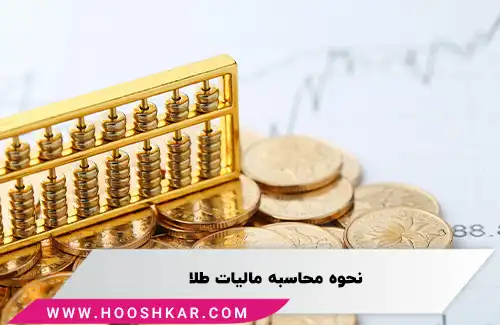

<blockquote class="faq-block">

  
آنچه در این مطلب خواهید خواند:

  <ul>
    <li>مالیات طلا چیست؟</li>
    <li>انواع مالیات طلا</li>
    <ul>
      <li>1- مالیات بر عایدی طلا با نرخ 0 تا 40 درصد</li>
      <li>2- مالیات بر ارزش‌افزوده طلا با نرخ 10 درصد</li>
      <li>3- مالیات عملکرد طلافروش با نرخ 15 تا 25 درصد</li>
    </ul>
    <li>محاسبه عملی مالیات طلا</li>
    <li>معافیت‌ها و نکات مهم قانونی</li>
    <li>پرسش‌های متداول</li>
  </ul>

</blockquote> 

طلا از دیرباز نقش مهمی در اقتصاد و فرهنگ ایران داشته است. این فلز گرانبها نه تنها به عنوان زیورآلات مورد استفاده قرار می‌گیرد، بلکه به عنوان یک ابزار سرمایه‌گذاری و حفظ ارزش دارایی نیز شناخته می‌شود.  

با توجه به اهمیت طلا در اقتصاد کشور، نظام مالیاتی ایران قوانین خاصی برای مالیات‌بندی معاملات طلا وضع کرده است. این مقاله به بررسی جامع مالیات طلا، انواع آن، نحوه محاسبه و معافیت‌های مربوطه می‌پردازد تا درک بهتری از این موضوع مهم اقتصادی برای خوانندگان فراهم آورد.

برای مدیریت دقیق مالیات‌ها و محاسبه سریع مالیات، می‌توانید از <a href="https://www.hooshkar.com/Software/Sayan/Module/TpTaxGov" target="_blank">نرم‌افزار سامانه مودیان سایان</a> استفاده کنید.

## مالیات طلا چیست؟

مالیات بر طلا یکی از مالیات‌های غیرمستقیم است که بر اساس ارزش اجرت ساخت و سود فروشنده در زمان فروش کالا دریافت می‌شود. این مالیات توسط فروشنده جمع‌آوری و به حساب سازمان امور مالیاتی واریز می‌شود و تنها اصل طلا از مالیات معاف است.

## انواع مالیات طلا

مالیات طلا به سه دسته تقسیم می‌شود:

### 1- مالیات بر عایدی طلا با نرخ 0 تا 40 درصد

این مالیات به سود ناشی از افزایش قیمت طلا تعلق می‌گیرد و نرخ آن بسته به مدت نگهداری سرمایه و مقدار سود تعیین می‌شود:

- نگهداری کمتر از 1 سال: 30 درصد  
- نگهداری بین 1 تا 2 سال: 20 درصد  
- نگهداری بیش از 2 سال: 10 درصد  

**معافیت‌های مالیاتی برای عایدی سرمایه طلا:**  

اندوخته طلا تا سقف 150 گرم از پرداخت این مالیات معاف است و عمدتاً مردم عادی مشمول پرداخت نمی‌شوند.

### 2- مالیات بر ارزش‌افزوده طلا با نرخ 10 درصد

مالیات بر ارزش افزوده بر اجرت ساخت و سود فروشنده اعمال می‌شود و نرخ آن مطابق قانون سال 1403، 10 درصد است.

### 3- مالیات عملکرد طلافروش با نرخ 15 تا 25 درصد

این مالیات بر سود خالص طلافروش پس از کسر هزینه‌ها محاسبه می‌شود:

| سود خالص فروشنده | نرخ مالیات |
|-----------------|------------|
| تا 50 میلیون تومان | 15% |
| 50 تا 100 میلیون تومان | 20% |
| بالاتر از 100 میلیون تومان | 25% |

### محاسبه عملی مالیات طلا

فرض کنید یک تیکه طلا به وزن 10 گرم با اجرت ساخت 500,000 تومان و قیمت هر گرم طلای 18 عیار 3,000,000 تومان خریداری شده است:

- مالیات بر ارزش افزوده: 10% × (30,000,000 + 500,000) = 3,050,000 تومان  
- سود طلافروش: 7% × (30,000,000 + 500,000) = 2,135,000 تومان  
- مالیات عملکرد: بسته به سود خالص فروشنده بین 15 تا 25 درصد  

**جمع مالیات‌ها و مبلغ نهایی پرداختی خریدار:** مجموع مالیات بر ارزش افزوده و سود فروشنده + مالیات عملکرد.

### معافیت‌ها و نکات مهم قانونی

- نگهداری فاکتور خرید طلا برای محاسبه صحیح مالیات الزامی است.  
- خرید طلا از منابع غیرمجاز ممکن است باعث مشکلات حقوقی شود.  
- تخطی از پرداخت مالیات ممکن است مشمول جریمه و دیرکرد شود.  

برای مطالعه بیشتر در مورد سایر مالیات‌های غیرمستقیم، می‌توانید مقاله <a href="https://www.hooshkar.com/Wiki/Financial/WhatIsStampDuty" target="_blank">مالیات حق تمبر</a> را ببینید.

---

### سوالات متداول

<blockquote class="faq-block">

آیا مالیات طلا شامل خرید آنلاین هم می‌شود؟

بله، تمامی فروشندگان رسمی موظف به دریافت مالیات هستند.

</blockquote>

<blockquote class="faq-block">

آیا طلاهای قدیمی و دست دوم مشمول مالیات هستند؟

مالیات تنها بر اجرت ساخت و سود فروشنده اعمال می‌شود و اصل طلا معاف است.

</blockquote>

<blockquote class="faq-block">

چرا نگهداری فاکتور خرید طلا مهم است؟

برای محاسبه دقیق مالیات بر عایدی و جلوگیری از مشکلات قانونی و مالیاتی، فاکتور خرید الزامی است.

</blockquote>

---

### جمع‌بندی

مالیات طلا شامل سه نوع اصلی است: مالیات بر عایدی طلا، مالیات بر ارزش‌افزوده و مالیات عملکرد طلافروش. این مالیات‌ها تنها بر اجرت ساخت و سود فروشنده اعمال می‌شوند و اصل طلا معاف است. آگاهی از نرخ‌ها، معافیت‌ها و روش محاسبه عملی به خریداران و فروشندگان کمک می‌کند تا معاملات قانونی، شفاف و بدون ریسک مالیاتی انجام دهند و از مشکلات حقوقی جلوگیری کنند.