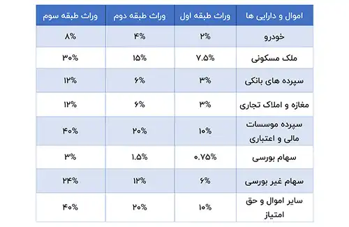

<blockquote style="background-color:#eeeefc; padding:0.5rem">

  
آنچه در این مطلب خواهید خواند:

  <ul>
    <li>مالیات بر ارث چیست؟</li>
    <li>دسته‌بندی وراث در ماده ۱۸ قانون مالیات‌های مستقیم</li>
    <li>روش محاسبه مالیات بر ارث</li>
    <li>چه اموالی شامل مالیات بر ارث می‌شوند؟</li>
    <li>جدول مالیات بر ارث</li>
    <li>روش‌های پرداخت مالیات بر ارث</li>
    <li>موارد معاف از مالیات بر ارث کدامند؟</li>
  </ul>

</blockquote>

مالیات بر ارث یکی از موضوعات مهم و پیچیده در حوزه مالیات‌های مستقیم است که وراث پس از فوت متوفی با آن مواجه می شوند. این مالیات بر اساس ارزش دارایی‌ها و اموال به‌جا مانده از متوفی محاسبه می گردد که باید طبق قوانین مشخص به سازمان امور مالیاتی پرداخت شود.

 در این مقاله به بررسی اصول و مبانی مالیات بر ارث، دسته‌بندی وراث، نحوه محاسبه مالیات و اموالی که مشمول این مالیات می‌شوند، پرداخته می‌شود. این اطلاعات به وراث کمک می‌کند تا با آگاهی کامل از حقوق و تکالیف خود، فرآیند مالیاتی را به درستی مدیریت کنند.

<blockquote style="background-color:#f5f5f5; padding:0.5rem">

<strong>آشنایی با <a href="https://www.hooshkar.com/Software/Sayan/Module/TpTaxGov" target="_blank">نرم افزار واسط سامانه مودیان
</a> سایان</strong>
</blockquote>

## مالیات بر ارث چیست؟

پس از فوت شخصی که دارای ورثه است، وراث یا نماینده قانونی آن‌ها موظفند فرایند انحصار وراثت را به‌طور قانونی دنبال کنند. وراث باید تا یک سال از تاریخ فوت، اظهارنامه مالیات بر ارث را تکمیل کرده و به سازمان امور مالیاتی تحویل دهند. برای انجام این کار، باید به اداره مالیاتی محل سکونت متوفی مراجعه کرده و فرم‌های مورد نیاز را دریافت کنند. این فرم‌ها شامل اطلاعات هویتی، جزئیات اموال و دارایی‌ها، اسامی وراث، بدهی‌ها، تعهدات مالی و هزینه‌های مربوط به کفن و دفن است.

### دسته‌بندی وراث در ماده ۱۸ قانون مالیات‌های مستقیم
بر اساس ماده ۱۸ قانون مالیات‌های مستقیم، وراث به سه طبقه تقسیم می‌شوند. این طبقه‌بندی به منظور تعیین میزان سهم‌الارث هر یک از وراث انجام شده است. همچنین نحوه محاسبه و توزیع این دارایی‌ها بین این سه طبقه، دارای ساز و کار خاصی است که در ادامه به بررسی آن‌ها پرداخته خواهد شد.

**طبقه اول:** پدر، مادر، همسر، فرزند، نوه

**طبقه دوم:** برادر، خواهر، پدربزرگ، مادربزرگ و فرزندان هر یک از آنها

**طبقه سوم:** عمو، عمه، دایی، خاله و فرزندان هر یک از آنها

### روش محاسبه مالیات بر ارث

همان‌طور که اشاره شد، میزان مالیات برای هر طبقه از وراث با دیگری متفاوت است. این مبالغ و نرخ‌های مربوطه، بر اساس تقسیم‌بندی وراث در قانون مالیات‌های مستقیم تعیین می‌شوند. نرخ‌هایی که برای طبقه اول در ماده ۲۰ قانون مالیات مشخص شده‌اند به این صورت است:

- ۵ درصد مالیات تا سقف ۵۰ میلیون ریال
- ۱۵ درصد مالیات برای مبالغ بالاتر از ۵۰ میلیون ریال تا ۲۰۰ میلیون ریال
- ۲۵ درصد مالیات برای مبالغ بالاتر از ۲۰۰ میلیون ریال تا ۵۰۰ میلیون ریال
- ۳۵ درصد مالیات برای مبالغ بالاتر از ۵۰۰ میلیون ریال

### چه اموالی شامل مالیات بر ارث می‌شوند؟

بر اساس ماده ۱۷ قانون مالیات‌های مستقیم، اموالی که پس از فوت به وراث منتقل می‌شوند، مشمول مالیات هستند. این اموال و دارایی‌ها شامل موارد زیر می‌شوند:

- تمامی سپرده‌های بانکی، اوراق بهادار، اوراق مشارکت و سودهای وابسته به آن‌ها
- تمامی وسایل نقلیه زمینی، دریایی، هوایی و موتوری
- کلیه املاک و مستغلات
- دارایی‌ها و اموال متوفی که در خارج از کشور قرار دارند.

### جدول مالیات بر ارث

## روش‌های پرداخت مالیات بر ارث

برای پرداخت مالیات بر ارث، ابتدا باید اظهارنامه مالیات بر ارث را تکمیل کنید. همان‌طور که اشاره شد، وراث تنها یک سال پس از انجام انحصار وراثت فرصت دارند تا این اظهارنامه را ثبت کنند.

### موارد معاف از مالیات بر ارث کدامند؟
قانون مالیات بر ارث معافیت‌های مشخصی را در نظر گرفته است که در اصلاحیه سال 1995 قانون مالیات‌های مستقیم تغییراتی یافته‌اند. در حال حاضر، این معافیت‌ها به صورت زیر تعریف شده‌اند:

1. اموال شهدای انقلاب اسلامی که به وراث طبقات اول و دوم منتقل می‌شود.
2. اثاثیه منزل متوفی، شامل مبلمان و لوازم خانگی.
3. اموالی که متعلق به وزارتخانه‌ها، سازمان‌های دولتی و نهادهای دارای بودجه دولتی است.
4. حقوق بازنشستگی، پس‌اندازها، مزایای پایان خدمت، خسارات قابل پرداخت، مرخصی استحقاقی و بیمه‌های اجتماعی استفاده‌نشده و همچنین وجوه پرداختی توسط شرکت‌های بیمه یا کارفرما مانند بیمه عمر و دارایی.