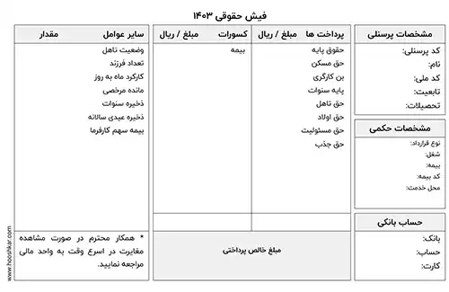

**راهنمای مطالب**
- [آشنایی کامل با اصطلاحات و نرم افزار حقوق و دستمزد](#آشنایی-کامل-با-اصطلاحات-و-نرم-افزار-حقوق-و-دستمزد)
- [بررسی نرم افزار حقوق دستمزد و انواع آن](#بررسی-نرم-افزار-حقوق-دستمزد-و-انواع-آن)
   - [نرم افزار محاسبه حقوق و دستمزد رایگان](#نرم-افزار-محاسبه-حقوق-و-دستمزد-رایگان)
   - [نرم افزار محاسبه حقوق و دستمزد غیر رایگان](#نرم-افزار-محاسبه-حقوق-و-دستمزد-غیر-رایگان)
- [بهترین نرم افزار حقوق و دستمزد رایگان](#بهترین-نرم-افزار-حقوق-و-دستمزد-رایگان)
- [خرید نرم افزار حقوق و دستمزد](#خرید-نرم-افزار-حقوق-و-دستمزد)
- [منظور از پایه حقوق چیست](#منظور-از-پایه-حقوق-چیست)
   - [پایه حقوق سال 1402](#پایه-حقوق-سال-1402)
- [فرمول های حقوق و دستمزد](#فرمول-های-حقوق-و-دستمزد)
   - [فرمول حقوق و دستمزد بر اساس اضافه کاری](#فرمول-حقوق-و-دستمزد-بر-اساس-اضافه-کاری)
   - [فرمول حقوق و دستمزد عیدی](#فرمول-حقوق-و-دستمزد-عیدی)
   - [فرمول حقوق و دستمزد شب کاری](#فرمول-حقوق-و-دستمزد-شب-کاری)
- [حق اولاد چیست و چگونه محاسبه می شود](#حق-اولاد-چیست-و-چگونه-محاسبه-می-شود)
- [آشنایی با لیست حقوق و دستمزد](#آشنایی-با-لیست-حقوق-و-دستمزد)
- [اهمیت ثبت سند حقوق و دستمزد](#اهمیت-ثبت-سند-حقوق-و-دستمزد)
- [محاسبه مالیات حقوق](#محاسبه-مالیات-حقوق)
   - [مالیات مستقیم](#مالیات-مستقیم)
   - [مالیات غیرمستقیم](#مالیات-غیرمستقیم)
   - [معافیت های مالیات حقوق](#معافیت-های-مالیات-حقوق)
- [سامانه ارسال لیست مالیات حقوق](#سامانه-ارسال-لیست-مالیات-حقوق)
- [فیش حقوقی چیست](#فیش-حقوقی-چیست)
- [حقوق اداره کار ](#حقوق-اداره-کار)
- [حقوق اداره کار 1401](#حقوق-اداره-کار-1401)
- [حقوق اداره کار 1402](#حقوق-اداره-کار-1402)

## آشنایی کامل با اصطلاحات حقوق و دستمزد 
بدون شک کارکنان و نیروهای انسانی هر مجموعه، ارزشمندترین دارایی آن به شمار می‌آیند. چرا که با کمک نیروهای انسانی خوب، مجموعه‌ها رشد و توسعه را تجربه می‌کنند. پس در نتیجه نگهداری و حفظ رضایت کارکنان، به نفع شرکت است و در این جهت باید اقداماتی انجام شود. یکی از این اقدامات مهم که هر مجموعه موظف است جهت جلب رضایت کارکنان خود انجام دهد، پرداخت به موقع حقوق آن‌هاست. 

با کمک نرم افزارهای حقوق و دستمزد، این پروسه به راحت‌ترین و بهترین شکل ممکن صورت می‌گیرد. اگر شما هم علاقه‌مندید با این نرم افزارها و همچنین تمام مباحث حقوق و دستمزد آشنا شوید، در این مقاله با ما همراه باشید.

<blockquote style="background-color:#f5f5f5; padding:0.5rem">
مطلب پیشنهادی: <a href="https://www.hooshkar.com/Software/Sayan/Module/Payroll" target="_blank">آشنایی با امکانات نرم افزار حقوق و دستمزد سایان
</a>
</blockquote>

## بررسی نرم افزار حقوق دستمزد و انواع آن
مهم نیست که ابعاد کسب و کار شما کوچک است یا بزرگ. در هر صورت، با محاسبه و پرداخت حقوق و مزایای پرسنل سر و کار خواهید داشت. 

نرم افزار حقوق و دستمزد، در انواع متخلفی وجود دارد که به کمک شما می‌آید. در ادامه به بررسی انواع آن می‌پردازیم.

### نرم افزار محاسبه حقوق و دستمزد رایگان
یکی از متداول‌ترین نرم‌ افزارها جهت محاسبه، نوع رایگان آن است که قابل استفاده روی سیستم و گوشی‌های همراه می‌باشد. 

نرم افزار محاسبه حقوق و دستمزد رایگان بر اساس مالیات، اقساط بیمه و اضافات مختلف، درآمد پرسنل شما را به صورت دقیق حساب می‌کند. 

شما به راحتی می‌توانید این نرم افزارهای رایگان را که توسط مجموعه‌های مختلف طراحی شده، از سایت‌های معتبر دانلود کنید.

اگر قصد دارید روی گوشی همراهتان این اپ کاربردی را داشته باشید، می‌توانید به برنامه بازار یا سیب سری بزنید. البته لازم به ذکر است که هیچ نرم افزار رایگانی، به شما دسترسی و امکانات کامل و گسترده نخواهد داد.

<blockquote style="background-color:#f5f5f5; padding:0.5rem">
مطلب پیشنهادی: <a href="https://www.hooshkar.com/Wiki/Payroll/Payroll1401" target="_blank">پایه حقوق وزارت کار 1402؛ میزان افزایش و جدول پایه حقوق اداره کار
</a></blockquote>

### نرم افزار محاسبه حقوق و دستمزد غیر رایگان
نرم افزارهای غیر رایگان، به دو صورت در بازار موجود هستند. نوع اول، نرم افزاری است که با پیش‌فرض‌های خاص و از قبل تعیین شده، برای مشاغل مختلف طراحی و ساخته شده‌است. شما می‌توانید به راحتی نرم افزار را خریداری کنید و از کلیه‌ی امکانات آن استفاده نمایید.

نوع دوم، نرم افزارهایی هستند که به صورت اختصاصی برای شرکت شما طراحی می‌شوند. در هر زمان هم که نیاز داشته باشید، برنامه‌نویسان آماده‌ی توسعه‌ی نرم‌ افزار حقوق و دستمزد شما هستند.

<blockquote style="background-color:#f5f5f5; padding:0.5rem">
مطلب پیشنهادی: <a href="https://www.hooshkar.com/Wiki/Payroll/WhatIsPayroll" target="_blank">حقوق و دستمزد چیست؟
</a>
</blockquote>

## بهترین نرم افزار حقوق و دستمزد رایگان
با توجه به توضیحاتی که در بخش بالا داده شد، می‌توان نتیجه گرفت که بهترین نرم افزار، نوع غیر رایگان آن است. چرا که با طراحی اختصاصی، تمام نیازهای شرکت شما رفع شده و با کم‌ترین خطا و بالاترین سرعت، حقوق پرسنلتان محاسبه می‌شود. 

## خرید نرم افزار حقوق و دستمزد
زمانی که در صفحه‌ی مرورگر **خرید نرم افزار حقوق و دستمزد** را جستجو می‌کنید، با سایت‌های متعددی روبه‌رو می‌شوید. ممکن است این موضوع در خرید و انتخاب، شما را سردرگم کند. برای این‌که بهترین انتخاب را داشته باشید، به شرکتی اطمینان کنید که دارای نمونه کارهای وسیع و سابقه‌ی درخشان در زمینه طراحی نرم افزارهای حسابداری باشد. 

شما می‌توانید با مراجعه به سایت <a href="https://www.hooshkar.com" target="_blank">هوشکار پرداز</a> و بررسی قابلیت‌های نرم افزار حقوق و دستمزد طراحی شده توسط این شرکت، بهترین انتخاب را داشته باشید.

مشاوران هوشکار پرداز در زمینه‌ی خرید نرم افزار به صورت کامل شما را راهنمایی خواهند کرد.

## منظور از پایه حقوق چیست
طبق قانون کار، به کارکنان رسمی و به کارکنان قراردادی به صورت ساعتی، روزانه یا ماهیانه حقوقی پرداخت می‌شود که به آن حقوق پایه می‌گویند. در واقع این حقوق قبل از هرگونه مالیات و پاداش به کارکنان پرداخت می‌شود.

### پایه حقوق سال 1402
حقوق ماهیانه پایه در سال 1402، پنج میلیون و ۳۰۸ هزار ۲۸۲ تومان و حداقل دستمزد روزانه ۱۷۶ هزار و ۹۴۲ تومان است.

## فرمول های حقوق و دستمزد

محاسبه‌ی حقوق، بر اساس موارد متفاوتی تعیین می‌شود. در ادامه به بررسی 3 فرمول پرکاربرد می‌پردازیم:

<blockquote style="background-color:#f5f5f5; padding:0.5rem">
مطلب پیشنهادی: <a href="https://www.hooshkar.com/Wiki/Payroll/PayrollFormula" target="_blank">فرمول محاسبه حقوق و دستمزد
</a>
</blockquote>

### فرمول حقوق و دستمزد بر اساس اضافه کاری
تعریف اضافه کاری یعنی کاری که بیش از ساعت کار قانونی (8 ساعت در روز و 44 ساعت در هفته) انجام شود. 

مبنای محاسبه اضافه کار به این صورت است که دستمزد پرسنل، در هر ساعت اضافه کاری 40 درصد بیشتر از ساعت کاری عادی محاسبه می‌شود. 

فرمول حقوق و دستمزد بر اساس اضافه کاری به شرح زیر است:

ساعات اضافه کاری × ۱.۴ × ۲۲۰ ÷ (حقوق پایه) = فرمول اضافه کاری

### فرمول حقوق و دستمزد عیدی
عیدی یکی از اصلی‌ترین حقوق پرسنل است که پس از اتمام سال، کارفرما باید مبلغی دو برابر حقوق پایه کارکنانش، به آن‌ها پرداخت کند. 

پایه حقوق روزانه × 60 = حداقل عیدی 1402
 
پایه حقوق روزانه × 90 = حداکثر عیدی 1402

<blockquote style="background-color:#f5f5f5; padding:0.5rem">
مطلب پیشنهادی: <a href="https://www.hooshkar.com/Wiki/Payroll/EidTax" target="_blank">محاسبه عیدی و مالیات عیدی
</a>
</blockquote>

### فرمول حقوق و دستمزد شب کاری
ساعت کاری عادی کارمندان از شنبه تا پنجشنبه، 7 ساعت و 20 دقیقه در روز است. این 7 ساعت و 20 دقیقه از 6 صبح شروع می‌شود و تا 22 شب ادامه دارد که روز کاری محسوب می‌شود.
به کارکنانی که از ساعت 22 شب الی 6 بامداد کار می‌کنند، شب کار گفته می‌شود. 
 
فرمول محاسبه حقوق کارکنان شب کار، به شرح زیر است:

تعداد ساعات شب کاری × 1.35 × (7.33 ÷ دستمزد روزانه) = شب کاری
 
کارکرد شب کاری × 100 ÷ 35 × (220 ÷ حقوق پایه در حکم) = شب کاری

## حق اولاد چیست و چگونه محاسبه می شود

طبق قانون کار، باید مبلغی به تمام کارکنانی که فرزند دارند به عنوان کمک هزینه، پرداخت شود. حق اولاد به افرادی تعلق می‌گیرد که بیمه شده‌ی تامین اجتماعی باشند. این حق، مختص جنسیت خاصی نیست؛ هم آقایان و هم خانم‌های دارای فرزند می‌توانند از آن استفاده کنند.

فرمول محاسبه‌ حق اولاد به صورت زیر است:

تعداد فرزندان * (حداقل دستمزد روزانه آن سال * ۳) = حق اولاد در بخش خصوصی
 
14 درصد * ضریب سالانه * حقوق پایه = حق اولاد برای یک فرزند در بخش دولتی

## آشنایی با لیست حقوق و دستمزد

در بعضی از سازمان‌های کوچک و بزرگ، پرداخت حقوق به کارکنان به صورت دلخواه و با ناعدالتی انجام می‌شود. برای این‌که پرداخت دستمزد و حقوق پرسنل با رعایت عدالت انجام شود، باید لیستی از عوامل تاثیرگذار بر حقوق و دستمزد آن‌ها تهیه کنید. بعد از تهیه لیست، بایستی پرداختی‌ها طبق نکات آن پیش برود. 

یک لیست، از بخش‌های زیر تشکیل می‌شود:

1. مشخصات کارکنان
2. تعداد روز کارکرد کارکنان
3. حقوق و مزایا
4. کسورات
5. پرداختی خالص

## اهمیت ثبت سند حقوق و دستمزد

سند حقوق و دستمزد یکی از مهم‌ترین سندهای هر شرکت است که در حسابداری به آن توجه ویژه‌ای می‌شود. علت اهمیت سند حقوق، این است که ترکیبی از مجموعه قوانین مالیاتی با استانداردهای حسابداری است.
حسابداران می‌بایست برای ثبت این سند، از آخرین بخشنامه‌های قانون کار مطلع باشند.

## محاسبه مالیات حقوق

در کشور ما همانند بسیاری از کشورهای دیگر، پرداخت مالیات الزامی است. افراد حقیقی و یا حقوقی (شرکت‌ها) که درآمد ماهیانه کسب می‌کنند، ملزم به پرداخت مالیات می‌باشند. میزان مالیات با توجه به حقوق و دستمزد هر فرد می‌تواند متفاوت باشد که به دو نوع مالیات مستقیم و غیر مستقیم، تقسیم می‌شود.

### مالیات مستقیم
این نوع مالیات، به صورت مستقیم از درآمدهای افراد حقیقی و یا حقوقی به دست می‌آید.

### مالیات غیرمستقیم
مالیات غیرمستقیم، به نوعی از مالیات گفته می‌شود که ما هنگام خرید اجناس و کالا آن را می‌پردازیم. مانند مالیات بر ارزش افزوده.

## معافیت های مالیات حقوق
همان‌طور که در قسمت بالا به این موضوع اشاره شد، پرداخت مالیات بر همه‌ی حقوق بگیران الزامی‌ست. اما موارد استثنایی نیز وجود دارند که معاف از پرداخت مالیات هستند. 

لیست این موارد به شرح زیر است:

1. مأموران سیاسی و کارشناسان خارجی در ایران
2. حقوق و دستمزد پرداختی‌های نیروهای مسلح
3. کارمندان سفارت‌خانه‌ها و کنسول‌گری‌ها
4. افراد بازنشسته و از کار افتاده
5. مستمرهای پرداختی به وارثان
6. کمک هزینه مسکن و خواروبار در ایام بیماری

<blockquote style="background-color:#f5f5f5; padding:0.5rem">
مطلب پیشنهادی: <a href="https://hooshkar.com/Wiki/Payroll/CalculationOfYears" target="_blank">سنوات چیست و نحوه محاسبه آن
</a>
</blockquote>

## سامانه ارسال لیست مالیات حقوق

در سال‌های اخیر، سازمان امور مالیاتی سامانه‌ای را راه‌اندازی کرده تا مودیان دسترسی راحت‌تری به اطلاعات مالیاتی خود داشته باشند. با طراحی و راه‌اندازی سامانه ارسال لیست مالیات حقوق، دیگر نیازی به مراجعه‌ی حضوری نیست. 

در این سیستم، تمامی جزئیات مورد نیاز درباره‌ی دریافت‌کننده و پرداخت‌کننده‌ی حقوق ذکر می‌شود. هم‌چنین اطلاعات کاملی درمورد میزان مالیات، مزایا، حقوق و دستمزد که باید پرداخت شود، به صورت فایل الکترونیکی در سامانه ثبت و ذخیره می‌گردد.

جهت استفاده از این سامانه‌ی مالیاتی، می‌توانید به صورت مستقیم وارد سایت <a href="https://www.tax.gov.ir" target="_blank">tax.gov.ir</a> شده و از مزایای آن بهره‌مند شوید.

## فیش حقوقی چیست

فیش حقوقی در واقع سندی است که با جزئیات کامل، میزان درآمد کارکنان در آن نوشته شده است. 
تمام کسب‌وکارهای کوچک و بزرگ، از شرکت‌ها گرفته تا کارخانه‌ها موظف‌اند به کارکنان خود فیش حقوقی بدهند. 

در این فیش‌ها، اطلاعات مهمی از جمله: نام شرکت و کارمند، شماره ملی و شماره حساب کارمند، تاریخ صدور و شماره بیمه ثبت می‌شود.

علت اهمیت فیش حقوقی این است که کارکنان درمورد حقوق و دستمزد، مالیات و کسوراتشان اطلاعات کامل به دست می‌آورند. در نتیجه می‌توانند این اطمینان را پیدا کنند که حقوق آن‌ها به صورت عادلانه پرداخت شده است. 

در تصویر زیر، می‌توانید جزئیات موجود در یک نمونه فیش حقوقی را مشاهده کنید.

## حقوق اداره کار 

هر ساله با تصویب لایحه بودجه توسط مجلس و رای مثبت به رقم پیشنهادی دولت، میزان حقوق وزارت کار تعیین می‌گردد. در ادامه با جدول افزایش حقوق کارمندان 1402 و 1401 به بررسی حقوق و دستمزد کارگران می‌پردازیم.

### حقوق اداره کار 1401

جدول حقوق کارگران 1401 به شرح زیر است:

عنوان | مبلغ (تومان)
------------ | -------------
حقوق روزانه | 139.325 
حقوق ماهیانه | 4.179.750 
پایه سنوات روزانه | 7.000 
پایه سنواتی ماهیانه | 210.000 
حق مسکن | 650.000 
بن کارگری | 850.000 
حق اولاد | 417.975 
جمع حقوق | 5.680.000

### حقوق اداره کار 1402
جدول حقوق کارگران 1402 به شرح زیر است:

عنوان | مبلغ (تومان)
------------ | -------------
حقوق روزانه | 176.942 
حقوق ماهیانه | 5.308.284 
پایه سنوات روزانه | 7.000 
پایه سنواتی ماهیانه | 210.000 
حق مسکن | 900.000 
بن کارگری | 1.100.000 
حق اولاد | 530.828 
جمع حقوق | 7.308.284

---
امیدواریم این مطلب برای شما مفید واقع شده باشد. 

اگر پس از خواندن این مقاله با هر سوال و یا ابهامی مواجه شدید، در قسمت نظرات مطرح کنید تا متخصصان هوشکارپرداز در اسرع وقت شما را راهنمایی کنند. 

آیا تا به حال تجربه‌ی استفاده از نرم افزارهای حقوق و دستمزد را داشته‌اید؟ نظرات خود را با ما به اشتراک بگذارید. 
