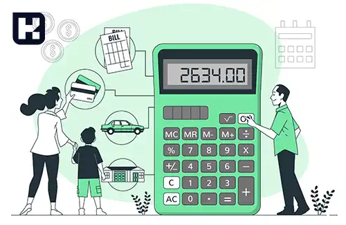

<style>
/* -----------------------
   تنظیمات کلی متن
-------------------------*/
body, .faq-block, p, li, td, th {
  font-size: 13px !important;
  line-height: 25px;
  color: #002145;
  margin: 0;
  padding: 0;
}

/* فاصله بین پاراگراف‌ها */
p + p {
  margin-top: 10px !important;
}

/* فاصله بین هر پاراگراف و هدینگ */
p + h1,
p + h2,
p + h3,
p + h4 {
  margin-top: 30px !important;
}

/* فاصله‌های قبل از هدینگ */
h1, h2, h3, h4 {
  margin-top: 30px !important;
  margin-bottom: 10px !important;
}

/* -----------------------
   تنظیم اندازه هدینگ‌ها
-------------------------*/
h1 {
  font-size: 18px !important;
}

h2 {
  font-size: 16px !important;
}

h3, h4 {
  font-size: 15px !important;
}

/* -----------------------
   لیست‌ها
-------------------------*/
ul li {
  font-size: 13px !important;
  margin-bottom: 10px;
}

/* -----------------------
   لینک‌ها
-------------------------*/
a {
  font-size: 13px !important;
  color: #0d6efd;
}

/* -----------------------
   متن‌های بولد
-------------------------*/
strong, b {
  font-size: 12.5px !important;
}

/* -----------------------
   FAQ و فهرست
-------------------------*/
.faq-block {
  padding: 0.5rem;
  margin-top: 0.5rem;
  color: #002145 !important;
  font-size: 13px !important;
}

.faq-block summary {
  cursor: pointer;
  color: #002145 !important;
  font-size: 13px !important;
}

/* -----------------------
   جدول‌ها
-------------------------*/
table {
  width: 100%;
  border-collapse: collapse;
  margin-top: 20px !important;
  font-size: 12.5px !important;
}

th, td {
  padding: 0.6rem !important;
  border: 1px solid #dcdcdc;
  text-align: right !important;
  font-size: 12.5px !important;
}

thead tr {
  background-color: #eeeeff;
}

tbody tr:nth-child(even) {
  background-color: #fafaff;
}

/* -----------------------
   فاصله بیشتر بین بخش‌ها
-------------------------*/
blockquote.faq-block {
  margin-top: 20px !important;
}

</style>

<blockquote class="faq-block">
<details>
  <summary>آنچه در این مطلب خواهید خواند:</summary>
  <ul>
    <li>تعریف حق سنوات</li>
    <li>نحوه محاسبه سنوات با مثال عددی</li>
    <li>مبلغ سنوات پرداختی چقدر است؟</li>
    <li>تفاوت حق سنوات و پایه سنوات در جدول مقایسه‌ای</li>
    <li>پرداخت سنوات خدمت بین کارمندان رسمی و غیررسمی</li>
    <li>نکات مالیاتی و اشتباهات رایج کارفرمایان</li>
    <li>حق سنوات در سال 1403</li>
    <li>بازخرید حق سنوات هنگام بازنشستگی</li>
    <li>نکته کاربردی برای حسابداران</li>
    <li>آشنایی با نرم‌افزار محاسبه سنوات</li>
    <li>سؤالات متداول</li>
    <li>جمع‌بندی</li>
  </ul>
</details>
</blockquote><br/>

سنوات یکی از مزایای قانونی و مهم برای کارگران و کارمندان است که در پایان هر سال کاری یا هنگام پایان همکاری به آن‌ها پرداخت می‌شود. این مزیت قانونی نه‌تنها نوعی پاداش برای سال‌های خدمت است، بلکه یکی از بخش‌های اساسی در حقوق و مزایای پرسنل محسوب می‌شود.

## تعریف حق سنوات



حق سنوات نوعی پاداش پایان خدمت است که به ازای هر سال کار معادل یک ماه آخرین حقوق فرد پرداخت می‌شود. این مبلغ به بیمه‌شدگان تأمین اجتماعی تعلق دارد و برای صاحبان مشاغل آزاد الزامی نیست.  

---

### نحوه محاسبه سنوات با مثال عددی

مبنای محاسبه سنوات، آخرین حقوق دریافتی فرد شامل مزایایی مثل حق مسکن، بن خواربار، ایاب‌وذهاب و... است.  
فرمول کلی محاسبه:

```

سنوات = (حقوق و مزایای ماه آخر ÷ 30) × روزهای کارکرد

```

#### مثال:
فرض کنید کارگری با حقوق ماهانه 10,000,000 تومان، 2 سال و 6 ماه در یک شرکت کار کرده است:  
- مجموع سابقه: 2.5 سال  
- حق سنوات = 10,000,000 × 2.5 = 25,000,000 تومان  

بنابراین کارگر در زمان تسویه‌حساب، ۲۵ میلیون تومان حق سنوات دریافت خواهد کرد.

---

### مبلغ سنوات پرداختی چقدر است؟

در صورتی که همکاری در میانه سال پایان یابد، مبلغ سنوات به نسبت روزهای کارکرد محاسبه می‌شود. حتی اگر سابقه فرد کمتر از یک سال باشد، باز هم مشمول سنوات است.  

---

### تفاوت حق سنوات و پایه سنوات

| مورد مقایسه | حق سنوات | پایه سنوات |
|--------------|-----------|-------------|
| زمان پرداخت | پایان همکاری یا هر سال کاری | ماهانه پس از یک سال سابقه |
| مبنای محاسبه | آخرین حقوق دریافتی | مبلغ ثابت مصوب شورای عالی کار |
| هدف | پاداش پایان خدمت | افزایش تدریجی حقوق ماهانه |
| مشمول بیمه و مزایا | خیر | بله |

---

### پرداخت سنوات خدمت بین کارمندان رسمی و غیررسمی

مطابق بخشنامه وزارت کار، نحوه محاسبه سنوات برای کارمندان رسمی و غیررسمی یکسان است. تنها تفاوت در نحوه محاسبه میانگین حقوق است.  
- کارمندان رسمی: معادل یک ماه آخرین حقوق سالانه  
- کارکنان قراردادی: میانگین سه ماه آخر خدمت  

---

### نکات مالیاتی و اشتباهات رایج کارفرمایان

- پرداخت سنوات **تا سقف معافیت سالانه مالیات بر درآمد**، از مالیات معاف است.  
- اشتباه رایج: محاسبه سنوات بر مبنای پایه حقوق بدون در نظر گرفتن مزایا.  
- نکته دیگر: اگر قرارداد کار تمدید شود ولی قطع همکاری رخ ندهد، پرداخت سنوات الزامی نیست و به پایان خدمت منتقل می‌شود.  

---

### حق سنوات در سال 1404

با نزدیک شدن به پایان سال، محاسبه و پرداخت سنوات اهمیت زیادی پیدا می‌کند. برای مشاهده جدول کامل مزایا، به  <a href="https://www.hooshkar.com/Wiki/Payroll/Payroll1404" target="_blank">جدول حقوق کارگران 1404</a> مراجعه کنید.  

---

### بازخرید حق سنوات هنگام بازنشستگی

بازنشستگان مشمول قانون کار نیز به ازای هر سال خدمت، یک ماه آخرین حقوق خود را به‌عنوان سنوات دریافت می‌کنند.  
افرادی که پس از بازنشستگی مجدداً مشغول به کار می‌شوند، برای دوره جدید نیز حق سنوات دریافت خواهند کرد.  

---

### نکته کاربردی برای حسابداران

در <a href="https://www.hooshkar.com/Software/Sayan">نرم افزار سایان</a>
می‌توانید با مراجعه به مسیر زیر خروجی اکسل از لیست سنوات کارکنان دریافت کنید:  

```

منوی حقوق و دستمزد > گزارش‌ها > گزارش سنوات > خروجی Excel

```

این گزارش به شما امکان می‌دهد تا مجموع سنوات هر کارمند را به‌صورت دقیق بررسی کنید.  

---

### آشنایی با نرم‌افزار محاسبه سنوات

نرم‌افزارهای حقوق و دستمزد مانند **سایان** با محاسبه خودکار سنوات، عیدی و مزایای کارکنان، خطاهای محاسباتی را از بین می‌برند و فرآیند تسویه‌حساب را سریع‌تر می‌کنند.

اگر می‌خواهید با نرم‌افزارهای مشابه آشنا شوید، پیشنهاد می‌کنیم <a href="https://www.hooshkar.com/Wiki/Financial/TheBestPayrollSoftware" target="_blank" rel="noopener noreferrer">بهترین نرم افزارهای حقوق و دستمزد</a> را بررسی کنید.

---

### سوالات متداول

<blockquote class="faq-block">
  <details>
    <summary>آیا سنوات شامل دوران مرخصی زایمان می‌شود؟</summary><br/>
    بله، چون مرخصی زایمان جزو سابقه کاری محسوب می‌شود و در محاسبه سنوات لحاظ می‌گردد.
  </details>
</blockquote>

<blockquote class="faq-block">
  <details>
    <summary>اگر کارگر بدون بیمه کار کرده باشد، آیا سنوات می‌گیرد؟</summary><br/>
    بله، حتی اگر کارگر بیمه نشده باشد، کارفرما موظف به پرداخت سنوات بر اساس مدت همکاری واقعی است.
  </details>
</blockquote>

<blockquote class="faq-block">
  <details>
    <summary>آیا سنوات به کار پاره‌وقت تعلق می‌گیرد؟</summary><br/>
    بله، میزان سنوات برای کار پاره‌وقت به نسبت ساعات کارکرد محاسبه می‌شود.
  </details>
</blockquote>

<blockquote class="faq-block">
  <details>
    <summary>در صورت استعفا، آیا سنوات پرداخت می‌شود؟</summary><br/>
    بله، استعفا مانع پرداخت سنوات نیست و کارفرما موظف به پرداخت آن طبق قانون کار است.
  </details>
</blockquote>

<blockquote class="faq-block">
  <details>
    <summary>آیا سنوات مشمول مالیات است؟</summary><br/>
    خیر، پرداخت سنوات تا سقف معافیت مالیات حقوق از مالیات معاف است و فقط در صورت تجاوز از سقف قانونی مشمول مالیات خواهد بود.
  </details>
</blockquote>

---

### جمع‌بندی

سنوات یکی از مهم‌ترین مزایای قانونی در روابط کار است و پرداخت صحیح آن نه‌تنها الزامی قانونی بلکه عاملی برای رضایت شغلی و حفظ انگیزه کارکنان است.  
با آگاهی از قوانین، نکات مالیاتی و استفاده از ابزارهای نرم‌افزاری، می‌توان فرآیند پرداخت سنوات را دقیق، سریع و بدون خطا انجام داد.  

**آیا این مطلب برای شما مفید بود؟ تجربه یا سؤال خود را درباره پرداخت سنوات در بخش نظرات با ما به اشتراک بگذارید.**