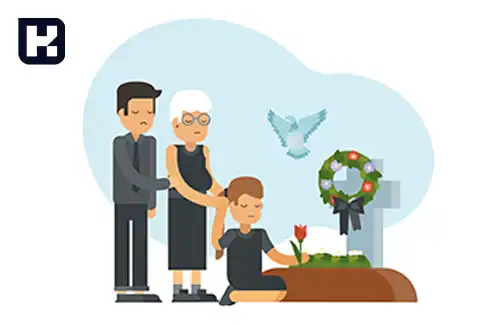

<blockquote style="background-color:#eeeefc; padding:0.5rem">

  
آنچه در این مطلب خواهید خواند:

  <ul>
    <li>چرا مرخصی در صورت فوت بستگان درجه یک ضروری است؟</li>
    <li>مراحل درخواست مرخصی فوت بستگان درجه یک</li>
    <li>مدت زمان مرخصی در صورت فوت بستگان درجه یک</li>
    <li>مرخصی فوت بستگان درجه دو</li>
  </ul>

</blockquote>

یکی از حقوق انسانی و قانونی کارمندان در محیط‌های کاری، مرخصی‌های ویژه‌ای است که در مواقع خاص مانند فوت بستگان به آن‌ها تعلق می‌گیرد. **مرخصی برای فوت بستگان درجه یک و درجه دو**، یکی از این مرخصی‌ها است که به کارمندان این امکان را می‌دهد تا در زمان از دست دادن عزیزان خود، فرصت کافی برای حضور در مراسم عزاداری و رسیدگی به امور مرتبط با فوت را داشته باشند. در این مقاله، به بررسی جزئیات مرخصی فوت بستگان درجه یک و درجه دو، شرایط دریافت این مرخصی‌ها و نحوه درخواست آن‌ها پرداخته خواهد شد.

برای آشنایی بیشتر با انواع مرخصی‌ها و نحوه استفاده از آن‌ها، مقاله <a href="https://www.hooshkar.com/Wiki/Payroll/TypesOfLeaves" target="_blank">راهنمای کامل انواع مرخصی</a>
را مطالعه کنید. این مقاله اطلاعات مفیدی درباره قوانین و نحوه مدیریت مرخصی‌های مختلف برای کارمندان و کارگران ارائه می‌دهد.

## چرا مرخصی در صورت فوت بستگان درجه یک ضروری است؟

هدف اصلی از اعطای مرخصی در مواقع فوت بستگان درجه یک، حمایت از کارکنان و فراهم کردن زمان کافی برای آن‌ها جهت گذراندن دوران عزاداری است. کارمندی که از نظر ذهنی و جسمی تحت فشار عاطفی ناشی از فوت عزیزان خود قرار گرفته است، قادر نخواهد بود وظایف خود را به‌طور موثر انجام دهد. از این رو، شرکت‌ها برای حفظ بهره‌وری و همچنین حمایت از کارکنان، مرخصی‌های ویژه‌ای در نظر می‌گیرند. این مرخصی علاوه بر کمک به کارکنان در زمان دشوار، نشان‌دهنده همدردی و احترام کارفرما به وضعیت کارمند است.

---

### مراحل درخواست مرخصی فوت بستگان درجه یک
برای درخواست مرخصی فوت بستگان درجه یک، کارمند باید هرچه سریع‌تر خبر فوت را به کارفرما اطلاع دهد و درخواست مرخصی خود را ارائه کند. این درخواست ممکن است به‌صورت حضوری یا کتبی ارسال شود. در مواردی که کارمند قادر به حضور در محل کار نیست، می‌تواند به‌صورت غیرحضوری درخواست خود را ثبت کند. در برخی از سازمان‌ها، ممکن است کارفرما نیاز به دریافت مدرک اثباتی مانند گواهی فوت از کارمند داشته باشد تا درخواست مرخصی تأیید شود.

---

### مدت زمان مرخصی در صورت فوت بستگان درجه یک

طبق <a href="https://www.mcls.gov.ir/fa/law/267/%d9%81%d8%b5%d9%84-%d8%b3%d9%88%d9%85-%d8%b4%d8%b1%d8%a7%db%8c%d8%b7-%da%a9%d8%a7%d8%b1" target="_blank">ماده 73 قانون کار</a>، **مدت زمان مرخصی فوت بستگان درجه یک** شامل همسر، پدر، مادر و فرزند، **۳ روز** با حقوق تعیین شده است. این مدت زمان به‌طور مستقل برای هر یک از بستگان درجه یک محاسبه می‌شود، به این معنی که اگر چند نفر از این بستگان در یک سال فوت کنند، برای هرکدام به‌طور جداگانه سه روز مرخصی به کارمند تعلق می‌گیرد. در برخی شرایط خاص یا در برخی شرکت‌ها، تعداد روزهای مرخصی ممکن است به ۷ روز افزایش یابد. علاوه بر این، کارمندان می‌توانند از تعطیلات عمومی یا روزهای غیرکاری برای افزایش مدت مرخصی خود استفاده کنند.

---

### مرخصی فوت بستگان درجه دو
مرخصی برای فوت بستگان درجه دو، شامل افرادی مانند پدربزرگ‌ها، مادربزرگ‌ها، عموها و عمه‌ها است. این نوع مرخصی به کارمندان این امکان را می‌دهد که در مراسم تشییع جنازه و تدفین بستگان درجه دو خود شرکت کنند. با این حال، **مرخصی برای فوت بستگان درجه دو به‌طور خاص در قانون کار تعریف نشده است** و برای این مرخصی معمولاً از روزهای مرخصی استحقاقی طبق <a href="https://www.mcls.gov.ir/fa/law/267/%d9%81%d8%b5%d9%84-%d8%b3%d9%88%d9%85-%d8%b4%d8%b1%d8%a7%db%8c%d8%b7-%da%a9%d8%a7%d8%b1" target="_blank">ماده 64 قانون کار</a>
 یا مرخصی بدون حقوق استفاده می‌شود. شرایط دقیق و مدت زمان این مرخصی بسته به قوانین داخلی هر سازمان متفاوت است.

برای کسب اطلاعات بیشتر درباره انواع مرخصی‌ها و شرایط قانونی آن‌ها، می‌توانید راهنمای کامل انواع مرخصی‌ها را مطالعه کنید.

اگر به دنبال یک راهکار سریع و دقیق برای محاسبه مرخصی‌ها و حقوق کارکنان خود هستید، پیشنهاد می‌کنیم با <a href="https://www.hooshkar.com/Software/Sayan/Module/Payroll" target="_blank">نرم‌افزار حقوق و دستمزد سایان</a> آشنا شوید. این نرم‌افزار می‌تواند در مدیریت مرخصی‌ها و محاسبه دقیق حقوق و مزایای کارمندان به شما کمک کند. 

---

### جمع‌بندی

مرخصی فوت بستگان، نشان‌دهنده توجه سازمان‌ها به بعد انسانی کارکنان است. با ارائه این مرخصی‌ها، شرکت‌ها نه تنها از کارکنان خود در زمان دشوار حمایت می‌کنند، بلکه روحیه کارکنان را تقویت کرده و به بهبود بهره‌وری و عملکرد آن‌ها کمک می‌کنند. همچنین، این مرخصی‌ها فرصتی است تا کارمندان بتوانند در شرایط سخت از نظر عاطفی، با آرامش بیشتری به امور خود رسیدگی کنند. با این حال، شرایط و مدت زمان این مرخصی‌ها در سازمان‌های مختلف ممکن است متفاوت باشد، اما اصل توجه به نیازهای انسانی کارکنان در تمامی سازمان‌ها باید مدنظر قرار گیرد.