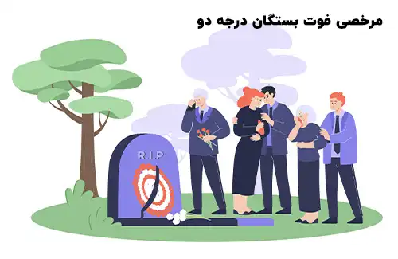

مرخصی فوت بستگان درجه دو یکی از انواع مرخصی‌هایی است که در بسیاری از سازمان‌ها و نظام‌های حقوقی مرتبط با کارگران و کارمندان، برای آنها در نظر گرفته شده است. هدف از این نوع مرخصی ارائه فرصتی مناسب به کارمندان و کارگران جهت شرکت در مراسم خاکسپاری و تشییع جنازه بستگان درجه دو خود است.

<blockquote style="background-color:#f5f5f5; padding:0.5rem">

<strong>آشنایی با <a href="https://www.hooshkar.com/Software/Sayan/Module/Payroll" target="_blank">نرم افزار حقوق و دستمزد</a> سایان</strong>
</blockquote>

مرخصی فوت بستگان درجه دو به کارمندان و کارگرانی تعلق می‌گیرد که یکی از بستگان درجه دو (مثل عموها، عمه‌ها، پدربزرگ ها و مادربزرگ ها) آنها فوت کرده است. 

این نوع مرخصی به آنها اجازه می‌دهد تا برای حضور در مراسم تشییع و تدفین بستگان درجه دو، اقدامات لازم را انجام دهند و در مراسمی که جهت احترام به متوفی برگزار می‌شود شرکت کنند.

### شرایط مرخصی فوت بستگان درجه دو، بر اساس قوانین هر سازمان

تعیین مدت و شرایط این مرخصی بسته به سیاست‌ها و مقررات موجود در هر سازمان می تواند متفاوت باشد. بعنوان مثال در بعضی موارد، ممکن است این مرخصی تحت ماده‌های خاص در سیاست‌های داخلی سازمان مشخص شده باشد، در حالی که در برخی سازمان های دیگر، افراد تنها باید از مرخصی بدون حقوق یا مرخصی استحقاقی استفاده نمایند. چراکه در قانون کار فقط برای مرخصی فوت بستگان درجه یک، سه روز مرخصی در نظر گرفته شده است و عنوانی بصورت مرخصی فوت بستگان درجه دو وجود ندارد.

<blockquote style="background-color:#f5f5f5; padding:0.5rem">

<strong>بیشتر بخوانید: <a href="https://www.hooshkar.com/Wiki/Payroll/TypesOfLeaves" target="_blank">راهنمای کامل انواع مرخصی</a>
</strong></blockquote>

### نتیجه گیری

مرخصی فوت بستگان، گویای این واقعیت است که سازمان‌ها صرفاً مجموعه‌ای از افراد نیستند، بلکه نهادهایی انسانی هستند که به احساسات و شرایط کارکنان خود توجه دارند. اگرچه جزئیات این مرخصی در سازمان‌های مختلف متفاوت است، ولی وجود آن نشان‌دهنده درک این نکته است که کارمندان نیز انسان‌هایی با خانواده و عزیزانی هستند که گاه با غم از دست دادن آن‌ها مواجه می‌شوند. پس مرخصی فوت بستگان، نشانه بارزی از توجه به بعد انسانی کارکنان در سازمان‌ها است.