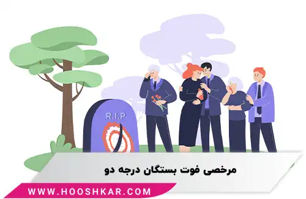

<blockquote style="background-color:#eeeefc; padding:0.5rem">

  
آنچه در این مطلب خواهید خواند:

  <ul>
   <li>چرا مرخصی برای فوت بستگان درجه یک تعیین می‌شود؟</li>
   <li>مراحل درخواست مرخصی فوت بستگان درجه یک</li>
   <li>مدت زمان مرخصی در صورت فوت بستگان درجه یک</li>
   <li>شرایط مرخصی فوت بستگان درجه دو، بر اساس قوانین هر سازمان</li>
  </ul>

</blockquote>

### چرا مرخصی برای فوت بستگان درجه یک تعیین می‌شود؟

تمام کارفرمایان به دنبال بهبود عملکرد و افزایش بهره‌وری کارکنان خود در محیط کار هستند. به همین دلیل، امتیازات مختلفی از جمله انواع مرخصی‌ها را فراهم می‌کنند.
کارمندی که از نظر ذهنی و جسمی تحت فشار و آسیب‌دیدگی باشد، در انجام وظایف اداری خود دچار کوتاهی می‌شود، که می‌تواند به روند فعالیت شرکت آسیب برساند.

در نتیجه، شرکت‌ها در شرایط مختلف امکان عدم حضور کارمند را فراهم می‌کنند. اعطای مرخصی برای فوت بستگان درجه یک کارگران از دو جهت اهمیت دارد: نخست، کارمند با گذراندن دوران استراحت و عزاداری، روحیه بهتری برای ادامه کار پیدا می‌کند. دوم، کارفرما با این اقدام، همدردی خود را با کارمند نشان داده و رضایت او را جلب می‌کند.

<blockquote style="background-color:#f5f5f5; padding:0.5rem">

<strong>آشنایی با <a href="https://www.hooshkar.com/Software/Sayan/Module/Payroll" target="_blank">نرم افزار حقوق و دستمزد</a> سایان</strong>
</blockquote>

### مراحل درخواست مرخصی فوت بستگان درجه یک

برای موافقت با مرخصی فوت بستگان درجه یک، کارمند باید در سریع‌ترین زمان ممکن، خبر فوت را به کارفرما اطلاع دهد و درخواست مرخصی خود را ارائه کند تا مورد تأیید قرار گیرد.
در مواردی که کارمند امکان حضور در شرکت را ندارد، می‌تواند به صورت کتبی و غیر حضوری درخواست مرخصی دهد. برخی شرکت‌ها علاوه بر درخواست کتبی، نیاز به ارائه مدرک فوت بستگان درجه یک برای اطمینان بیشتر دارند. در این صورت، کارمند باید کپی گواهی فوت را به شرکت ارسال کند.

### مدت زمان مرخصی در صورت فوت بستگان درجه یک

مدت مرخصی در صورت فوت بستگان درجه یک، ۳ روز تعیین شده است. این مرخصی شبیه به مرخصی ازدواج است، اما مستقل از آن بوده و امتیاز آن را از بین نمی‌برد.

در شرایط خاص یا در برخی شرکت‌ها، تعداد روزهای مرخصی ممکن است تا ۷ روز افزایش یابد. همچنین، کارمندان می‌توانند تا چهل روز پس از فوت نزدیکان خود درخواست مرخصی دهند و از روزهای تعطیل استفاده کنند.

این قوانین برای تمام کارمندان رسمی، قراردادی، رسمی آزمایشی، اتباع، قرارداد کار معین و افراد مشمول قانون خدمت پزشکان و پیراپزشکان اعمال می‌شود.

مرخصی فوت بستگان درجه دو یکی از انواع مرخصی‌هایی است که در بسیاری از سازمان‌ها و نظام‌های حقوقی مرتبط با کارگران و کارمندان، برای آنها در نظر گرفته شده است. هدف از این نوع مرخصی ارائه فرصتی مناسب به کارمندان و کارگران جهت شرکت در مراسم خاکسپاری و تشییع جنازه بستگان درجه دو خود است.

مرخصی فوت بستگان درجه دو به کارمندان و کارگرانی تعلق می‌گیرد که یکی از بستگان درجه دو (مثل عموها، عمه‌ها، پدربزرگ ها و مادربزرگ ها) آنها فوت کرده است. 

این نوع مرخصی به آنها اجازه می‌دهد تا برای حضور در مراسم تشییع و تدفین بستگان درجه دو، اقدامات لازم را انجام دهند و در مراسمی که جهت احترام به متوفی برگزار می‌شود شرکت کنند.

### شرایط مرخصی فوت بستگان درجه دو، بر اساس قوانین هر سازمان

تعیین مدت و شرایط این مرخصی بسته به سیاست‌ها و مقررات موجود در هر سازمان می تواند متفاوت باشد. بعنوان مثال در بعضی موارد، ممکن است این مرخصی تحت ماده‌های خاص در سیاست‌های داخلی سازمان مشخص شده باشد، در حالی که در برخی سازمان های دیگر، افراد تنها باید از مرخصی بدون حقوق یا مرخصی استحقاقی استفاده نمایند. چراکه در قانون کار فقط برای مرخصی فوت بستگان درجه یک، سه روز در نظر گرفته شده است و عنوانی بصورت مرخصی فوت بستگان درجه دو وجود ندارد.

<blockquote style="background-color:#f5f5f5; padding:0.5rem">

<strong>بیشتر بخوانید: <a href="https://www.hooshkar.com/Wiki/Payroll/TypesOfLeaves" target="_blank">راهنمای کامل انواع مرخصی</a>
</strong></blockquote>

### نتیجه گیری

مرخصی فوت بستگان، گویای این واقعیت است که سازمان‌ها صرفاً مجموعه‌ای از افراد نیستند، بلکه نهادهایی انسانی هستند که به احساسات و شرایط کارکنان خود توجه دارند. اگرچه جزئیات این مرخصی در سازمان‌های مختلف متفاوت است، ولی وجود آن نشان‌دهنده درک این نکته است که کارمندان نیز انسان‌هایی با خانواده و عزیزانی هستند که گاه با غم از دست دادن آن‌ها مواجه می‌شوند. پس مرخصی فوت بستگان، نشانه بارزی از توجه به بعد انسانی کارکنان در سازمان‌ها است.