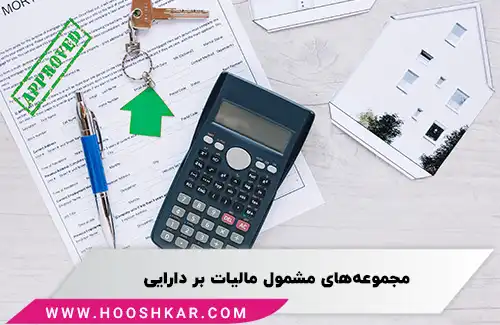

<blockquote style="background-color:#eeeefc; padding:0.5rem">

  
آنچه در این مطلب خواهید خواند:

  <ul>
    <li>مالیات بر دارایی چیست؟</li>
    <li>چرا مالیات بر دارایی اعمال می‌شود؟</li>
    <li>انواع مالیات بر دارایی</li>
    <ul>
      <li>1. مالیات سالیانه بر املاک</li>
      <li>2. مالیات بر خانه‌های خالی</li>
      <li>3. مالیات بر اراضی بایر</li>
      <li>4. مالیات حق تمبر</li>
      <li>5. مالیات بر ارث</li>
    </ul>
  </ul>
  </ul>

</blockquote>

مالیات بر دارایی یکی از ابزارهای مهم دولت‌ها برای تأمین بودجه و ایجاد تعادل اجتماعی است. این نوع مالیات، که یکی از انواع مالیات‌های مستقیم است، به ارزش دارایی‌های خالص افراد تعلق می‌گیرد و در بسیاری از کشورها با اهداف اقتصادی و اجتماعی مختلفی اجرا می‌شود. 

<a href="https://www.hooshkar.com/Software/Sayan/Module/TpTaxGov" target="_blank">نرم افزار واسط سامانه مودیان سایان</a> یکی از ابزارهای کارآمد برای تسهیل فرآیندهای مالیاتی است. این نرم‌افزار با ارائه امکانات مختلف، به افراد و سازمان‌ها کمک می‌کند تا فرآیندهای مالیاتی خود را به‌راحتی پیگیری و اجرا کنند.

در این مقاله، به بررسی مفهوم، ضرورت، انواع و تحولات جدید مالیات بر دارایی پرداخته می‌شود و به تغییرات قانونی و نحوه اجرای این مالیات در ایران توجه خواهیم کرد.

### مالیات بر دارایی چیست؟

مالیات بر دارایی به نوعی مالیات بر ثروت و دارایی‌های خالص افراد اطلاق می‌شود. این مالیات برای محاسبه، تمامی دارایی‌های فرد شامل پول نقد، خودرو، سهام، املاک و اوراق قرضه را در نظر می‌گیرد. افراد با دارایی‌های بیشتر از حد معمول موظف به پرداخت این مالیات به دولت هستند.

این نوع مالیات، علاوه بر تأمین بودجه دولت، به کاهش فاصله طبقاتی و ایجاد تعادل اقتصادی در جامعه نیز کمک می‌کند. مالیات بر دارایی مانند مالیات بر درآمد، از نوع مالیات‌های مستقیم است که به‌طور مستقیم از افراد دریافت می‌شود.

مالیات بر دارایی، که گاهی به عنوان مالیات بر سهام یا مالیات بر سرمایه نیز شناخته می‌شود، به دارایی‌های خالص افراد تعلق می‌گیرد. این دارایی‌ها شامل تمامی اموالی است که افراد در اختیار دارند و به صورت مستقیم از طریق درآمدهای حاصل از این دارایی‌ها به دولت پرداخت می‌شود. به‌طور کلی، می‌توان گفت که افراد برای تمامی دارایی‌هایی که در اختیار دارند، موظف به پرداخت مالیات هستند. حتی هر گونه دارایی که به عنوان ارث به فرد منتقل شود نیز مشمول مالیات بر دارایی می‌شود.

---

### چرا مالیات بر دارایی اعمال می‌شود؟

برخی از افراد ممکن است اجرای مالیات بر دارایی را ناعادلانه بدانند، اما اقتصاددانان به‌طور مداوم بر اهمیت این نوع مالیات تأکید دارند. آن‌ها معتقدند که مالیات بر دارایی‌ برای برقراری تعادل اقتصادی و پایداری مالی در جامعه ضروری است.

یکی از مهمترین دلایل اجرای این مالیات، ایجاد تعادل اجتماعی و کاهش فاصله طبقاتی در جامعه است. با اعمال مالیات بر دارایی، منابع مالی بیشتری برای دولت فراهم می‌شود که می‌تواند برای تأمین خدمات عمومی، بهبود زیرساخت‌ها و افزایش رفاه اجتماعی استفاده شود. همچنین، مالیات بر دارایی می‌تواند موجب بهبود وضعیت اقتصادی و ایجاد ثبات در بازارهای مالی شود.

---

### انواع مالیات بر دارایی

مالیات بر دارایی‌ها در کشورهای مختلف ممکن است به‌طور متفاوتی تعریف و اجرا شود. در ایران نیز، مالیات بر دارایی‌ها شامل مجموعه‌ای از قوانین و تغییرات در طول زمان بوده است. در سال 1366، قانونی برای مالیات بر دارایی تصویب شد که پنج گروه مشمول مالیات را مشخص کرده بود:

- مالیات سالیانه بر املاک
- مالیات بر خانه‌های خالی
- مالیات بر اراضی بایر
- مالیات حق تمبر
- مالیات بر ارث

در سال 1380، با اعمال تغییرات در قانون مالیات‌های کشور، برخی از این موارد حذف شدند و تنها مالیات حق تمبر و مالیات بر ارث باقی ماندند. با این حال، برخی موارد جدید مانند مالیات بر خودروهای لوکس، در اصلاحیه‌های جدید در نظر گرفته شده‌اند.

---

#### 1. مالیات سالیانه بر املاک

مالیات سالیانه بر املاک به املاک اداری، تجاری، خانه‌های مجلل و باغ ویلاهایی که ارزش روز آن‌ها بیشتر از دویست میلیارد ریال باشد، تعلق می‌گیرد. این مالیات با نرخ دو در هزار محاسبه می‌شود. برای این مالیات، افرادی که در تاریخ ۱۴۰۲/۱/۱ مالک این املاک بوده‌اند، موظف به پرداخت آن خواهند بود. نکته‌ای که در این زمینه قابل توجه است، معافیت‌هایی است که برای افرادی که صاحب یک واحد مسکونی هستند و بیش از ۱۰ سال از تاریخ تملک آن‌ها گذشته است، اعمال می‌شود.

#### 2. مالیات بر خانه‌های خالی

طبق قوانین موجود، خانه‌هایی که بیش از یک سال خالی از سکنه باقی بمانند، مشمول مالیات خواهند شد. این مالیات به‌منظور جلوگیری از احتکار مسکن و تأمین خانه‌های بیشتر برای نیازمندان به تصویب رسیده است. مالکان خانه‌های خالی باید از سال دوم به بعد، مالیات بر درآمد اجاره را پرداخت کنند. از سال سوم به بعد، این مالیات افزایش می‌یابد.

#### 3. مالیات بر اراضی بایر

مالیات بر اراضی بایر به زمین‌هایی تعلق می‌گیرد که بدون استفاده مانده‌اند. زمین‌هایی که به مدت ۲ تا ۴ سال بلااستفاده بوده‌اند، با نرخ ۲٪ مالیات خواهند شد. همچنین، زمین‌هایی که برای مدت بیش از ۵ سال بلااستفاده باقی بمانند، نرخ مالیات بیشتری خواهند داشت.

#### 4. مالیات حق تمبر

این مالیات به افراد و شرکت‌ها در صورت استفاده از اسناد رسمی تعلق می‌گیرد. هر فردی که اسناد خود را به‌طور رسمی می‌سازد یا آن‌ها را ابطال می‌کند، موظف به پرداخت این مالیات خواهد بود.

#### 5. مالیات بر ارث

مالیات بر ارث پس از فوت صاحب دارایی به اموال او تعلق می‌گیرد و به وارثان منتقل می‌شود. این مالیات در زمان انتقال اموال از فرد فوت‌شده به ورثه محاسبه می‌شود و از اموال متوفی کسر می‌شود. معافیت‌هایی مانند هزینه‌های کفن و دفن از پرداخت این مالیات مستثنی هستند.

---

### جمع‌بندی

مالیات بر دارایی، به‌عنوان یکی از ابزارهای کلیدی در سیاست‌های مالی دولت‌ها، به تأمین منابع مالی برای دولت و کاهش نابرابری‌های اجتماعی کمک می‌کند. این مالیات‌ها، که به صورت مستقیم از دارایی‌های افراد دریافت می‌شود، به ایجاد تعادل اقتصادی در جامعه و تأمین خدمات عمومی کمک می‌کنند.

در ایران، با تغییرات مستمر در قوانین مالیاتی، قوانین جدیدی در زمینه مالیات بر دارایی‌ها به تصویب رسیده است که بر اساس آن، املاک، اراضی بایر، خانه‌های خالی و حتی خودروهای لوکس تحت پوشش مالیات قرار می‌گیرند. اجرای این نوع مالیات‌ها، نه‌تنها موجب تأمین منابع مالی برای دولت می‌شود، بلکه به کاهش اختلافات طبقاتی و بهبود شرایط اقتصادی و اجتماعی در جامعه کمک می‌کند.