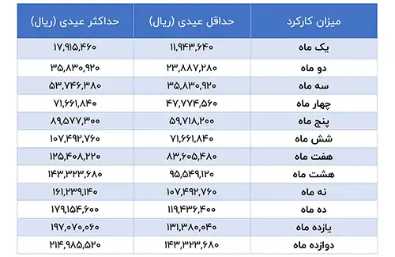

<blockquote class="faq-block">

  
آنچه در این مطلب خواهید خواند:

  <ul>
    <li>عیدی و سنوات چگونه محاسبه می شود؟</li>
    <li>فرمول محاسبه سنوات</li>
    <li>تأثیر افزایش حقوق، تعدیل نیرو و ترک کار بر سنوات</li>
    <li>فرمول محاسبه عیدی</li>
    <li>جدول محاسبه عیدی 1403</li>
    <li>جدول محاسبه عیدی 1404</li>
    <li>حق سنوات کارگران غیررسمی چگونه محاسبه می‌شود؟</li>
    <li>محاسبه مالیات عیدی</li>
    <li>عیدی بازنشستگان تامین اجتماعی</li>
  <li>سؤالات متداول</li>
  </ul>

</blockquote> 

آخرین روزهای سال است و کارشناس مالی یک شرکت متوسط، پشت میز خود نشسته و به انبوه پرونده‌های مربوط به عیدی و سنوات کارکنان نگاه می‌کند. او می‌داند که هر کارمند مستحق مزایایی است، اما فرمول‌های محاسبه و قوانین مالیاتی گاهی باعث سردرگمی می‌شوند.

محاسبه عیدی و سنوات کارکنان یکی از چالش‌برانگیزترین فرآیندهای پایان سال برای بخش مالی سازمان‌هاست. هرچند قانون زمان دقیق پرداخت را مشخص نکرده، اما همه کارکنان طبق فرمول‌های قانونی مشمول دریافت این مزایا هستند.

برای آنکه محاسبه دقیق مزایا بدون خطا و اتلاف وقت انجام شود، می‌توانید از <a href="https://www.hooshkar.com/Software/Sayan/Module/Payroll" target="_blank">نرم‌افزار محاسبه عیدی و سنوات سایان</a> استفاده کنید. این ابزار فرآیندهای محاسباتی پایان سال را ساده و سریع می‌کند و خیال شما را از بابت اعداد و محاسبات راحت می‌سازد.

## عیدی و سنوات چگونه محاسبه می شود؟

تمامی افراد تحت پوشش قانون کار حتی با سابقه کمتر از یک سال مشمول عیدی و سنوات هستند و نحوه اتمام همکاری آنها با سازمان (ترک کار، اخراج و...) هیچ تاثیری بر دریافتی آنها نخواهد داشت.

زمان پرداخت عیدی و سنوات در قانون کار مشخص نشده است و بنا بر تصمیم کارفرما می‌تواند به صورت ماهانه، فصلی، پایان سال یا زمان بازنشستگی پرداخت شود.

لازم به ذکر است عیدی و سنوات سال جاری (1404) بر اساس کارکرد اشخاص در آن سال محاسبه می‌شود؛ اما از آنجا که این پرداختی منتهی به نوروز سال 1404 است، به صورت عمومی عیدی و سنوات سال 1404 نامیده می‌شود.

برای مشاهده جزئیات کامل <a href="https://www.hooshkar.com/Wiki/Payroll/Payroll1404" target="_blank">جدول حقوق کارگران 1404</a> این مطلب را بخوانید.

---

### فرمول محاسبه عیدی

 <blockquote style="padding:0.8rem; border-right:4px solid #7066f1;">

**کارکرد یک سال کامل:** فردی که یک سال کامل مشغول بوده باشد، در پایان سال مبلغی معادل دو برابر حقوق پایه ماهیانه خود به عنوان عیدی دریافت خواهد کرد، مشروط بر اینکه از سقف سه برابر حقوق پایه وزارت کار بیشتر نشود.  

**کارکرد کمتر از یک سال:** تعداد ماه‌های کارکرد فرد در دو برابر حقوق پایه ماهیانه ضرب شده و بر ۱۲ تقسیم می‌شود.  

برای محاسبه دقیق‌تر، می‌توان از حقوق روزانه استفاده کرد؛ یعنی تعداد روزهای کارکرد فرد در دو برابر پایه حقوق ضرب شده و بر ۳۶۵ تقسیم شود.

**عیدی کارکنان دولت سال 1403:** پایه عیدی برای کارمندان دولت ۳ میلیون و ۸۰۰ هزار تومان تعیین شده است.  

میزان عیدی پرداختی نباید کمتر از ۶۰ روز حداقل دستمزد و بیشتر از ۹۰ روز آن باشد.
</blockquote> 

---

### جدول محاسبه عیدی 1403

با در نظر گرفتن پایه حقوق سال 1403 معادل ۷,۱۶۶,۰۰۰ تومان، حداقل عیدی ۱۴,۳۳۲,۳۶۸ تومان و حداکثر ۲۱,۴۹۸,۵۲۲ تومان خواهد بود.

### فرمول قانونی عیدی بر اساس قانون کار

 <blockquote style="padding:0.8rem; border-right:4px solid #7066f1;">

حداقل عیدی = ۲ × پایه حقوق ماهانه

حداکثر عیدی = ۳ × پایه حقوق ماهانه

این مقادیر مربوط به کارگر تمام‌وقت با یک سال سابقه کار یا بیشتر است و برای کارکنانی با شرایط خاص (مثل سابقه کمتر یا اضافه مزایا) ممکن است اندکی متفاوت شود.
</blockquote> 

---

### فرمول محاسبه سنوات

 <blockquote style="padding:0.8rem; border-right:4px solid #7066f1;">
حق سنوات = تعداد سال‌های خدمت × یک‌ماه حقوق
</blockquote> 
در صورتیکه کارگری چند سال سابقه داشته و حق سنوات سال‌های قبل را دریافت نکرده باشد، می‌تواند بر اساس آخرین حقوق خود و روزهای کارکرد، حق سنوات گذشته را محاسبه کند.

---

### تأثیر افزایش حقوق، تعدیل نیرو و ترک کار بر سنوات

**افزایش حقوق:** سنوات کارگرانی که در طول سال افزایش حقوق داشته‌اند، بر اساس آخرین حقوق دریافتی آن‌ها محاسبه می‌شود.  
**تعدیل نیرو:** در صورت تعدیل نیرو، حق سنوات تا تاریخ خاتمه قرارداد بر اساس آخرین حقوق پرداخت می‌شود.  
**ترک کار:** کارگران مستعفی نیز مشمول دریافت سنوات متناسب با مدت اشتغال خود خواهند بود.

برای آشنایی با فرمول‌های محاسبه حقوق و مزایا، مقاله <a href="https://www.hooshkar.com/Wiki/Payroll/PayrollFormula" target="_blank">فرمول‌های حقوق و دستمزد</a> را مطالعه کنید.

---

### جدول محاسبه عیدی و سنوات 1404

| ماه‌های کارکرد | حداقل عیدی (ریال) | حداکثر عیدی (ریال) |    سنوات (ریال) |
| -------------: | ----------------: | -----------------: | --------------: |
|              1 |        17,318,280 |         25,977,420 |       8,659,140 |
|              2 |        34,636,560 |         51,954,840 |      17,318,280 |
|              3 |        51,954,840 |         77,932,260 |      25,977,420 |
|              4 |        69,273,120 |        103,909,680 |      34,636,560 |
|              5 |        86,591,400 |        129,887,100 |      43,295,700 |
|              6 |       103,909,680 |        155,864,520 |      51,954,840 |
|              7 |       121,227,960 |        181,841,940 |      60,613,980 |
|              8 |       138,546,240 |        207,819,360 |      69,273,120 |
|              9 |       155,864,520 |        233,796,780 |      77,932,260 |
|             10 |       173,182,800 |        259,774,200 |      86,591,400 |
|             11 |       190,501,080 |        285,751,620 |      95,250,540 |
|             12 |       207,819,360 |        311,729,040 | 103,909,680 |

---

### حق سنوات کارگران غیررسمی چگونه محاسبه می‌شود؟

حق سنوات برای کارگران رسمی و غیررسمی تفاوتی ندارد. حتی کارگران پیمانکاری، ساعتی و نیمه‌وقت بر اساس مدت و میزان کارکردشان حق سنوات دریافت می‌کنند.  

معیار محاسبه این گروه، میانگین حقوق دریافتی در ۹۰ روز پایانی همکاری است.

## محاسبه مالیات عیدی

مالیات عیدی مانند مالیات حقوق محاسبه می‌شود. مبلغ عیدی به عنوان سیزدهمین حقوق در نظر گرفته شده و تا مبلغ ۵,۶۰۰,۰۰۰ تومان معاف از مالیات است. مازاد این مبلغ با نرخ ۱۰٪ مشمول مالیات می‌شود.  

مثال: اگر عیدی ۱۰ میلیون تومان باشد، ابتدا ۵,۶۰۰,۰۰۰ تومان معاف می‌شود و باقیمانده ۴,۴۰۰,۰۰۰ تومان، ۱۰٪ مالیات می‌خورد.

اگر به دنبال انتخاب نرم‌افزار مناسب هستید، <a href="https://www.hooshkar.com/Wiki/Financial/TheBestPayrollSoftware" target="_blank" rel="noopener noreferrer">مقاله بهترین نرم‌افزارهای حقوق و دستمزد</a> را مطالعه کنید.

---

### عیدی بازنشستگان تامین اجتماعی

بازنشستگان و مستمری‌بگیران نیز سالانه مبلغی تحت عنوان عیدی دریافت می‌کنند که توسط هیئت دولت تعیین شده و سازمان تأمین اجتماعی پرداخت می‌کند.  

**مالیات:** عیدی بازنشستگان طبق قانون معاف از مالیات است.

---

### سؤالات متداول

<blockquote class="faq-block">
  

    
حداقل و حداکثر عیدی کارکنان چقدر است؟
 
    حداقل عیدی ۶۰ روز و حداکثر ۹۰ روز حقوق پایه سال جاری است.
  

</blockquote>

<blockquote class="faq-block">
  

    
حق سنوات چگونه محاسبه می‌شود؟
 
    حق سنوات = تعداد سال‌های خدمت × یک ماه حقوق آخرین دریافتی.
  

</blockquote>

<blockquote class="faq-block">
  

    
آیا کارگران پیمانکاری یا غیررسمی مشمول سنوات می‌شوند؟
 
    بله، حتی کارگران پیمانکاری، ساعتی و نیمه‌وقت نیز بر اساس مدت و میزان کارکرد، حق سنوات دریافت می‌کنند.
  

</blockquote>

<blockquote class="faq-block">
  

    
مالیات عیدی چگونه محاسبه می‌شود؟
 
    مبلغ عیدی تا ۵,۶۰۰,۰۰۰ تومان معاف از مالیات است و مازاد آن با نرخ ۱۰٪ مالیات می‌شود.
  

</blockquote>

<blockquote class="faq-block">
  

    
آیا عیدی بازنشستگان مشمول مالیات می‌شود؟
 
    خیر، عیدی بازنشستگان تامین اجتماعی طبق قانون معاف از مالیات است.
  

</blockquote>

---

### جمع‌بندی
عیدی، سنوات و مالیات عیدی، سه رکن مهم محاسبات پایان سال هستند که همه کارکنان مشمول قانون کار بدون توجه به نوع قرارداد، میزان سابقه یا نحوه پایان همکاری از آن بهره‌مند می‌شوند. عیدی بر اساس دو تا سه برابر حقوق پایه ماهانه محاسبه شده و برای افراد با کارکرد کمتر از یک سال، مبلغ آن به‌صورت تناسبی تعیین می‌شود. سنوات نیز طبق آخرین حقوق دریافتی فرد و به‌ازای هر سال خدمت معادل یک ماه حقوق است و برای کارگران رسمی، غیررسمی، پیمانکاری، ساعتی و نیمه‌وقت به یک شکل محاسبه می‌شود.

از سوی دیگر، عیدی تا سقف مشخصی از مالیات معاف بوده و مازاد آن با نرخ تعیین‌شده محاسبه می‌شود، در حالی که عیدی بازنشستگان تأمین اجتماعی کاملاً معاف از مالیات است. جدول‌های ارائه‌شده برای سال‌های ۱۴۰۳ و ۱۴۰۴ به کارفرمایان و کارکنان کمک می‌کند تا با اطمینان بیشتری مبلغ دقیق عیدی و سنوات را بر اساس کارکرد خود محاسبه کنند.

در نهایت، بهره‌گیری از نرم‌افزارهای تخصصی حقوق و دستمزد <a href="https://www.hooshkar.com" target="_blank">هوشکار</a>، می‌تواند روند محاسبات را سریع‌تر، دقیق‌تر و بدون خطا انجام داده و بار کاری واحد مالی را در روزهای پایانی سال به شکل چشمگیری کاهش دهد.