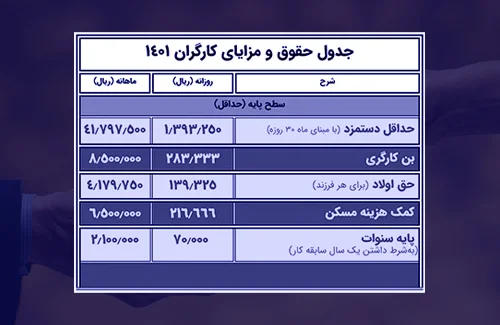

> ["مطلب پیشنهادی: افزایش حقوق و دستمزد 1402 چقدر خواهد شد؟"](https://www.hooshkar.com/Wiki/Payroll/Payroll1402)

حداقل حقوق وزارت کار در سال ۱۴۰۱ ماهانه ۴ میلیون و ۱۷۹ هزار و ۷۵۰ تومان تعیین شده است. این مبلغ در سال ۱۴۰۰، ۲ میلیون و ۵۵۴ هزار و ۹۵۰ تومان بود. کارفرمایان هم در بخش خصوصی و هم در بخش دولتی موظف به افزایش حقوق و مزایای کارگران با توجه به مصوبه‌های اداره کار هستند.

*   حقوق روزانه: ۱.۳۹۳.۲۵۰ ریال
*   حقوق ماهیانه: ۴۱.۷۹۷.۵۰۰ ریال
*   پایه سنوات روزانه: ۷۰.۰۰۰ ریال
*   حق مسکن: 6.۵۰۰.۰۰۰ ریال
*   بن کارگری: ۸.۵۰۰.۰۰۰ ریال

با این حساب، دریافتی یک کارگر حداقل بگیر که هیچ سابقه و فرزندی ندارد با مجموع پایه مزد ماهانه‌ ۴۱.۷۹۷.۵۰۰ ریال و بن ۸.۵۰۰.۰۰۰ ریال و حق مسکن 6.۵۰۰.۰۰۰ ریال، برابر با ۵۶.۷۹۷.۵۰۰ ریال می‌شود.

> ["مطلب پیشنهادی: جزئیات متن قانون کار"](https://rc.majlis.ir/fa/law/show/99612)

