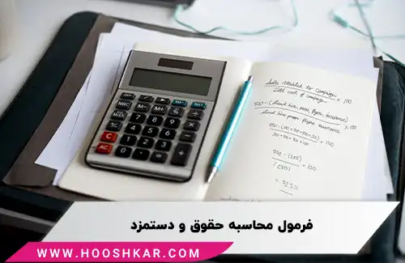

<blockquote style="background-color:#eeeefc; padding:0.5rem">

  
آنچه در این مطلب خواهید خواند:

  <ul>
    <li>انواع فرمول های حقوق و دستمزد</li>
    <li>فرمول محاسبه حقوق پایه</li>
    <li>فرمول اضافه کاری</li>
    <li>فرمول عیدی</li>
    <li>فرمول محاسبه سنوات</li>
    <li>فرمول شب کاری</li>
    <li>فرمول محاسبه نوبت کاری</li>
    <li>فرمول محاسبه کسر کار ماه</li>
    <li>حق اولاد چیست و چگونه محاسبه می شود</li>
    <li>فرمول محاسبه‌ حق اولاد</li>
  </ul>

</blockquote>

 محاسبه درست حقوق و دستمزد کارکنان، یکی از مهمترین وظایف بخش حسابداری سازمان‌هاست. رعایت عدالت در پرداخت‌ها و دقت در محاسبات، نقش مهمی در انگیزه و رضایت شغلی کارکنان دارد. 

در این مقاله، قصد داریم تا به بررسی فرمول های محاسبه حقوق پایه، اضافه کاری و شب‌کاری کارکنان و... بپردازیم. فرمول‌های ارائه شده در ادامه، راهنمای مناسبی برای محاسبه دقیق حقوق و مزایای کارکنان بر اساس ضوابط قانون کار هستند. پیروی از این فرمول‌ها می‌تواند از بروز خطا در محاسبات جلوگیری کرده و عدالت را در پرداخت‌ها تضمین نماید.

<blockquote style="background-color:#f5f5f5; padding:0.5rem">

<strong>آشنایی با <a href="https://www.hooshkar.com/Software/Sayan/Module/Payroll" target="_blank">نرم افزار حقوق و دستمزد</a> سایان</strong>
</blockquote>

## انواع فرمول های حقوق و دستمزد

محاسبه‌ی حقوق، بر اساس موارد متفاوتی تعیین می‌شود. در ادامه به بررسی 3 فرمول پرکاربرد می‌پردازیم:

|  عنوان | فرمول | 
|--------|--------
| پایه اضافه کاری | ساعات اضافه کاری × 140% × 220 ÷ (حقوق پایه) 
|تعطیل کاری | ساعات تعطیل کاری × 180% × 220 ÷ (حقوق پایه) 
| ساعت کاری| ساعات شب کاری × 135% × 220 ÷ (حقوق پایه) 
| حقوق| ساعات نوبت کاری × 10% × 220 ÷ (حقوق پایه) 
| حقوق| ساعات نوبت کاری × 15% × 220 ÷ (حقوق پایه) 
| حقوق| ساعات نوبت کاری × 22.5% × 220 ÷ (حقوق پایه) 
 سنوات|تعداد روز های کارکرد × 365 روز ÷ (حقوق پایه)|
 عیدی و پاداش پایان سال| کارکرد × 365 روز ÷ 2 × (حقوق پایه)|
 عیدی و پاداش پایان سال| کارکرد × 366 روز ÷ 2 × (حقوق پایه)|

### فرمول محاسبه حقوق پایه
کارکرد ماه × 30 ÷ حقوق پایه در حکم

### فرمول اضافه کاری
تعریف اضافه کاری یعنی کاری که بیش از ساعت کار قانونی (8 ساعت در روز و 44 ساعت در هفته) انجام شود. 

مبنای محاسبه اضافه کار به این صورت است که دستمزد پرسنل، در هر ساعت اضافه کاری 40 درصد بیشتر از ساعت کاری عادی محاسبه می‌شود. 

فرمول حقوق و دستمزد بر اساس اضافه کاری به شرح زیر است:

ساعات اضافه کاری × ۱.۴ × ۲۲۰ ÷ (حقوق پایه) = فرمول اضافه کاری

### فرمول عیدی
عیدی یکی از اصلی‌ترین حقوق پرسنل است که پس از اتمام سال، کارفرما باید مبلغی دو برابر حقوق پایه کارکنانش، به آن‌ها پرداخت کند. 

پایه حقوق روزانه × 60 = حداقل عیدی 1402
 
پایه حقوق روزانه × 90 = حداکثر عیدی 1402

### فرمول محاسبه سنوات

روزهای کارکرد سنوات خدمت × 365 ÷ حقوق پایه در حکم

<blockquote style="background-color:#f5f5f5; padding:0.5rem">

<strong>بیشتر بخوانید: <a href="https://www.hooshkar.com/Wiki/Payroll/EidTax" target="_blank">فرمول محاسبه عیدی و سنوات
</a>
</strong></blockquote>

### فرمول شب کاری
ساعت کاری عادی کارمندان از شنبه تا پنجشنبه، 7 ساعت و 20 دقیقه در روز است. این 7 ساعت و 20 دقیقه از 6 صبح شروع می‌شود و تا 22 شب ادامه دارد که روز کاری محسوب می‌شود.
به کارکنانی که از ساعت 22 شب الی 6 بامداد کار می‌کنند، شب کار گفته می‌شود. 
 
فرمول محاسبه حقوق کارکنان شب کار، به شرح زیر است:

تعداد ساعات شب کاری × 1.35 × (7.33 ÷ دستمزد روزانه) = شب کاری
 
کارکرد شب کاری × 100 ÷ 35 × (220 ÷ حقوق پایه در حکم) = شب کاری

### فرمول محاسبه نوبت کاری

_فرمول حقوق و دستمزد شیفت کاری 6 الی 14 بعد از ظهر_

(کارکرد نوبت کاری 10% × 100 ÷ 10 × (220 ÷ حقوق پایه در حکم))

_فرمول حقوق و دستمزد شیفت کاری 14 الی 22 شب_

(کارکرد نوبت کاری 15% × 100 ÷ 15 × (220 ÷ حقوق پایه در حکم))

### فرمول محاسبه کسر کار ماه
کسر کار ماه × (2 × 220   ÷ حقوق پایه در حکم)

<blockquote style="background-color:#f5f5f5; padding:0.5rem">

<strong>بیشتر بخوانید: <a href="https://www.hooshkar.com/Wiki/Financial/TheBestPayrollSoftware" target="_blank">معرفی بهترین نرم افزارهای حقوق و دستمزد</a>
</strong></blockquote>

## حق اولاد چیست و چگونه محاسبه می شود

طبق قانون کار، باید مبلغی به تمام کارکنانی که فرزند دارند به عنوان کمک هزینه، پرداخت شود. حق اولاد به افرادی تعلق می‌گیرد که بیمه شده‌ی تامین اجتماعی باشند. این حق، مختص جنسیت خاصی نیست؛ هم آقایان و هم خانم‌های دارای فرزند می‌توانند از آن استفاده کنند.

### فرمول محاسبه‌ حق اولاد

تعداد فرزندان * (حداقل دستمزد روزانه آن سال * ۳) = حق اولاد در بخش خصوصی
 
14 درصد * ضریب سالانه * حقوق پایه = حق اولاد برای یک فرزند در بخش دولتی

---
 عزیزانی که در حوزه حسابداری و حقوق و دستمزد فعالیت می‌کنند، دوره‌های آموزشی <a href="https://www.aparat.com/Hooshkar_Pardaz" target="_blank">کانال آپارات هوشکار</a> در این زمینه، فرصت مناسبی برای ارتقای دانش شماست. 

با شرکت در این دوره‌ها به روشی ساده و کاربردی، ضمن آشنایی با آخرین قوانین و مقررات، فرمول‌های لازم برای محاسبات حقوق و دستمزد را فرا خواهید گرفت.