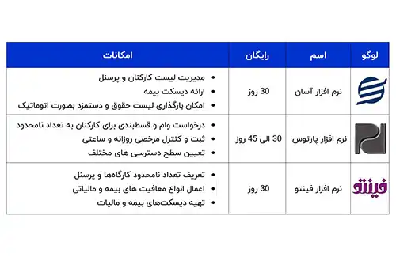

<blockquote style="background-color:#eeeefc; padding:0.5rem">

  
آنچه در این مطلب خواهید خواند:

  <ul>
    <li>لیست نرم افزارهای حقوق دستمزد رایگان</li>
    <li>انواع نرم افزار های محاسبه حقوق و دستمزد پولی</li>
    <li>نتیجه گیری</li>
  </ul>

</blockquote>

بدون شک کارکنان و نیروهای انسانی هر مجموعه، ارزشمندترین دارایی آن به شمار می‌آیند. چرا که با کمک نیروهای انسانی خوب، مجموعه‌ها رشد و توسعه را تجربه می‌کنند. پس در نتیجه نگهداری و حفظ رضایت کارکنان، به نفع شرکت است و در این جهت باید اقداماتی انجام شود. 

یکی از این اقدامات مهم که هر مجموعه موظف است جهت جلب رضایت کارکنان خود انجام دهد، پرداخت به موقع حقوق آن‌هاست. 
با کمک نرم افزارهای حقوق و دستمزد، این پروسه به راحت‌ترین و بهترین شکل ممکن صورت می‌گیرد.

<blockquote style="background-color:#f5f5f5; padding:0.5rem">

<strong>آشنایی با <a href="https://www.hooshkar.com/Software/Sayan/Module/Payroll" target="_blank">نرم افزار حقوق و دستمزد</a> سایان</strong>
</blockquote>

## لیست نرم افزارهای حقوق دستمزد رایگان
مهم نیست ابعاد کسب و کار شما کوچک است یا بزرگ، در نهایت، با محاسبه حقوق و مزایای پرسنل سر و کار خواهید داشت. در این راستا نرم افزارهای مختلفی بصورت رایگان و پولی وجود دارند. در ادامه به بررسی آنها می‌پردازیم.

- چطور می توانیم به نرم افزارهای رایگان دسترسی داشته باشیم؟
شما به راحتی می‌توانید این نرم افزارهای رایگان را که توسط مجموعه‌های مختلف طراحی شده اند، از سایت‌های معتبر دانلود کنید.
اگر قصد دارید روی گوشی همراهتان این اپ کاربردی را داشته باشید، می‌توانید به برنامه بازار یا سیب سری بزنید.
- آیا نرم افزاری که کاملا رایگان باشد، وجود دارد؟ خیر
- آیا دسترسی به امکانات نرم افزارهای رایگان نامحدود است؟ خیر، هیچ نرم افزار رایگانی، به شما دسترسی و امکانات کامل و گسترده را نخواهد داد.

**نام برخی از نرم افزارهای رایگان + برخی از امکانات آنها:**

### انواع نرم افزار های محاسبه حقوق و دستمزد پولی

نیازها و منابع سازمان‌ها تعیین می‌کنند که آنها باید به سراغ نرم‌افزارهای رایگان بروند یا برای تهیه نرم‌افزارهای تجاری و حرفه‌ای، بودجه‌ای را اختصاص دهند.

نرم افزارهای حرفه ای و تخصصی، به دو صورت در بازار موجود هستند:

**نوع اول،** نرم افزاری است که با پیش‌فرض‌های خاص، برای مشاغل مختلف طراحی و ساخته شده‌است. شما می‌توانید به راحتی نرم افزار را خریداری کنید و از کلیه‌ی امکانات آن استفاده نمایید.

**نوع دوم،** نرم افزارهایی هستند که به صورت اختصاصی برای شرکت شما و با توجه به نیازهای شما شخصی سازی می‌شوند. در هر زمان هم که نیاز داشته باشید، برنامه‌نویسان آماده‌ی توسعه‌ی نرم‌ افزار شما هستند.

<blockquote style="background-color:#f5f5f5; padding:0.5rem">

<strong>بیشتر بخوانید: <a href="https://www.hooshkar.com/Wiki/Financial/TheBestPayrollSoftware" target="_blank">لیست بهترین نرم افزارهای حقوق و دستمزد</a>
</strong></blockquote>

#### نتیجه گیری

با توجه به توضیحاتی که در بخش بالا داده شد، می‌توان نتیجه گرفت که مناسب ترین نرم افزار، نوع غیر رایگان آن است. چرا که با طراحی اختصاصی، تمام نیازهای شرکت شما رفع شده و با کم‌ترین خطا و بالاترین سرعت، حقوق پرسنل محاسبه می‌گردد. 

از اینکه تا انتهای این مقاله با ما همراه بودید سپاسگذاریم. نظرات و سوالات خود را با ما به اشتراک بگذارید.