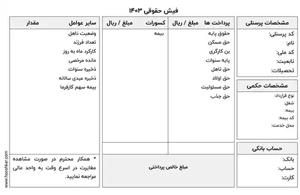

<blockquote style="background-color:#eeeefc; padding:0.5rem">

  
آنچه در این مطلب خواهید خواند:

  <ul>
    <li>تعریف سند حقوق و دستمزد</li>
    <li>اهمیت ثبت سند حقوق و دستمزد</li>
    <li>فیش حقوقی چیست</li>
  </ul>

</blockquote>

**مقدمه**

سند حقوق و دستمزد یکی از مهمترین اسناد حسابداری هر سازمان است که نشان دهنده جزئیات پرداختی به کارکنان می باشد. در این مقاله با این سند و اجزای آن بیشتر آشنا خواهیم شد.

<blockquote style="background-color:#f5f5f5; padding:0.5rem">

<strong>آشنایی با <a href="https://www.hooshkar.com/Software/Sayan/Module/Payroll" target="_blank">نرم افزار حقوق و دستمزد</a> سایان</strong>
</blockquote>

## تعریف سند حقوق و دستمزد

سند حقوق و دستمزد یک سند حسابداری است که نتایج محاسبه حقوق و دستمزد کارکنان به صورت ماهانه در آن ثبت می شود.

جهت ثبت این سند نیاز به سرفصل های زیر می‌باشد:

بستانکار | بدهکار
------------ | -------------
مالیات حقوق | هزینه حقوق
بیمه تامین اجتماعی | حق مسکن
بیمه تکمیلی | حق بن
مالیات حقوق | هزینه حقوق
جاری کارکنان به تفکیک پرسنل | حق بیمه 23 درصد کارفرما

## اهمیت ثبت سند حقوق و دستمزد

سند حقوق و دستمزد یکی از مهم‌ترین سندهای هر شرکت است که در حسابداری به آن توجه ویژه‌ای می‌شود. علت اهمیت سند حقوق، این است که ترکیبی از مجموعه قوانین مالیاتی با استانداردهای حسابداری است.

حسابداران می‌بایست برای ثبت این سند، از آخرین بخشنامه‌های قانون کار مطلع باشند.

## فیش حقوقی چیست

فیش حقوقی در واقع سندی است که جزئیات کاملی از میزان درآمد کارکنان در آن نوشته شده است. 
تمام کسب‌وکارهای کوچک و بزرگ، از شرکت‌ها گرفته تا کارخانه‌ها موظف‌اند به کارکنان خود فیش حقوقی را ارائه دهند. 

در این فیش‌ها، اطلاعات مهمی از جمله: نام شرکت و کارمند، شماره ملی و شماره حساب کارمند، تاریخ صدور و شماره بیمه ثبت می‌شود.

علت اهمیت فیش حقوقی این است که کارکنان درمورد حقوق و دستمزد، مالیات و کسوراتشان اطلاعات کامل به دست می‌آورند. در نتیجه می‌توانند این اطمینان را پیدا کنند که حقوق آن‌ها به صورت عادلانه پرداخت شده است. 

در تصویر زیر، می‌توانید جزئیات موجود در یک نمونه فیش حقوقی را مشاهده کنید.

---

برای دریافت راهنمای کامل محاسبه حقوق و دستمزد، <a href="https://www.hooshkar.com" target="_blank">اینجا</a> را کلیک کنید