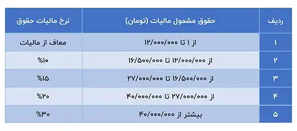

<blockquote class="faq-block">

  
آنچه در این مطلب خواهید خواند:

  <ul>
    <li>سامانه ارسال لیست مالیات حقوق</li>
    <li>معافیت‌های مالیات حقوق</li>
    <li>درصد و روش محاسبه مالیات حقوق</li>
    <li>جدول مالیات حقوق 1403</li>
    <li>عواقب عدم پرداخت مالیات بر درآمد چیست؟</li>
  </ul>

</blockquote>

پرداخت مالیات بر حقوق و درآمد برای افراد حقیقی و حقوقی الزامی است. مالیات حقوق به دو دسته مالیات مستقیم و غیرمستقیم تقسیم می‌شود. در این مقاله با انواع مالیات حقوق و روش محاسبه آن‌ها آشنا خواهیم شد.

برای محاسبه دقیق مالیات حقوق و مدیریت مالیاتی کارکنان، می‌توانید با <a href="https://www.hooshkar.com/Software/Sayan/Module/Payroll" target="_blank">نرم‌افزار مالیات حقوق سایان</a> آشنا شوید.

## سامانه ارسال لیست مالیات حقوق

در یک سال‌ اخیر، سازمان امور مالیاتی سامانه‌ای را راه‌اندازی کرده تا مودیان دسترسی راحت‌تری به اطلاعات مالیاتی خود داشته باشند. با طراحی و راه‌اندازی سامانه ارسال لیست مالیات حقوق، دیگر نیازی به مراجعه‌ی حضوری نیست. 

جهت استفاده از این سامانه‌ی مالیاتی، می‌توانید به صورت مستقیم وارد لینک زیر شوید:

سایت: <a href="https://www.tax.gov.ir" target="_blank">tax.gov.ir</a>

در کشور ما همانند بسیاری از کشورهای دیگر، پرداخت مالیات الزامی است. افراد حقیقی و یا حقوقی (شرکت‌ها) که درآمد ماهیانه کسب می‌کنند، ملزم به پرداخت مالیات می‌باشند. میزان مالیات با توجه به حقوق و دستمزد هر فرد می‌تواند متفاوت باشد.

برای یادگیری نحوه محاسبه مالیات عیدی کارکنان، مطلب <a href="https://www.hooshkar.com/Wiki/Payroll/EidTax" target="_blank">محاسبه مالیات عیدی</a> را مطالعه کنید.

## معافیت های مالیات حقوق
همان‌طور که در قسمت بالا به این موضوع اشاره شد، پرداخت مالیات بر همه‌ی حقوق بگیران الزامی‌ست. اما موارد استثنایی نیز وجود دارند که معاف از پرداخت مالیات هستند. 

لیست این موارد به شرح زیر است:

1. مأموران سیاسی و کارشناسان خارجی در ایران
2. حقوق و دستمزد پرداختی‌های نیروهای مسلح
3. کارمندان سفارت‌خانه‌ها و کنسول‌گری‌ها
4. افراد بازنشسته و از کار افتاده
5. مستمرهای پرداختی به وارثان

## درصد و روش محاسبه مالیات حقوق

مالیات حقوق در دوره‌های ماهانه و سالانه محاسبه و پرداخت می‌شود. 

مالیات ماهانه بر اساس جدول مالیات حقوق ماهیانه و مالیات سالانه بر اساس جدول مالیات حقوق سالیانه تعیین می‌شود. این جداول بر پایه نرخ‌های مقرر در قانون مالیات‌های مستقیم تنظیم می‌شوند. 

### جدول مالیات حقوق  1403

### عواقب عدم پرداخت مالیات بر درآمد چیست؟

بر اساس قوانین مالیاتی، کارفرما موظف است لیست مالیات حقوق کارکنان را به صورت ماهانه به سامانه مربوطه ارسال کند. در صورتی که این لیست دیرتر از موعد مقرر به سازمان امور مالیاتی ارائه شود، کارفرما باید ۲٪ از حقوق پرداختی را به عنوان جریمه بپردازد.

علاوه بر این، اگر مالیات حقوق و دستمزد به مدت چند ماه به سازمان مالیاتی کشور پرداخت نشود، برای هر ماه تأخیر ۲.۵٪ از میزان مالیات به عنوان جریمه محاسبه می‌شود که این جریمه قابل بخشش نخواهد بود.