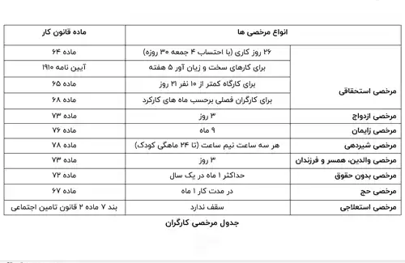

<blockquote style="background-color:#eeeefc; padding:0.5rem">
آنچه در این مطلب خواهید خواند:

- [تعریف مرخصی](#تعریف-مرخصی)
- [انواع مرخصی در قانون کار](#انواع-مرخصی-در-قانون-کار)
    - [مرخصی استحقاقی](#مرخصی-استحقاقی)
    - [مرخصی ساعتی](#مرخصی-ساعتی)
    - [مرخصی استعلاجی](#مرخصی-استعلاجی)
    - [مرخصی بدون حقوق](#مرخصی-بدون-حقوق)
    - [مرخصی ازدواج یا فوت نزدیکان درجه یک](#مرخصی-ازدواج-یا-فوت-نزدیکان-درجه-یک)
    - [مرخصی زایمان برای بانوان](#مرخصی-زایمان-برای-بانوان)
    - [مرخصی مخصوص مادران شیرده](#مرخصی-مخصوص-مادران-شیرده)

</blockquote>

**مقدمه**

آیا با قوانین مربوط به مرخصی آشنایی دارید؟ چگونه مرخصی ها در قانون کار محاسبه می‌شوند؟ معمولا کارگران و کارمندان با این سوالات متداول درباره مرخصی ها مواجه هستند.

در این مقاله، ما قصد داریم شما را با جزئیات مرخصی های قانون کار آشنا کنیم؛ با ما همراه شوید.

<blockquote style="background-color:#f5f5f5; padding:0.5rem">
<a href="https://www.hooshkar.com/Software/Sayan/Module/Payroll" target="_blank">محاسبه عیدی و سنوات و مرخصی با سایان</a>:  یکی از چالش‌های متداول برای بخش‌های مالی و حسابداری سازمان‌ها، محاسبه دقیق عیدی، سنوات و مرخصی کارکنان است. 

انجام این محاسبات به صورت دستی و سنتی، زمانبر بوده و احتمال بروز خطا وجود دارد؛ اما با استفاده از نرم‌افزارهای تخصصی، می‌توان این فرایند را به سادگی انجام داد.

</blockquote>

## تعریف مرخصی
آیا با اجزا و عناصر حقوق و دستمزد آشنایی دارید؟ یکی از مولفه‌های حیاتی در محاسبه حقوق و دستمزد، مرخصی است. زمانی که به عنوان کارگر یا کارمند به یک سازمان ملحق می‌شوید، یک قرارداد بین شما و کارفرما یا سازمان مربوطه برقرار می‌شود که معمولاً توسط قوانین وزارت کار تنظیم می‌شود.

در این قرارداد، کارگر یا کارمند مختار است تا در صورت نیاز، به تعداد روزها و ساعات مشخص شده مرخصی بگیرد. البته، لازم به ذکر است که مسائل مرتبط با تعطیلی‌ها و مرخصی ها نیز بسته به این قرارداد و حقوق ذکر شده در آن می‌باشد.

علاوه بر این، در این قرارداد، شما می‌توانید درباره تعداد روزهای مرخصی، حق دریافت مرخصی های طولانی مدت در شرایط خاص مانند بیماری یا سفر و امکان درخواست مرخصی پریود (اگر خانم هستید) از واحد منابع انسانی شرکت سؤال کنید.

## انواع مرخصی در قانون کار

### مرخصی استحقاقی

طبق قانون، مرخصی استحقاقی هر نیروی انسانی به مدت 30 روز در طول سال می باشد. این 30 روز معادل 26 روز کاری و 4 جمعه است. که طبق استاندارد وزارت کار معادل 2.5 روز در ماه می باشد.

### مرخصی ساعتی
مرخصی ساعتی، یکی از اقسام مرخصی‌هاست که می‌تواند جزء مرخصی های استحقاقی باشد. در این نوع مرخصی، به جای گرفتن یک روز کامل، به مدت ساعات مشخصی از حق مرخصی خود استفاده می‌کنید. اگر تعداد ساعات مرخصی ساعتی به 8 ساعت برسد، آن را معادل یک روز کامل در نظر می‌گیرند.

### مرخصی استعلاجی

این نوع مرخصی در رابطه با بیماری هایی می باشد که به تجویز پزشک صادر شده و کمیسیون پزشکی سازمان تامین اجتماعی آن را تایید نموده تا جزئی از سوابق کاری فرد مورد نظر محاسبه شده و هزینه آن را بیمه تقبل نماید. 

حداکثر بازه استفاده از این مرخصی 4 ماه بوده که برای بیماری های خاص نظیر سرطان در صورتیکه به تایید پزشک مورد اعتماد و شورای عالی پزشکی رسیده باشد، فرد کاملا بازنشسته می‌شود.

### مرخصی بدون حقوق

همان طور که از اسمش پیداست در بازه ای که از این مرخصی استفاده می شود شخص هیچگونه حقوق و مزایایی دریافت نمی کند. 

این مرخصی به دلیل مسائلی مانند تحصیل، سفرهای طولانی و... طبق قانون 72 وزارت کار بین کارفرما و کارگر بصورت کتبی به توافق می رسد که زمان آن می تواند حداکثر به مدت 2 سال باشد.

### مرخصی ازدواج یا فوت نزدیکان درجه یک

در صورت ازدواج دائم و فوت بستگان درجه یک، به استناد ماده 73 قانون کار، هر کارگر و کارمندی می‌تواند حداکثر 3 روز مرخصی با تمامی حقوق و مزایا داشته باشد.

### مرخصی زایمان برای بانوان

هر بانوی شاغلی که باردار باشد می تواند حداکثر 6 ماه از این مرخصی با برخورداری از حقوق و بیمه که بر عهده سازمان تامین اجتماعی است استفاده نماید. 

بعد از اتمام دوره مرخصی کارفرما ملزم به پرداخت حق سنوات و عیدی این مدت مرخصی بوده و علاوه بر آن کارفرما موظف است با ادامه فعالیت شخص موافقت نماید.

### مرخصی مخصوص مادران شیرده
 یک نوع مرخصی مخصوص مادران شیرده است که در ماده 6 قانون کار تعیین گردیده است. این مرخصی به مدت یک ساعت و به مدت دو سال برای مادران و همچنین برای فرزندان شیرخوار فراهم شده است. زمان استفاده از این مرخصی باید در ابتدا یا انتهای ساعات کاری قرار گیرد. مقدار یک ساعت اختصاص یافته به هر فرزند است، بنابراین اگر مادر دارای دو یا چند فرزند شیرخوار باشد، به ازای هر فرزند 2 یا چند ساعت مرخصی در نظر گرفته می‌شود.

---
در این مقاله، تلاش شده است تا شما را با انواع مرخصی آشنا نموده، به نحوی که در صورت نیاز به هر یک از آنها، اطلاعات کاملی در این زمینه داشته باشید و قادر باشید به صورت صحیح از حقوق خود دفاع نمایید. 

از شما که تا انتهای این مقاله با ما همراه بوده اید، سپاسگزاریم. در صورت داشتن هرگونه سؤال با کارشناسنان <a href="https://www.hooshkar.com" target="_blank">هوشکار</a> در ارتباط باشید.