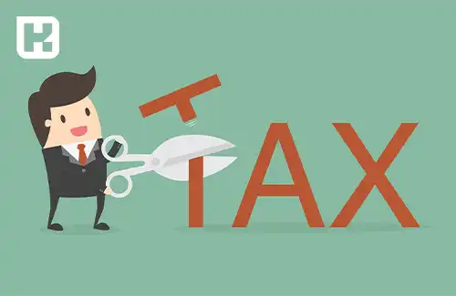

<blockquote style="background-color:#eeeefc; padding:0.5rem">

   
آنچه در این مطلب خواهید خواند:

  <ul>
    <li>حق تاهل چیست؟</li>
    <li>محاسبه حق اولاد برای کارگران در سال ۱۴۰۳</li>
    <li>سوالات مرتبط</li>
  </ul>

</blockquote>

**مقدمه**

مالیات، به عنوان یکی از مهم‌ترین مسائل اقتصادی هر کشور، نقش بسیار حیاتی در تعیین سیاست‌ها و توسعه اجتماعی دارد. این مفهوم پیچیده، همواره مورد توجه مردم و مسئولان قرار گرفته و تفاوت‌ها و مبانی آن در سراسر جهان بحث و بررسی شده است. از مبتدیان تا کارشناسان، همه به دنبال درک بهتری از مفهوم و انواع مالیات هستند تا بتوانند در امور مالی و مالیاتی خود بهتر تصمیم بگیرند.

 در این مقاله، ما به توضیح مفهوم مالیات، تفاوت‌ها و مبانی آنها می‌پردازیم. از انواع مالیات مستقیم گرفته تا مالیات‌های غیرمستقیم، همه جنبه‌های این موضوع پیچیده را بررسی خواهیم کرد. همچنین، از طریق مطالعه پیامدهای عدم انجام تعهدات مالیاتی و معرفی کشورهایی که بیشترین میزان مالیات را از شهروندانشان دریافت می‌کنند، به بررسی چگونگی عملکرد سیستم مالیاتی در جوامع مختلف می‌پردازیم.

## توضیح مفهوم مالیات چیست؟

در یک توصیف آموزشی و ساده می‌توان گفت که مالیات یک نوع هزینه اجتماعی است که افراد یا شرکت‌ها باید به دولت پرداخت کنند، به طوری که دولت از این پول برای هزینه‌های عمومی استفاده می‌کند. در هر کشور، مالیات یکی از مهم‌ترین مباحث اقتصادی است و قوانین دقیقی برای آن وجود دارد. 

به عنوان مثال، قانون اساسی کشورها به موضوع مالیات اشاره می‌کند و مقرراتی را برای مالیات‌های مختلف تعیین می‌کند. همچنین قوانین مالیاتی مشخص می‌کنند که چه کسانی باید اظهارنامه مالیاتی خود را ارسال کنند و هر فرد یا شرکت چه مقدار مالیات باید پرداخت کنند.

### مالیات‌های مختلف

1.	مالیات مستقیم 
2.	مالیات غیر مستقیم 

اگر مودی مالیاتی و پرداخت کننده مالیات یک شخص باشد، آن مالیات به عنوان مالیات مستقیم شناخته می‌شود؛ در غیر این صورت، مالیات به عنوان مالیات غیرمستقیم تلقی می‌شود. 
همچنین، شخصی که مسئولیت پرداخت مالیات را دارد، به عنوان مودی مالیاتی شناخته می‌شود.

### انواع مالیات مستقیم

الف) **مالیات بر دارایی:** مالیات بر دارایی بر اساس ثروتی که فرد یا شرکت دارد، اعمال می‌شود. این نوع مالیات دو بخش زیر را شامل می‌شود:

- مالیات بر ارث: مهم‌ترین نوع مالیات بر دارایی که از اموال و دارایی‌های فرد پس از وفات او دریافت می‌شود.

- مالیات حق تمبر: این نوع مالیات از طریق الصاق و ابطال تمبر بر اسناد و مدارک جهت رسمیت بخشیدن یا انجام لازم الاجرای آنها، از مودی (شخصی که مالیات را می‌پردازد) دریافت می‌شود.

ب) **مالیات بر درآمد:** در این نوع مالیات، درآمد افراد و شرکت‌ها (نه ثروت آنها) مبنای مالیات است. مالیات بر درآمد به دسته‌بندی‌های زیر تقسیم می‌شود:

- مالیات بر درآمد املاک
- مالیات بر درآمد حقوق

- مالیات بر درآمد مشاغل

-	مالیات بر درآمد کشاورزی

-	مالیات بر درآمد اشخاص حقوقی

-	مالیات بر درآمدهای اتفاقی

### انواع مالیات غیرمستقیم

**الف) مالیات بر واردات:**

این نوع از مالیات‌ها معمولاً به عنوان یکی از ابزارهای سیاست‌های بازرگانی و در شرایط اقتصادی مختلف کشورها به کار گرفته می‌شوند. به جز اینکه برای تأمین درآمد دولت‌ها مورد استفاده قرار می‌گیرند، معمولاً برای حمایت از صنایع داخلی نیز به کار می‌روند. این نوع از مالیات‌ها ممکن است بر اساس قیمت و ارزش کالاها یا بر اساس ویژگی‌ها و مشخصات آنها (مانند حجم، وزن و...) تعیین و دریافت شوند. این گونه از مالیات به سه شکل زیر از مودیان 
واردکننده دریافت می‌گردد:

-	مالیات و انواع آن حقوق و عوارض گمرکی
-	مالیات و انواع آن سود بازرگانی
-	مالیات بر واردات اتومبیل و انواع آن

**ب)مالیات بر مصرف و فروش محصولات و خدمات**

این نوع از مالیات به مصرف‌کنندگان کالاها و خدمات خاص در زمان خرید آن کالاها (همراه با قیمت کالا) تحمیل می‌شود. این مالیات در واقع به عهده تولیدکنندگان و فروشندگان است، اما نهایتاً توسط مصرف‌کننده نهایی پرداخت می‌شود. مالیات بر مصرف انواع متعددی دارد که به صورت زیر دریافت می‌شود:

- مالیات و انواع آن بر نوشابه‌های غیرالکلی
-	مالیات و انواع آن بر الکل طبی و صنعتی
-	مالیات و انواع آن بر فروش سیگار
-	مالیات و انواع آن بر فروش اتومبیل
-	مالیات و انواع آن بر فرآورده‌های نفتی و پتروشیمی
-	مالیات و انواع آن بر فروش خاویار
-	مالیات و انواع آن بر نوارهای ضبط صوتی و تصویری
-	مالیات و انواع آن بر اشتراک تلفن‌های خودکار و خدمات مخابرات بین‌المللی

### پیامدهای عدم انجام تعهدات مالیاتی
طبق قوانین مالیاتی، افراد حقیقی و حقوقی موظفند تاکالیف مالیاتی خود را به موقع و طبق مقررات انجام دهند. در صورت عدم رعایت این تکالیف، آن‌ها ممکن است مورد جریمه مالیاتی قرار گیرند.

مواد 199 و 200 قانون مالیات مستقیم به موضوع فرار مالیاتی و جرایم مرتبط اشاره دارند. این شامل پرداخت جریمه معادل 20 درصد مالیات پرداخت نشده و سایر موارد مرتبط است.

#### کدام کشورها بیشترین درآمد مالیاتی را دارند؟

مردم بسیاری از کشورها به پرداخت مالیات ملزم هستند، اما میزان این مالیات بر اساس فعالیت‌های اقتصادی در هر کشور متفاوت است. 
در برخی کشورها، شهروندان مقادیر کمتری از مالیات را پرداخت می‌کنند، در حالی که در دیگران، مقدار قابل توجهی از درآمدشان به عنوان مالیات به دولت پرداخت می‌شود. به عنوان مثال، فهرست زیر کشورهایی را نشان می‌دهد که در سال ۲۰۲۲ بیشترین مقدار مالیات را از شهروندانشان دریافت کرده‌اند.
1.	ساحل عاج
2.	فنلاند 
3.	ژاپن 
4.	دانمارک 
5.	اتریش 

### جمع بندی:

با توجه به توضیحات ارائه شده در این مقاله، می‌توان نتیجه گرفت که مالیات به عنوان یکی از اصلی‌ترین منابع تأمین مالی دولت‌ها، نقش بسیار مهمی در تعادل اقتصادی و توسعه اجتماعی دارد. این مقاله به بررسی مفهوم، انواع و تأثیرات مالیات پرداخته و نشان داده است که چگونه سیستم مالیاتی می‌تواند در تنظیم نظام اقتصادی هر کشور نقش مهمی ایفا کند.

همچنین، با معرفی کشورهایی که بیشترین میزان مالیات را از شهروندانشان دریافت می‌کنند، نشان داده شده است که مالیات چگونه به منظور تأمین درآمد دولت و پشتیبانی از خدمات عمومی در جوامع مختلف به کار می‌رود. این اطلاعات می‌تواند به تصمیم‌گیری‌های مسئولان و همچنین آگاهی مردم درباره سیاست‌های مالیاتی کمک کند و در نهایت به بهبود شرایط اقتصادی و اجتماعی کشورها کمک نماید.
