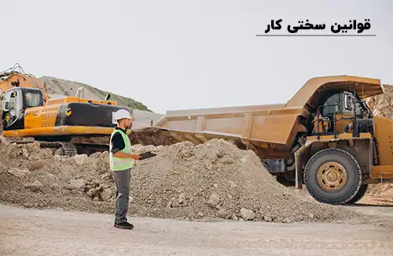

<blockquote style="background-color:#eeeefc; padding:0.5rem">

  
آنچه در این مطلب خواهید خواند:

  <ul>
    <li>تعریف سختی کار</li>
    <li>لیست مشاغل سخت و زیان‌آور</li>
    <li>قوانین مربوط به مشاغل سخت</li>
    <li>مقررات ساعت کاری</li>
    <li>مقررات اضافه‌کاری</li>
    <li>مقررات حق بیمه برای کارگران</li>
    <li>مقررات مرخصی</li>
    <li>سختی کار چگونه محاسبه میشود؟</li>
  </ul>

</blockquote>

**مقدمه**

این مقاله به بررسی مفهوم سختی کار و قوانین مرتبط با آن در محیط کار ایران می‌پردازد. سختی کار به مشاغلی اطلاق می‌شود که کارکنان در آنها با عوامل خطرناک فیزیکی، شیمیایی، بیولوژیکی و محیطی مواجه هستند و در معرض آسیب‌های جسمی و روحی بیشتری قرار دارند.
 آشنایی با این قوانین می‌تواند برای کارفرمایان و کارکنان در این حوزه حائز اهمیت باشد.

<blockquote style="background-color:#f5f5f5; padding:0.5rem">

<strong>آشنایی با <a href="https://www.hooshkar.com/Software/Sayan/Module/Payroll" target="_blank">نرم افزار حقوق و دستمزد</a> سایان</strong>
</blockquote>

## تعریف سختی کار

سختی کار برای مشاغل دشوار و پرخطر اعمال می‌شود. این مشاغل شامل آن‌هایی هستند که دارای عوامل فیزیکی، شیمیایی، بیولوژیکی و محیطی خطرناک و غیراستاندارد هستند. فعالیت در این مشاغل، کارکنان را در معرض خطرات بیشتری نسبت به شرایط عادی قرار می‌دهد. برای چنین مشاغلی، مفهوم سختی کار تعریف می‌شود.
در ادامه به برخی از این مشاغل اشاره خواهیم کرد.

لازم به ذکر است برخی مشاغل به‌طور ذاتی سخت و طاقت‌فرسا هستند، اما با اجرای تدابیر ایمنی مناسب می‌توان از قرار دادن آنها در دسته مشاغل زیان‌آور اجتناب کرد. تصمیم‌گیری در مورد اعمال یا عدم اعمال قوانین سختی کار و میزان بهره‌مندی از آن بر عهده کمیته قانون‌گذاری خواهد بود.

## لیست مشاغل سخت و زیان‌آور
**گروه الف:** مشاغل گروه الف با وجود ماهیت سخت و زیان‌آور، می‌توانند با اجرای تدابیر ایمنی و بهداشتی، به طور کامل یا تا حدی کاهش یابند.

**گروه ب:** مشاغل سخت و زیان‌آور گروه ب حتی با اجرای اقدامات ایمنی، بهداشتی و فنی همچنان سخت و زیان‌آور خواهند بود. این اقدامات فقط ممکن است اندکی از میزان سختی و زیان‌آوری شغل بکاهند.

می‌توان به طور کلی بدون توجه به گروه‌های مختلف، به برخی از مشاغل سخت و زیان‌آور اشاره کرد:

-	فعالیت در معدن
-	کارهای استخراج
-	کار در مخازن بسته
-	فعالیت در نزدیکی کوره‌های ذوب
-	کارگران دامداری‌ها و مرغداری‌ها
-	کار در ارتفاعات
-	فعالیت روی دکل‌های برق
-	کار با مواد رادیواکتیو
-	فعالیت در محیط‌های خاص مانند زندان‌ها و مراکز روان‌درمانی
-	آتش‌نشانی
-	خبرنگاری
-	رانندگی حمل و نقل بار و مسافر درون‌شهری و برون‌شهری

علاوه بر این، برخی مشاغل حوزه پزشکی نیز به عنوان کارهای سخت و زیان‌آور شناخته می‌شوند؛ مانند هوشبری، مامایی، اورژانس پزشکی و کارشناسی علوم آزمایشگاهی.

ممکن است برخی از مشاغل دیگر نیز در لیست مشاغل دارای سختی کار قرار گیرند. هیچ معیار مشخصی برای تعیین اینکه چگونه سختی کار یک شغل را تشخیص دهیم، وجود ندارد. تعیین اینکه یک شغل سخت و زیان‌آور است یا نه، توسط کمیته‌های تخصصی و پس از بررسی شرایط محیط کار و سوابق انجام می‌شود. 

کارگر متقاضی باید درخواست خود را ثبت و به کمیته بدوی مشاغل سخت و زیان‌آور استانی ارسال کند. پس از بررسی درخواست و اظهارنظر کارشناس مربوطه، مشخص می‌شود که آیا به شغل متقاضی سختی کار تعلق می‌گیرد یا خیر.

## قوانین مربوط به مشاغل سخت 
طبق قوانین، افراد بیمه‌شده مشاغل سخت که 20 سال سابقه کار متوالی یا 25 سال سابقه کار به‌صورت غیرمتوالی داشته باشند، به طور کامل از حقوق مستمری برخوردار می‌شوند. این قانون در راستای حمایت از افرادی است که در مشاغل سخت فعالیت می‌کنند. 

علاوه بر این، اگر کارکنان پیش از رسیدن به این مدت زمان به دلیل شرایط کاری دچار آسیب‌های روحی یا جسمی شوند، می‌توانند با تأیید کمیسیون پزشکی و بر اساس ماده 91 قانون تأمین اجتماعی از مزایای مستمری خود استفاده کنند. در این صورت، سن و سابقه کار مطرح نیست و تنها اثبات آسیب وارده مورد توجه قرار می‌گیرد.

بخشنامه مشاغل سخت و زیان‌آور تأمین اجتماعی نیز به مفاد قانون جدید بازنشستگی 7300 روز اشاره می‌کند. براساس این قانون، کارگران مشاغل سخت پس از 7300 روز کار و پرداخت بیمه می‌توانند بازنشسته شوند. این قانون تأثیر مثبتی بر تسریع روند اشتغال‌زایی داشته است.

### مقررات ساعت کاری
برای کاهش آسیب‌های وارده به کارکنان، قانون تعیین ساعات کاری در مشاغل سخت وضع شده است که کارفرما باید از آن پیروی کند. در مشاغل سخت، ساعات کاری نباید از 6 ساعت در روز فراتر رود و در مجموع نباید بیش از 36 ساعت در هفته باشد. 
برای برخی مشاغل که ساعات کاری آنها از 8 ساعت در روز یا 44 ساعت در هفته تجاوز می‌کند، مجموع ساعات کاری در دوره چهار هفته‌ای نباید بیش از 176 ساعت شود. نقض این قانون به عنوان یک تخلف در نظر گرفته می‌شود.

### مقررات اضافه کاری
یکی از نگرانی‌های شاغلان در مشاغل سخت، مربوط به قانون اضافه‌کاری است. بر اساس ماده 61 قانون مشاغل سخت، انجام اضافه‌کاری در این مشاغل به طور کامل ممنوع بوده و اعمال آن خلاف قانون است.

### مقررات حق بیمه برای کارگران
یکی دیگر از موارد مرتبط با قانون در زمینه سختی کار، به حق بیمه کارگران مربوط می‌شود. کارکنان به ازای هر یک سال کار و پرداخت حق بیمه، مستحق دریافت سابقه بیمه به مدت یک سال و نیم هستند. به عبارت دیگر، اگر کارگری ۱۰ سال در مشاغل سخت فعالیت داشته باشد، سوابق او به عنوان ۱۵ سال محاسبه خواهد شد و کارفرمایان باید این سوابق را برای کارکنان ثبت کنند.

### مقررات مرخصی 
یکی دیگر از موارد قانونی مرتبط با مرخصی در مشاغل سخت است. طبق ماده 65 قانون کار، کارگرانی که در مشاغل سخت و زیان‌آور مشغول به کار هستند، سالانه 5 هفته مرخصی دریافت می‌کنند. این مرخصی معمولاً در دو دوره شش‌ماهه قابل استفاده است.

<blockquote style="background-color:#f5f5f5; padding:0.5rem">

<strong>بیشتر بخوانید: <a href="https://www.hooshkar.com/Wiki/Payroll/TypesOfLeaves" target="_blank">جدول مرخصی کارگران و انواع آن</a></strong>
</blockquote>

## سختی کار چگونه محاسبه می شود؟ 
روش محاسبه سختی کار دارای تعریف مشخصی است و بنابراین برای آن یک فرمول خاص در نظر گرفته شده است که به فاکتورهای متفاوتی توجه می‌شود. برای محاسبه میزان سختی کار، به فرمول زیر توجه کنید:

### فرمول محاسبه سختی کار

(۴٪ از مبلغ حق بیمه آخرین دستمزد مشمول حق بیمه × تعداد ماه‌ها) + (۴٪ از مستمری محاسبه شده × مدت سابقه در مشاغل سخت و زیان‌آور تا تاریخ ۱۴/۰۷/۱۳۸۰)

---
استفاده از نرم‌ افزار حسابداری حقوق و دستمزد، راهی ساده برای رفع هرگونه نگرانی در مورد محاسبه حقوق و مزایای کارکنان در مشاغل سخت است. برای اطلاعات بیشتر <a href="https://www.hooshkar.com" target="_blank">اینجا</a> کلیک کنید.